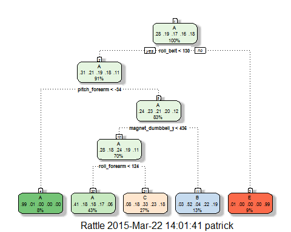

# Practical Machine Learning Project
Patrick Newsom  
Sunday, March 22, 2015  
<br>


###Introduction:
With the advent of fitness devices, data collection and studies in Human Activity Recognition has become inexpensive.  While people regularly quantify how much of a particular activity they do, they rarely quantify how well they do it. This project's goal will be to use data provided from various sensors on the belt, forearm, arm, and dumbell of 6 participants to determine proper exercise execution as well as mistake detection. The experiment is more formally described below:
```
Participants were asked to perform one set of 10 repetitions of the Unilateral Dumbbell Biceps Curl in five 
different fashions: exactly according to the specification (Class A), throwing the elbows to the front
(Class B), lifting the dumbbell only halfway (Class C), lowering the dumbbell only halfway (Class D) and
throwing the hips to the front (Class E). Class A corresponds to the specified execution of the exercise, while
the other 4 classes correspond to common mistakes. [1]
```
<br>

###Project Scope:

1. Gain understanding of the machine learning process.
2. Utilizing data provided, build a machine learning algorithm to predict activity quality from various activity monitors placed on the body and exercise equipment.
<br><br>

###Obtaining Data Files and Partitioning:
The initial scripting loads the required libraries into R, sets the working directory, and downloads the necessary data files if they're not stored locally. 

```r
library(caret); library(rgl); library(rattle); library(rpart); library(randomForest)
library(foreach); library(parallel); library(doParallel)

# set working directory ----
if (getwd() != "C:/Users/patrick/Documents/R_Workspace/Pratical Machine Learning/Poject"){
   setwd("C:/Users/patrick/Documents/R_Workspace/Practical Machine Learning/Project")
}

# get datafiles ----
file_1 = "pml-training.csv"; file_2 = "pml-testing.csv"
train_source <- "https://d396qusza40orc.cloudfront.net/predmachlearn/pml-training.csv"
test_source <-"https://d396qusza40orc.cloudfront.net/predmachlearn/pml-testing.csv"

if (!file.exists(file_1)){
   download.file(train_source, destfile = file_1)
}
if (!file.exists(file_2)){
   download.file(test_source, destfile = file_2)
}
```
The dataset is large having 19,622 observations of 160 variables. The dataset is split 70/30 into partitions for training and testing.


```r
# create dataframe ----
train.df <- read.csv(file_1, na.strings = c("", "NA", "#DIV/0!"))
dim(train.df)
```

```
[1] 19622   160
```

```r
# create data partitionins ----
set.seed(121)
partition = createDataPartition(train.df$classe, p = 0.70, list= FALSE)
training = train.df[partition,]; testing = train.df[-partition,]
```

<br>

###Data Cleaning and Exploration
The dataset provided for analysis is dirty due to the approaches used in the original experiment to create features the experimenters felts was necessary.
```
For feature extraction we used a sliding window approach with different lengths from 0.5 second to 2.5 seconds,
with 0.5 second overlap. In each step of the sliding window approach we calculated features on the Euler angles
(roll, pitch and yaw), as well as the raw accelerometer, gyroscope and magnetometer readings. For the Euler
angles of each of the four sensors, we calculated eight features: mean, variance, standard deviation, max, min,
amplitude, kurtosis and skewness, generating in total 96 derived feature sets. [1]
```
Examining the data it can be seen that many of the columns conatined NA values. These are removed. The first 7 columns are also removed since they provide no useful data for determining which exercised is performed.

```r
# Data cleaning ----
training <- training[, complete.cases(t(training))] # eliminate incomplete columns
plot.df <- training[training$user_name == "carlitos",] # data exploration only
training <- training[, -seq(1:7)] # remove remaining unwanted columns
names(training)
```

```
 [1] "roll_belt"            "pitch_belt"           "yaw_belt"            
 [4] "total_accel_belt"     "gyros_belt_x"         "gyros_belt_y"        
 [7] "gyros_belt_z"         "accel_belt_x"         "accel_belt_y"        
[10] "accel_belt_z"         "magnet_belt_x"        "magnet_belt_y"       
[13] "magnet_belt_z"        "roll_arm"             "pitch_arm"           
[16] "yaw_arm"              "total_accel_arm"      "gyros_arm_x"         
[19] "gyros_arm_y"          "gyros_arm_z"          "accel_arm_x"         
[22] "accel_arm_y"          "accel_arm_z"          "magnet_arm_x"        
[25] "magnet_arm_y"         "magnet_arm_z"         "roll_dumbbell"       
[28] "pitch_dumbbell"       "yaw_dumbbell"         "total_accel_dumbbell"
[31] "gyros_dumbbell_x"     "gyros_dumbbell_y"     "gyros_dumbbell_z"    
[34] "accel_dumbbell_x"     "accel_dumbbell_y"     "accel_dumbbell_z"    
[37] "magnet_dumbbell_x"    "magnet_dumbbell_y"    "magnet_dumbbell_z"   
[40] "roll_forearm"         "pitch_forearm"        "yaw_forearm"         
[43] "total_accel_forearm"  "gyros_forearm_x"      "gyros_forearm_y"     
[46] "gyros_forearm_z"      "accel_forearm_x"      "accel_forearm_y"     
[49] "accel_forearm_z"      "magnet_forearm_x"     "magnet_forearm_y"    
[52] "magnet_forearm_z"     "classe"              
```
As it can be seen, the training dataset is reduced to 53 variables from the original 160. A subset of the training file was taken to examine various features from the sensors(accelorometer, gyroscope, and magnetometer) and their calculated Euler
angles to determine on which parameter the exercises performed could be separable. Two examples are shown below in 3 dimensional plots. These plots are interactive allowing for plot rotation and resizing using the mouse butons and mouse wheel. The color scheme to identify each exercise activity is:
**A black**, **<font color="red">B red</font>**, **<font color="green">C green</font>**, **<font color="blue">D blue</font>**, and **<font color="cyan">E cyan</font>**

<script src="CanvasMatrix.js" type="text/javascript"></script>
<canvas id="unnamed_chunk_6textureCanvas" style="display: none;" width="256" height="256">
Your browser does not support the HTML5 canvas element.</canvas>
<!-- ****** spheres object 7 ****** -->
<script id="unnamed_chunk_6vshader7" type="x-shader/x-vertex">
attribute vec3 aPos;
attribute vec4 aCol;
uniform mat4 mvMatrix;
uniform mat4 prMatrix;
varying vec4 vCol;
varying vec4 vPosition;
attribute vec3 aNorm;
uniform mat4 normMatrix;
varying vec3 vNormal;
void main(void) {
vPosition = mvMatrix * vec4(aPos, 1.);
gl_Position = prMatrix * vPosition;
vCol = aCol;
vNormal = normalize((normMatrix * vec4(aNorm, 1.)).xyz);
}
</script>
<script id="unnamed_chunk_6fshader7" type="x-shader/x-fragment"> 
#ifdef GL_ES
precision highp float;
#endif
varying vec4 vCol; // carries alpha
varying vec4 vPosition;
varying vec3 vNormal;
void main(void) {
vec3 eye = normalize(-vPosition.xyz);
const vec3 emission = vec3(0., 0., 0.);
const vec3 ambient1 = vec3(0., 0., 0.);
const vec3 specular1 = vec3(1., 1., 1.);// light*material
const float shininess1 = 50.;
vec4 colDiff1 = vec4(vCol.rgb * vec3(1., 1., 1.), vCol.a);
const vec3 lightDir1 = vec3(0., 0., 1.);
vec3 halfVec1 = normalize(lightDir1 + eye);
vec4 lighteffect = vec4(emission, 0.);
vec3 n = normalize(vNormal);
n = -faceforward(n, n, eye);
vec3 col1 = ambient1;
float nDotL1 = dot(n, lightDir1);
col1 = col1 + max(nDotL1, 0.) * colDiff1.rgb;
col1 = col1 + pow(max(dot(halfVec1, n), 0.), shininess1) * specular1;
lighteffect = lighteffect + vec4(col1, colDiff1.a);
gl_FragColor = lighteffect;
}
</script> 
<!-- ****** text object 9 ****** -->
<script id="unnamed_chunk_6vshader9" type="x-shader/x-vertex">
attribute vec3 aPos;
attribute vec4 aCol;
uniform mat4 mvMatrix;
uniform mat4 prMatrix;
varying vec4 vCol;
varying vec4 vPosition;
attribute vec2 aTexcoord;
varying vec2 vTexcoord;
uniform vec2 textScale;
attribute vec2 aOfs;
void main(void) {
vCol = aCol;
vTexcoord = aTexcoord;
vec4 pos = prMatrix * mvMatrix * vec4(aPos, 1.);
pos = pos/pos.w;
gl_Position = pos + vec4(aOfs*textScale, 0.,0.);
}
</script>
<script id="unnamed_chunk_6fshader9" type="x-shader/x-fragment"> 
#ifdef GL_ES
precision highp float;
#endif
varying vec4 vCol; // carries alpha
varying vec4 vPosition;
varying vec2 vTexcoord;
uniform sampler2D uSampler;
void main(void) {
vec4 colDiff = vCol;
vec4 lighteffect = colDiff;
vec4 textureColor = lighteffect*texture2D(uSampler, vTexcoord);
if (textureColor.a < 0.1)
discard;
else
gl_FragColor = textureColor;
}
</script> 
<!-- ****** text object 10 ****** -->
<script id="unnamed_chunk_6vshader10" type="x-shader/x-vertex">
attribute vec3 aPos;
attribute vec4 aCol;
uniform mat4 mvMatrix;
uniform mat4 prMatrix;
varying vec4 vCol;
varying vec4 vPosition;
attribute vec2 aTexcoord;
varying vec2 vTexcoord;
uniform vec2 textScale;
attribute vec2 aOfs;
void main(void) {
vCol = aCol;
vTexcoord = aTexcoord;
vec4 pos = prMatrix * mvMatrix * vec4(aPos, 1.);
pos = pos/pos.w;
gl_Position = pos + vec4(aOfs*textScale, 0.,0.);
}
</script>
<script id="unnamed_chunk_6fshader10" type="x-shader/x-fragment"> 
#ifdef GL_ES
precision highp float;
#endif
varying vec4 vCol; // carries alpha
varying vec4 vPosition;
varying vec2 vTexcoord;
uniform sampler2D uSampler;
void main(void) {
vec4 colDiff = vCol;
vec4 lighteffect = colDiff;
vec4 textureColor = lighteffect*texture2D(uSampler, vTexcoord);
if (textureColor.a < 0.1)
discard;
else
gl_FragColor = textureColor;
}
</script> 
<!-- ****** text object 11 ****** -->
<script id="unnamed_chunk_6vshader11" type="x-shader/x-vertex">
attribute vec3 aPos;
attribute vec4 aCol;
uniform mat4 mvMatrix;
uniform mat4 prMatrix;
varying vec4 vCol;
varying vec4 vPosition;
attribute vec2 aTexcoord;
varying vec2 vTexcoord;
uniform vec2 textScale;
attribute vec2 aOfs;
void main(void) {
vCol = aCol;
vTexcoord = aTexcoord;
vec4 pos = prMatrix * mvMatrix * vec4(aPos, 1.);
pos = pos/pos.w;
gl_Position = pos + vec4(aOfs*textScale, 0.,0.);
}
</script>
<script id="unnamed_chunk_6fshader11" type="x-shader/x-fragment"> 
#ifdef GL_ES
precision highp float;
#endif
varying vec4 vCol; // carries alpha
varying vec4 vPosition;
varying vec2 vTexcoord;
uniform sampler2D uSampler;
void main(void) {
vec4 colDiff = vCol;
vec4 lighteffect = colDiff;
vec4 textureColor = lighteffect*texture2D(uSampler, vTexcoord);
if (textureColor.a < 0.1)
discard;
else
gl_FragColor = textureColor;
}
</script> 
<!-- ****** text object 13 ****** -->
<script id="unnamed_chunk_6vshader13" type="x-shader/x-vertex">
attribute vec3 aPos;
attribute vec4 aCol;
uniform mat4 mvMatrix;
uniform mat4 prMatrix;
varying vec4 vCol;
varying vec4 vPosition;
attribute vec2 aTexcoord;
varying vec2 vTexcoord;
uniform vec2 textScale;
attribute vec2 aOfs;
void main(void) {
vCol = aCol;
vTexcoord = aTexcoord;
vec4 pos = prMatrix * mvMatrix * vec4(aPos, 1.);
pos = pos/pos.w;
gl_Position = pos + vec4(aOfs*textScale, 0.,0.);
}
</script>
<script id="unnamed_chunk_6fshader13" type="x-shader/x-fragment"> 
#ifdef GL_ES
precision highp float;
#endif
varying vec4 vCol; // carries alpha
varying vec4 vPosition;
varying vec2 vTexcoord;
uniform sampler2D uSampler;
void main(void) {
vec4 colDiff = vCol;
vec4 lighteffect = colDiff;
vec4 textureColor = lighteffect*texture2D(uSampler, vTexcoord);
if (textureColor.a < 0.1)
discard;
else
gl_FragColor = textureColor;
}
</script> 
<!-- ****** text object 14 ****** -->
<script id="unnamed_chunk_6vshader14" type="x-shader/x-vertex">
attribute vec3 aPos;
attribute vec4 aCol;
uniform mat4 mvMatrix;
uniform mat4 prMatrix;
varying vec4 vCol;
varying vec4 vPosition;
attribute vec2 aTexcoord;
varying vec2 vTexcoord;
uniform vec2 textScale;
attribute vec2 aOfs;
void main(void) {
vCol = aCol;
vTexcoord = aTexcoord;
vec4 pos = prMatrix * mvMatrix * vec4(aPos, 1.);
pos = pos/pos.w;
gl_Position = pos + vec4(aOfs*textScale, 0.,0.);
}
</script>
<script id="unnamed_chunk_6fshader14" type="x-shader/x-fragment"> 
#ifdef GL_ES
precision highp float;
#endif
varying vec4 vCol; // carries alpha
varying vec4 vPosition;
varying vec2 vTexcoord;
uniform sampler2D uSampler;
void main(void) {
vec4 colDiff = vCol;
vec4 lighteffect = colDiff;
vec4 textureColor = lighteffect*texture2D(uSampler, vTexcoord);
if (textureColor.a < 0.1)
discard;
else
gl_FragColor = textureColor;
}
</script> 
<!-- ****** text object 15 ****** -->
<script id="unnamed_chunk_6vshader15" type="x-shader/x-vertex">
attribute vec3 aPos;
attribute vec4 aCol;
uniform mat4 mvMatrix;
uniform mat4 prMatrix;
varying vec4 vCol;
varying vec4 vPosition;
attribute vec2 aTexcoord;
varying vec2 vTexcoord;
uniform vec2 textScale;
attribute vec2 aOfs;
void main(void) {
vCol = aCol;
vTexcoord = aTexcoord;
vec4 pos = prMatrix * mvMatrix * vec4(aPos, 1.);
pos = pos/pos.w;
gl_Position = pos + vec4(aOfs*textScale, 0.,0.);
}
</script>
<script id="unnamed_chunk_6fshader15" type="x-shader/x-fragment"> 
#ifdef GL_ES
precision highp float;
#endif
varying vec4 vCol; // carries alpha
varying vec4 vPosition;
varying vec2 vTexcoord;
uniform sampler2D uSampler;
void main(void) {
vec4 colDiff = vCol;
vec4 lighteffect = colDiff;
vec4 textureColor = lighteffect*texture2D(uSampler, vTexcoord);
if (textureColor.a < 0.1)
discard;
else
gl_FragColor = textureColor;
}
</script> 
<!-- ****** text object 16 ****** -->
<script id="unnamed_chunk_6vshader16" type="x-shader/x-vertex">
attribute vec3 aPos;
attribute vec4 aCol;
uniform mat4 mvMatrix;
uniform mat4 prMatrix;
varying vec4 vCol;
varying vec4 vPosition;
attribute vec2 aTexcoord;
varying vec2 vTexcoord;
uniform vec2 textScale;
attribute vec2 aOfs;
void main(void) {
vCol = aCol;
vTexcoord = aTexcoord;
vec4 pos = prMatrix * mvMatrix * vec4(aPos, 1.);
pos = pos/pos.w;
gl_Position = pos + vec4(aOfs*textScale, 0.,0.);
}
</script>
<script id="unnamed_chunk_6fshader16" type="x-shader/x-fragment"> 
#ifdef GL_ES
precision highp float;
#endif
varying vec4 vCol; // carries alpha
varying vec4 vPosition;
varying vec2 vTexcoord;
uniform sampler2D uSampler;
void main(void) {
vec4 colDiff = vCol;
vec4 lighteffect = colDiff;
vec4 textureColor = lighteffect*texture2D(uSampler, vTexcoord);
if (textureColor.a < 0.1)
discard;
else
gl_FragColor = textureColor;
}
</script> 
<!-- ****** lines object 17 ****** -->
<script id="unnamed_chunk_6vshader17" type="x-shader/x-vertex">
attribute vec3 aPos;
attribute vec4 aCol;
uniform mat4 mvMatrix;
uniform mat4 prMatrix;
varying vec4 vCol;
varying vec4 vPosition;
void main(void) {
vPosition = mvMatrix * vec4(aPos, 1.);
gl_Position = prMatrix * vPosition;
vCol = aCol;
}
</script>
<script id="unnamed_chunk_6fshader17" type="x-shader/x-fragment"> 
#ifdef GL_ES
precision highp float;
#endif
varying vec4 vCol; // carries alpha
varying vec4 vPosition;
void main(void) {
vec4 colDiff = vCol;
vec4 lighteffect = colDiff;
gl_FragColor = lighteffect;
}
</script> 
<!-- ****** text object 18 ****** -->
<script id="unnamed_chunk_6vshader18" type="x-shader/x-vertex">
attribute vec3 aPos;
attribute vec4 aCol;
uniform mat4 mvMatrix;
uniform mat4 prMatrix;
varying vec4 vCol;
varying vec4 vPosition;
attribute vec2 aTexcoord;
varying vec2 vTexcoord;
uniform vec2 textScale;
attribute vec2 aOfs;
void main(void) {
vCol = aCol;
vTexcoord = aTexcoord;
vec4 pos = prMatrix * mvMatrix * vec4(aPos, 1.);
pos = pos/pos.w;
gl_Position = pos + vec4(aOfs*textScale, 0.,0.);
}
</script>
<script id="unnamed_chunk_6fshader18" type="x-shader/x-fragment"> 
#ifdef GL_ES
precision highp float;
#endif
varying vec4 vCol; // carries alpha
varying vec4 vPosition;
varying vec2 vTexcoord;
uniform sampler2D uSampler;
void main(void) {
vec4 colDiff = vCol;
vec4 lighteffect = colDiff;
vec4 textureColor = lighteffect*texture2D(uSampler, vTexcoord);
if (textureColor.a < 0.1)
discard;
else
gl_FragColor = textureColor;
}
</script> 
<!-- ****** lines object 19 ****** -->
<script id="unnamed_chunk_6vshader19" type="x-shader/x-vertex">
attribute vec3 aPos;
attribute vec4 aCol;
uniform mat4 mvMatrix;
uniform mat4 prMatrix;
varying vec4 vCol;
varying vec4 vPosition;
void main(void) {
vPosition = mvMatrix * vec4(aPos, 1.);
gl_Position = prMatrix * vPosition;
vCol = aCol;
}
</script>
<script id="unnamed_chunk_6fshader19" type="x-shader/x-fragment"> 
#ifdef GL_ES
precision highp float;
#endif
varying vec4 vCol; // carries alpha
varying vec4 vPosition;
void main(void) {
vec4 colDiff = vCol;
vec4 lighteffect = colDiff;
gl_FragColor = lighteffect;
}
</script> 
<!-- ****** text object 20 ****** -->
<script id="unnamed_chunk_6vshader20" type="x-shader/x-vertex">
attribute vec3 aPos;
attribute vec4 aCol;
uniform mat4 mvMatrix;
uniform mat4 prMatrix;
varying vec4 vCol;
varying vec4 vPosition;
attribute vec2 aTexcoord;
varying vec2 vTexcoord;
uniform vec2 textScale;
attribute vec2 aOfs;
void main(void) {
vCol = aCol;
vTexcoord = aTexcoord;
vec4 pos = prMatrix * mvMatrix * vec4(aPos, 1.);
pos = pos/pos.w;
gl_Position = pos + vec4(aOfs*textScale, 0.,0.);
}
</script>
<script id="unnamed_chunk_6fshader20" type="x-shader/x-fragment"> 
#ifdef GL_ES
precision highp float;
#endif
varying vec4 vCol; // carries alpha
varying vec4 vPosition;
varying vec2 vTexcoord;
uniform sampler2D uSampler;
void main(void) {
vec4 colDiff = vCol;
vec4 lighteffect = colDiff;
vec4 textureColor = lighteffect*texture2D(uSampler, vTexcoord);
if (textureColor.a < 0.1)
discard;
else
gl_FragColor = textureColor;
}
</script> 
<!-- ****** lines object 21 ****** -->
<script id="unnamed_chunk_6vshader21" type="x-shader/x-vertex">
attribute vec3 aPos;
attribute vec4 aCol;
uniform mat4 mvMatrix;
uniform mat4 prMatrix;
varying vec4 vCol;
varying vec4 vPosition;
void main(void) {
vPosition = mvMatrix * vec4(aPos, 1.);
gl_Position = prMatrix * vPosition;
vCol = aCol;
}
</script>
<script id="unnamed_chunk_6fshader21" type="x-shader/x-fragment"> 
#ifdef GL_ES
precision highp float;
#endif
varying vec4 vCol; // carries alpha
varying vec4 vPosition;
void main(void) {
vec4 colDiff = vCol;
vec4 lighteffect = colDiff;
gl_FragColor = lighteffect;
}
</script> 
<!-- ****** text object 22 ****** -->
<script id="unnamed_chunk_6vshader22" type="x-shader/x-vertex">
attribute vec3 aPos;
attribute vec4 aCol;
uniform mat4 mvMatrix;
uniform mat4 prMatrix;
varying vec4 vCol;
varying vec4 vPosition;
attribute vec2 aTexcoord;
varying vec2 vTexcoord;
uniform vec2 textScale;
attribute vec2 aOfs;
void main(void) {
vCol = aCol;
vTexcoord = aTexcoord;
vec4 pos = prMatrix * mvMatrix * vec4(aPos, 1.);
pos = pos/pos.w;
gl_Position = pos + vec4(aOfs*textScale, 0.,0.);
}
</script>
<script id="unnamed_chunk_6fshader22" type="x-shader/x-fragment"> 
#ifdef GL_ES
precision highp float;
#endif
varying vec4 vCol; // carries alpha
varying vec4 vPosition;
varying vec2 vTexcoord;
uniform sampler2D uSampler;
void main(void) {
vec4 colDiff = vCol;
vec4 lighteffect = colDiff;
vec4 textureColor = lighteffect*texture2D(uSampler, vTexcoord);
if (textureColor.a < 0.1)
discard;
else
gl_FragColor = textureColor;
}
</script> 
<!-- ****** lines object 23 ****** -->
<script id="unnamed_chunk_6vshader23" type="x-shader/x-vertex">
attribute vec3 aPos;
attribute vec4 aCol;
uniform mat4 mvMatrix;
uniform mat4 prMatrix;
varying vec4 vCol;
varying vec4 vPosition;
void main(void) {
vPosition = mvMatrix * vec4(aPos, 1.);
gl_Position = prMatrix * vPosition;
vCol = aCol;
}
</script>
<script id="unnamed_chunk_6fshader23" type="x-shader/x-fragment"> 
#ifdef GL_ES
precision highp float;
#endif
varying vec4 vCol; // carries alpha
varying vec4 vPosition;
void main(void) {
vec4 colDiff = vCol;
vec4 lighteffect = colDiff;
gl_FragColor = lighteffect;
}
</script> 
<script type="text/javascript">
function getShader ( gl, id ){
var shaderScript = document.getElementById ( id );
var str = "";
var k = shaderScript.firstChild;
while ( k ){
if ( k.nodeType == 3 ) str += k.textContent;
k = k.nextSibling;
}
var shader;
if ( shaderScript.type == "x-shader/x-fragment" )
shader = gl.createShader ( gl.FRAGMENT_SHADER );
else if ( shaderScript.type == "x-shader/x-vertex" )
shader = gl.createShader(gl.VERTEX_SHADER);
else return null;
gl.shaderSource(shader, str);
gl.compileShader(shader);
if (gl.getShaderParameter(shader, gl.COMPILE_STATUS) == 0)
alert(gl.getShaderInfoLog(shader));
return shader;
}
var min = Math.min;
var max = Math.max;
var sqrt = Math.sqrt;
var sin = Math.sin;
var acos = Math.acos;
var tan = Math.tan;
var SQRT2 = Math.SQRT2;
var PI = Math.PI;
var log = Math.log;
var exp = Math.exp;
function unnamed_chunk_6webGLStart() {
var debug = function(msg) {
document.getElementById("unnamed_chunk_6debug").innerHTML = msg;
}
debug("");
var canvas = document.getElementById("unnamed_chunk_6canvas");
if (!window.WebGLRenderingContext){
debug(" Your browser does not support WebGL. See <a href=\"http://get.webgl.org\">http://get.webgl.org</a>");
return;
}
var gl;
try {
// Try to grab the standard context. If it fails, fallback to experimental.
gl = canvas.getContext("webgl") 
|| canvas.getContext("experimental-webgl");
}
catch(e) {}
if ( !gl ) {
debug(" Your browser appears to support WebGL, but did not create a WebGL context.  See <a href=\"http://get.webgl.org\">http://get.webgl.org</a>");
return;
}
var width = 481;  var height = 385;
canvas.width = width;   canvas.height = height;
var prMatrix = new CanvasMatrix4();
var mvMatrix = new CanvasMatrix4();
var normMatrix = new CanvasMatrix4();
var saveMat = new Object();
var distance;
var posLoc = 0;
var colLoc = 1;
var zoom = new Object();
var fov = new Object();
var userMatrix = new Object();
var activeSubscene = 1;
zoom[1] = 1;
fov[1] = 30;
userMatrix[1] = new CanvasMatrix4();
userMatrix[1].load([
1, 0, 0, 0,
0, 0.3420201, -0.9396926, 0,
0, 0.9396926, 0.3420201, 0,
0, 0, 0, 1
]);
function getPowerOfTwo(value) {
var pow = 1;
while(pow<value) {
pow *= 2;
}
return pow;
}
function handleLoadedTexture(texture, textureCanvas) {
gl.pixelStorei(gl.UNPACK_FLIP_Y_WEBGL, true);
gl.bindTexture(gl.TEXTURE_2D, texture);
gl.texImage2D(gl.TEXTURE_2D, 0, gl.RGBA, gl.RGBA, gl.UNSIGNED_BYTE, textureCanvas);
gl.texParameteri(gl.TEXTURE_2D, gl.TEXTURE_MAG_FILTER, gl.LINEAR);
gl.texParameteri(gl.TEXTURE_2D, gl.TEXTURE_MIN_FILTER, gl.LINEAR_MIPMAP_NEAREST);
gl.generateMipmap(gl.TEXTURE_2D);
gl.bindTexture(gl.TEXTURE_2D, null);
}
function loadImageToTexture(filename, texture) {   
var canvas = document.getElementById("unnamed_chunk_6textureCanvas");
var ctx = canvas.getContext("2d");
var image = new Image();
image.onload = function() {
var w = image.width;
var h = image.height;
var canvasX = getPowerOfTwo(w);
var canvasY = getPowerOfTwo(h);
canvas.width = canvasX;
canvas.height = canvasY;
ctx.imageSmoothingEnabled = true;
ctx.drawImage(image, 0, 0, canvasX, canvasY);
handleLoadedTexture(texture, canvas);
drawScene();
}
image.src = filename;
}  	   
function drawTextToCanvas(text, cex) {
var canvasX, canvasY;
var textX, textY;
var textHeight = 20 * cex;
var textColour = "white";
var fontFamily = "Arial";
var backgroundColour = "rgba(0,0,0,0)";
var canvas = document.getElementById("unnamed_chunk_6textureCanvas");
var ctx = canvas.getContext("2d");
ctx.font = textHeight+"px "+fontFamily;
canvasX = 1;
var widths = [];
for (var i = 0; i < text.length; i++)  {
widths[i] = ctx.measureText(text[i]).width;
canvasX = (widths[i] > canvasX) ? widths[i] : canvasX;
}	  
canvasX = getPowerOfTwo(canvasX);
var offset = 2*textHeight; // offset to first baseline
var skip = 2*textHeight;   // skip between baselines	  
canvasY = getPowerOfTwo(offset + text.length*skip);
canvas.width = canvasX;
canvas.height = canvasY;
ctx.fillStyle = backgroundColour;
ctx.fillRect(0, 0, ctx.canvas.width, ctx.canvas.height);
ctx.fillStyle = textColour;
ctx.textAlign = "left";
ctx.textBaseline = "alphabetic";
ctx.font = textHeight+"px "+fontFamily;
for(var i = 0; i < text.length; i++) {
textY = i*skip + offset;
ctx.fillText(text[i], 0,  textY);
}
return {canvasX:canvasX, canvasY:canvasY,
widths:widths, textHeight:textHeight,
offset:offset, skip:skip};
}
// ****** sphere object ******
var v=new Float32Array([
-1, 0, 0,
1, 0, 0,
0, -1, 0,
0, 1, 0,
0, 0, -1,
0, 0, 1,
-0.7071068, 0, -0.7071068,
-0.7071068, -0.7071068, 0,
0, -0.7071068, -0.7071068,
-0.7071068, 0, 0.7071068,
0, -0.7071068, 0.7071068,
-0.7071068, 0.7071068, 0,
0, 0.7071068, -0.7071068,
0, 0.7071068, 0.7071068,
0.7071068, -0.7071068, 0,
0.7071068, 0, -0.7071068,
0.7071068, 0, 0.7071068,
0.7071068, 0.7071068, 0,
-0.9349975, 0, -0.3546542,
-0.9349975, -0.3546542, 0,
-0.77044, -0.4507894, -0.4507894,
0, -0.3546542, -0.9349975,
-0.3546542, 0, -0.9349975,
-0.4507894, -0.4507894, -0.77044,
-0.3546542, -0.9349975, 0,
0, -0.9349975, -0.3546542,
-0.4507894, -0.77044, -0.4507894,
-0.9349975, 0, 0.3546542,
-0.77044, -0.4507894, 0.4507894,
0, -0.9349975, 0.3546542,
-0.4507894, -0.77044, 0.4507894,
-0.3546542, 0, 0.9349975,
0, -0.3546542, 0.9349975,
-0.4507894, -0.4507894, 0.77044,
-0.9349975, 0.3546542, 0,
-0.77044, 0.4507894, -0.4507894,
0, 0.9349975, -0.3546542,
-0.3546542, 0.9349975, 0,
-0.4507894, 0.77044, -0.4507894,
0, 0.3546542, -0.9349975,
-0.4507894, 0.4507894, -0.77044,
-0.77044, 0.4507894, 0.4507894,
0, 0.3546542, 0.9349975,
-0.4507894, 0.4507894, 0.77044,
0, 0.9349975, 0.3546542,
-0.4507894, 0.77044, 0.4507894,
0.9349975, -0.3546542, 0,
0.9349975, 0, -0.3546542,
0.77044, -0.4507894, -0.4507894,
0.3546542, -0.9349975, 0,
0.4507894, -0.77044, -0.4507894,
0.3546542, 0, -0.9349975,
0.4507894, -0.4507894, -0.77044,
0.9349975, 0, 0.3546542,
0.77044, -0.4507894, 0.4507894,
0.3546542, 0, 0.9349975,
0.4507894, -0.4507894, 0.77044,
0.4507894, -0.77044, 0.4507894,
0.9349975, 0.3546542, 0,
0.77044, 0.4507894, -0.4507894,
0.4507894, 0.4507894, -0.77044,
0.3546542, 0.9349975, 0,
0.4507894, 0.77044, -0.4507894,
0.77044, 0.4507894, 0.4507894,
0.4507894, 0.77044, 0.4507894,
0.4507894, 0.4507894, 0.77044
]);
var f=new Uint16Array([
0, 18, 19,
6, 20, 18,
7, 19, 20,
19, 18, 20,
4, 21, 22,
8, 23, 21,
6, 22, 23,
22, 21, 23,
2, 24, 25,
7, 26, 24,
8, 25, 26,
25, 24, 26,
7, 20, 26,
6, 23, 20,
8, 26, 23,
26, 20, 23,
0, 19, 27,
7, 28, 19,
9, 27, 28,
27, 19, 28,
2, 29, 24,
10, 30, 29,
7, 24, 30,
24, 29, 30,
5, 31, 32,
9, 33, 31,
10, 32, 33,
32, 31, 33,
9, 28, 33,
7, 30, 28,
10, 33, 30,
33, 28, 30,
0, 34, 18,
11, 35, 34,
6, 18, 35,
18, 34, 35,
3, 36, 37,
12, 38, 36,
11, 37, 38,
37, 36, 38,
4, 22, 39,
6, 40, 22,
12, 39, 40,
39, 22, 40,
6, 35, 40,
11, 38, 35,
12, 40, 38,
40, 35, 38,
0, 27, 34,
9, 41, 27,
11, 34, 41,
34, 27, 41,
5, 42, 31,
13, 43, 42,
9, 31, 43,
31, 42, 43,
3, 37, 44,
11, 45, 37,
13, 44, 45,
44, 37, 45,
11, 41, 45,
9, 43, 41,
13, 45, 43,
45, 41, 43,
1, 46, 47,
14, 48, 46,
15, 47, 48,
47, 46, 48,
2, 25, 49,
8, 50, 25,
14, 49, 50,
49, 25, 50,
4, 51, 21,
15, 52, 51,
8, 21, 52,
21, 51, 52,
15, 48, 52,
14, 50, 48,
8, 52, 50,
52, 48, 50,
1, 53, 46,
16, 54, 53,
14, 46, 54,
46, 53, 54,
5, 32, 55,
10, 56, 32,
16, 55, 56,
55, 32, 56,
2, 49, 29,
14, 57, 49,
10, 29, 57,
29, 49, 57,
14, 54, 57,
16, 56, 54,
10, 57, 56,
57, 54, 56,
1, 47, 58,
15, 59, 47,
17, 58, 59,
58, 47, 59,
4, 39, 51,
12, 60, 39,
15, 51, 60,
51, 39, 60,
3, 61, 36,
17, 62, 61,
12, 36, 62,
36, 61, 62,
17, 59, 62,
15, 60, 59,
12, 62, 60,
62, 59, 60,
1, 58, 53,
17, 63, 58,
16, 53, 63,
53, 58, 63,
3, 44, 61,
13, 64, 44,
17, 61, 64,
61, 44, 64,
5, 55, 42,
16, 65, 55,
13, 42, 65,
42, 55, 65,
16, 63, 65,
17, 64, 63,
13, 65, 64,
65, 63, 64
]);
var sphereBuf = gl.createBuffer();
gl.bindBuffer(gl.ARRAY_BUFFER, sphereBuf);
gl.bufferData(gl.ARRAY_BUFFER, v, gl.STATIC_DRAW);
var sphereIbuf = gl.createBuffer();
gl.bindBuffer(gl.ELEMENT_ARRAY_BUFFER, sphereIbuf);
gl.bufferData(gl.ELEMENT_ARRAY_BUFFER, f, gl.STATIC_DRAW);
// ****** spheres object 7 ******
var prog7  = gl.createProgram();
gl.attachShader(prog7, getShader( gl, "unnamed_chunk_6vshader7" ));
gl.attachShader(prog7, getShader( gl, "unnamed_chunk_6fshader7" ));
//  Force aPos to location 0, aCol to location 1 
gl.bindAttribLocation(prog7, 0, "aPos");
gl.bindAttribLocation(prog7, 1, "aCol");
gl.linkProgram(prog7);
var v=new Float32Array([
1.41, 8.07, -94.4, 0, 0, 0, 1, 0.2604666,
1.41, 8.07, -94.4, 0, 0, 0, 1, 0.2604666,
1.42, 8.07, -94.4, 0, 0, 0, 1, 0.2604666,
1.48, 8.05, -94.4, 0, 0, 0, 1, 0.2604666,
1.45, 8.06, -94.4, 0, 0, 0, 1, 0.2604666,
1.42, 8.09, -94.4, 0, 0, 0, 1, 0.2604666,
1.42, 8.13, -94.4, 0, 0, 0, 1, 0.2604666,
1.43, 8.16, -94.4, 0, 0, 0, 1, 0.2604666,
1.45, 8.17, -94.4, 0, 0, 0, 1, 0.2604666,
1.45, 8.18, -94.4, 0, 0, 0, 1, 0.2604666,
1.42, 8.21, -94.4, 0, 0, 0, 1, 0.2604666,
1.45, 8.2, -94.4, 0, 0, 0, 1, 0.2604666,
1.48, 8.15, -94.4, 0, 0, 0, 1, 0.2604666,
1.57, 8.06, -94.4, 0, 0, 0, 1, 0.2604666,
1.6, 8.1, -94.4, 0, 0, 0, 1, 0.2604666,
1.57, 8.09, -94.4, 0, 0, 0, 1, 0.2604666,
1.56, 8.1, -94.3, 0, 0, 0, 1, 0.2604666,
1.55, 8.09, -94.4, 0, 0, 0, 1, 0.2604666,
1.54, 8.11, -94.4, 0, 0, 0, 1, 0.2604666,
1.53, 8.14, -94.4, 0, 0, 0, 1, 0.2604666,
1.53, 8.17, -94.4, 0, 0, 0, 1, 0.2604666,
1.44, 8.18, -94.3, 0, 0, 0, 1, 0.2604666,
1.41, 8.18, -94.4, 0, 0, 0, 1, 0.2604666,
1.42, 8.12, -94.3, 0, 0, 0, 1, 0.2604666,
1.41, 8.11, -94.3, 0, 0, 0, 1, 0.2604666,
1.4, 8.05, -94.3, 0, 0, 0, 1, 0.2604666,
1.34, 8.05, -94.3, 0, 0, 0, 1, 0.2604666,
1.3, 7.85, -94.2, 0, 0, 0, 1, 0.2604666,
1.29, 7.81, -94.2, 0, 0, 0, 1, 0.2604666,
1.33, 7.76, -94.2, 0, 0, 0, 1, 0.2604666,
1.33, 7.69, -94.2, 0, 0, 0, 1, 0.2604666,
1.31, 7.69, -94.2, 0, 0, 0, 1, 0.2604666,
1.29, 7.58, -94.1, 0, 0, 0, 1, 0.2604666,
1.27, 7.56, -94.1, 0, 0, 0, 1, 0.2604666,
1.26, 7.54, -94.1, 0, 0, 0, 1, 0.2604666,
1.26, 7.47, -94.2, 0, 0, 0, 1, 0.2604666,
1.27, 7.46, -94.1, 0, 0, 0, 1, 0.2604666,
1.24, 7.43, -94.1, 0, 0, 0, 1, 0.2604666,
1.26, 7.41, -94.1, 0, 0, 0, 1, 0.2604666,
1.26, 7.4, -94.1, 0, 0, 0, 1, 0.2604666,
1.27, 7.35, -94.1, 0, 0, 0, 1, 0.2604666,
1.28, 7.35, -94.1, 0, 0, 0, 1, 0.2604666,
1.23, 7.31, -94.1, 0, 0, 0, 1, 0.2604666,
1.23, 7.32, -94.1, 0, 0, 0, 1, 0.2604666,
1.2, 7.28, -94.1, 0, 0, 0, 1, 0.2604666,
1.17, 7.27, -94.1, 0, 0, 0, 1, 0.2604666,
1.16, 7.29, -94.1, 0, 0, 0, 1, 0.2604666,
1.16, 7.27, -94.1, 0, 0, 0, 1, 0.2604666,
1.19, 7.25, -94.1, 0, 0, 0, 1, 0.2604666,
1.18, 7.25, -94.1, 0, 0, 0, 1, 0.2604666,
1.18, 7.26, -94.1, 0, 0, 0, 1, 0.2604666,
1.18, 7.28, -94.1, 0, 0, 0, 1, 0.2604666,
1.14, 7.31, -94, 0, 0, 0, 1, 0.2604666,
1.1, 7.3, -94.1, 0, 0, 0, 1, 0.2604666,
1.1, 7.32, -94.1, 0, 0, 0, 1, 0.2604666,
1.06, 7.44, -94.1, 0, 0, 0, 1, 0.2604666,
1.04, 7.46, -94, 0, 0, 0, 1, 0.2604666,
1.04, 7.47, -94.1, 0, 0, 0, 1, 0.2604666,
1.04, 7.48, -94.1, 0, 0, 0, 1, 0.2604666,
1.03, 7.49, -94, 0, 0, 0, 1, 0.2604666,
1.02, 7.5, -94, 0, 0, 0, 1, 0.2604666,
1, 7.5, -94.1, 0, 0, 0, 1, 0.2604666,
1.02, 7.51, -94.1, 0, 0, 0, 1, 0.2604666,
1.04, 7.54, -94.1, 0, 0, 0, 1, 0.2604666,
1.02, 7.53, -94.1, 0, 0, 0, 1, 0.2604666,
1.03, 7.43, -94.1, 0, 0, 0, 1, 0.2604666,
1.06, 7.42, -94.1, 0, 0, 0, 1, 0.2604666,
1.04, 7.43, -94.1, 0, 0, 0, 1, 0.2604666,
1.03, 7.41, -94.1, 0, 0, 0, 1, 0.2604666,
1.03, 7.4, -94.1, 0, 0, 0, 1, 0.2604666,
1.05, 7.42, -94.1, 0, 0, 0, 1, 0.2604666,
1.08, 7.44, -94, 0, 0, 0, 1, 0.2604666,
1.07, 7.44, -94, 0, 0, 0, 1, 0.2604666,
1.06, 7.43, -94, 0, 0, 0, 1, 0.2604666,
1.04, 7.42, -94, 0, 0, 0, 1, 0.2604666,
1.05, 7.43, -94, 0, 0, 0, 1, 0.2604666,
1.07, 7.44, -94.1, 0, 0, 0, 1, 0.2604666,
1.15, 7.39, -94.1, 0, 0, 0, 1, 0.2604666,
1.27, 7.33, -94.1, 0, 0, 0, 1, 0.2604666,
1.32, 7.28, -94.1, 0, 0, 0, 1, 0.2604666,
1.29, 7.23, -94.1, 0, 0, 0, 1, 0.2604666,
1.24, 7.2, -94.1, 0, 0, 0, 1, 0.2604666,
1.05, 7.13, -94, 0, 0, 0, 1, 0.2604666,
1.09, 7.18, -94, 0, 0, 0, 1, 0.2604666,
1.11, 7.16, -94, 0, 0, 0, 1, 0.2604666,
1.13, 7.17, -94, 0, 0, 0, 1, 0.2604666,
1.16, 7.21, -94, 0, 0, 0, 1, 0.2604666,
1.16, 7.23, -94, 0, 0, 0, 1, 0.2604666,
1.29, 7.44, -93.9, 0, 0, 0, 1, 0.2604666,
1.38, 7.6, -93.9, 0, 0, 0, 1, 0.2604666,
1.4, 7.64, -93.9, 0, 0, 0, 1, 0.2604666,
1.4, 7.74, -93.9, 0, 0, 0, 1, 0.2604666,
1.41, 7.81, -93.9, 0, 0, 0, 1, 0.2604666,
1.49, 7.44, -93.8, 0, 0, 0, 1, 0.2604666,
1.44, 7.28, -93.8, 0, 0, 0, 1, 0.2604666,
1.42, 7.26, -93.8, 0, 0, 0, 1, 0.2604666,
1.4, 7.22, -93.8, 0, 0, 0, 1, 0.2604666,
1.3, 7.15, -93.8, 0, 0, 0, 1, 0.2604666,
1.29, 7.08, -93.8, 0, 0, 0, 1, 0.2604666,
1.22, 7.04, -93.8, 0, 0, 0, 1, 0.2604666,
1.23, 7.03, -93.8, 0, 0, 0, 1, 0.2604666,
1.21, 7.04, -93.8, 0, 0, 0, 1, 0.2604666,
1.06, 6.97, -93.8, 0, 0, 0, 1, 0.2604666,
1.03, 6.96, -93.8, 0, 0, 0, 1, 0.2604666,
0.88, 7.09, -93.8, 0, 0, 0, 1, 0.2604666,
0.9, 7.08, -93.8, 0, 0, 0, 1, 0.2604666,
0.85, 7.07, -93.8, 0, 0, 0, 1, 0.2604666,
0.84, 7.09, -93.8, 0, 0, 0, 1, 0.2604666,
0.88, 7.23, -93.8, 0, 0, 0, 1, 0.2604666,
0.91, 7.26, -93.8, 0, 0, 0, 1, 0.2604666,
0.99, 7.34, -93.8, 0, 0, 0, 1, 0.2604666,
1, 7.37, -93.8, 0, 0, 0, 1, 0.2604666,
1.01, 7.45, -93.8, 0, 0, 0, 1, 0.2604666,
1.02, 7.49, -93.8, 0, 0, 0, 1, 0.2604666,
1.03, 7.53, -93.8, 0, 0, 0, 1, 0.2604666,
1.04, 7.51, -93.8, 0, 0, 0, 1, 0.2604666,
1.04, 7.47, -93.8, 0, 0, 0, 1, 0.2604666,
1.08, 7.38, -93.8, 0, 0, 0, 1, 0.2604666,
1.29, 7.23, -93.8, 0, 0, 0, 1, 0.2604666,
1.47, 7.36, -93.8, 0, 0, 0, 1, 0.2604666,
1.62, 7.43, -93.8, 0, 0, 0, 1, 0.2604666,
1.6, 7.41, -93.8, 0, 0, 0, 1, 0.2604666,
1.69, 7.35, -93.8, 0, 0, 0, 1, 0.2604666,
1.67, 7.32, -93.8, 0, 0, 0, 1, 0.2604666,
1.64, 7.32, -93.8, 0, 0, 0, 1, 0.2604666,
1.71, 7.4, -93.9, 0, 0, 0, 1, 0.2604666,
1.24, 6.52, -93.9, 0, 0, 0, 1, 0.2604666,
1.25, 6.44, -93.8, 0, 0, 0, 1, 0.2604666,
1.17, 6.48, -93.8, 0, 0, 0, 1, 0.2604666,
1.08, 6.64, -93.8, 0, 0, 0, 1, 0.2604666,
1.02, 6.65, -93.8, 0, 0, 0, 1, 0.2604666,
1.01, 6.61, -93.8, 0, 0, 0, 1, 0.2604666,
1.05, 6.55, -93.8, 0, 0, 0, 1, 0.2604666,
1.07, 6.5, -93.8, 0, 0, 0, 1, 0.2604666,
1.02, 6.46, -93.8, 0, 0, 0, 1, 0.2604666,
1, 6.44, -93.8, 0, 0, 0, 1, 0.2604666,
0.95, 6.48, -93.7, 0, 0, 0, 1, 0.2604666,
0.94, 6.49, -93.7, 0, 0, 0, 1, 0.2604666,
0.95, 6.53, -93.7, 0, 0, 0, 1, 0.2604666,
0.94, 6.57, -93.7, 0, 0, 0, 1, 0.2604666,
0.95, 6.64, -93.7, 0, 0, 0, 1, 0.2604666,
0.95, 6.96, -93.8, 0, 0, 0, 1, 0.2604666,
0.98, 7.37, -93.7, 0, 0, 0, 1, 0.2604666,
1.01, 7.68, -93.7, 0, 0, 0, 1, 0.2604666,
1.02, 7.77, -93.8, 0, 0, 0, 1, 0.2604666,
1.04, 7.86, -93.8, 0, 0, 0, 1, 0.2604666,
1.04, 7.94, -93.8, 0, 0, 0, 1, 0.2604666,
1.06, 8.02, -93.8, 0, 0, 0, 1, 0.2604666,
1.08, 8.08, -93.8, 0, 0, 0, 1, 0.2604666,
1.16, 8.14, -93.9, 0, 0, 0, 1, 0.2604666,
1.17, 8.14, -93.8, 0, 0, 0, 1, 0.2604666,
1.2, 8.1, -93.9, 0, 0, 0, 1, 0.2604666,
1.29, 8.07, -93.9, 0, 0, 0, 1, 0.2604666,
1.26, 7.68, -94, 0, 0, 0, 1, 0.2604666,
1.34, 7.33, -94, 0, 0, 0, 1, 0.2604666,
1.4, 7.23, -94, 0, 0, 0, 1, 0.2604666,
1.39, 7.21, -94, 0, 0, 0, 1, 0.2604666,
1.35, 7.21, -94, 0, 0, 0, 1, 0.2604666,
1.29, 7.2, -94.1, 0, 0, 0, 1, 0.2604666,
1.28, 7.23, -94.1, 0, 0, 0, 1, 0.2604666,
1.42, 7.47, -94.1, 0, 0, 0, 1, 0.2604666,
1.41, 7.49, -94.1, 0, 0, 0, 1, 0.2604666,
1.43, 7.5, -94.1, 0, 0, 0, 1, 0.2604666,
1.44, 7.47, -94.1, 0, 0, 0, 1, 0.2604666,
1.42, 7.52, -94.1, 0, 0, 0, 1, 0.2604666,
1.46, 7.56, -94, 0, 0, 0, 1, 0.2604666,
1.51, 7.71, -94, 0, 0, 0, 1, 0.2604666,
1.62, 7.91, -93.9, 0, 0, 0, 1, 0.2604666,
1.64, 7.99, -93.9, 0, 0, 0, 1, 0.2604666,
1.69, 8.13, -93.9, 0, 0, 0, 1, 0.2604666,
1.73, 8.16, -93.9, 0, 0, 0, 1, 0.2604666,
1.7, 8.11, -93.9, 0, 0, 0, 1, 0.2604666,
1.68, 8.03, -93.9, 0, 0, 0, 1, 0.2604666,
1.61, 7.83, -94, 0, 0, 0, 1, 0.2604666,
1.65, 7.68, -94, 0, 0, 0, 1, 0.2604666,
1.7, 7.68, -94, 0, 0, 0, 1, 0.2604666,
1.72, 7.66, -94, 0, 0, 0, 1, 0.2604666,
1.73, 7.66, -94, 0, 0, 0, 1, 0.2604666,
1.83, 7.69, -94, 0, 0, 0, 1, 0.2604666,
1.85, 7.71, -94.1, 0, 0, 0, 1, 0.2604666,
1.85, 7.7, -94.1, 0, 0, 0, 1, 0.2604666,
1.86, 7.69, -94.1, 0, 0, 0, 1, 0.2604666,
1.91, 7.67, -94.1, 0, 0, 0, 1, 0.2604666,
1.88, 7.5, -94.1, 0, 0, 0, 1, 0.2604666,
1.88, 7.45, -94.1, 0, 0, 0, 1, 0.2604666,
1.88, 7.33, -94, 0, 0, 0, 1, 0.2604666,
1.83, 7.27, -94, 0, 0, 0, 1, 0.2604666,
1.79, 7.22, -94, 0, 0, 0, 1, 0.2604666,
1.73, 7.17, -94, 0, 0, 0, 1, 0.2604666,
1.63, 7.03, -93.9, 0, 0, 0, 1, 0.2604666,
1.63, 6.98, -93.9, 0, 0, 0, 1, 0.2604666,
1.49, 6.87, -93.9, 0, 0, 0, 1, 0.2604666,
1.49, 6.66, -93.9, 0, 0, 0, 1, 0.2604666,
1.51, 6.6, -93.9, 0, 0, 0, 1, 0.2604666,
1.51, 6.48, -93.9, 0, 0, 0, 1, 0.2604666,
1.4, 6.54, -93.7, 0, 0, 0, 1, 0.2604666,
1.44, 6.67, -93.7, 0, 0, 0, 1, 0.2604666,
1.46, 6.76, -93.7, 0, 0, 0, 1, 0.2604666,
1.38, 8.05, -93.9, 0, 0, 0, 1, 0.2604666,
1.39, 8.19, -93.9, 0, 0, 0, 1, 0.2604666,
1.36, 8.58, -94, 0, 0, 0, 1, 0.2604666,
1.34, 8.72, -94, 0, 0, 0, 1, 0.2604666,
1.19, 8.62, -94.1, 0, 0, 0, 1, 0.2604666,
1.18, 8.53, -94.1, 0, 0, 0, 1, 0.2604666,
1.15, 8.27, -94.1, 0, 0, 0, 1, 0.2604666,
1.37, 7.85, -94.1, 0, 0, 0, 1, 0.2604666,
1.46, 7.64, -94.1, 0, 0, 0, 1, 0.2604666,
1.54, 7.41, -94.1, 0, 0, 0, 1, 0.2604666,
1.52, 7.3, -94.2, 0, 0, 0, 1, 0.2604666,
1.39, 6.94, -94.2, 0, 0, 0, 1, 0.2604666,
1.34, 6.84, -94.2, 0, 0, 0, 1, 0.2604666,
1.29, 6.75, -94.2, 0, 0, 0, 1, 0.2604666,
1.25, 6.66, -94.2, 0, 0, 0, 1, 0.2604666,
1.23, 6.58, -94.2, 0, 0, 0, 1, 0.2604666,
1.21, 6.54, -94.2, 0, 0, 0, 1, 0.2604666,
1.19, 6.53, -94.2, 0, 0, 0, 1, 0.2604666,
1.27, 6.85, -94, 0, 0, 0, 1, 0.2604666,
1.33, 7, -94, 0, 0, 0, 1, 0.2604666,
1.45, 7.32, -93.9, 0, 0, 0, 1, 0.2604666,
1.41, 7.49, -93.9, 0, 0, 0, 1, 0.2604666,
1.4, 7.5, -93.9, 0, 0, 0, 1, 0.2604666,
1.36, 7.6, -93.9, 0, 0, 0, 1, 0.2604666,
1.37, 7.62, -93.9, 0, 0, 0, 1, 0.2604666,
1.35, 7.75, -93.9, 0, 0, 0, 1, 0.2604666,
1.43, 7.87, -93.9, 0, 0, 0, 1, 0.2604666,
1.45, 7.89, -93.9, 0, 0, 0, 1, 0.2604666,
1.47, 7.97, -93.9, 0, 0, 0, 1, 0.2604666,
1.49, 8.01, -94, 0, 0, 0, 1, 0.2604666,
1.52, 7.99, -94, 0, 0, 0, 1, 0.2604666,
1.47, 7.8, -94, 0, 0, 0, 1, 0.2604666,
1.44, 7.59, -94, 0, 0, 0, 1, 0.2604666,
1.42, 7.5, -94, 0, 0, 0, 1, 0.2604666,
1.42, 7.48, -94, 0, 0, 0, 1, 0.2604666,
1.37, 7.13, -93.8, 0, 0, 0, 1, 0.2604666,
1.24, 7.07, -93.8, 0, 0, 0, 1, 0.2604666,
1.16, 6.92, -93.7, 0, 0, 0, 1, 0.2604666,
1.21, 6.8, -93.7, 0, 0, 0, 1, 0.2604666,
1.21, 6.77, -93.7, 0, 0, 0, 1, 0.2604666,
1.21, 6.79, -93.6, 0, 0, 0, 1, 0.2604666,
1.2, 6.75, -93.6, 0, 0, 0, 1, 0.2604666,
1.23, 6.7, -93.6, 0, 0, 0, 1, 0.2604666,
1.36, 6.91, -93.6, 0, 0, 0, 1, 0.2604666,
1.46, 7.1, -93.7, 0, 0, 0, 1, 0.2604666,
1.52, 7.27, -93.6, 0, 0, 0, 1, 0.2604666,
1.52, 7.32, -93.7, 0, 0, 0, 1, 0.2604666,
1.51, 7.55, -93.8, 0, 0, 0, 1, 0.2604666,
1.54, 7.62, -93.8, 0, 0, 0, 1, 0.2604666,
1.53, 7.66, -93.8, 0, 0, 0, 1, 0.2604666,
1.49, 7.61, -93.9, 0, 0, 0, 1, 0.2604666,
1.48, 7.51, -93.9, 0, 0, 0, 1, 0.2604666,
1.42, 7.45, -93.9, 0, 0, 0, 1, 0.2604666,
1.32, 7.09, -94, 0, 0, 0, 1, 0.2604666,
1.32, 7.02, -94, 0, 0, 0, 1, 0.2604666,
1.32, 6.97, -94, 0, 0, 0, 1, 0.2604666,
1.43, 6.83, -94.1, 0, 0, 0, 1, 0.2604666,
1.45, 6.76, -94.1, 0, 0, 0, 1, 0.2604666,
1.41, 6.69, -94.1, 0, 0, 0, 1, 0.2604666,
1.11, 6.63, -94.1, 0, 0, 0, 1, 0.2604666,
1.07, 6.66, -94.1, 0, 0, 0, 1, 0.2604666,
1.08, 6.71, -94.1, 0, 0, 0, 1, 0.2604666,
1.1, 6.95, -94, 0, 0, 0, 1, 0.2604666,
1.18, 7.28, -93.9, 0, 0, 0, 1, 0.2604666,
1.25, 7.49, -93.9, 0, 0, 0, 1, 0.2604666,
1.35, 7.85, -93.9, 0, 0, 0, 1, 0.2604666,
1.37, 8.07, -93.9, 0, 0, 0, 1, 0.2604666,
1.26, 8.18, -94, 0, 0, 0, 1, 0.2604666,
1.11, 8.28, -93.9, 0, 0, 0, 1, 0.2604666,
1.1, 8.33, -93.9, 0, 0, 0, 1, 0.2604666,
1.26, 8.55, -93.9, 0, 0, 0, 1, 0.2604666,
1.3, 8.62, -93.9, 0, 0, 0, 1, 0.2604666,
1.33, 8.6, -93.9, 0, 0, 0, 1, 0.2604666,
1.39, 8.66, -93.9, 0, 0, 0, 1, 0.2604666,
1.39, 8.55, -93.9, 0, 0, 0, 1, 0.2604666,
1.34, 8.25, -93.9, 0, 0, 0, 1, 0.2604666,
1.29, 8.23, -93.9, 0, 0, 0, 1, 0.2604666,
1.27, 8.03, -93.8, 0, 0, 0, 1, 0.2604666,
1.1, 7.94, -93.8, 0, 0, 0, 1, 0.2604666,
0.9, 7.88, -93.8, 0, 0, 0, 1, 0.2604666,
0.86, 7.82, -93.8, 0, 0, 0, 1, 0.2604666,
0.82, 7.59, -93.8, 0, 0, 0, 1, 0.2604666,
0.79, 7.3, -93.7, 0, 0, 0, 1, 0.2604666,
0.82, 7.19, -93.8, 0, 0, 0, 1, 0.2604666,
0.84, 7.15, -93.8, 0, 0, 0, 1, 0.2604666,
0.72, 7.48, -93.5, 0, 0, 0, 1, 0.2604666,
0.69, 7.52, -93.5, 0, 0, 0, 1, 0.2604666,
0.68, 7.58, -93.5, 0, 0, 0, 1, 0.2604666,
0.7, 7.6, -93.4, 0, 0, 0, 1, 0.2604666,
0.83, 7.68, -93.4, 0, 0, 0, 1, 0.2604666,
0.87, 7.69, -93.4, 0, 0, 0, 1, 0.2604666,
0.98, 7.66, -93.4, 0, 0, 0, 1, 0.2604666,
1.15, 7.41, -93.6, 0, 0, 0, 1, 0.2604666,
1.17, 6.87, -93.6, 0, 0, 0, 1, 0.2604666,
1.16, 6.61, -93.6, 0, 0, 0, 1, 0.2604666,
1.41, 6.27, -93.7, 0, 0, 0, 1, 0.2604666,
1.43, 6.25, -93.7, 0, 0, 0, 1, 0.2604666,
1.54, 6.24, -93.7, 0, 0, 0, 1, 0.2604666,
1.64, 6.17, -93.7, 0, 0, 0, 1, 0.2604666,
1.68, 6.15, -93.7, 0, 0, 0, 1, 0.2604666,
1.71, 6.14, -93.7, 0, 0, 0, 1, 0.2604666,
1.68, 6.12, -93.7, 0, 0, 0, 1, 0.2604666,
1.6, 6.05, -93.8, 0, 0, 0, 1, 0.2604666,
1.6, 6.25, -93.7, 0, 0, 0, 1, 0.2604666,
1.63, 6.42, -93.7, 0, 0, 0, 1, 0.2604666,
1.75, 6.82, -93.6, 0, 0, 0, 1, 0.2604666,
1.81, 7.05, -93.6, 0, 0, 0, 1, 0.2604666,
1.86, 7.51, -93.5, 0, 0, 0, 1, 0.2604666,
1.79, 7.69, -93.5, 0, 0, 0, 1, 0.2604666,
1.7, 7.84, -93.5, 0, 0, 0, 1, 0.2604666,
1.67, 7.89, -93.5, 0, 0, 0, 1, 0.2604666,
1.57, 8.09, -93.6, 0, 0, 0, 1, 0.2604666,
1.58, 8.24, -93.6, 0, 0, 0, 1, 0.2604666,
1.56, 8.32, -93.6, 0, 0, 0, 1, 0.2604666,
1.48, 8.25, -93.7, 0, 0, 0, 1, 0.2604666,
1.46, 8.18, -93.7, 0, 0, 0, 1, 0.2604666,
1.42, 8.13, -93.7, 0, 0, 0, 1, 0.2604666,
1.37, 7.92, -93.6, 0, 0, 0, 1, 0.2604666,
1.23, 6.99, -93.6, 0, 0, 0, 1, 0.2604666,
1.19, 6.69, -93.5, 0, 0, 0, 1, 0.2604666,
1.22, 6.68, -93.5, 0, 0, 0, 1, 0.2604666,
1.12, 6.6, -93.5, 0, 0, 0, 1, 0.2604666,
0.91, 6.4, -93.5, 0, 0, 0, 1, 0.2604666,
0.9, 6.31, -93.5, 0, 0, 0, 1, 0.2604666,
0.89, 6.11, -93.5, 0, 0, 0, 1, 0.2604666,
0.85, 6.01, -93.5, 0, 0, 0, 1, 0.2604666,
0.8, 5.96, -93.5, 0, 0, 0, 1, 0.2604666,
0.83, 5.98, -93.4, 0, 0, 0, 1, 0.2604666,
0.84, 5.99, -93.4, 0, 0, 0, 1, 0.2604666,
0.81, 5.98, -93.4, 0, 0, 0, 1, 0.2604666,
0.79, 5.99, -93.3, 0, 0, 0, 1, 0.2604666,
0.78, 6.11, -93.3, 0, 0, 0, 1, 0.2604666,
0.86, 6.64, -93.3, 0, 0, 0, 1, 0.2604666,
0.91, 6.73, -93.2, 0, 0, 0, 1, 0.2604666,
0.99, 6.88, -93.3, 0, 0, 0, 1, 0.2604666,
1.05, 6.97, -93.3, 0, 0, 0, 1, 0.2604666,
1.17, 7.28, -93.4, 0, 0, 0, 1, 0.2604666,
1.26, 7.5, -93.4, 0, 0, 0, 1, 0.2604666,
1.42, 7.27, -93.6, 0, 0, 0, 1, 0.2604666,
1.44, 7.17, -93.6, 0, 0, 0, 1, 0.2604666,
1.48, 7.13, -93.6, 0, 0, 0, 1, 0.2604666,
1.6, 7.02, -93.7, 0, 0, 0, 1, 0.2604666,
1.65, 7, -93.7, 0, 0, 0, 1, 0.2604666,
1.67, 7, -93.7, 0, 0, 0, 1, 0.2604666,
1.7, 6.97, -93.7, 0, 0, 0, 1, 0.2604666,
1.72, 6.86, -93.7, 0, 0, 0, 1, 0.2604666,
1.66, 7.47, -93.6, 0, 0, 0, 1, 0.2604666,
1.7, 7.66, -93.6, 0, 0, 0, 1, 0.2604666,
1.72, 7.8, -93.6, 0, 0, 0, 1, 0.2604666,
1.76, 7.9, -93.6, 0, 0, 0, 1, 0.2604666,
1.7, 8.02, -93.7, 0, 0, 0, 1, 0.2604666,
1.62, 8, -93.7, 0, 0, 0, 1, 0.2604666,
1.62, 7.92, -93.7, 0, 0, 0, 1, 0.2604666,
1.61, 7.85, -93.7, 0, 0, 0, 1, 0.2604666,
1.66, 7.81, -93.7, 0, 0, 0, 1, 0.2604666,
1.57, 7.69, -93.8, 0, 0, 0, 1, 0.2604666,
1.49, 7.56, -93.8, 0, 0, 0, 1, 0.2604666,
1.43, 7.41, -93.8, 0, 0, 0, 1, 0.2604666,
1.36, 7.32, -93.8, 0, 0, 0, 1, 0.2604666,
1.32, 7.31, -93.8, 0, 0, 0, 1, 0.2604666,
1.33, 7.36, -93.7, 0, 0, 0, 1, 0.2604666,
1.29, 7.31, -93.7, 0, 0, 0, 1, 0.2604666,
1.24, 7.3, -93.7, 0, 0, 0, 1, 0.2604666,
1.24, 7.39, -93.6, 0, 0, 0, 1, 0.2604666,
1.19, 7.45, -93.6, 0, 0, 0, 1, 0.2604666,
1.17, 7.51, -93.6, 0, 0, 0, 1, 0.2604666,
1.15, 7.54, -93.6, 0, 0, 0, 1, 0.2604666,
1.08, 7.61, -93.7, 0, 0, 0, 1, 0.2604666,
1.08, 7.64, -93.7, 0, 0, 0, 1, 0.2604666,
1.12, 7.58, -93.7, 0, 0, 0, 1, 0.2604666,
1.1, 7.59, -93.7, 0, 0, 0, 1, 0.2604666,
1.06, 7.56, -93.7, 0, 0, 0, 1, 0.2604666,
1.07, 7.52, -93.7, 0, 0, 0, 1, 0.2604666,
1.1, 7.14, -93.8, 0, 0, 0, 1, 0.2604666,
1.11, 6.82, -93.7, 0, 0, 0, 1, 0.2604666,
1.2, 6.67, -93.5, 0, 0, 0, 1, 0.2604666,
1.16, 6.72, -93.5, 0, 0, 0, 1, 0.2604666,
1.15, 6.86, -93.5, 0, 0, 0, 1, 0.2604666,
1.12, 7.3, -93.5, 0, 0, 0, 1, 0.2604666,
1.13, 7.36, -93.5, 0, 0, 0, 1, 0.2604666,
1.17, 7.56, -93.6, 0, 0, 0, 1, 0.2604666,
1.17, 7.61, -93.6, 0, 0, 0, 1, 0.2604666,
1.17, 7.62, -93.7, 0, 0, 0, 1, 0.2604666,
1.16, 7.42, -93.7, 0, 0, 0, 1, 0.2604666,
1.28, 6.9, -93.8, 0, 0, 0, 1, 0.2604666,
1.43, 6.79, -93.8, 0, 0, 0, 1, 0.2604666,
1.56, 6.88, -93.8, 0, 0, 0, 1, 0.2604666,
1.54, 6.89, -93.8, 0, 0, 0, 1, 0.2604666,
1.51, 6.86, -93.8, 0, 0, 0, 1, 0.2604666,
1.3, 6.66, -93.8, 0, 0, 0, 1, 0.2604666,
1.25, 6.7, -93.7, 0, 0, 0, 1, 0.2604666,
1.33, 7.42, -93.6, 0, 0, 0, 1, 0.2604666,
1.46, 7.8, -93.7, 0, 0, 0, 1, 0.2604666,
1.43, 7.86, -93.7, 0, 0, 0, 1, 0.2604666,
1.36, 7.89, -93.7, 0, 0, 0, 1, 0.2604666,
1.33, 7.93, -93.7, 0, 0, 0, 1, 0.2604666,
1.3, 7.93, -93.8, 0, 0, 0, 1, 0.2604666,
1.34, 7.97, -93.8, 0, 0, 0, 1, 0.2604666,
1.32, 7.95, -93.8, 0, 0, 0, 1, 0.2604666,
1.37, 7.85, -93.8, 0, 0, 0, 1, 0.2604666,
1.43, 7.81, -93.8, 0, 0, 0, 1, 0.2604666,
1.44, 7.82, -93.8, 0, 0, 0, 1, 0.2604666,
1.43, 7.83, -93.8, 0, 0, 0, 1, 0.2604666,
1.42, 7.84, -93.7, 0, 0, 0, 1, 0.2604666,
1.35, 7.89, -93.7, 0, 0, 0, 1, 0.2604666,
1.27, 8, -93.7, 0, 0, 0, 1, 0.2604666,
1.25, 8.02, -93.7, 0, 0, 0, 1, 0.2604666,
1.21, 8.09, -93.7, 0, 0, 0, 1, 0.2604666,
1.1, 8.16, -93.7, 0, 0, 0, 1, 0.2604666,
1.09, 8.15, -93.7, 0, 0, 0, 1, 0.2604666,
1.08, 8.15, -93.7, 0, 0, 0, 1, 0.2604666,
1.01, 8.1, -93.7, 0, 0, 0, 1, 0.2604666,
1.03, 8.09, -93.7, 0, 0, 0, 1, 0.2604666,
0.99, 7.97, -93.7, 0, 0, 0, 1, 0.2604666,
0.87, 8.05, -93.5, 0, 0, 0, 1, 0.2604666,
0.78, 7.98, -93.5, 0, 0, 0, 1, 0.2604666,
0.78, 7.79, -93.5, 0, 0, 0, 1, 0.2604666,
0.8, 7.71, -93.5, 0, 0, 0, 1, 0.2604666,
0.86, 7.54, -93.5, 0, 0, 0, 1, 0.2604666,
0.91, 7.47, -93.5, 0, 0, 0, 1, 0.2604666,
1.16, 7.4, -93.5, 0, 0, 0, 1, 0.2604666,
1.28, 7.56, -93.6, 0, 0, 0, 1, 0.2604666,
1.37, 7.6, -93.7, 0, 0, 0, 1, 0.2604666,
1.47, 7.58, -93.7, 0, 0, 0, 1, 0.2604666,
1.46, 7.53, -93.7, 0, 0, 0, 1, 0.2604666,
1.41, 7.47, -93.7, 0, 0, 0, 1, 0.2604666,
1.38, 7.38, -93.7, 0, 0, 0, 1, 0.2604666,
1.34, 7.28, -93.7, 0, 0, 0, 1, 0.2604666,
1.34, 7.23, -93.7, 0, 0, 0, 1, 0.2604666,
1.38, 7.01, -93.7, 0, 0, 0, 1, 0.2604666,
1.69, 6.98, -93.7, 0, 0, 0, 1, 0.2604666,
1.77, 6.7, -93.7, 0, 0, 0, 1, 0.2604666,
1.74, 6.69, -93.7, 0, 0, 0, 1, 0.2604666,
1.65, 7.08, -93.7, 0, 0, 0, 1, 0.2604666,
1.68, 7.71, -93.6, 0, 0, 0, 1, 0.2604666,
1.59, 7.79, -93.6, 0, 0, 0, 1, 0.2604666,
1.61, 7.5, -93.6, 0, 0, 0, 1, 0.2604666,
1.62, 7.47, -93.6, 0, 0, 0, 1, 0.2604666,
1.29, 7.71, -93.5, 0, 0, 0, 1, 0.2604666,
1.36, 7.25, -93.5, 0, 0, 0, 1, 0.2604666,
1.47, 7.11, -93.6, 0, 0, 0, 1, 0.2604666,
1.48, 7.19, -93.6, 0, 0, 0, 1, 0.2604666,
1.48, 7.27, -93.6, 0, 0, 0, 1, 0.2604666,
1.51, 7.4, -93.5, 0, 0, 0, 1, 0.2604666,
1.62, 7.55, -93.5, 0, 0, 0, 1, 0.2604666,
1.66, 7.6, -93.5, 0, 0, 0, 1, 0.2604666,
1.78, 7.79, -93.5, 0, 0, 0, 1, 0.2604666,
1.78, 7.88, -93.5, 0, 0, 0, 1, 0.2604666,
1.84, 7.72, -93.6, 0, 0, 0, 1, 0.2604666,
1.79, 7.66, -93.6, 0, 0, 0, 1, 0.2604666,
1.81, 7.78, -93.5, 0, 0, 0, 1, 0.2604666,
2, 8.09, -93.4, 0, 0, 0, 1, 0.2604666,
2.09, 8.18, -93.4, 0, 0, 0, 1, 0.2604666,
2.11, 8.25, -93.4, 0, 0, 0, 1, 0.2604666,
2.01, 8.18, -93.4, 0, 0, 0, 1, 0.2604666,
1.83, 8.06, -93.5, 0, 0, 0, 1, 0.2604666,
1.78, 8, -93.5, 0, 0, 0, 1, 0.2604666,
1.73, 7.97, -93.5, 0, 0, 0, 1, 0.2604666,
1.7, 7.94, -93.4, 0, 0, 0, 1, 0.2604666,
1.69, 7.95, -93.4, 0, 0, 0, 1, 0.2604666,
1.66, 7.98, -93.4, 0, 0, 0, 1, 0.2604666,
1.67, 7.97, -93.4, 0, 0, 0, 1, 0.2604666,
1.67, 8, -93.4, 0, 0, 0, 1, 0.2604666,
1.4, 7.96, -93.4, 0, 0, 0, 1, 0.2604666,
1.36, 7.93, -93.4, 0, 0, 0, 1, 0.2604666,
1.27, 7.72, -93.3, 0, 0, 0, 1, 0.2604666,
1.26, 7.71, -93.3, 0, 0, 0, 1, 0.2604666,
1.09, 7.54, -93.2, 0, 0, 0, 1, 0.2604666,
1.09, 7.55, -93.2, 0, 0, 0, 1, 0.2604666,
1, 7.55, -93.2, 0, 0, 0, 1, 0.2604666,
0.97, 7.53, -93.2, 0, 0, 0, 1, 0.2604666,
0.91, 7.46, -93.2, 0, 0, 0, 1, 0.2604666,
0.88, 7.41, -93.3, 0, 0, 0, 1, 0.2604666,
0.87, 7.35, -93.3, 0, 0, 0, 1, 0.2604666,
0.87, 7.28, -93.3, 0, 0, 0, 1, 0.2604666,
0.72, 7.46, -93.2, 0, 0, 0, 1, 0.2604666,
0.71, 7.53, -93.2, 0, 0, 0, 1, 0.2604666,
0.74, 7.76, -93.2, 0, 0, 0, 1, 0.2604666,
0.75, 7.82, -93.1, 0, 0, 0, 1, 0.2604666,
0.82, 7.89, -93.1, 0, 0, 0, 1, 0.2604666,
0.85, 7.88, -93.1, 0, 0, 0, 1, 0.2604666,
0.86, 7.89, -93.1, 0, 0, 0, 1, 0.2604666,
0.9, 7.9, -93.1, 0, 0, 0, 1, 0.2604666,
0.96, 7.9, -93.1, 0, 0, 0, 1, 0.2604666,
1.01, 7.89, -93.1, 0, 0, 0, 1, 0.2604666,
1.37, 8.24, -93.2, 0, 0, 0, 1, 0.2604666,
1.45, 8.29, -93.3, 0, 0, 0, 1, 0.2604666,
1.43, 8.26, -93.3, 0, 0, 0, 1, 0.2604666,
1.42, 8.18, -93.3, 0, 0, 0, 1, 0.2604666,
1.52, 7.67, -93.3, 0, 0, 0, 1, 0.2604666,
1.58, 7.41, -93.3, 0, 0, 0, 1, 0.2604666,
1.72, 7.24, -93.3, 0, 0, 0, 1, 0.2604666,
1.76, 7.2, -93.2, 0, 0, 0, 1, 0.2604666,
1.77, 7.16, -93.2, 0, 0, 0, 1, 0.2604666,
1.77, 7.18, -93.2, 0, 0, 0, 1, 0.2604666,
1.74, 7.2, -93.3, 0, 0, 0, 1, 0.2604666,
1.66, 7.25, -93.2, 0, 0, 0, 1, 0.2604666,
1.66, 7.26, -93.2, 0, 0, 0, 1, 0.2604666,
1.74, 7.36, -93.3, 0, 0, 0, 1, 0.2604666,
1.71, 7.7, -93.2, 0, 0, 0, 1, 0.2604666,
1.71, 8, -93.2, 0, 0, 0, 1, 0.2604666,
1.74, 8.14, -93.2, 0, 0, 0, 1, 0.2604666,
1.75, 8.32, -93.2, 0, 0, 0, 1, 0.2604666,
1.73, 8.39, -93.2, 0, 0, 0, 1, 0.2604666,
1.71, 8.39, -93.2, 0, 0, 0, 1, 0.2604666,
1.68, 8.37, -93.2, 0, 0, 0, 1, 0.2604666,
1.64, 8.35, -93.2, 0, 0, 0, 1, 0.2604666,
1.59, 8.32, -93.2, 0, 0, 0, 1, 0.2604666,
1.56, 8.31, -93.2, 0, 0, 0, 1, 0.2604666,
1.52, 8.23, -93.2, 0, 0, 0, 1, 0.2604666,
1.53, 8.21, -93.2, 0, 0, 0, 1, 0.2604666,
1.55, 8.17, -93.2, 0, 0, 0, 1, 0.2604666,
1.55, 8.13, -93.2, 0, 0, 0, 1, 0.2604666,
1.51, 7.95, -93.3, 0, 0, 0, 1, 0.2604666,
1.45, 7.21, -93.2, 0, 0, 0, 1, 0.2604666,
1.34, 6.86, -93.1, 0, 0, 0, 1, 0.2604666,
1.45, 6.75, -93, 0, 0, 0, 1, 0.2604666,
1.27, 6.66, -92.9, 0, 0, 0, 1, 0.2604666,
1.22, 6.65, -92.8, 0, 0, 0, 1, 0.2604666,
1.22, 6.67, -92.8, 0, 0, 0, 1, 0.2604666,
1.07, 6.71, -92.7, 0, 0, 0, 1, 0.2604666,
1.03, 6.74, -92.7, 0, 0, 0, 1, 0.2604666,
0.91, 6.84, -92.7, 0, 0, 0, 1, 0.2604666,
0.83, 6.86, -92.7, 0, 0, 0, 1, 0.2604666,
0.78, 6.86, -92.7, 0, 0, 0, 1, 0.2604666,
0.7, 6.92, -92.8, 0, 0, 0, 1, 0.2604666,
0.64, 6.95, -92.8, 0, 0, 0, 1, 0.2604666,
0.55, 7.17, -92.9, 0, 0, 0, 1, 0.2604666,
0.74, 7.57, -93, 0, 0, 0, 1, 0.2604666,
0.87, 7.53, -93.1, 0, 0, 0, 1, 0.2604666,
0.93, 7.48, -93.1, 0, 0, 0, 1, 0.2604666,
1.07, 7.33, -93.1, 0, 0, 0, 1, 0.2604666,
1.11, 7.26, -93.1, 0, 0, 0, 1, 0.2604666,
1.2, 7.19, -93.1, 0, 0, 0, 1, 0.2604666,
1.22, 7.19, -93.1, 0, 0, 0, 1, 0.2604666,
1.2, 7.28, -93.1, 0, 0, 0, 1, 0.2604666,
1.18, 7.29, -93.1, 0, 0, 0, 1, 0.2604666,
1.16, 7.33, -93.2, 0, 0, 0, 1, 0.2604666,
1.17, 7.35, -93.1, 0, 0, 0, 1, 0.2604666,
1.17, 7.39, -93.1, 0, 0, 0, 1, 0.2604666,
1.18, 7.42, -93.1, 0, 0, 0, 1, 0.2604666,
1.17, 7.43, -93.1, 0, 0, 0, 1, 0.2604666,
1.13, 7.47, -93.1, 0, 0, 0, 1, 0.2604666,
1.12, 7.54, -93.1, 0, 0, 0, 1, 0.2604666,
1.13, 7.55, -93.1, 0, 0, 0, 1, 0.2604666,
1.14, 7.59, -93.1, 0, 0, 0, 1, 0.2604666,
1.13, 7.65, -93.2, 0, 0, 0, 1, 0.2604666,
1.12, 7.65, -93.1, 0, 0, 0, 1, 0.2604666,
1.12, 7.67, -93.1, 0, 0, 0, 1, 0.2604666,
1.1, 7.67, -93.1, 0, 0, 0, 1, 0.2604666,
1.1, 7.66, -93.1, 0, 0, 0, 1, 0.2604666,
1.04, 7.65, -93.1, 0, 0, 0, 1, 0.2604666,
1.05, 7.66, -93.1, 0, 0, 0, 1, 0.2604666,
1.07, 7.69, -93.1, 0, 0, 0, 1, 0.2604666,
1.09, 7.66, -93.1, 0, 0, 0, 1, 0.2604666,
1.11, 7.66, -93.1, 0, 0, 0, 1, 0.2604666,
1.09, 7.64, -93.1, 0, 0, 0, 1, 0.2604666,
1.1, 7.69, -93.1, 0, 0, 0, 1, 0.2604666,
1.14, 7.76, -93.1, 0, 0, 0, 1, 0.2604666,
1.14, 7.78, -93.1, 0, 0, 0, 1, 0.2604666,
1.18, 7.81, -93.1, 0, 0, 0, 1, 0.2604666,
1.21, 7.92, -93, 0, 0, 0, 1, 0.2604666,
1.23, 7.92, -93, 0, 0, 0, 1, 0.2604666,
1.23, 7.88, -93, 0, 0, 0, 1, 0.2604666,
1.29, 7.83, -93, 0, 0, 0, 1, 0.2604666,
1.33, 7.75, -93, 0, 0, 0, 1, 0.2604666,
1.4, 7.65, -93, 0, 0, 0, 1, 0.2604666,
1.56, 7.32, -93.5, 0, 0, 0, 1, 0.2604666,
1.56, 7.34, -93.5, 0, 0, 0, 1, 0.2604666,
1.54, 7.42, -93.4, 0, 0, 0, 1, 0.2604666,
1.5, 7.49, -93.4, 0, 0, 0, 1, 0.2604666,
1.43, 7.47, -93.5, 0, 0, 0, 1, 0.2604666,
1.38, 7.42, -93.4, 0, 0, 0, 1, 0.2604666,
1.16, 7.39, -93.4, 0, 0, 0, 1, 0.2604666,
1.02, 7.54, -93.5, 0, 0, 0, 1, 0.2604666,
0.96, 7.57, -93.6, 0, 0, 0, 1, 0.2604666,
0.89, 7.62, -93.6, 0, 0, 0, 1, 0.2604666,
0.81, 7.91, -93.5, 0, 0, 0, 1, 0.2604666,
0.77, 8.02, -93.5, 0, 0, 0, 1, 0.2604666,
0.76, 8.06, -93.5, 0, 0, 0, 1, 0.2604666,
0.79, 8.15, -93.5, 0, 0, 0, 1, 0.2604666,
0.77, 8.17, -93.5, 0, 0, 0, 1, 0.2604666,
0.78, 8.16, -93.4, 0, 0, 0, 1, 0.2604666,
0.8, 8.14, -93.4, 0, 0, 0, 1, 0.2604666,
0.83, 8.12, -93.4, 0, 0, 0, 1, 0.2604666,
0.92, 8.07, -93.5, 0, 0, 0, 1, 0.2604666,
1.04, 8, -93.5, 0, 0, 0, 1, 0.2604666,
1.16, 7.91, -93.5, 0, 0, 0, 1, 0.2604666,
1.2, 7.9, -93.5, 0, 0, 0, 1, 0.2604666,
1.24, 7.87, -93.5, 0, 0, 0, 1, 0.2604666,
1.34, 7.45, -92.7, 1, 0, 0, 1, 0.2604666,
1.34, 7.41, -92.6, 1, 0, 0, 1, 0.2604666,
1.38, 7.36, -92.6, 1, 0, 0, 1, 0.2604666,
1.4, 7.36, -92.5, 1, 0, 0, 1, 0.2604666,
1.42, 7.44, -92.5, 1, 0, 0, 1, 0.2604666,
1.52, 7.24, -92.4, 1, 0, 0, 1, 0.2604666,
1.47, 6.85, -92.4, 1, 0, 0, 1, 0.2604666,
1.46, 6.69, -92.4, 1, 0, 0, 1, 0.2604666,
1.47, 6.53, -92.4, 1, 0, 0, 1, 0.2604666,
1.46, 6.24, -92.4, 1, 0, 0, 1, 0.2604666,
1.4, 5.75, -92.5, 1, 0, 0, 1, 0.2604666,
1.45, 5.5, -92.4, 1, 0, 0, 1, 0.2604666,
1.41, 5.12, -92.4, 1, 0, 0, 1, 0.2604666,
1.24, 4.49, -92.4, 1, 0, 0, 1, 0.2604666,
1.18, 4.47, -92.4, 1, 0, 0, 1, 0.2604666,
1.15, 4.46, -92.4, 1, 0, 0, 1, 0.2604666,
1.1, 4.46, -92.4, 1, 0, 0, 1, 0.2604666,
1.08, 4.47, -92.4, 1, 0, 0, 1, 0.2604666,
1, 4.53, -92.4, 1, 0, 0, 1, 0.2604666,
0.94, 4.61, -92.4, 1, 0, 0, 1, 0.2604666,
0.94, 4.64, -92.4, 1, 0, 0, 1, 0.2604666,
0.96, 4.78, -92.4, 1, 0, 0, 1, 0.2604666,
0.99, 4.84, -92.3, 1, 0, 0, 1, 0.2604666,
1.09, 4.94, -92.3, 1, 0, 0, 1, 0.2604666,
1.37, 5.29, -92.4, 1, 0, 0, 1, 0.2604666,
1.41, 5.6, -92.4, 1, 0, 0, 1, 0.2604666,
1.45, 5.72, -92.4, 1, 0, 0, 1, 0.2604666,
1.55, 6.05, -92.4, 1, 0, 0, 1, 0.2604666,
1.53, 6.24, -92.4, 1, 0, 0, 1, 0.2604666,
1.57, 6.3, -92.4, 1, 0, 0, 1, 0.2604666,
1.64, 6.51, -92.5, 1, 0, 0, 1, 0.2604666,
1.65, 6.52, -92.5, 1, 0, 0, 1, 0.2604666,
1.65, 6.56, -92.5, 1, 0, 0, 1, 0.2604666,
1.65, 6.61, -92.5, 1, 0, 0, 1, 0.2604666,
1.68, 6.61, -92.6, 1, 0, 0, 1, 0.2604666,
1.65, 6.56, -92.6, 1, 0, 0, 1, 0.2604666,
1.64, 6.52, -92.6, 1, 0, 0, 1, 0.2604666,
1.56, 6.39, -92.6, 1, 0, 0, 1, 0.2604666,
1.39, 6.07, -92.5, 1, 0, 0, 1, 0.2604666,
1.26, 6.06, -92.5, 1, 0, 0, 1, 0.2604666,
0.96, 7.41, -92.4, 1, 0, 0, 1, 0.2604666,
0.98, 7.45, -92.5, 1, 0, 0, 1, 0.2604666,
1.01, 7.6, -92.5, 1, 0, 0, 1, 0.2604666,
1.15, 7.96, -92.6, 1, 0, 0, 1, 0.2604666,
1.2, 8.08, -92.6, 1, 0, 0, 1, 0.2604666,
1.21, 8.1, -92.6, 1, 0, 0, 1, 0.2604666,
1.23, 8.1, -92.6, 1, 0, 0, 1, 0.2604666,
1.26, 8.06, -92.6, 1, 0, 0, 1, 0.2604666,
1.33, 7.91, -92.6, 1, 0, 0, 1, 0.2604666,
1.33, 7.77, -92.7, 1, 0, 0, 1, 0.2604666,
1.36, 7.5, -92.7, 1, 0, 0, 1, 0.2604666,
1.43, 7.39, -92.7, 1, 0, 0, 1, 0.2604666,
1.55, 6.9, -92.7, 1, 0, 0, 1, 0.2604666,
1.6, 6.54, -92.7, 1, 0, 0, 1, 0.2604666,
1.59, 6.07, -92.7, 1, 0, 0, 1, 0.2604666,
1.61, 5.83, -92.7, 1, 0, 0, 1, 0.2604666,
1.61, 5.73, -92.7, 1, 0, 0, 1, 0.2604666,
1.61, 5.62, -92.7, 1, 0, 0, 1, 0.2604666,
1.48, 5.43, -92.7, 1, 0, 0, 1, 0.2604666,
1.32, 5.36, -92.7, 1, 0, 0, 1, 0.2604666,
1.27, 5.36, -92.7, 1, 0, 0, 1, 0.2604666,
1.22, 5.49, -92.7, 1, 0, 0, 1, 0.2604666,
1.36, 5.82, -92.6, 1, 0, 0, 1, 0.2604666,
1.4, 6.06, -92.6, 1, 0, 0, 1, 0.2604666,
1.45, 6.1, -92.7, 1, 0, 0, 1, 0.2604666,
1.47, 6.07, -92.6, 1, 0, 0, 1, 0.2604666,
1.46, 5.88, -92.7, 1, 0, 0, 1, 0.2604666,
1.48, 5.86, -92.7, 1, 0, 0, 1, 0.2604666,
1.57, 5.93, -92.7, 1, 0, 0, 1, 0.2604666,
1.72, 6.18, -92.6, 1, 0, 0, 1, 0.2604666,
1.79, 6.36, -92.6, 1, 0, 0, 1, 0.2604666,
1.85, 6.59, -92.6, 1, 0, 0, 1, 0.2604666,
1.88, 6.68, -92.6, 1, 0, 0, 1, 0.2604666,
1.92, 6.76, -92.6, 1, 0, 0, 1, 0.2604666,
1.82, 6.63, -92.6, 1, 0, 0, 1, 0.2604666,
1.8, 6.57, -92.6, 1, 0, 0, 1, 0.2604666,
1.74, 6.37, -92.7, 1, 0, 0, 1, 0.2604666,
1.59, 6.27, -92.6, 1, 0, 0, 1, 0.2604666,
1.51, 6.18, -92.7, 1, 0, 0, 1, 0.2604666,
1.41, 6.23, -92.7, 1, 0, 0, 1, 0.2604666,
1.36, 6.26, -92.7, 1, 0, 0, 1, 0.2604666,
1.2, 6.4, -92.7, 1, 0, 0, 1, 0.2604666,
1.13, 6.5, -92.7, 1, 0, 0, 1, 0.2604666,
1.06, 6.66, -92.7, 1, 0, 0, 1, 0.2604666,
1.04, 6.81, -92.7, 1, 0, 0, 1, 0.2604666,
1.03, 6.9, -92.7, 1, 0, 0, 1, 0.2604666,
1.05, 6.91, -92.6, 1, 0, 0, 1, 0.2604666,
1.08, 6.89, -92.6, 1, 0, 0, 1, 0.2604666,
1.14, 6.84, -92.6, 1, 0, 0, 1, 0.2604666,
1.2, 6.56, -92.6, 1, 0, 0, 1, 0.2604666,
1.3, 6.54, -92.7, 1, 0, 0, 1, 0.2604666,
1.38, 6.57, -92.7, 1, 0, 0, 1, 0.2604666,
1.49, 6.38, -92.8, 1, 0, 0, 1, 0.2604666,
1.55, 6.47, -92.8, 1, 0, 0, 1, 0.2604666,
1.73, 7.11, -92.7, 1, 0, 0, 1, 0.2604666,
1.84, 7.54, -92.7, 1, 0, 0, 1, 0.2604666,
1.79, 7.5, -92.7, 1, 0, 0, 1, 0.2604666,
1.67, 7.17, -92.7, 1, 0, 0, 1, 0.2604666,
1.55, 6.9, -92.7, 1, 0, 0, 1, 0.2604666,
1.33, 6.58, -92.8, 1, 0, 0, 1, 0.2604666,
1.32, 6.63, -92.8, 1, 0, 0, 1, 0.2604666,
1.29, 6.7, -92.9, 1, 0, 0, 1, 0.2604666,
1.16, 6.75, -92.9, 1, 0, 0, 1, 0.2604666,
1.11, 6.78, -92.8, 1, 0, 0, 1, 0.2604666,
1.06, 6.83, -92.8, 1, 0, 0, 1, 0.2604666,
1.03, 6.82, -92.8, 1, 0, 0, 1, 0.2604666,
0.92, 6.96, -92.8, 1, 0, 0, 1, 0.2604666,
0.91, 7.06, -92.8, 1, 0, 0, 1, 0.2604666,
0.95, 7.15, -92.8, 1, 0, 0, 1, 0.2604666,
1.01, 7.13, -92.8, 1, 0, 0, 1, 0.2604666,
0.99, 7.04, -92.8, 1, 0, 0, 1, 0.2604666,
1.21, 6.97, -92.8, 1, 0, 0, 1, 0.2604666,
1.2, 6.89, -92.8, 1, 0, 0, 1, 0.2604666,
1.22, 6.81, -92.8, 1, 0, 0, 1, 0.2604666,
1.24, 6.68, -92.8, 1, 0, 0, 1, 0.2604666,
1.23, 6.61, -92.8, 1, 0, 0, 1, 0.2604666,
1.26, 5.88, -92.8, 1, 0, 0, 1, 0.2604666,
1.2, 5.71, -92.8, 1, 0, 0, 1, 0.2604666,
1.13, 5.71, -92.8, 1, 0, 0, 1, 0.2604666,
1.09, 5.7, -92.8, 1, 0, 0, 1, 0.2604666,
0.95, 5.79, -92.8, 1, 0, 0, 1, 0.2604666,
0.94, 5.83, -92.8, 1, 0, 0, 1, 0.2604666,
1.16, 6.92, -92.7, 1, 0, 0, 1, 0.2604666,
1.16, 6.86, -92.7, 1, 0, 0, 1, 0.2604666,
1.14, 6.77, -92.7, 1, 0, 0, 1, 0.2604666,
1.17, 6.77, -92.7, 1, 0, 0, 1, 0.2604666,
1.17, 6.81, -92.7, 1, 0, 0, 1, 0.2604666,
1.1, 6.91, -92.6, 1, 0, 0, 1, 0.2604666,
1.1, 6.98, -92.6, 1, 0, 0, 1, 0.2604666,
1.08, 7.02, -92.6, 1, 0, 0, 1, 0.2604666,
1.02, 7.05, -92.7, 1, 0, 0, 1, 0.2604666,
1.02, 7.1, -92.6, 1, 0, 0, 1, 0.2604666,
1.02, 7.12, -92.6, 1, 0, 0, 1, 0.2604666,
1.14, 6.93, -92.6, 1, 0, 0, 1, 0.2604666,
1.23, 6.85, -92.6, 1, 0, 0, 1, 0.2604666,
1.29, 6.89, -92.7, 1, 0, 0, 1, 0.2604666,
1.38, 6.94, -92.7, 1, 0, 0, 1, 0.2604666,
1.58, 7.1, -92.7, 1, 0, 0, 1, 0.2604666,
1.62, 7.11, -92.7, 1, 0, 0, 1, 0.2604666,
1.63, 7.09, -92.7, 1, 0, 0, 1, 0.2604666,
1.66, 7.02, -92.7, 1, 0, 0, 1, 0.2604666,
1.66, 6.95, -92.7, 1, 0, 0, 1, 0.2604666,
1.7, 6.59, -92.7, 1, 0, 0, 1, 0.2604666,
1.7, 6.53, -92.7, 1, 0, 0, 1, 0.2604666,
1.74, 5.84, -92.8, 1, 0, 0, 1, 0.2604666,
1.66, 5.8, -92.8, 1, 0, 0, 1, 0.2604666,
1.62, 5.85, -92.7, 1, 0, 0, 1, 0.2604666,
1.64, 5.88, -92.8, 1, 0, 0, 1, 0.2604666,
1.65, 6.11, -92.7, 1, 0, 0, 1, 0.2604666,
1.65, 6.16, -92.7, 1, 0, 0, 1, 0.2604666,
1.67, 6.28, -92.7, 1, 0, 0, 1, 0.2604666,
1.67, 6.34, -92.7, 1, 0, 0, 1, 0.2604666,
1.62, 6.36, -92.8, 1, 0, 0, 1, 0.2604666,
1.71, 6.31, -92.7, 1, 0, 0, 1, 0.2604666,
1.82, 6.37, -92.7, 1, 0, 0, 1, 0.2604666,
1.85, 6.51, -92.7, 1, 0, 0, 1, 0.2604666,
1.86, 6.68, -92.7, 1, 0, 0, 1, 0.2604666,
1.82, 6.73, -92.7, 1, 0, 0, 1, 0.2604666,
1.77, 6.76, -92.7, 1, 0, 0, 1, 0.2604666,
1.83, 6.77, -92.8, 1, 0, 0, 1, 0.2604666,
1.84, 6.83, -92.7, 1, 0, 0, 1, 0.2604666,
1.83, 6.87, -92.7, 1, 0, 0, 1, 0.2604666,
1.7, 6.63, -92.7, 1, 0, 0, 1, 0.2604666,
1.5, 6.5, -92.7, 1, 0, 0, 1, 0.2604666,
1.29, 6.36, -92.7, 1, 0, 0, 1, 0.2604666,
1.28, 6.34, -92.7, 1, 0, 0, 1, 0.2604666,
1.17, 6.26, -92.7, 1, 0, 0, 1, 0.2604666,
1.12, 6.25, -92.7, 1, 0, 0, 1, 0.2604666,
1.09, 6.23, -92.7, 1, 0, 0, 1, 0.2604666,
1.06, 6.23, -92.8, 1, 0, 0, 1, 0.2604666,
1.01, 6.12, -92.7, 1, 0, 0, 1, 0.2604666,
0.95, 5.75, -92.7, 1, 0, 0, 1, 0.2604666,
0.91, 5.7, -92.7, 1, 0, 0, 1, 0.2604666,
0.71, 6.01, -92.7, 1, 0, 0, 1, 0.2604666,
0.68, 6.1, -92.7, 1, 0, 0, 1, 0.2604666,
0.65, 6.27, -92.7, 1, 0, 0, 1, 0.2604666,
0.66, 6.31, -92.7, 1, 0, 0, 1, 0.2604666,
0.68, 6.3, -92.7, 1, 0, 0, 1, 0.2604666,
0.69, 6.3, -92.7, 1, 0, 0, 1, 0.2604666,
0.71, 6.12, -92.7, 1, 0, 0, 1, 0.2604666,
0.73, 6.06, -92.7, 1, 0, 0, 1, 0.2604666,
0.78, 6.01, -92.7, 1, 0, 0, 1, 0.2604666,
0.88, 5.88, -92.6, 1, 0, 0, 1, 0.2604666,
0.93, 5.87, -92.6, 1, 0, 0, 1, 0.2604666,
1.04, 5.99, -92.7, 1, 0, 0, 1, 0.2604666,
1.1, 6.18, -92.7, 1, 0, 0, 1, 0.2604666,
1.21, 6.35, -92.7, 1, 0, 0, 1, 0.2604666,
1.63, 7.21, -92.7, 1, 0, 0, 1, 0.2604666,
1.65, 7.27, -92.7, 1, 0, 0, 1, 0.2604666,
1.66, 7.27, -92.7, 1, 0, 0, 1, 0.2604666,
1.68, 6.29, -92.9, 1, 0, 0, 1, 0.2604666,
1.73, 5.49, -92.9, 1, 0, 0, 1, 0.2604666,
1.73, 5.33, -92.9, 1, 0, 0, 1, 0.2604666,
1.71, 5.23, -92.8, 1, 0, 0, 1, 0.2604666,
1.72, 5.17, -92.8, 1, 0, 0, 1, 0.2604666,
1.72, 5.75, -92.7, 1, 0, 0, 1, 0.2604666,
1.63, 5.95, -92.7, 1, 0, 0, 1, 0.2604666,
1.59, 6.02, -92.7, 1, 0, 0, 1, 0.2604666,
1.56, 6.07, -92.7, 1, 0, 0, 1, 0.2604666,
1.48, 6.03, -92.7, 1, 0, 0, 1, 0.2604666,
1.45, 6.03, -92.7, 1, 0, 0, 1, 0.2604666,
1.38, 5.96, -92.8, 1, 0, 0, 1, 0.2604666,
1.35, 6, -92.8, 1, 0, 0, 1, 0.2604666,
1.33, 6.03, -92.8, 1, 0, 0, 1, 0.2604666,
1.23, 6.27, -92.8, 1, 0, 0, 1, 0.2604666,
1.09, 6.39, -92.9, 1, 0, 0, 1, 0.2604666,
1.02, 6.5, -93, 1, 0, 0, 1, 0.2604666,
0.93, 6.69, -93, 1, 0, 0, 1, 0.2604666,
0.89, 6.86, -93.1, 1, 0, 0, 1, 0.2604666,
0.93, 7.43, -93.1, 1, 0, 0, 1, 0.2604666,
1.13, 8.15, -93.3, 1, 0, 0, 1, 0.2604666,
1.2, 8.18, -93.3, 1, 0, 0, 1, 0.2604666,
1.21, 8.16, -93.3, 1, 0, 0, 1, 0.2604666,
1.48, 7.22, -93.3, 1, 0, 0, 1, 0.2604666,
1.53, 6.9, -93.4, 1, 0, 0, 1, 0.2604666,
1.54, 6.81, -93.3, 1, 0, 0, 1, 0.2604666,
1.31, 6.31, -93.3, 1, 0, 0, 1, 0.2604666,
1.26, 6.37, -93.3, 1, 0, 0, 1, 0.2604666,
1.29, 6.57, -93.3, 1, 0, 0, 1, 0.2604666,
1.29, 6.64, -93.3, 1, 0, 0, 1, 0.2604666,
1.35, 6.79, -93.3, 1, 0, 0, 1, 0.2604666,
1.14, 6.26, -92.8, 1, 0, 0, 1, 0.2604666,
1.21, 6.36, -92.8, 1, 0, 0, 1, 0.2604666,
1.22, 6.56, -92.8, 1, 0, 0, 1, 0.2604666,
1.26, 6.96, -92.9, 1, 0, 0, 1, 0.2604666,
1.28, 7.09, -92.9, 1, 0, 0, 1, 0.2604666,
1.32, 7.25, -92.9, 1, 0, 0, 1, 0.2604666,
1.36, 7.38, -93, 1, 0, 0, 1, 0.2604666,
1.77, 7.3, -93, 1, 0, 0, 1, 0.2604666,
1.79, 7.04, -93, 1, 0, 0, 1, 0.2604666,
1.74, 6.21, -93.1, 1, 0, 0, 1, 0.2604666,
1.48, 5.65, -93.1, 1, 0, 0, 1, 0.2604666,
1.34, 5.61, -93.1, 1, 0, 0, 1, 0.2604666,
1.3, 5.55, -93.1, 1, 0, 0, 1, 0.2604666,
0.97, 5.31, -93.1, 1, 0, 0, 1, 0.2604666,
0.89, 5.3, -93.1, 1, 0, 0, 1, 0.2604666,
0.81, 5.37, -93, 1, 0, 0, 1, 0.2604666,
0.81, 5.4, -93, 1, 0, 0, 1, 0.2604666,
0.8, 5.44, -93.1, 1, 0, 0, 1, 0.2604666,
0.89, 5.53, -93.1, 1, 0, 0, 1, 0.2604666,
1.03, 5.72, -93, 1, 0, 0, 1, 0.2604666,
1.15, 5.86, -93, 1, 0, 0, 1, 0.2604666,
1.19, 5.99, -93.1, 1, 0, 0, 1, 0.2604666,
1.27, 6.13, -93.1, 1, 0, 0, 1, 0.2604666,
1.42, 6.8, -93.1, 1, 0, 0, 1, 0.2604666,
1.38, 6.87, -93.2, 1, 0, 0, 1, 0.2604666,
1.13, 6.54, -93.2, 1, 0, 0, 1, 0.2604666,
0.93, 6.74, -93.1, 1, 0, 0, 1, 0.2604666,
0.9, 6.74, -93.1, 1, 0, 0, 1, 0.2604666,
0.53, 7.17, -93.2, 1, 0, 0, 1, 0.2604666,
0.59, 7.17, -93.2, 1, 0, 0, 1, 0.2604666,
0.59, 7.15, -93.2, 1, 0, 0, 1, 0.2604666,
0.95, 7.03, -93.2, 1, 0, 0, 1, 0.2604666,
1.21, 7.11, -93.2, 1, 0, 0, 1, 0.2604666,
1.51, 7.24, -93.1, 1, 0, 0, 1, 0.2604666,
1.58, 7.25, -93.1, 1, 0, 0, 1, 0.2604666,
1.64, 7.23, -93.1, 1, 0, 0, 1, 0.2604666,
1.69, 6.8, -93.1, 1, 0, 0, 1, 0.2604666,
1.74, 6.5, -93.1, 1, 0, 0, 1, 0.2604666,
1.93, 6.32, -93.1, 1, 0, 0, 1, 0.2604666,
1.97, 6.47, -93.1, 1, 0, 0, 1, 0.2604666,
1.98, 6.88, -93.1, 1, 0, 0, 1, 0.2604666,
1.96, 6.78, -93.1, 1, 0, 0, 1, 0.2604666,
1.89, 6.69, -93, 1, 0, 0, 1, 0.2604666,
1.95, 6.64, -93, 1, 0, 0, 1, 0.2604666,
2.06, 6.76, -93, 1, 0, 0, 1, 0.2604666,
2.07, 6.91, -93, 1, 0, 0, 1, 0.2604666,
1.97, 7.13, -93, 1, 0, 0, 1, 0.2604666,
1.78, 7.3, -93, 1, 0, 0, 1, 0.2604666,
1.59, 7.61, -93, 1, 0, 0, 1, 0.2604666,
1.52, 7.85, -93, 1, 0, 0, 1, 0.2604666,
1.44, 7.95, -93, 1, 0, 0, 1, 0.2604666,
1.38, 8.11, -93.1, 1, 0, 0, 1, 0.2604666,
1.38, 8.18, -93.1, 1, 0, 0, 1, 0.2604666,
1.4, 8.22, -93.1, 1, 0, 0, 1, 0.2604666,
1.44, 8.25, -93.1, 1, 0, 0, 1, 0.2604666,
1.47, 8.26, -93.1, 1, 0, 0, 1, 0.2604666,
1.52, 8.18, -93.1, 1, 0, 0, 1, 0.2604666,
1.58, 8.12, -93.1, 1, 0, 0, 1, 0.2604666,
1.73, 7.86, -93.1, 1, 0, 0, 1, 0.2604666,
1.87, 7.64, -93.2, 1, 0, 0, 1, 0.2604666,
1.91, 7.58, -93.2, 1, 0, 0, 1, 0.2604666,
1.67, 6.93, -92.3, 1, 0, 0, 1, 0.2604666,
1.62, 6.84, -92.3, 1, 0, 0, 1, 0.2604666,
1.42, 6.34, -92.2, 1, 0, 0, 1, 0.2604666,
1.44, 6.18, -92.2, 1, 0, 0, 1, 0.2604666,
1.44, 6.14, -92.2, 1, 0, 0, 1, 0.2604666,
1.44, 6.07, -92.2, 1, 0, 0, 1, 0.2604666,
1.49, 6.03, -92.1, 1, 0, 0, 1, 0.2604666,
1.54, 6.11, -92, 1, 0, 0, 1, 0.2604666,
1.55, 6.13, -91.9, 1, 0, 0, 1, 0.2604666,
1.61, 6.07, -91.9, 1, 0, 0, 1, 0.2604666,
1.6, 6.08, -91.8, 1, 0, 0, 1, 0.2604666,
1.58, 6.15, -91.8, 1, 0, 0, 1, 0.2604666,
1.57, 6.19, -91.8, 1, 0, 0, 1, 0.2604666,
1.55, 6.25, -91.8, 1, 0, 0, 1, 0.2604666,
1.55, 6.24, -91.8, 1, 0, 0, 1, 0.2604666,
1.53, 6.23, -91.7, 1, 0, 0, 1, 0.2604666,
1.46, 6.17, -91.7, 1, 0, 0, 1, 0.2604666,
1.33, 5.83, -91.6, 1, 0, 0, 1, 0.2604666,
1.31, 5.73, -91.5, 1, 0, 0, 1, 0.2604666,
1.32, 5.66, -91.5, 1, 0, 0, 1, 0.2604666,
1.24, 5.34, -91.3, 1, 0, 0, 1, 0.2604666,
1.15, 5.41, -91.3, 1, 0, 0, 1, 0.2604666,
1.14, 5.51, -91.3, 1, 0, 0, 1, 0.2604666,
0.98, 5.72, -91.2, 1, 0, 0, 1, 0.2604666,
0.91, 6.01, -91, 1, 0, 0, 1, 0.2604666,
0.91, 6.01, -91, 1, 0, 0, 1, 0.2604666,
0.91, 6.01, -90.9, 1, 0, 0, 1, 0.2604666,
0.88, 6.02, -90.9, 1, 0, 0, 1, 0.2604666,
0.89, 6.02, -90.8, 1, 0, 0, 1, 0.2604666,
0.83, 5.9, -90.8, 1, 0, 0, 1, 0.2604666,
0.75, 5.81, -90.8, 1, 0, 0, 1, 0.2604666,
0.73, 5.74, -90.7, 1, 0, 0, 1, 0.2604666,
0.7, 5.59, -90.7, 1, 0, 0, 1, 0.2604666,
0.71, 5.48, -90.6, 1, 0, 0, 1, 0.2604666,
0.68, 5.46, -90.6, 1, 0, 0, 1, 0.2604666,
0.61, 5.31, -90.5, 1, 0, 0, 1, 0.2604666,
0.62, 5.28, -90.5, 1, 0, 0, 1, 0.2604666,
0.63, 5.27, -90.5, 1, 0, 0, 1, 0.2604666,
0.63, 5.27, -90.5, 1, 0, 0, 1, 0.2604666,
0.6, 5.32, -90.5, 1, 0, 0, 1, 0.2604666,
0.56, 5.37, -90.4, 1, 0, 0, 1, 0.2604666,
0.54, 5.47, -90.4, 1, 0, 0, 1, 0.2604666,
0.53, 5.42, -90.4, 1, 0, 0, 1, 0.2604666,
0.55, 5.09, -90.3, 1, 0, 0, 1, 0.2604666,
0.66, 4.42, -90.3, 1, 0, 0, 1, 0.2604666,
0.68, 2.99, -90.2, 1, 0, 0, 1, 0.2604666,
0.62, 2.53, -90.2, 1, 0, 0, 1, 0.2604666,
0.69, 2.29, -90.2, 1, 0, 0, 1, 0.2604666,
0.74, 2.22, -90.2, 1, 0, 0, 1, 0.2604666,
0.96, 2.07, -90.1, 1, 0, 0, 1, 0.2604666,
1.13, 2.09, -90, 1, 0, 0, 1, 0.2604666,
1.25, 2.03, -90, 1, 0, 0, 1, 0.2604666,
1.29, 2.02, -90.1, 1, 0, 0, 1, 0.2604666,
1.24, 2.71, -90.3, 1, 0, 0, 1, 0.2604666,
1.29, 3.05, -90.4, 1, 0, 0, 1, 0.2604666,
1.22, 4.77, -90.8, 1, 0, 0, 1, 0.2604666,
1.4, 3.17, -90.5, 1, 0, 0, 1, 0.2604666,
1.41, 3.27, -90.5, 1, 0, 0, 1, 0.2604666,
1.31, 3.54, -90.5, 1, 0, 0, 1, 0.2604666,
1.12, 3.97, -90.5, 1, 0, 0, 1, 0.2604666,
1.09, 4.06, -90.6, 1, 0, 0, 1, 0.2604666,
1.13, 4.16, -90.6, 1, 0, 0, 1, 0.2604666,
1.13, 4.34, -90.6, 1, 0, 0, 1, 0.2604666,
1.18, 4.57, -90.7, 1, 0, 0, 1, 0.2604666,
1.2, 4.58, -90.7, 1, 0, 0, 1, 0.2604666,
1.22, 4.68, -90.8, 1, 0, 0, 1, 0.2604666,
1.92, 7.62, -93.2, 1, 0, 0, 1, 0.2604666,
2.12, 8.35, -93.1, 1, 0, 0, 1, 0.2604666,
2.08, 8.55, -93.1, 1, 0, 0, 1, 0.2604666,
2.06, 8.62, -93, 1, 0, 0, 1, 0.2604666,
2.03, 8.66, -93, 1, 0, 0, 1, 0.2604666,
1.97, 8.72, -93, 1, 0, 0, 1, 0.2604666,
1.84, 8.71, -93, 1, 0, 0, 1, 0.2604666,
1.8, 8.65, -93, 1, 0, 0, 1, 0.2604666,
1.8, 8.46, -92.9, 1, 0, 0, 1, 0.2604666,
1.78, 8.17, -92.9, 1, 0, 0, 1, 0.2604666,
1.71, 7.71, -92.9, 1, 0, 0, 1, 0.2604666,
1.72, 7.63, -92.8, 1, 0, 0, 1, 0.2604666,
1.73, 7.58, -92.8, 1, 0, 0, 1, 0.2604666,
1.62, 7.28, -92.7, 1, 0, 0, 1, 0.2604666,
1.65, 7.25, -92.5, 1, 0, 0, 1, 0.2604666,
1.8, 7.23, -92.4, 1, 0, 0, 1, 0.2604666,
1.78, 7.13, -92.3, 1, 0, 0, 1, 0.2604666,
1.8, 5.8, -93.1, 1, 0, 0, 1, 0.2604666,
1.82, 5.68, -93.1, 1, 0, 0, 1, 0.2604666,
1.8, 5.72, -93.1, 1, 0, 0, 1, 0.2604666,
1.78, 5.76, -93.1, 1, 0, 0, 1, 0.2604666,
1.74, 5.79, -93.1, 1, 0, 0, 1, 0.2604666,
1.68, 5.82, -93.1, 1, 0, 0, 1, 0.2604666,
1.59, 5.95, -93.1, 1, 0, 0, 1, 0.2604666,
1.5, 6.01, -93.1, 1, 0, 0, 1, 0.2604666,
1.39, 6.01, -93.1, 1, 0, 0, 1, 0.2604666,
1.35, 6.01, -93.1, 1, 0, 0, 1, 0.2604666,
1.29, 5.99, -93.1, 1, 0, 0, 1, 0.2604666,
1.29, 6, -93.1, 1, 0, 0, 1, 0.2604666,
1.3, 6.02, -93.1, 1, 0, 0, 1, 0.2604666,
1.42, 6.09, -93.1, 1, 0, 0, 1, 0.2604666,
1.42, 5.96, -93.1, 1, 0, 0, 1, 0.2604666,
1.44, 5.85, -93.1, 1, 0, 0, 1, 0.2604666,
1.49, 5.72, -93.1, 1, 0, 0, 1, 0.2604666,
1.54, 5.66, -93.1, 1, 0, 0, 1, 0.2604666,
1.81, 5.92, -93.1, 1, 0, 0, 1, 0.2604666,
1.39, 6.95, -93.2, 1, 0, 0, 1, 0.2604666,
1.38, 6.94, -93.2, 1, 0, 0, 1, 0.2604666,
1.35, 6.89, -93.3, 1, 0, 0, 1, 0.2604666,
1.45, 6.72, -93.2, 1, 0, 0, 1, 0.2604666,
1.43, 6.64, -93.2, 1, 0, 0, 1, 0.2604666,
1.43, 6.59, -93.2, 1, 0, 0, 1, 0.2604666,
1.49, 6.6, -93.2, 1, 0, 0, 1, 0.2604666,
1.51, 6.62, -93.2, 1, 0, 0, 1, 0.2604666,
1.49, 6.63, -93.2, 1, 0, 0, 1, 0.2604666,
1.51, 6.67, -93.2, 1, 0, 0, 1, 0.2604666,
1.53, 6.76, -93.2, 1, 0, 0, 1, 0.2604666,
1.52, 6.79, -93.2, 1, 0, 0, 1, 0.2604666,
1.41, 6.75, -93.2, 1, 0, 0, 1, 0.2604666,
1.28, 6.39, -93, 1, 0, 0, 1, 0.2604666,
1.23, 6.39, -92.9, 1, 0, 0, 1, 0.2604666,
1.18, 6.34, -92.9, 1, 0, 0, 1, 0.2604666,
1.7, 6.25, -92.8, 1, 0, 0, 1, 0.2604666,
1.74, 5.89, -92.8, 1, 0, 0, 1, 0.2604666,
1.66, 5.57, -92.8, 1, 0, 0, 1, 0.2604666,
1.58, 5.31, -92.8, 1, 0, 0, 1, 0.2604666,
1.52, 5.23, -92.8, 1, 0, 0, 1, 0.2604666,
1.32, 5.05, -92.7, 1, 0, 0, 1, 0.2604666,
1.18, 5, -92.7, 1, 0, 0, 1, 0.2604666,
1.21, 5.26, -92.7, 1, 0, 0, 1, 0.2604666,
1.21, 5.45, -92.8, 1, 0, 0, 1, 0.2604666,
1.21, 5.49, -92.8, 1, 0, 0, 1, 0.2604666,
1.22, 5.46, -92.8, 1, 0, 0, 1, 0.2604666,
1.2, 5.38, -92.8, 1, 0, 0, 1, 0.2604666,
1.53, 5.5, -92.8, 1, 0, 0, 1, 0.2604666,
1.55, 5.52, -92.8, 1, 0, 0, 1, 0.2604666,
1.56, 5.59, -92.8, 1, 0, 0, 1, 0.2604666,
1.59, 5.89, -92.8, 1, 0, 0, 1, 0.2604666,
1.59, 6.04, -92.8, 1, 0, 0, 1, 0.2604666,
0.88, 6.37, -92.8, 1, 0, 0, 1, 0.2604666,
0.9, 6.36, -92.8, 1, 0, 0, 1, 0.2604666,
0.93, 6.35, -92.8, 1, 0, 0, 1, 0.2604666,
0.93, 6.34, -92.8, 1, 0, 0, 1, 0.2604666,
0.95, 6.37, -92.8, 1, 0, 0, 1, 0.2604666,
1.01, 6.41, -92.8, 1, 0, 0, 1, 0.2604666,
1.16, 6.45, -92.8, 1, 0, 0, 1, 0.2604666,
1.21, 6.47, -92.8, 1, 0, 0, 1, 0.2604666,
1.41, 6.65, -92.8, 1, 0, 0, 1, 0.2604666,
1.41, 6.52, -92.8, 1, 0, 0, 1, 0.2604666,
1.36, 6.27, -92.8, 1, 0, 0, 1, 0.2604666,
1.17, 5.76, -92.8, 1, 0, 0, 1, 0.2604666,
1.05, 5.53, -92.7, 1, 0, 0, 1, 0.2604666,
0.99, 5.43, -92.7, 1, 0, 0, 1, 0.2604666,
0.78, 5.79, -92.7, 1, 0, 0, 1, 0.2604666,
0.88, 5.77, -92.7, 1, 0, 0, 1, 0.2604666,
0.94, 6, -92.7, 1, 0, 0, 1, 0.2604666,
1.02, 6.27, -92.7, 1, 0, 0, 1, 0.2604666,
1.13, 6.55, -92.8, 1, 0, 0, 1, 0.2604666,
1.14, 6.64, -92.8, 1, 0, 0, 1, 0.2604666,
1.14, 6.72, -92.8, 1, 0, 0, 1, 0.2604666,
1.1, 6.79, -92.7, 1, 0, 0, 1, 0.2604666,
1.08, 6.77, -92.7, 1, 0, 0, 1, 0.2604666,
1.06, 6.78, -92.8, 1, 0, 0, 1, 0.2604666,
1.15, 6.72, -92.7, 1, 0, 0, 1, 0.2604666,
1.16, 6.65, -92.8, 1, 0, 0, 1, 0.2604666,
1.11, 6.49, -92.8, 1, 0, 0, 1, 0.2604666,
1.07, 6.29, -92.8, 1, 0, 0, 1, 0.2604666,
1.03, 6.07, -92.8, 1, 0, 0, 1, 0.2604666,
0.93, 5.81, -92.7, 1, 0, 0, 1, 0.2604666,
0.87, 5.67, -92.8, 1, 0, 0, 1, 0.2604666,
0.78, 5.64, -92.8, 1, 0, 0, 1, 0.2604666,
0.74, 5.75, -92.8, 1, 0, 0, 1, 0.2604666,
0.69, 5.9, -92.8, 1, 0, 0, 1, 0.2604666,
0.76, 6.14, -92.8, 1, 0, 0, 1, 0.2604666,
0.8, 6.21, -92.8, 1, 0, 0, 1, 0.2604666,
0.94, 5.85, -92.8, 1, 0, 0, 1, 0.2604666,
0.93, 5.91, -92.8, 1, 0, 0, 1, 0.2604666,
0.82, 6.06, -92.8, 1, 0, 0, 1, 0.2604666,
0.81, 6.01, -92.8, 1, 0, 0, 1, 0.2604666,
0.81, 5.96, -92.8, 1, 0, 0, 1, 0.2604666,
0.84, 5.87, -92.8, 1, 0, 0, 1, 0.2604666,
1.04, 6.03, -92.8, 1, 0, 0, 1, 0.2604666,
1.11, 6.07, -92.8, 1, 0, 0, 1, 0.2604666,
1.15, 6.22, -92.8, 1, 0, 0, 1, 0.2604666,
1.18, 6.32, -92.8, 1, 0, 0, 1, 0.2604666,
1.25, 6.58, -92.7, 1, 0, 0, 1, 0.2604666,
1.33, 7.07, -92.7, 1, 0, 0, 1, 0.2604666,
1.4, 7.4, -92.6, 1, 0, 0, 1, 0.2604666,
1.4, 7.56, -92.6, 1, 0, 0, 1, 0.2604666,
1.43, 7.63, -92.7, 1, 0, 0, 1, 0.2604666,
1.41, 7.64, -92.7, 1, 0, 0, 1, 0.2604666,
1.42, 7.63, -92.7, 1, 0, 0, 1, 0.2604666,
1.4, 7.43, -92.7, 1, 0, 0, 1, 0.2604666,
1.33, 7.27, -92.7, 1, 0, 0, 1, 0.2604666,
1.3, 7.17, -92.7, 1, 0, 0, 1, 0.2604666,
1.47, 6.26, -92.7, 1, 0, 0, 1, 0.2604666,
1.47, 6.07, -92.8, 1, 0, 0, 1, 0.2604666,
1.49, 6.01, -92.8, 1, 0, 0, 1, 0.2604666,
1.5, 5.94, -92.8, 1, 0, 0, 1, 0.2604666,
1.51, 5.91, -92.8, 1, 0, 0, 1, 0.2604666,
1.55, 5.9, -92.8, 1, 0, 0, 1, 0.2604666,
1.5, 5.91, -92.7, 1, 0, 0, 1, 0.2604666,
1.44, 5.89, -92.7, 1, 0, 0, 1, 0.2604666,
1.38, 5.83, -92.7, 1, 0, 0, 1, 0.2604666,
1.19, 6.02, -92.8, 1, 0, 0, 1, 0.2604666,
1.32, 6.36, -92.7, 1, 0, 0, 1, 0.2604666,
1.33, 6.42, -92.7, 1, 0, 0, 1, 0.2604666,
1.36, 6.47, -92.7, 1, 0, 0, 1, 0.2604666,
1.39, 6.46, -92.7, 1, 0, 0, 1, 0.2604666,
1.41, 6.43, -92.7, 1, 0, 0, 1, 0.2604666,
1.48, 6.38, -92.8, 1, 0, 0, 1, 0.2604666,
1.22, 4.8, -90.8, 0, 0.8039216, 0, 1, 0.2604666,
1.22, 4.94, -90.8, 0, 0.8039216, 0, 1, 0.2604666,
1.21, 5, -90.8, 0, 0.8039216, 0, 1, 0.2604666,
1.21, 5.06, -90.8, 0, 0.8039216, 0, 1, 0.2604666,
1.23, 5.12, -90.8, 0, 0.8039216, 0, 1, 0.2604666,
1.25, 5.27, -90.8, 0, 0.8039216, 0, 1, 0.2604666,
1.31, 5.44, -90.8, 0, 0.8039216, 0, 1, 0.2604666,
1.32, 5.47, -90.9, 0, 0.8039216, 0, 1, 0.2604666,
1.31, 5.5, -90.9, 0, 0.8039216, 0, 1, 0.2604666,
1.37, 5.4, -91, 0, 0.8039216, 0, 1, 0.2604666,
1.35, 5.36, -91.1, 0, 0.8039216, 0, 1, 0.2604666,
1.35, 5.31, -91.1, 0, 0.8039216, 0, 1, 0.2604666,
1.36, 5.26, -91.2, 0, 0.8039216, 0, 1, 0.2604666,
1.39, 5.2, -91.2, 0, 0.8039216, 0, 1, 0.2604666,
1.39, 5.19, -91.2, 0, 0.8039216, 0, 1, 0.2604666,
1.4, 5.2, -91.2, 0, 0.8039216, 0, 1, 0.2604666,
1.48, 5.16, -91.3, 0, 0.8039216, 0, 1, 0.2604666,
1.48, 5.05, -91.4, 0, 0.8039216, 0, 1, 0.2604666,
1.47, 4.96, -91.4, 0, 0.8039216, 0, 1, 0.2604666,
1.52, 4.95, -91.4, 0, 0.8039216, 0, 1, 0.2604666,
1.48, 4.96, -91.5, 0, 0.8039216, 0, 1, 0.2604666,
1.48, 5.06, -91.5, 0, 0.8039216, 0, 1, 0.2604666,
1.21, 5.79, -91.5, 0, 0.8039216, 0, 1, 0.2604666,
1.2, 5.81, -91.5, 0, 0.8039216, 0, 1, 0.2604666,
1.17, 5.58, -91.6, 0, 0.8039216, 0, 1, 0.2604666,
1.14, 5.46, -91.6, 0, 0.8039216, 0, 1, 0.2604666,
1.12, 5.33, -91.6, 0, 0.8039216, 0, 1, 0.2604666,
1.15, 5.26, -91.6, 0, 0.8039216, 0, 1, 0.2604666,
1.21, 5.08, -91.7, 0, 0.8039216, 0, 1, 0.2604666,
1.22, 4.8, -91.7, 0, 0.8039216, 0, 1, 0.2604666,
1.25, 4.77, -91.7, 0, 0.8039216, 0, 1, 0.2604666,
1.23, 4.72, -91.8, 0, 0.8039216, 0, 1, 0.2604666,
1.32, 4.65, -91.8, 0, 0.8039216, 0, 1, 0.2604666,
1.3, 4.61, -91.8, 0, 0.8039216, 0, 1, 0.2604666,
1.27, 4.59, -91.9, 0, 0.8039216, 0, 1, 0.2604666,
1.26, 4.58, -91.9, 0, 0.8039216, 0, 1, 0.2604666,
1.29, 4.54, -91.9, 0, 0.8039216, 0, 1, 0.2604666,
1.31, 4.54, -92, 0, 0.8039216, 0, 1, 0.2604666,
1.34, 4.62, -92, 0, 0.8039216, 0, 1, 0.2604666,
1.38, 4.55, -92, 0, 0.8039216, 0, 1, 0.2604666,
1.36, 4.55, -92, 0, 0.8039216, 0, 1, 0.2604666,
1.34, 4.63, -92, 0, 0.8039216, 0, 1, 0.2604666,
1.36, 5.04, -92, 0, 0.8039216, 0, 1, 0.2604666,
1.41, 5.46, -92, 0, 0.8039216, 0, 1, 0.2604666,
1.43, 5.57, -92, 0, 0.8039216, 0, 1, 0.2604666,
1.67, 6.25, -92.3, 0, 0.8039216, 0, 1, 0.2604666,
1.86, 6.46, -92.4, 0, 0.8039216, 0, 1, 0.2604666,
1.98, 6.7, -92.5, 0, 0.8039216, 0, 1, 0.2604666,
1.92, 6.66, -92.5, 0, 0.8039216, 0, 1, 0.2604666,
1.89, 6.62, -92.6, 0, 0.8039216, 0, 1, 0.2604666,
1.9, 6.64, -92.6, 0, 0.8039216, 0, 1, 0.2604666,
1.94, 6.68, -92.6, 0, 0.8039216, 0, 1, 0.2604666,
1.97, 6.68, -92.6, 0, 0.8039216, 0, 1, 0.2604666,
2.02, 6.71, -92.7, 0, 0.8039216, 0, 1, 0.2604666,
1.52, 6.6, -92.7, 0, 0.8039216, 0, 1, 0.2604666,
1.49, 6.43, -92.6, 0, 0.8039216, 0, 1, 0.2604666,
1.47, 6.2, -92.7, 0, 0.8039216, 0, 1, 0.2604666,
1.35, 5.6, -92.7, 0, 0.8039216, 0, 1, 0.2604666,
1.37, 5.45, -92.7, 0, 0.8039216, 0, 1, 0.2604666,
1.28, 4.77, -92.6, 0, 0.8039216, 0, 1, 0.2604666,
1.26, 4.7, -92.6, 0, 0.8039216, 0, 1, 0.2604666,
1.3, 4.65, -92.5, 0, 0.8039216, 0, 1, 0.2604666,
1.32, 4.71, -92.5, 0, 0.8039216, 0, 1, 0.2604666,
1.26, 5.03, -92.5, 0, 0.8039216, 0, 1, 0.2604666,
1.23, 5.36, -92.5, 0, 0.8039216, 0, 1, 0.2604666,
1.18, 5.56, -92.5, 0, 0.8039216, 0, 1, 0.2604666,
1.15, 5.64, -92.6, 0, 0.8039216, 0, 1, 0.2604666,
1.13, 5.71, -92.6, 0, 0.8039216, 0, 1, 0.2604666,
1.14, 5.82, -92.6, 0, 0.8039216, 0, 1, 0.2604666,
1.15, 6.04, -92.6, 0, 0.8039216, 0, 1, 0.2604666,
1.1, 6.36, -92.7, 0, 0.8039216, 0, 1, 0.2604666,
1.08, 6.42, -92.7, 0, 0.8039216, 0, 1, 0.2604666,
1.09, 6.5, -92.7, 0, 0.8039216, 0, 1, 0.2604666,
1.17, 6.65, -92.7, 0, 0.8039216, 0, 1, 0.2604666,
1.23, 6.83, -92.7, 0, 0.8039216, 0, 1, 0.2604666,
1.27, 7.18, -92.9, 0, 0.8039216, 0, 1, 0.2604666,
1.25, 7.38, -92.9, 0, 0.8039216, 0, 1, 0.2604666,
1.31, 7.54, -93, 0, 0.8039216, 0, 1, 0.2604666,
1.48, 7.47, -93, 0, 0.8039216, 0, 1, 0.2604666,
0.81, 5.71, -92.8, 0, 0.8039216, 0, 1, 0.2604666,
0.81, 6.08, -92.8, 0, 0.8039216, 0, 1, 0.2604666,
0.84, 6.13, -92.7, 0, 0.8039216, 0, 1, 0.2604666,
0.87, 6.23, -92.7, 0, 0.8039216, 0, 1, 0.2604666,
0.99, 6.35, -92.8, 0, 0.8039216, 0, 1, 0.2604666,
1.03, 6.36, -92.8, 0, 0.8039216, 0, 1, 0.2604666,
1.14, 6.44, -92.8, 0, 0.8039216, 0, 1, 0.2604666,
1.29, 6.52, -92.8, 0, 0.8039216, 0, 1, 0.2604666,
1.3, 6.54, -92.9, 0, 0.8039216, 0, 1, 0.2604666,
1.48, 6.58, -92.9, 0, 0.8039216, 0, 1, 0.2604666,
1.52, 6.57, -93, 0, 0.8039216, 0, 1, 0.2604666,
1.53, 6.57, -93.1, 0, 0.8039216, 0, 1, 0.2604666,
1.51, 6.57, -93.1, 0, 0.8039216, 0, 1, 0.2604666,
1.51, 6.58, -93.2, 0, 0.8039216, 0, 1, 0.2604666,
1.55, 6.69, -93.2, 0, 0.8039216, 0, 1, 0.2604666,
1.58, 6.72, -93.1, 0, 0.8039216, 0, 1, 0.2604666,
1.6, 6.74, -93.1, 0, 0.8039216, 0, 1, 0.2604666,
1.6, 6.81, -93.1, 0, 0.8039216, 0, 1, 0.2604666,
1.38, 6.82, -93.1, 0, 0.8039216, 0, 1, 0.2604666,
1.3, 6.85, -93, 0, 0.8039216, 0, 1, 0.2604666,
1.25, 6.85, -93, 0, 0.8039216, 0, 1, 0.2604666,
1.23, 6.83, -93, 0, 0.8039216, 0, 1, 0.2604666,
1.17, 6.78, -93, 0, 0.8039216, 0, 1, 0.2604666,
1.03, 6.65, -93, 0, 0.8039216, 0, 1, 0.2604666,
1.04, 6.58, -93, 0, 0.8039216, 0, 1, 0.2604666,
1.03, 6.5, -92.9, 0, 0.8039216, 0, 1, 0.2604666,
1.02, 6.41, -92.9, 0, 0.8039216, 0, 1, 0.2604666,
1.03, 6.24, -93, 0, 0.8039216, 0, 1, 0.2604666,
0.98, 6, -92.9, 0, 0.8039216, 0, 1, 0.2604666,
0.96, 5.66, -92.8, 0, 0.8039216, 0, 1, 0.2604666,
0.92, 5.66, -92.7, 0, 0.8039216, 0, 1, 0.2604666,
0.89, 5.64, -92.7, 0, 0.8039216, 0, 1, 0.2604666,
0.81, 5.65, -92.7, 0, 0.8039216, 0, 1, 0.2604666,
0.89, 5.57, -92.8, 0, 0.8039216, 0, 1, 0.2604666,
0.89, 5.54, -92.7, 0, 0.8039216, 0, 1, 0.2604666,
0.91, 5.53, -92.7, 0, 0.8039216, 0, 1, 0.2604666,
0.92, 5.53, -92.7, 0, 0.8039216, 0, 1, 0.2604666,
0.97, 5.49, -92.7, 0, 0.8039216, 0, 1, 0.2604666,
1.14, 5.47, -92.7, 0, 0.8039216, 0, 1, 0.2604666,
1.19, 5.49, -92.6, 0, 0.8039216, 0, 1, 0.2604666,
1.25, 5.52, -92.6, 0, 0.8039216, 0, 1, 0.2604666,
1.26, 5.54, -92.6, 0, 0.8039216, 0, 1, 0.2604666,
1.31, 5.63, -92.6, 0, 0.8039216, 0, 1, 0.2604666,
1.4, 5.73, -92.6, 0, 0.8039216, 0, 1, 0.2604666,
1.49, 6.26, -92.8, 0, 0.8039216, 0, 1, 0.2604666,
1.47, 6.27, -92.9, 0, 0.8039216, 0, 1, 0.2604666,
1.49, 6.23, -92.9, 0, 0.8039216, 0, 1, 0.2604666,
1.69, 6.39, -93, 0, 0.8039216, 0, 1, 0.2604666,
1.72, 6.46, -93.1, 0, 0.8039216, 0, 1, 0.2604666,
1.71, 6.54, -93.1, 0, 0.8039216, 0, 1, 0.2604666,
1.71, 6.63, -93.1, 0, 0.8039216, 0, 1, 0.2604666,
1.69, 6.7, -93.1, 0, 0.8039216, 0, 1, 0.2604666,
1.51, 7.08, -93, 0, 0.8039216, 0, 1, 0.2604666,
1.47, 7.09, -93, 0, 0.8039216, 0, 1, 0.2604666,
1.36, 6.95, -93, 0, 0.8039216, 0, 1, 0.2604666,
1.3, 6.87, -92.9, 0, 0.8039216, 0, 1, 0.2604666,
1.28, 6.82, -93, 0, 0.8039216, 0, 1, 0.2604666,
1.25, 6.67, -92.9, 0, 0.8039216, 0, 1, 0.2604666,
1.24, 6.61, -92.9, 0, 0.8039216, 0, 1, 0.2604666,
1.22, 6.47, -93, 0, 0.8039216, 0, 1, 0.2604666,
1.21, 6.39, -93, 0, 0.8039216, 0, 1, 0.2604666,
1.13, 6.25, -92.9, 0, 0.8039216, 0, 1, 0.2604666,
1.13, 6.13, -92.9, 0, 0.8039216, 0, 1, 0.2604666,
1.06, 5.77, -92.8, 0, 0.8039216, 0, 1, 0.2604666,
0.9, 5.21, -92.6, 0, 0.8039216, 0, 1, 0.2604666,
0.91, 5.42, -92.5, 0, 0.8039216, 0, 1, 0.2604666,
0.91, 6.06, -92.5, 0, 0.8039216, 0, 1, 0.2604666,
0.99, 6.51, -92.6, 0, 0.8039216, 0, 1, 0.2604666,
1.11, 6.61, -92.6, 0, 0.8039216, 0, 1, 0.2604666,
1.22, 6.71, -92.7, 0, 0.8039216, 0, 1, 0.2604666,
1.55, 7.11, -92.7, 0, 0.8039216, 0, 1, 0.2604666,
1.59, 7.21, -92.7, 0, 0.8039216, 0, 1, 0.2604666,
1.65, 7.32, -92.7, 0, 0.8039216, 0, 1, 0.2604666,
1.6, 7.37, -92.7, 0, 0.8039216, 0, 1, 0.2604666,
1.53, 7.46, -92.7, 0, 0.8039216, 0, 1, 0.2604666,
1.33, 7.43, -92.9, 0, 0.8039216, 0, 1, 0.2604666,
1.33, 6.85, -92.9, 0, 0.8039216, 0, 1, 0.2604666,
1.41, 6.75, -92.9, 0, 0.8039216, 0, 1, 0.2604666,
1.6, 6.53, -92.9, 0, 0.8039216, 0, 1, 0.2604666,
1.74, 6.19, -92.9, 0, 0.8039216, 0, 1, 0.2604666,
1.71, 6.14, -92.9, 0, 0.8039216, 0, 1, 0.2604666,
1.38, 6.03, -92.9, 0, 0.8039216, 0, 1, 0.2604666,
1.3, 6.16, -92.9, 0, 0.8039216, 0, 1, 0.2604666,
1.26, 6.18, -92.8, 0, 0.8039216, 0, 1, 0.2604666,
1.16, 5.85, -92.9, 0, 0.8039216, 0, 1, 0.2604666,
1.07, 5.38, -92.9, 0, 0.8039216, 0, 1, 0.2604666,
0.81, 4.89, -92.6, 0, 0.8039216, 0, 1, 0.2604666,
0.77, 5.01, -92.3, 0, 0.8039216, 0, 1, 0.2604666,
0.72, 5.1, -92.3, 0, 0.8039216, 0, 1, 0.2604666,
0.72, 5.56, -92.4, 0, 0.8039216, 0, 1, 0.2604666,
0.71, 5.68, -92.4, 0, 0.8039216, 0, 1, 0.2604666,
0.67, 5.87, -92.5, 0, 0.8039216, 0, 1, 0.2604666,
0.7, 5.86, -92.5, 0, 0.8039216, 0, 1, 0.2604666,
0.8, 5.88, -92.6, 0, 0.8039216, 0, 1, 0.2604666,
0.89, 6.05, -92.5, 0, 0.8039216, 0, 1, 0.2604666,
0.93, 6.14, -92.5, 0, 0.8039216, 0, 1, 0.2604666,
0.95, 6.19, -92.5, 0, 0.8039216, 0, 1, 0.2604666,
1.04, 6.36, -92.6, 0, 0.8039216, 0, 1, 0.2604666,
1.1, 6.4, -92.6, 0, 0.8039216, 0, 1, 0.2604666,
1.13, 6.43, -92.6, 0, 0.8039216, 0, 1, 0.2604666,
1.17, 6.55, -92.7, 0, 0.8039216, 0, 1, 0.2604666,
1.27, 6.69, -92.7, 0, 0.8039216, 0, 1, 0.2604666,
1.35, 6.78, -92.7, 0, 0.8039216, 0, 1, 0.2604666,
1.55, 6.91, -92.8, 0, 0.8039216, 0, 1, 0.2604666,
1.45, 6.82, -92.8, 0, 0.8039216, 0, 1, 0.2604666,
1.51, 6.79, -92.7, 0, 0.8039216, 0, 1, 0.2604666,
1.53, 6.62, -92.8, 0, 0.8039216, 0, 1, 0.2604666,
1.33, 6.65, -92.8, 0, 0.8039216, 0, 1, 0.2604666,
1.3, 6.67, -92.8, 0, 0.8039216, 0, 1, 0.2604666,
1.27, 6.69, -92.7, 0, 0.8039216, 0, 1, 0.2604666,
1.14, 6.65, -92.7, 0, 0.8039216, 0, 1, 0.2604666,
1.09, 6.45, -92.8, 0, 0.8039216, 0, 1, 0.2604666,
1.07, 6.38, -92.8, 0, 0.8039216, 0, 1, 0.2604666,
1.06, 6.17, -92.7, 0, 0.8039216, 0, 1, 0.2604666,
0.88, 6.15, -92.7, 0, 0.8039216, 0, 1, 0.2604666,
0.89, 6.2, -92.7, 0, 0.8039216, 0, 1, 0.2604666,
0.74, 6.09, -92.7, 0, 0.8039216, 0, 1, 0.2604666,
0.72, 6.02, -92.6, 0, 0.8039216, 0, 1, 0.2604666,
0.66, 5.85, -92.7, 0, 0.8039216, 0, 1, 0.2604666,
0.71, 5.66, -92.6, 0, 0.8039216, 0, 1, 0.2604666,
0.67, 5.53, -92.6, 0, 0.8039216, 0, 1, 0.2604666,
0.68, 5.48, -92.6, 0, 0.8039216, 0, 1, 0.2604666,
0.8, 5.99, -92.5, 0, 0.8039216, 0, 1, 0.2604666,
0.87, 6.16, -92.5, 0, 0.8039216, 0, 1, 0.2604666,
0.93, 6.25, -92.6, 0, 0.8039216, 0, 1, 0.2604666,
0.97, 6.37, -92.6, 0, 0.8039216, 0, 1, 0.2604666,
1.03, 6.46, -92.6, 0, 0.8039216, 0, 1, 0.2604666,
1.22, 6.79, -92.7, 0, 0.8039216, 0, 1, 0.2604666,
1.36, 6.85, -92.8, 0, 0.8039216, 0, 1, 0.2604666,
1.5, 6.84, -92.9, 0, 0.8039216, 0, 1, 0.2604666,
1.52, 6.85, -92.9, 0, 0.8039216, 0, 1, 0.2604666,
1.5, 6.88, -92.9, 0, 0.8039216, 0, 1, 0.2604666,
1.51, 6.88, -92.9, 0, 0.8039216, 0, 1, 0.2604666,
1.47, 6.86, -92.9, 0, 0.8039216, 0, 1, 0.2604666,
1.47, 6.84, -93, 0, 0.8039216, 0, 1, 0.2604666,
1.5, 6.8, -92.9, 0, 0.8039216, 0, 1, 0.2604666,
1.55, 6.76, -92.9, 0, 0.8039216, 0, 1, 0.2604666,
1.58, 6.56, -92.9, 0, 0.8039216, 0, 1, 0.2604666,
1.57, 6.16, -92.9, 0, 0.8039216, 0, 1, 0.2604666,
1.48, 6, -92.9, 0, 0.8039216, 0, 1, 0.2604666,
1.34, 5.94, -92.9, 0, 0.8039216, 0, 1, 0.2604666,
1.27, 5.93, -92.9, 0, 0.8039216, 0, 1, 0.2604666,
1.23, 5.93, -92.9, 0, 0.8039216, 0, 1, 0.2604666,
1.18, 5.94, -92.9, 0, 0.8039216, 0, 1, 0.2604666,
1.16, 6.02, -92.9, 0, 0.8039216, 0, 1, 0.2604666,
1.14, 6.08, -92.9, 0, 0.8039216, 0, 1, 0.2604666,
1.12, 6.2, -93, 0, 0.8039216, 0, 1, 0.2604666,
0.96, 6.31, -93, 0, 0.8039216, 0, 1, 0.2604666,
0.89, 6.3, -93, 0, 0.8039216, 0, 1, 0.2604666,
0.83, 6.3, -93.1, 0, 0.8039216, 0, 1, 0.2604666,
0.72, 6.4, -93.2, 0, 0.8039216, 0, 1, 0.2604666,
0.73, 6.57, -93.2, 0, 0.8039216, 0, 1, 0.2604666,
0.86, 6.58, -93.1, 0, 0.8039216, 0, 1, 0.2604666,
0.93, 6.49, -93.1, 0, 0.8039216, 0, 1, 0.2604666,
0.85, 6.37, -93, 0, 0.8039216, 0, 1, 0.2604666,
0.82, 6.48, -93.1, 0, 0.8039216, 0, 1, 0.2604666,
0.78, 6.55, -93.1, 0, 0.8039216, 0, 1, 0.2604666,
0.74, 6.65, -93.2, 0, 0.8039216, 0, 1, 0.2604666,
1.92, 8.53, -93.4, 0, 0.8039216, 0, 1, 0.2604666,
1.87, 8.47, -93.4, 0, 0.8039216, 0, 1, 0.2604666,
1.83, 8.41, -93.4, 0, 0.8039216, 0, 1, 0.2604666,
1.77, 8.17, -93.4, 0, 0.8039216, 0, 1, 0.2604666,
1.78, 8.13, -93.4, 0, 0.8039216, 0, 1, 0.2604666,
1.71, 7.95, -93.4, 0, 0.8039216, 0, 1, 0.2604666,
1.68, 7.85, -93.4, 0, 0.8039216, 0, 1, 0.2604666,
1.64, 7.82, -93.4, 0, 0.8039216, 0, 1, 0.2604666,
1.56, 7.67, -93.2, 0, 0.8039216, 0, 1, 0.2604666,
1.55, 7.63, -93.2, 0, 0.8039216, 0, 1, 0.2604666,
1.54, 7.62, -93.1, 0, 0.8039216, 0, 1, 0.2604666,
1.42, 7.39, -93.1, 0, 0.8039216, 0, 1, 0.2604666,
1.39, 7.23, -93.1, 0, 0.8039216, 0, 1, 0.2604666,
1.18, 6.33, -93, 0, 0.8039216, 0, 1, 0.2604666,
1.43, 5.97, -92.8, 0, 0.8039216, 0, 1, 0.2604666,
1.78, 5.99, -92.7, 0, 0.8039216, 0, 1, 0.2604666,
1.85, 6.04, -92.7, 0, 0.8039216, 0, 1, 0.2604666,
1.93, 6.12, -92.7, 0, 0.8039216, 0, 1, 0.2604666,
2.1, 6.52, -92.7, 0, 0.8039216, 0, 1, 0.2604666,
2.09, 6.62, -92.7, 0, 0.8039216, 0, 1, 0.2604666,
2.03, 6.73, -92.7, 0, 0.8039216, 0, 1, 0.2604666,
1.93, 6.3, -92.8, 0, 0.8039216, 0, 1, 0.2604666,
1.98, 6.21, -92.9, 0, 0.8039216, 0, 1, 0.2604666,
2, 6.06, -92.9, 0, 0.8039216, 0, 1, 0.2604666,
2.44, 5.87, -92.9, 0, 0.8039216, 0, 1, 0.2604666,
2.48, 5.86, -92.9, 0, 0.8039216, 0, 1, 0.2604666,
2.58, 6.12, -92.8, 0, 0.8039216, 0, 1, 0.2604666,
2.46, 6.38, -92.8, 0, 0.8039216, 0, 1, 0.2604666,
2.33, 6.62, -92.8, 0, 0.8039216, 0, 1, 0.2604666,
2.29, 6.74, -92.8, 0, 0.8039216, 0, 1, 0.2604666,
2.21, 6.96, -92.8, 0, 0.8039216, 0, 1, 0.2604666,
2.11, 7.08, -92.8, 0, 0.8039216, 0, 1, 0.2604666,
2.06, 7.09, -92.9, 0, 0.8039216, 0, 1, 0.2604666,
1.82, 6.99, -92.9, 0, 0.8039216, 0, 1, 0.2604666,
1.67, 6.91, -93.1, 0, 0.8039216, 0, 1, 0.2604666,
1.64, 6.84, -93.1, 0, 0.8039216, 0, 1, 0.2604666,
1.53, 6.45, -93.2, 0, 0.8039216, 0, 1, 0.2604666,
1.41, 6.1, -93.1, 0, 0.8039216, 0, 1, 0.2604666,
1.41, 5.9, -93.1, 0, 0.8039216, 0, 1, 0.2604666,
1.39, 5.79, -93.1, 0, 0.8039216, 0, 1, 0.2604666,
1.3, 5.5, -93, 0, 0.8039216, 0, 1, 0.2604666,
1.21, 5.28, -92.9, 0, 0.8039216, 0, 1, 0.2604666,
1.21, 5.28, -92.9, 0, 0.8039216, 0, 1, 0.2604666,
0.96, 5.37, -92.8, 0, 0.8039216, 0, 1, 0.2604666,
0.89, 5.39, -92.8, 0, 0.8039216, 0, 1, 0.2604666,
0.86, 5.45, -92.8, 0, 0.8039216, 0, 1, 0.2604666,
0.76, 6.13, -92.9, 0, 0.8039216, 0, 1, 0.2604666,
0.77, 6.28, -93, 0, 0.8039216, 0, 1, 0.2604666,
0.8, 6.5, -93, 0, 0.8039216, 0, 1, 0.2604666,
0.81, 6.58, -93, 0, 0.8039216, 0, 1, 0.2604666,
0.82, 6.64, -93, 0, 0.8039216, 0, 1, 0.2604666,
0.84, 6.72, -93, 0, 0.8039216, 0, 1, 0.2604666,
0.83, 6.82, -93.1, 0, 0.8039216, 0, 1, 0.2604666,
0.83, 6.82, -93.1, 0, 0.8039216, 0, 1, 0.2604666,
0.87, 6.83, -93.2, 0, 0.8039216, 0, 1, 0.2604666,
0.87, 6.82, -93.2, 0, 0.8039216, 0, 1, 0.2604666,
0.88, 6.83, -93.2, 0, 0.8039216, 0, 1, 0.2604666,
0.93, 6.78, -93.2, 0, 0.8039216, 0, 1, 0.2604666,
0.94, 6.76, -93.2, 0, 0.8039216, 0, 1, 0.2604666,
0.94, 6.75, -93.3, 0, 0.8039216, 0, 1, 0.2604666,
0.94, 6.75, -93.3, 0, 0.8039216, 0, 1, 0.2604666,
0.94, 6.76, -93.3, 0, 0.8039216, 0, 1, 0.2604666,
0.91, 6.75, -93.3, 0, 0.8039216, 0, 1, 0.2604666,
0.93, 6.76, -93.3, 0, 0.8039216, 0, 1, 0.2604666,
0.94, 6.75, -93.3, 0, 0.8039216, 0, 1, 0.2604666,
0.94, 6.77, -93.3, 0, 0.8039216, 0, 1, 0.2604666,
0.93, 6.8, -93.3, 0, 0.8039216, 0, 1, 0.2604666,
0.96, 6.82, -93.3, 0, 0.8039216, 0, 1, 0.2604666,
0.98, 6.86, -93.3, 0, 0.8039216, 0, 1, 0.2604666,
0.99, 6.88, -93.3, 0, 0.8039216, 0, 1, 0.2604666,
1.01, 6.92, -93.3, 0, 0.8039216, 0, 1, 0.2604666,
1.13, 7.1, -93.3, 0, 0.8039216, 0, 1, 0.2604666,
1.13, 7.08, -93.3, 0, 0.8039216, 0, 1, 0.2604666,
1.15, 7.07, -93.3, 0, 0.8039216, 0, 1, 0.2604666,
1.19, 7.06, -93.3, 0, 0.8039216, 0, 1, 0.2604666,
1.2, 7.05, -93.3, 0, 0.8039216, 0, 1, 0.2604666,
1.18, 7.04, -93.3, 0, 0.8039216, 0, 1, 0.2604666,
1.17, 7.01, -93.3, 0, 0.8039216, 0, 1, 0.2604666,
1.19, 7.11, -93.4, 0, 0.8039216, 0, 1, 0.2604666,
1.18, 7.17, -93.4, 0, 0.8039216, 0, 1, 0.2604666,
1.2, 7.28, -93.4, 0, 0.8039216, 0, 1, 0.2604666,
1.32, 7.68, -93.5, 0, 0.8039216, 0, 1, 0.2604666,
1.32, 7.57, -93.5, 0, 0.8039216, 0, 1, 0.2604666,
1.24, 7.43, -93.5, 0, 0.8039216, 0, 1, 0.2604666,
1.23, 7.42, -93.5, 0, 0.8039216, 0, 1, 0.2604666,
0.77, 6.71, -93.2, 0, 0.8039216, 0, 1, 0.2604666,
0.84, 6.84, -93.3, 0, 0.8039216, 0, 1, 0.2604666,
1.31, 7.51, -93.4, 0, 0.8039216, 0, 1, 0.2604666,
1.38, 7.76, -93.4, 0, 0.8039216, 0, 1, 0.2604666,
1.39, 7.83, -93.4, 0, 0.8039216, 0, 1, 0.2604666,
1.42, 7.92, -93.4, 0, 0.8039216, 0, 1, 0.2604666,
1.52, 8.26, -93.4, 0, 0.8039216, 0, 1, 0.2604666,
1.56, 8.34, -93.4, 0, 0.8039216, 0, 1, 0.2604666,
1.6, 8.42, -93.4, 0, 0.8039216, 0, 1, 0.2604666,
1.64, 8.48, -93.4, 0, 0.8039216, 0, 1, 0.2604666,
1.74, 8.53, -93.4, 0, 0.8039216, 0, 1, 0.2604666,
1.77, 8.5, -93.5, 0, 0.8039216, 0, 1, 0.2604666,
1.75, 8.42, -93.5, 0, 0.8039216, 0, 1, 0.2604666,
1.85, 8.24, -93.5, 0, 0.8039216, 0, 1, 0.2604666,
1.87, 8.22, -93.5, 0, 0.8039216, 0, 1, 0.2604666,
1.9, 8.2, -93.5, 0, 0.8039216, 0, 1, 0.2604666,
1.99, 8.3, -93.6, 0, 0.8039216, 0, 1, 0.2604666,
2.03, 8.37, -93.6, 0, 0.8039216, 0, 1, 0.2604666,
2.06, 8.44, -93.5, 0, 0.8039216, 0, 1, 0.2604666,
2.09, 8.53, -93.5, 0, 0.8039216, 0, 1, 0.2604666,
2.04, 8.66, -93.5, 0, 0.8039216, 0, 1, 0.2604666,
2, 8.69, -93.5, 0, 0.8039216, 0, 1, 0.2604666,
1.56, 7.37, -93, 0, 0.8039216, 0, 1, 0.2604666,
1.55, 7.17, -93, 0, 0.8039216, 0, 1, 0.2604666,
1.46, 7.19, -93.1, 0, 0.8039216, 0, 1, 0.2604666,
1.41, 7.21, -93.1, 0, 0.8039216, 0, 1, 0.2604666,
1.38, 7.23, -93.1, 0, 0.8039216, 0, 1, 0.2604666,
1.36, 7.3, -93, 0, 0.8039216, 0, 1, 0.2604666,
1.3, 7.29, -93, 0, 0.8039216, 0, 1, 0.2604666,
1.26, 7.21, -93, 0, 0.8039216, 0, 1, 0.2604666,
1.13, 7.09, -93, 0, 0.8039216, 0, 1, 0.2604666,
1.11, 6.99, -93, 0, 0.8039216, 0, 1, 0.2604666,
1.02, 6.69, -93, 0, 0.8039216, 0, 1, 0.2604666,
1.01, 6.31, -93, 0, 0.8039216, 0, 1, 0.2604666,
1.01, 6.01, -93, 0, 0.8039216, 0, 1, 0.2604666,
0.91, 5.87, -92.9, 0, 0.8039216, 0, 1, 0.2604666,
0.86, 5.77, -92.9, 0, 0.8039216, 0, 1, 0.2604666,
0.84, 5.75, -92.8, 0, 0.8039216, 0, 1, 0.2604666,
0.84, 5.73, -92.8, 0, 0.8039216, 0, 1, 0.2604666,
1.29, 6.73, -93.4, 0, 0, 1, 1, 0.2604666,
1.31, 6.7, -93.4, 0, 0, 1, 1, 0.2604666,
1.34, 6.68, -93.4, 0, 0, 1, 1, 0.2604666,
1.42, 6.36, -93.4, 0, 0, 1, 1, 0.2604666,
1.39, 6.31, -93.4, 0, 0, 1, 1, 0.2604666,
1.36, 6.31, -93.4, 0, 0, 1, 1, 0.2604666,
1.35, 6.37, -93.4, 0, 0, 1, 1, 0.2604666,
1.39, 6.45, -93.3, 0, 0, 1, 1, 0.2604666,
1.42, 6.52, -93.3, 0, 0, 1, 1, 0.2604666,
1.57, 6.85, -93.3, 0, 0, 1, 1, 0.2604666,
1.58, 6.83, -93.3, 0, 0, 1, 1, 0.2604666,
1.64, 6.79, -93.3, 0, 0, 1, 1, 0.2604666,
1.64, 6.77, -93.3, 0, 0, 1, 1, 0.2604666,
1.6, 6.79, -93.3, 0, 0, 1, 1, 0.2604666,
1.6, 6.72, -93.3, 0, 0, 1, 1, 0.2604666,
1.64, 6.83, -93.3, 0, 0, 1, 1, 0.2604666,
1.63, 6.83, -93.3, 0, 0, 1, 1, 0.2604666,
1.64, 6.89, -93.3, 0, 0, 1, 1, 0.2604666,
1.62, 6.82, -93.3, 0, 0, 1, 1, 0.2604666,
1.62, 6.81, -93.3, 0, 0, 1, 1, 0.2604666,
1.51, 6.74, -93.2, 0, 0, 1, 1, 0.2604666,
1.47, 6.83, -93.2, 0, 0, 1, 1, 0.2604666,
1.46, 6.77, -93.2, 0, 0, 1, 1, 0.2604666,
1.45, 6.74, -93.2, 0, 0, 1, 1, 0.2604666,
1.51, 6.78, -93.2, 0, 0, 1, 1, 0.2604666,
1.6, 6.84, -93.2, 0, 0, 1, 1, 0.2604666,
1.54, 6.66, -93.3, 0, 0, 1, 1, 0.2604666,
1.42, 6.44, -93.3, 0, 0, 1, 1, 0.2604666,
1.4, 6.37, -93.3, 0, 0, 1, 1, 0.2604666,
1.34, 6.27, -93.3, 0, 0, 1, 1, 0.2604666,
1.22, 6.04, -93.3, 0, 0, 1, 1, 0.2604666,
1.2, 6.01, -93.3, 0, 0, 1, 1, 0.2604666,
1.17, 6.09, -93.3, 0, 0, 1, 1, 0.2604666,
1.16, 6.14, -93.3, 0, 0, 1, 1, 0.2604666,
1.27, 6.28, -93.2, 0, 0, 1, 1, 0.2604666,
1.18, 6.3, -93.1, 0, 0, 1, 1, 0.2604666,
0.88, 6.37, -93.2, 0, 0, 1, 1, 0.2604666,
0.93, 6.51, -93.1, 0, 0, 1, 1, 0.2604666,
1.13, 6.96, -93.2, 0, 0, 1, 1, 0.2604666,
1.14, 6.94, -93.2, 0, 0, 1, 1, 0.2604666,
1.13, 6.91, -93.3, 0, 0, 1, 1, 0.2604666,
1.14, 6.67, -93.3, 0, 0, 1, 1, 0.2604666,
1.1, 6.5, -93.3, 0, 0, 1, 1, 0.2604666,
1.02, 6.37, -93.3, 0, 0, 1, 1, 0.2604666,
1.04, 6.36, -93.3, 0, 0, 1, 1, 0.2604666,
1.05, 6.36, -93.3, 0, 0, 1, 1, 0.2604666,
1.01, 6.39, -93.4, 0, 0, 1, 1, 0.2604666,
1.02, 6.38, -93.3, 0, 0, 1, 1, 0.2604666,
1, 6.52, -93.3, 0, 0, 1, 1, 0.2604666,
1.03, 6.48, -93.3, 0, 0, 1, 1, 0.2604666,
1.06, 6.52, -93.3, 0, 0, 1, 1, 0.2604666,
1.09, 6.6, -93.3, 0, 0, 1, 1, 0.2604666,
1.11, 6.56, -93.2, 0, 0, 1, 1, 0.2604666,
1.51, 6.94, -93.2, 0, 0, 1, 1, 0.2604666,
1.52, 6.94, -93.2, 0, 0, 1, 1, 0.2604666,
1.56, 6.87, -93.2, 0, 0, 1, 1, 0.2604666,
1.67, 6.91, -93.3, 0, 0, 1, 1, 0.2604666,
1.75, 6.9, -93.3, 0, 0, 1, 1, 0.2604666,
1.86, 6.78, -93.3, 0, 0, 1, 1, 0.2604666,
1.79, 6.6, -93.3, 0, 0, 1, 1, 0.2604666,
1.43, 5.75, -93.4, 0, 0, 1, 1, 0.2604666,
1.33, 5.72, -93.4, 0, 0, 1, 1, 0.2604666,
1.28, 5.71, -93.4, 0, 0, 1, 1, 0.2604666,
1.18, 5.86, -93.4, 0, 0, 1, 1, 0.2604666,
1.17, 5.98, -93.5, 0, 0, 1, 1, 0.2604666,
1.16, 6.02, -93.5, 0, 0, 1, 1, 0.2604666,
1.17, 6.26, -93.5, 0, 0, 1, 1, 0.2604666,
1.15, 6.32, -93.5, 0, 0, 1, 1, 0.2604666,
1.17, 6.55, -93.6, 0, 0, 1, 1, 0.2604666,
1.12, 6.75, -93.6, 0, 0, 1, 1, 0.2604666,
1.12, 6.83, -93.6, 0, 0, 1, 1, 0.2604666,
1.11, 6.9, -93.6, 0, 0, 1, 1, 0.2604666,
1.1, 7.03, -93.7, 0, 0, 1, 1, 0.2604666,
1.09, 7.24, -93.7, 0, 0, 1, 1, 0.2604666,
1.11, 7.29, -93.8, 0, 0, 1, 1, 0.2604666,
1.12, 7.3, -93.8, 0, 0, 1, 1, 0.2604666,
1.12, 7.34, -93.8, 0, 0, 1, 1, 0.2604666,
1.17, 7.38, -93.8, 0, 0, 1, 1, 0.2604666,
1.2, 7.49, -93.8, 0, 0, 1, 1, 0.2604666,
1.17, 7.8, -93.8, 0, 0, 1, 1, 0.2604666,
1.16, 7.91, -93.8, 0, 0, 1, 1, 0.2604666,
1.11, 7.99, -93.8, 0, 0, 1, 1, 0.2604666,
1.08, 8.09, -93.8, 0, 0, 1, 1, 0.2604666,
1.05, 8.28, -93.8, 0, 0, 1, 1, 0.2604666,
0.99, 8.47, -93.9, 0, 0, 1, 1, 0.2604666,
0.92, 8.73, -93.9, 0, 0, 1, 1, 0.2604666,
0.86, 8.96, -94, 0, 0, 1, 1, 0.2604666,
0.85, 8.86, -94, 0, 0, 1, 1, 0.2604666,
0.86, 8.83, -94, 0, 0, 1, 1, 0.2604666,
0.86, 8.71, -93.9, 0, 0, 1, 1, 0.2604666,
0.9, 8.68, -93.9, 0, 0, 1, 1, 0.2604666,
0.9, 8.66, -93.9, 0, 0, 1, 1, 0.2604666,
0.9, 8.62, -93.8, 0, 0, 1, 1, 0.2604666,
0.94, 8.58, -93.8, 0, 0, 1, 1, 0.2604666,
1.02, 8.51, -93.8, 0, 0, 1, 1, 0.2604666,
1.09, 8.41, -93.7, 0, 0, 1, 1, 0.2604666,
1.05, 8.35, -93.6, 0, 0, 1, 1, 0.2604666,
0.99, 8.28, -93.6, 0, 0, 1, 1, 0.2604666,
0.93, 8.24, -93.5, 0, 0, 1, 1, 0.2604666,
0.76, 8.09, -93.5, 0, 0, 1, 1, 0.2604666,
0.56, 8.05, -93.5, 0, 0, 1, 1, 0.2604666,
0.32, 7.81, -93.4, 0, 0, 1, 1, 0.2604666,
1.13, 7.24, -93.5, 0, 0, 1, 1, 0.2604666,
1.03, 7.08, -93.6, 0, 0, 1, 1, 0.2604666,
0.98, 6.84, -93.7, 0, 0, 1, 1, 0.2604666,
1.06, 6.97, -93.7, 0, 0, 1, 1, 0.2604666,
1.1, 7.09, -93.7, 0, 0, 1, 1, 0.2604666,
1.5, 8.05, -93.5, 0, 0, 1, 1, 0.2604666,
1.39, 8.2, -93.6, 0, 0, 1, 1, 0.2604666,
1.36, 8.21, -93.6, 0, 0, 1, 1, 0.2604666,
1.38, 8.17, -93.6, 0, 0, 1, 1, 0.2604666,
1.35, 8.06, -93.6, 0, 0, 1, 1, 0.2604666,
1.35, 7.91, -93.6, 0, 0, 1, 1, 0.2604666,
1.35, 7.75, -93.6, 0, 0, 1, 1, 0.2604666,
1.36, 7.64, -93.6, 0, 0, 1, 1, 0.2604666,
1.42, 7.52, -93.7, 0, 0, 1, 1, 0.2604666,
1.46, 7.23, -93.7, 0, 0, 1, 1, 0.2604666,
1.57, 7.15, -93.7, 0, 0, 1, 1, 0.2604666,
1.63, 7.01, -93.6, 0, 0, 1, 1, 0.2604666,
1.63, 7.03, -93.5, 0, 0, 1, 1, 0.2604666,
1.6, 6.99, -93.5, 0, 0, 1, 1, 0.2604666,
1.47, 7.26, -93.4, 0, 0, 1, 1, 0.2604666,
1.46, 7.34, -93.4, 0, 0, 1, 1, 0.2604666,
1.45, 7.4, -93.4, 0, 0, 1, 1, 0.2604666,
1.44, 7.49, -93.4, 0, 0, 1, 1, 0.2604666,
1.43, 7.6, -93.5, 0, 0, 1, 1, 0.2604666,
1.4, 7.55, -93.5, 0, 0, 1, 1, 0.2604666,
1.38, 7.49, -93.5, 0, 0, 1, 1, 0.2604666,
1.25, 7.01, -93.6, 0, 0, 1, 1, 0.2604666,
1.23, 6.85, -93.6, 0, 0, 1, 1, 0.2604666,
1.22, 6.8, -93.6, 0, 0, 1, 1, 0.2604666,
1.28, 6.56, -93.7, 0, 0, 1, 1, 0.2604666,
1.26, 6.51, -93.7, 0, 0, 1, 1, 0.2604666,
1.25, 6.51, -93.7, 0, 0, 1, 1, 0.2604666,
1.21, 6.51, -93.7, 0, 0, 1, 1, 0.2604666,
1.26, 6.72, -93.6, 0, 0, 1, 1, 0.2604666,
1.29, 6.85, -93.6, 0, 0, 1, 1, 0.2604666,
1.35, 6.97, -93.5, 0, 0, 1, 1, 0.2604666,
1.43, 7.12, -93.5, 0, 0, 1, 1, 0.2604666,
1.5, 7.29, -93.5, 0, 0, 1, 1, 0.2604666,
1.58, 7.47, -93.5, 0, 0, 1, 1, 0.2604666,
1.56, 7.56, -93.5, 0, 0, 1, 1, 0.2604666,
1.52, 7.59, -93.5, 0, 0, 1, 1, 0.2604666,
1.42, 7.27, -93.6, 0, 0, 1, 1, 0.2604666,
1.46, 7.05, -93.6, 0, 0, 1, 1, 0.2604666,
1.47, 6.99, -93.6, 0, 0, 1, 1, 0.2604666,
1.54, 6.93, -93.6, 0, 0, 1, 1, 0.2604666,
1.58, 7.06, -93.7, 0, 0, 1, 1, 0.2604666,
1.56, 7.15, -93.7, 0, 0, 1, 1, 0.2604666,
1.53, 7.11, -93.7, 0, 0, 1, 1, 0.2604666,
1.47, 7.02, -93.6, 0, 0, 1, 1, 0.2604666,
1.48, 6.98, -93.6, 0, 0, 1, 1, 0.2604666,
1.36, 6.95, -93.6, 0, 0, 1, 1, 0.2604666,
1.34, 6.94, -93.6, 0, 0, 1, 1, 0.2604666,
1.27, 6.95, -93.5, 0, 0, 1, 1, 0.2604666,
1.18, 7.19, -93.5, 0, 0, 1, 1, 0.2604666,
1.19, 7.36, -93.6, 0, 0, 1, 1, 0.2604666,
1.19, 7.41, -93.6, 0, 0, 1, 1, 0.2604666,
1.2, 7.44, -93.6, 0, 0, 1, 1, 0.2604666,
1.25, 7.51, -93.7, 0, 0, 1, 1, 0.2604666,
1.24, 7.49, -93.7, 0, 0, 1, 1, 0.2604666,
1.27, 7.45, -93.7, 0, 0, 1, 1, 0.2604666,
1.28, 7.45, -93.7, 0, 0, 1, 1, 0.2604666,
1.27, 7.38, -93.7, 0, 0, 1, 1, 0.2604666,
1.28, 7.38, -93.7, 0, 0, 1, 1, 0.2604666,
1.26, 7.31, -93.7, 0, 0, 1, 1, 0.2604666,
1.25, 7.23, -93.7, 0, 0, 1, 1, 0.2604666,
1.35, 7.08, -93.7, 0, 0, 1, 1, 0.2604666,
1.36, 6.89, -93.7, 0, 0, 1, 1, 0.2604666,
1.35, 6.83, -93.7, 0, 0, 1, 1, 0.2604666,
1.32, 6.69, -93.7, 0, 0, 1, 1, 0.2604666,
1.31, 6.65, -93.7, 0, 0, 1, 1, 0.2604666,
1.27, 6.62, -93.7, 0, 0, 1, 1, 0.2604666,
1.25, 6.72, -93.8, 0, 0, 1, 1, 0.2604666,
1.29, 6.86, -93.8, 0, 0, 1, 1, 0.2604666,
1.58, 7.4, -93.7, 0, 0, 1, 1, 0.2604666,
1.63, 7.51, -93.7, 0, 0, 1, 1, 0.2604666,
1.69, 7.54, -93.8, 0, 0, 1, 1, 0.2604666,
1.68, 7.48, -93.8, 0, 0, 1, 1, 0.2604666,
1.66, 7.44, -93.7, 0, 0, 1, 1, 0.2604666,
1.66, 7.44, -93.7, 0, 0, 1, 1, 0.2604666,
1.65, 7.42, -93.7, 0, 0, 1, 1, 0.2604666,
1.64, 7.42, -93.8, 0, 0, 1, 1, 0.2604666,
1.64, 7.45, -93.8, 0, 0, 1, 1, 0.2604666,
1.73, 7.48, -93.8, 0, 0, 1, 1, 0.2604666,
1.59, 7.1, -93.8, 0, 0, 1, 1, 0.2604666,
1.41, 6.88, -93.6, 0, 0, 1, 1, 0.2604666,
1.36, 6.93, -93.6, 0, 0, 1, 1, 0.2604666,
1.22, 7.43, -93.6, 0, 0, 1, 1, 0.2604666,
1.15, 8.13, -93.7, 0, 0, 1, 1, 0.2604666,
1.13, 8.25, -93.8, 0, 0, 1, 1, 0.2604666,
1.1, 8.34, -93.8, 0, 0, 1, 1, 0.2604666,
1.1, 8.26, -93.9, 0, 0, 1, 1, 0.2604666,
1.05, 8.1, -93.9, 0, 0, 1, 1, 0.2604666,
1.04, 7.95, -93.9, 0, 0, 1, 1, 0.2604666,
1.01, 7.62, -93.9, 0, 0, 1, 1, 0.2604666,
1.03, 7.46, -93.9, 0, 0, 1, 1, 0.2604666,
1.14, 7.16, -93.8, 0, 0, 1, 1, 0.2604666,
1.12, 6.96, -93.9, 0, 0, 1, 1, 0.2604666,
1.08, 6.79, -93.9, 0, 0, 1, 1, 0.2604666,
1.01, 6.68, -93.9, 0, 0, 1, 1, 0.2604666,
0.99, 6.63, -93.9, 0, 0, 1, 1, 0.2604666,
0.98, 6.59, -93.9, 0, 0, 1, 1, 0.2604666,
1.37, 7.51, -93.8, 0, 0, 1, 1, 0.2604666,
1.43, 7.72, -93.8, 0, 0, 1, 1, 0.2604666,
1.42, 7.84, -93.8, 0, 0, 1, 1, 0.2604666,
1.46, 8.04, -93.9, 0, 0, 1, 1, 0.2604666,
1.57, 8, -93.9, 0, 0, 1, 1, 0.2604666,
1.58, 7.95, -93.9, 0, 0, 1, 1, 0.2604666,
1.61, 7.89, -94, 0, 0, 1, 1, 0.2604666,
1.61, 7.95, -93.9, 0, 0, 1, 1, 0.2604666,
1.64, 7.82, -93.9, 0, 0, 1, 1, 0.2604666,
1.63, 7.63, -93.9, 0, 0, 1, 1, 0.2604666,
1.52, 7.41, -93.7, 0, 0, 1, 1, 0.2604666,
1.24, 7.98, -93.7, 0, 0, 1, 1, 0.2604666,
1.2, 8.1, -93.7, 0, 0, 1, 1, 0.2604666,
1.17, 8.15, -93.8, 0, 0, 1, 1, 0.2604666,
1.18, 8.23, -93.8, 0, 0, 1, 1, 0.2604666,
1.19, 8.25, -93.8, 0, 0, 1, 1, 0.2604666,
1.18, 8.17, -93.8, 0, 0, 1, 1, 0.2604666,
1.02, 7.2, -93.8, 0, 0, 1, 1, 0.2604666,
1.06, 7.03, -93.8, 0, 0, 1, 1, 0.2604666,
1.05, 6.98, -93.8, 0, 0, 1, 1, 0.2604666,
0.99, 6.77, -93.7, 0, 0, 1, 1, 0.2604666,
0.93, 6.57, -93.7, 0, 0, 1, 1, 0.2604666,
0.9, 6.49, -93.7, 0, 0, 1, 1, 0.2604666,
0.88, 6.41, -93.7, 0, 0, 1, 1, 0.2604666,
1.01, 6.59, -93.6, 0, 0, 1, 1, 0.2604666,
1.21, 7, -93.5, 0, 0, 1, 1, 0.2604666,
1.25, 6.75, -93.5, 0, 0, 1, 1, 0.2604666,
1.31, 6.73, -93.5, 0, 0, 1, 1, 0.2604666,
1.35, 6.72, -93.5, 0, 0, 1, 1, 0.2604666,
1.35, 6.71, -93.6, 0, 0, 1, 1, 0.2604666,
1.52, 6.18, -93.4, 0, 0, 1, 1, 0.2604666,
1.53, 6.18, -93.4, 0, 0, 1, 1, 0.2604666,
1.51, 6.06, -93.4, 0, 0, 1, 1, 0.2604666,
1.5, 6.02, -93.4, 0, 0, 1, 1, 0.2604666,
1.48, 6.07, -93.4, 0, 0, 1, 1, 0.2604666,
1.48, 6.11, -93.4, 0, 0, 1, 1, 0.2604666,
1.48, 6.2, -93.4, 0, 0, 1, 1, 0.2604666,
1.45, 6.42, -93.4, 0, 0, 1, 1, 0.2604666,
1.45, 6.53, -93.4, 0, 0, 1, 1, 0.2604666,
1.42, 6.65, -93.4, 0, 0, 1, 1, 0.2604666,
1.38, 6.75, -93.4, 0, 0, 1, 1, 0.2604666,
1.38, 6.88, -93.5, 0, 0, 1, 1, 0.2604666,
1.35, 7.05, -93.5, 0, 0, 1, 1, 0.2604666,
1.13, 7.07, -93.6, 0, 0, 1, 1, 0.2604666,
1.16, 7.01, -93.6, 0, 0, 1, 1, 0.2604666,
1.18, 6.9, -93.6, 0, 0, 1, 1, 0.2604666,
1.22, 6.61, -93.6, 0, 0, 1, 1, 0.2604666,
1.22, 6.52, -93.6, 0, 0, 1, 1, 0.2604666,
1.14, 6.48, -93.6, 0, 0, 1, 1, 0.2604666,
1.14, 6.39, -93.6, 0, 0, 1, 1, 0.2604666,
1.22, 6.44, -93.7, 0, 0, 1, 1, 0.2604666,
1.23, 6.57, -93.6, 0, 0, 1, 1, 0.2604666,
1.27, 6.73, -93.6, 0, 0, 1, 1, 0.2604666,
1.35, 6.87, -93.5, 0, 0, 1, 1, 0.2604666,
1.49, 6.96, -93.5, 0, 0, 1, 1, 0.2604666,
1.53, 6.97, -93.5, 0, 0, 1, 1, 0.2604666,
1.48, 7.82, -93.6, 0, 0, 1, 1, 0.2604666,
1.39, 7.71, -93.6, 0, 0, 1, 1, 0.2604666,
1.23, 7.58, -93.6, 0, 0, 1, 1, 0.2604666,
1.18, 7.44, -93.6, 0, 0, 1, 1, 0.2604666,
1.14, 7.26, -93.6, 0, 0, 1, 1, 0.2604666,
1.12, 7.21, -93.6, 0, 0, 1, 1, 0.2604666,
1.09, 7.14, -93.6, 0, 0, 1, 1, 0.2604666,
1.12, 7.06, -93.6, 0, 0, 1, 1, 0.2604666,
1.22, 7.1, -93.6, 0, 0, 1, 1, 0.2604666,
1.27, 7.08, -93.6, 0, 0, 1, 1, 0.2604666,
1.29, 7, -93.6, 0, 0, 1, 1, 0.2604666,
1.29, 6.65, -93.6, 0, 0, 1, 1, 0.2604666,
1.28, 6.58, -93.6, 0, 0, 1, 1, 0.2604666,
1.28, 6.48, -93.5, 0, 0, 1, 1, 0.2604666,
1.42, 7, -93.4, 0, 0, 1, 1, 0.2604666,
1.36, 7.16, -93.5, 0, 0, 1, 1, 0.2604666,
1.41, 7.17, -93.5, 0, 0, 1, 1, 0.2604666,
1.47, 7.2, -93.6, 0, 0, 1, 1, 0.2604666,
1.57, 7.35, -93.6, 0, 0, 1, 1, 0.2604666,
1.6, 7.42, -93.6, 0, 0, 1, 1, 0.2604666,
1.64, 7.35, -93.6, 0, 0, 1, 1, 0.2604666,
1.7, 7.34, -93.6, 0, 0, 1, 1, 0.2604666,
1.79, 7.31, -93.6, 0, 0, 1, 1, 0.2604666,
1.83, 7.03, -93.5, 0, 0, 1, 1, 0.2604666,
1.69, 6.74, -93.4, 0, 0, 1, 1, 0.2604666,
1.7, 6.69, -93.4, 0, 0, 1, 1, 0.2604666,
1.72, 6.67, -93.4, 0, 0, 1, 1, 0.2604666,
1.67, 6.94, -93.2, 0, 0, 1, 1, 0.2604666,
1.56, 7.2, -93.3, 0, 0, 1, 1, 0.2604666,
1.46, 7.64, -93.3, 0, 0, 1, 1, 0.2604666,
1.41, 7.58, -93.3, 0, 0, 1, 1, 0.2604666,
1.38, 7.53, -93.3, 0, 0, 1, 1, 0.2604666,
1.36, 7.48, -93.3, 0, 0, 1, 1, 0.2604666,
1.21, 6.97, -93.4, 0, 0, 1, 1, 0.2604666,
1.22, 6.89, -93.4, 0, 0, 1, 1, 0.2604666,
1.21, 6.81, -93.4, 0, 0, 1, 1, 0.2604666,
1.25, 6.76, -93.4, 0, 0, 1, 1, 0.2604666,
1.24, 6.64, -93.1, 0, 0, 1, 1, 0.2604666,
1.23, 6.74, -93, 0, 0, 1, 1, 0.2604666,
1.22, 6.82, -93, 0, 0, 1, 1, 0.2604666,
1.19, 7.04, -93.1, 0, 0, 1, 1, 0.2604666,
1.16, 7.14, -93.1, 0, 0, 1, 1, 0.2604666,
1.15, 7.18, -93.1, 0, 0, 1, 1, 0.2604666,
1.08, 7.33, -93.2, 0, 0, 1, 1, 0.2604666,
1.04, 7.39, -93.2, 0, 0, 1, 1, 0.2604666,
1.05, 7.45, -93.2, 0, 0, 1, 1, 0.2604666,
1.04, 7.49, -93.3, 0, 0, 1, 1, 0.2604666,
1.07, 7.55, -93.3, 0, 0, 1, 1, 0.2604666,
1.07, 7.54, -93.3, 0, 0, 1, 1, 0.2604666,
1.03, 7.54, -93.3, 0, 0, 1, 1, 0.2604666,
0.98, 7.49, -93.3, 0, 0, 1, 1, 0.2604666,
0.86, 7.28, -93.3, 0, 0, 1, 1, 0.2604666,
0.82, 6.96, -93.3, 0, 0, 1, 1, 0.2604666,
0.77, 5.99, -93.4, 0, 0, 1, 1, 0.2604666,
1.06, 6.08, -93.3, 0, 0, 1, 1, 0.2604666,
1.17, 6.24, -93.3, 0, 0, 1, 1, 0.2604666,
1.21, 6.31, -93.3, 0, 0, 1, 1, 0.2604666,
1.08, 6.34, -93.3, 0, 0, 1, 1, 0.2604666,
1.06, 6.34, -93.3, 0, 0, 1, 1, 0.2604666,
1.08, 6.47, -93.2, 0, 0, 1, 1, 0.2604666,
1.22, 6.81, -93.1, 0, 0, 1, 1, 0.2604666,
1.55, 7.04, -93.5, 0, 0, 1, 1, 0.2604666,
1.54, 7.06, -93.6, 0, 0, 1, 1, 0.2604666,
1.58, 7.09, -93.6, 0, 0, 1, 1, 0.2604666,
1.56, 7.1, -93.6, 0, 0, 1, 1, 0.2604666,
1.6, 7.16, -93.6, 0, 0, 1, 1, 0.2604666,
1.63, 7.17, -93.6, 0, 0, 1, 1, 0.2604666,
1.83, 7.16, -93.6, 0, 0, 1, 1, 0.2604666,
1.82, 7.22, -93.6, 0, 0, 1, 1, 0.2604666,
1.83, 7.18, -93.6, 0, 0, 1, 1, 0.2604666,
1.75, 7.14, -93.5, 0, 0, 1, 1, 0.2604666,
1.71, 7.31, -93.5, 0, 0, 1, 1, 0.2604666,
1.67, 7.59, -93.5, 0, 0, 1, 1, 0.2604666,
1.64, 7.64, -93.6, 0, 0, 1, 1, 0.2604666,
1.57, 7.71, -93.6, 0, 0, 1, 1, 0.2604666,
1.58, 7.79, -93.6, 0, 0, 1, 1, 0.2604666,
1.56, 7.86, -93.6, 0, 0, 1, 1, 0.2604666,
1.51, 7.88, -93.6, 0, 0, 1, 1, 0.2604666,
1.49, 7.87, -93.6, 0, 0, 1, 1, 0.2604666,
1.12, 7.23, -93.3, 0, 1, 1, 1, 0.2604666,
3.31, 5.9, -92.9, 0, 1, 1, 1, 0.2604666,
5.12, 4.61, -92.6, 0, 1, 1, 1, 0.2604666,
5.46, 4.29, -92.5, 0, 1, 1, 1, 0.2604666,
5.82, 3.94, -92.4, 0, 1, 1, 1, 0.2604666,
6.15, 3.68, -92.3, 0, 1, 1, 1, 0.2604666,
6.65, 3, -92.3, 0, 1, 1, 1, 0.2604666,
7.63, 2.18, -92.5, 0, 1, 1, 1, 0.2604666,
7.62, 1.99, -92.9, 0, 1, 1, 1, 0.2604666,
7.45, 2.23, -92.9, 0, 1, 1, 1, 0.2604666,
6.97, 3.73, -93.2, 0, 1, 1, 1, 0.2604666,
7.17, 4.93, -93.2, 0, 1, 1, 1, 0.2604666,
6.61, 5.01, -93.1, 0, 1, 1, 1, 0.2604666,
6.31, 4.99, -93.1, 0, 1, 1, 1, 0.2604666,
6.03, 5, -93.1, 0, 1, 1, 1, 0.2604666,
5.72, 5.02, -93.1, 0, 1, 1, 1, 0.2604666,
5.22, 5.07, -93.1, 0, 1, 1, 1, 0.2604666,
4.65, 5.1, -93.1, 0, 1, 1, 1, 0.2604666,
4.04, 5.09, -93.1, 0, 1, 1, 1, 0.2604666,
3.42, 5.17, -93.1, 0, 1, 1, 1, 0.2604666,
2.75, 5.29, -93.1, 0, 1, 1, 1, 0.2604666,
-2.03, 5.73, -93.1, 0, 1, 1, 1, 0.2604666,
-3.11, 6.02, -93.1, 0, 1, 1, 1, 0.2604666,
-7.19, 6.87, -93.3, 0, 1, 1, 1, 0.2604666,
-7.52, 6.85, -93.3, 0, 1, 1, 1, 0.2604666,
-8.2, 6.24, -93.4, 0, 1, 1, 1, 0.2604666,
-8.4, 4.93, -93.5, 0, 1, 1, 1, 0.2604666,
-8.35, 3.83, -93.6, 0, 1, 1, 1, 0.2604666,
-8.23, 4.3, -93.7, 0, 1, 1, 1, 0.2604666,
-8.09, 4.58, -93.8, 0, 1, 1, 1, 0.2604666,
-7.63, 5.48, -93.7, 0, 1, 1, 1, 0.2604666,
-7.46, 5.77, -93.7, 0, 1, 1, 1, 0.2604666,
-7.29, 6.04, -93.7, 0, 1, 1, 1, 0.2604666,
-7.12, 6.29, -93.7, 0, 1, 1, 1, 0.2604666,
-6.71, 6.73, -93.7, 0, 1, 1, 1, 0.2604666,
-6.17, 7.17, -93.7, 0, 1, 1, 1, 0.2604666,
-5.87, 7.37, -93.8, 0, 1, 1, 1, 0.2604666,
-5.5, 7.57, -93.8, 0, 1, 1, 1, 0.2604666,
-2.86, 8.16, -93.8, 0, 1, 1, 1, 0.2604666,
-0.29, 8.14, -93.9, 0, 1, 1, 1, 0.2604666,
4.65, 7.29, -93.5, 0, 1, 1, 1, 0.2604666,
9.27, 5.99, -92.9, 0, 1, 1, 1, 0.2604666,
9.76, 5.67, -93, 0, 1, 1, 1, 0.2604666,
9.97, 5.51, -93, 0, 1, 1, 1, 0.2604666,
10.1, 5.38, -93, 0, 1, 1, 1, 0.2604666,
10.2, 5.03, -93.1, 0, 1, 1, 1, 0.2604666,
10.1, 4.85, -93.2, 0, 1, 1, 1, 0.2604666,
9.96, 4.78, -93.2, 0, 1, 1, 1, 0.2604666,
9.94, 4.89, -93.2, 0, 1, 1, 1, 0.2604666,
9.88, 4.93, -93.2, 0, 1, 1, 1, 0.2604666,
9.91, 5.02, -93.2, 0, 1, 1, 1, 0.2604666,
9.89, 5.38, -93.1, 0, 1, 1, 1, 0.2604666,
9.38, 5.55, -92.9, 0, 1, 1, 1, 0.2604666,
9.12, 5.45, -92.9, 0, 1, 1, 1, 0.2604666,
8.43, 5.08, -92.8, 0, 1, 1, 1, 0.2604666,
7.91, 4.79, -92.8, 0, 1, 1, 1, 0.2604666,
7.29, 4.5, -92.8, 0, 1, 1, 1, 0.2604666,
6.11, 4.19, -92.8, 0, 1, 1, 1, 0.2604666,
4.79, 4.1, -92.7, 0, 1, 1, 1, 0.2604666,
2, 3.84, -92.7, 0, 1, 1, 1, 0.2604666,
0.61, 4.16, -92.8, 0, 1, 1, 1, 0.2604666,
-0.68, 4.71, -92.9, 0, 1, 1, 1, 0.2604666,
-2.37, 5.38, -93.1, 0, 1, 1, 1, 0.2604666,
-6.8, 7.78, -93.7, 0, 1, 1, 1, 0.2604666,
-6.96, 7.74, -93.7, 0, 1, 1, 1, 0.2604666,
-7.11, 7.7, -93.7, 0, 1, 1, 1, 0.2604666,
-7.25, 7.63, -93.7, 0, 1, 1, 1, 0.2604666,
-7.49, 7.25, -93.7, 0, 1, 1, 1, 0.2604666,
-7.66, 6.3, -93.6, 0, 1, 1, 1, 0.2604666,
-7.81, 5.64, -93.5, 0, 1, 1, 1, 0.2604666,
-7.85, 5.38, -93.5, 0, 1, 1, 1, 0.2604666,
-8.05, 5.22, -93.5, 0, 1, 1, 1, 0.2604666,
-8.05, 5.24, -93.5, 0, 1, 1, 1, 0.2604666,
-7.88, 5.68, -93.4, 0, 1, 1, 1, 0.2604666,
-7.82, 5.9, -93.4, 0, 1, 1, 1, 0.2604666,
-7.68, 6.13, -93.4, 0, 1, 1, 1, 0.2604666,
-7.55, 6.31, -93.3, 0, 1, 1, 1, 0.2604666,
-6.34, 6.67, -93.1, 0, 1, 1, 1, 0.2604666,
-5.37, 6.69, -93, 0, 1, 1, 1, 0.2604666,
-4.75, 6.68, -93, 0, 1, 1, 1, 0.2604666,
-4.06, 6.7, -93, 0, 1, 1, 1, 0.2604666,
-0.66, 6.83, -93, 0, 1, 1, 1, 0.2604666,
1.23, 6.91, -92.9, 0, 1, 1, 1, 0.2604666,
5.48, 6.61, -92.6, 0, 1, 1, 1, 0.2604666,
5.96, 6.42, -92.5, 0, 1, 1, 1, 0.2604666,
6.33, 6.18, -92.4, 0, 1, 1, 1, 0.2604666,
7, 5.77, -92.3, 0, 1, 1, 1, 0.2604666,
7.53, 5.33, -92.2, 0, 1, 1, 1, 0.2604666,
7.76, 4.98, -92.1, 0, 1, 1, 1, 0.2604666,
7.87, 4.64, -92.1, 0, 1, 1, 1, 0.2604666,
7.92, 4.21, -92, 0, 1, 1, 1, 0.2604666,
7.98, 3.84, -92, 0, 1, 1, 1, 0.2604666,
8.35, 2.26, -91.8, 0, 1, 1, 1, 0.2604666,
8.04, 2.08, -91.8, 0, 1, 1, 1, 0.2604666,
7.77, 2.39, -91.7, 0, 1, 1, 1, 0.2604666,
7.73, 2.97, -91.7, 0, 1, 1, 1, 0.2604666,
7.92, 3.63, -91.7, 0, 1, 1, 1, 0.2604666,
7.97, 4.04, -91.7, 0, 1, 1, 1, 0.2604666,
7.92, 4.36, -91.8, 0, 1, 1, 1, 0.2604666,
7.56, 4.74, -91.8, 0, 1, 1, 1, 0.2604666,
7.33, 4.9, -91.9, 0, 1, 1, 1, 0.2604666,
7.03, 5.09, -91.9, 0, 1, 1, 1, 0.2604666,
6.64, 5.31, -91.9, 0, 1, 1, 1, 0.2604666,
5.64, 5.6, -91.9, 0, 1, 1, 1, 0.2604666,
3.94, 6.1, -92.1, 0, 1, 1, 1, 0.2604666,
-0.78, 7.77, -92.4, 0, 1, 1, 1, 0.2604666,
-1.31, 8.08, -92.5, 0, 1, 1, 1, 0.2604666,
-1.84, 8.33, -92.5, 0, 1, 1, 1, 0.2604666,
-2.35, 8.53, -92.5, 0, 1, 1, 1, 0.2604666,
-2.84, 8.65, -92.6, 0, 1, 1, 1, 0.2604666,
-4.51, 8.97, -92.8, 0, 1, 1, 1, 0.2604666,
-5.29, 8.96, -92.9, 0, 1, 1, 1, 0.2604666,
-6.47, 8.38, -93.1, 0, 1, 1, 1, 0.2604666,
-6.66, 8.16, -93.1, 0, 1, 1, 1, 0.2604666,
-6.81, 7.89, -93.1, 0, 1, 1, 1, 0.2604666,
-6.94, 7.16, -93.2, 0, 1, 1, 1, 0.2604666,
-6.89, 6.74, -93.2, 0, 1, 1, 1, 0.2604666,
-6.71, 5.57, -93.1, 0, 1, 1, 1, 0.2604666,
-6.31, 4.42, -93, 0, 1, 1, 1, 0.2604666,
-5.98, 3.88, -92.9, 0, 1, 1, 1, 0.2604666,
-5.67, 3.66, -92.8, 0, 1, 1, 1, 0.2604666,
-5.49, 3.72, -92.8, 0, 1, 1, 1, 0.2604666,
7.17, 4.58, -91.2, 0, 1, 1, 1, 0.2604666,
6.85, 4.67, -91.2, 0, 1, 1, 1, 0.2604666,
5.48, 5.02, -91.3, 0, 1, 1, 1, 0.2604666,
1.94, 5.56, -91.7, 0, 1, 1, 1, 0.2604666,
-1.92, 6.09, -92, 0, 1, 1, 1, 0.2604666,
-2.32, 6.14, -92.1, 0, 1, 1, 1, 0.2604666,
-2.74, 6.17, -92.1, 0, 1, 1, 1, 0.2604666,
-6.3, 6.17, -92.4, 0, 1, 1, 1, 0.2604666,
-6.88, 5.94, -92.5, 0, 1, 1, 1, 0.2604666,
-7.11, 5.74, -92.5, 0, 1, 1, 1, 0.2604666,
-7.31, 4.54, -92.5, 0, 1, 1, 1, 0.2604666,
-5.52, 4.8, -92.3, 0, 1, 1, 1, 0.2604666,
-3.03, 4.88, -91.9, 0, 1, 1, 1, 0.2604666,
-1.02, 4.8, -91.7, 0, 1, 1, 1, 0.2604666,
1.14, 4.67, -91.5, 0, 1, 1, 1, 0.2604666,
1.82, 4.59, -91.4, 0, 1, 1, 1, 0.2604666,
2.5, 4.49, -91.3, 0, 1, 1, 1, 0.2604666,
3.11, 4.38, -91.2, 0, 1, 1, 1, 0.2604666,
8.37, 3.57, -90.7, 0, 1, 1, 1, 0.2604666,
9.7, 2.81, -90.8, 0, 1, 1, 1, 0.2604666,
9.68, 2.7, -90.8, 0, 1, 1, 1, 0.2604666,
9.45, 2.65, -90.9, 0, 1, 1, 1, 0.2604666,
8.08, 4.41, -91.3, 0, 1, 1, 1, 0.2604666,
7.61, 5.74, -91.5, 0, 1, 1, 1, 0.2604666,
7.39, 5.82, -91.5, 0, 1, 1, 1, 0.2604666,
7.13, 5.82, -91.6, 0, 1, 1, 1, 0.2604666,
6.42, 5.8, -91.7, 0, 1, 1, 1, 0.2604666,
3.46, 6.03, -91.9, 0, 1, 1, 1, 0.2604666,
2.9, 6.16, -92, 0, 1, 1, 1, 0.2604666,
1.76, 6.4, -92.1, 0, 1, 1, 1, 0.2604666,
1.18, 6.47, -92.1, 0, 1, 1, 1, 0.2604666,
0.59, 6.55, -92.2, 0, 1, 1, 1, 0.2604666,
-0.05, 6.66, -92.2, 0, 1, 1, 1, 0.2604666,
-0.65, 6.73, -92.2, 0, 1, 1, 1, 0.2604666,
-1.21, 6.82, -92.3, 0, 1, 1, 1, 0.2604666,
-6.05, 7.55, -92.5, 0, 1, 1, 1, 0.2604666,
-7.73, 5.22, -92.6, 0, 1, 1, 1, 0.2604666,
-7.28, 4, -92.4, 0, 1, 1, 1, 0.2604666,
-7.18, 3.87, -92.4, 0, 1, 1, 1, 0.2604666,
-6.79, 3.73, -92.3, 0, 1, 1, 1, 0.2604666,
-6.48, 3.82, -92.2, 0, 1, 1, 1, 0.2604666,
-5.55, 4.08, -92.3, 0, 1, 1, 1, 0.2604666,
-5.23, 4.16, -92.3, 0, 1, 1, 1, 0.2604666,
-3.6, 4.42, -92.3, 0, 1, 1, 1, 0.2604666,
-1.3, 4.76, -92.3, 0, 1, 1, 1, 0.2604666,
-0.09, 5.07, -92.3, 0, 1, 1, 1, 0.2604666,
0.5, 5.25, -92.3, 0, 1, 1, 1, 0.2604666,
1.07, 5.4, -92.3, 0, 1, 1, 1, 0.2604666,
2.74, 5.7, -92.2, 0, 1, 1, 1, 0.2604666,
3.24, 5.74, -92.2, 0, 1, 1, 1, 0.2604666,
5.17, 5.64, -91.9, 0, 1, 1, 1, 0.2604666,
6.6, 4.58, -91.6, 0, 1, 1, 1, 0.2604666,
7.17, 3.91, -91.4, 0, 1, 1, 1, 0.2604666,
7.54, 3.63, -91.3, 0, 1, 1, 1, 0.2604666,
7.58, 3.58, -91.3, 0, 1, 1, 1, 0.2604666,
7.65, 3.6, -91.2, 0, 1, 1, 1, 0.2604666,
7.76, 3.8, -91.2, 0, 1, 1, 1, 0.2604666,
-6.9, 3.7, -92.2, 0, 1, 1, 1, 0.2604666,
-6.82, 3.79, -92.2, 0, 1, 1, 1, 0.2604666,
-6.69, 3.88, -92.2, 0, 1, 1, 1, 0.2604666,
-6.56, 3.99, -92.1, 0, 1, 1, 1, 0.2604666,
-6.19, 4.18, -92.2, 0, 1, 1, 1, 0.2604666,
-5.93, 4.28, -92.2, 0, 1, 1, 1, 0.2604666,
-5.37, 4.43, -92.2, 0, 1, 1, 1, 0.2604666,
-5.03, 4.47, -92.2, 0, 1, 1, 1, 0.2604666,
-3.74, 4.64, -92.2, 0, 1, 1, 1, 0.2604666,
-1.2, 4.93, -92.1, 0, 1, 1, 1, 0.2604666,
3.75, 5.81, -92, 0, 1, 1, 1, 0.2604666,
4.34, 5.83, -92, 0, 1, 1, 1, 0.2604666,
5.05, 5.78, -92, 0, 1, 1, 1, 0.2604666,
5.68, 5.66, -92, 0, 1, 1, 1, 0.2604666,
8.5, 4.65, -91.8, 0, 1, 1, 1, 0.2604666,
9.12, 4.83, -91.7, 0, 1, 1, 1, 0.2604666,
9.21, 4.85, -91.7, 0, 1, 1, 1, 0.2604666,
9.35, 4.8, -91.7, 0, 1, 1, 1, 0.2604666,
9.57, 4.56, -91.5, 0, 1, 1, 1, 0.2604666,
9.65, 4.67, -91.4, 0, 1, 1, 1, 0.2604666,
9.21, 5.13, -91.2, 0, 1, 1, 1, 0.2604666,
8.73, 5.44, -91.2, 0, 1, 1, 1, 0.2604666,
4.74, 5.88, -90.9, 0, 1, 1, 1, 0.2604666,
3.31, 5.92, -90.9, 0, 1, 1, 1, 0.2604666,
2.57, 5.98, -91, 0, 1, 1, 1, 0.2604666,
1.83, 6.04, -91, 0, 1, 1, 1, 0.2604666,
0.32, 5.93, -91.2, 0, 1, 1, 1, 0.2604666,
-0.41, 5.84, -91.2, 0, 1, 1, 1, 0.2604666,
-1.74, 5.77, -91.3, 0, 1, 1, 1, 0.2604666,
-3.13, 5.71, -91.4, 0, 1, 1, 1, 0.2604666,
-4.19, 5.67, -91.6, 0, 1, 1, 1, 0.2604666,
-4.7, 5.62, -91.6, 0, 1, 1, 1, 0.2604666,
-6.82, 5.34, -92, 0, 1, 1, 1, 0.2604666,
-9.43, 4.19, -92.4, 0, 1, 1, 1, 0.2604666,
-11, 3.43, -92.7, 0, 1, 1, 1, 0.2604666,
-12.4, 2.86, -93, 0, 1, 1, 1, 0.2604666,
-13.3, 2.73, -93.1, 0, 1, 1, 1, 0.2604666,
-13.1, 2.99, -93.1, 0, 1, 1, 1, 0.2604666,
-11.6, 4.26, -93.1, 0, 1, 1, 1, 0.2604666,
-7.12, 6.44, -93, 0, 1, 1, 1, 0.2604666,
-3.85, 7.55, -92.6, 0, 1, 1, 1, 0.2604666,
-1.35, 7.78, -92.2, 0, 1, 1, 1, 0.2604666,
6.31, 6.17, -91.5, 0, 1, 1, 1, 0.2604666,
7.54, 5.86, -91.4, 0, 1, 1, 1, 0.2604666,
8.06, 5.62, -91.4, 0, 1, 1, 1, 0.2604666,
10.8, 5.28, -91.4, 0, 1, 1, 1, 0.2604666,
11.6, 5.43, -91.3, 0, 1, 1, 1, 0.2604666,
12.4, 6.81, -91.2, 0, 1, 1, 1, 0.2604666,
11.3, 6.95, -91.3, 0, 1, 1, 1, 0.2604666,
9.35, 6.71, -91.4, 0, 1, 1, 1, 0.2604666,
6.91, 6.43, -91.4, 0, 1, 1, 1, 0.2604666,
6.05, 6.34, -91.5, 0, 1, 1, 1, 0.2604666,
5.2, 6.19, -91.5, 0, 1, 1, 1, 0.2604666,
3.48, 5.87, -91.5, 0, 1, 1, 1, 0.2604666,
1.16, 5.57, -91.6, 0, 1, 1, 1, 0.2604666,
-0.24, 5.32, -91.6, 0, 1, 1, 1, 0.2604666,
-0.92, 5.16, -91.6, 0, 1, 1, 1, 0.2604666,
-1.6, 4.91, -91.7, 0, 1, 1, 1, 0.2604666,
-2.2, 4.68, -91.7, 0, 1, 1, 1, 0.2604666,
-3.62, 3.81, -91.7, 0, 1, 1, 1, 0.2604666,
-4.3, 3.25, -91.8, 0, 1, 1, 1, 0.2604666,
-5.18, 2.61, -91.9, 0, 1, 1, 1, 0.2604666,
-5.57, 2.38, -91.9, 0, 1, 1, 1, 0.2604666,
-7.29, 2.79, -93.2, 0, 1, 1, 1, 0.2604666,
-7.52, 2.63, -93.3, 0, 1, 1, 1, 0.2604666,
-7.57, 2.59, -93.3, 0, 1, 1, 1, 0.2604666,
-7.36, 2.95, -93.3, 0, 1, 1, 1, 0.2604666,
-3.53, 4.96, -92.9, 0, 1, 1, 1, 0.2604666,
-2.48, 5.19, -92.8, 0, 1, 1, 1, 0.2604666,
-1.96, 5.29, -92.8, 0, 1, 1, 1, 0.2604666,
1.14, 5.72, -92.6, 0, 1, 1, 1, 0.2604666,
2.32, 5.91, -92.5, 0, 1, 1, 1, 0.2604666,
2.86, 5.91, -92.5, 0, 1, 1, 1, 0.2604666,
4.69, 5.82, -92.4, 0, 1, 1, 1, 0.2604666,
5.28, 5.71, -92.3, 0, 1, 1, 1, 0.2604666,
6.51, 5.58, -92.2, 0, 1, 1, 1, 0.2604666,
7.1, 5.52, -92.1, 0, 1, 1, 1, 0.2604666,
8.46, 5.46, -91.9, 0, 1, 1, 1, 0.2604666,
9.26, 5.51, -91.8, 0, 1, 1, 1, 0.2604666,
9.52, 5.4, -91.8, 0, 1, 1, 1, 0.2604666,
9.92, 5.27, -91.8, 0, 1, 1, 1, 0.2604666,
12.4, 5.91, -91.3, 0, 1, 1, 1, 0.2604666,
11.5, 6.35, -91.4, 0, 1, 1, 1, 0.2604666,
11.1, 6.39, -91.5, 0, 1, 1, 1, 0.2604666,
10.1, 6.35, -91.6, 0, 1, 1, 1, 0.2604666,
9.49, 6.3, -91.6, 0, 1, 1, 1, 0.2604666,
6.02, 6.06, -92, 0, 1, 1, 1, 0.2604666,
4.51, 6.03, -92.2, 0, 1, 1, 1, 0.2604666,
0.96, 5.83, -92.6, 0, 1, 1, 1, 0.2604666,
-2.59, 5.51, -92.9, 0, 1, 1, 1, 0.2604666,
-4.19, 4.86, -92.9, 0, 1, 1, 1, 0.2604666,
-5.29, 4.56, -93, 0, 1, 1, 1, 0.2604666,
-5.74, 4.49, -93, 0, 1, 1, 1, 0.2604666,
-6.37, 4.12, -93, 0, 1, 1, 1, 0.2604666,
-6.63, 3.77, -93, 0, 1, 1, 1, 0.2604666,
-6.73, 3.08, -93, 0, 1, 1, 1, 0.2604666,
-6.65, 2.89, -93, 0, 1, 1, 1, 0.2604666,
-6.21, 2.65, -92.8, 0, 1, 1, 1, 0.2604666,
-6.12, 2.57, -92.8, 0, 1, 1, 1, 0.2604666,
-6, 2.52, -92.8, 0, 1, 1, 1, 0.2604666,
-5.81, 2.54, -92.7, 0, 1, 1, 1, 0.2604666,
-5.53, 2.71, -92.7, 0, 1, 1, 1, 0.2604666,
-5.46, 2.79, -92.7, 0, 1, 1, 1, 0.2604666,
-4.74, 3.84, -92.8, 0, 1, 1, 1, 0.2604666,
-4.55, 4.12, -92.8, 0, 1, 1, 1, 0.2604666,
-3.57, 5.51, -93.1, 0, 1, 1, 1, 0.2604666,
-3.1, 5.63, -93.2, 0, 1, 1, 1, 0.2604666,
-2.82, 5.64, -93.2, 0, 1, 1, 1, 0.2604666,
-2.24, 5.61, -93.2, 0, 1, 1, 1, 0.2604666,
-2.07, 5.62, -93.2, 0, 1, 1, 1, 0.2604666,
-2.01, 5.65, -93.2, 0, 1, 1, 1, 0.2604666,
-1.77, 5.79, -93.2, 0, 1, 1, 1, 0.2604666,
-1.56, 5.98, -93.2, 0, 1, 1, 1, 0.2604666,
-1.18, 6.21, -93.1, 0, 1, 1, 1, 0.2604666,
-0.9, 6.31, -93.1, 0, 1, 1, 1, 0.2604666,
-0.84, 6.33, -93.1, 0, 1, 1, 1, 0.2604666,
-0.66, 6.42, -93.1, 0, 1, 1, 1, 0.2604666,
-0.53, 6.48, -93.1, 0, 1, 1, 1, 0.2604666,
-0.26, 6.63, -93.1, 0, 1, 1, 1, 0.2604666,
-0.12, 6.79, -93.1, 0, 1, 1, 1, 0.2604666,
-0.04, 6.83, -93.1, 0, 1, 1, 1, 0.2604666,
0.03, 6.87, -93.2, 0, 1, 1, 1, 0.2604666,
0.46, 7, -93.2, 0, 1, 1, 1, 0.2604666,
0.66, 7.01, -93.2, 0, 1, 1, 1, 0.2604666,
0.78, 7.05, -93.2, 0, 1, 1, 1, 0.2604666,
0.81, 7.05, -93.2, 0, 1, 1, 1, 0.2604666,
0.84, 7.07, -93.2, 0, 1, 1, 1, 0.2604666,
0.84, 7.14, -93.2, 0, 1, 1, 1, 0.2604666,
0.9, 7.31, -93.2, 0, 1, 1, 1, 0.2604666,
0.94, 7.77, -93.3, 0, 1, 1, 1, 0.2604666,
0.99, 7.81, -93.4, 0, 1, 1, 1, 0.2604666,
1.3, 8, -93.4, 0, 1, 1, 1, 0.2604666,
1.91, 8.55, -93.2, 0, 1, 1, 1, 0.2604666,
2.18, 8.91, -93.2, 0, 1, 1, 1, 0.2604666,
2.31, 9.04, -93.2, 0, 1, 1, 1, 0.2604666,
2.37, 8.88, -93.2, 0, 1, 1, 1, 0.2604666,
2.42, 8.73, -93.2, 0, 1, 1, 1, 0.2604666,
2.43, 8.51, -93.2, 0, 1, 1, 1, 0.2604666,
2.4, 8.5, -93.1, 0, 1, 1, 1, 0.2604666,
2.38, 8.45, -93.1, 0, 1, 1, 1, 0.2604666,
2.33, 8.34, -93.1, 0, 1, 1, 1, 0.2604666,
2.19, 7.96, -93.2, 0, 1, 1, 1, 0.2604666,
2.18, 7.88, -93.2, 0, 1, 1, 1, 0.2604666,
2.04, 7.67, -93.2, 0, 1, 1, 1, 0.2604666,
1.86, 7.47, -93.2, 0, 1, 1, 1, 0.2604666,
1.83, 7.41, -93.2, 0, 1, 1, 1, 0.2604666,
1.76, 7.35, -93.2, 0, 1, 1, 1, 0.2604666,
1.48, 7.63, -93.1, 0, 1, 1, 1, 0.2604666,
1.24, 7.93, -93.1, 0, 1, 1, 1, 0.2604666,
1, 8.24, -93.1, 0, 1, 1, 1, 0.2604666,
8.67, 6.23, -92.2, 0, 1, 1, 1, 0.2604666,
10.2, 6.28, -92, 0, 1, 1, 1, 0.2604666,
10.5, 6.28, -92, 0, 1, 1, 1, 0.2604666,
10.7, 6.21, -91.9, 0, 1, 1, 1, 0.2604666,
10.7, 6.15, -91.8, 0, 1, 1, 1, 0.2604666,
10.7, 6.16, -91.7, 0, 1, 1, 1, 0.2604666,
10.7, 6.23, -91.6, 0, 1, 1, 1, 0.2604666,
10.6, 6.36, -91.5, 0, 1, 1, 1, 0.2604666,
10.2, 6.63, -91.5, 0, 1, 1, 1, 0.2604666,
8.47, 6.77, -91.6, 0, 1, 1, 1, 0.2604666,
4.08, 6.81, -92, 0, 1, 1, 1, 0.2604666,
0.41, 6.82, -92.5, 0, 1, 1, 1, 0.2604666,
-0.8, 6.73, -92.7, 0, 1, 1, 1, 0.2604666,
-1.32, 6.63, -92.8, 0, 1, 1, 1, 0.2604666,
-1.82, 6.55, -92.8, 0, 1, 1, 1, 0.2604666,
-3.26, 5.58, -92.9, 0, 1, 1, 1, 0.2604666,
-5.48, 4.54, -93, 0, 1, 1, 1, 0.2604666,
-5.93, 4.2, -93, 0, 1, 1, 1, 0.2604666,
-6.26, 3.94, -93, 0, 1, 1, 1, 0.2604666,
-5.99, 2.18, -92, 0, 1, 1, 1, 0.2604666,
-6.93, 1.92, -92.2, 0, 1, 1, 1, 0.2604666,
-7.81, 1.85, -92.4, 0, 1, 1, 1, 0.2604666,
-8.6, 1.77, -92.8, 0, 1, 1, 1, 0.2604666,
-8.5, 2.1, -92.9, 0, 1, 1, 1, 0.2604666,
-8.52, 2.25, -93, 0, 1, 1, 1, 0.2604666,
-8.45, 2.54, -93, 0, 1, 1, 1, 0.2604666,
-6.8, 4.35, -93.2, 0, 1, 1, 1, 0.2604666,
-6.47, 4.59, -93.2, 0, 1, 1, 1, 0.2604666,
-6.08, 4.84, -93.2, 0, 1, 1, 1, 0.2604666,
-5.61, 5.12, -93.2, 0, 1, 1, 1, 0.2604666,
-3.94, 6.05, -93, 0, 1, 1, 1, 0.2604666,
-2.69, 6.67, -92.9, 0, 1, 1, 1, 0.2604666,
0.1, 7.88, -92.7, 0, 1, 1, 1, 0.2604666,
3.6, 7.9, -92.7, 0, 1, 1, 1, 0.2604666,
4.02, 7.75, -92.7, 0, 1, 1, 1, 0.2604666,
4.42, 7.52, -92.7, 0, 1, 1, 1, 0.2604666,
4.82, 7.39, -92.7, 0, 1, 1, 1, 0.2604666,
6.76, 6.61, -92.5, 0, 1, 1, 1, 0.2604666,
4.21, 6.4, -91.3, 0, 1, 1, 1, 0.2604666,
1.26, 6.85, -91.6, 0, 1, 1, 1, 0.2604666,
0, 6.94, -91.7, 0, 1, 1, 1, 0.2604666,
-1.14, 6.81, -91.8, 0, 1, 1, 1, 0.2604666,
-1.55, 6.77, -91.9, 0, 1, 1, 1, 0.2604666,
-1.93, 6.76, -91.9, 0, 1, 1, 1, 0.2604666,
-3.1, 6.54, -91.9, 0, 1, 1, 1, 0.2604666,
-3.53, 6.48, -91.9, 0, 1, 1, 1, 0.2604666,
-3.99, 6.35, -91.9, 0, 1, 1, 1, 0.2604666,
-5.52, 5.9, -91.9, 0, 1, 1, 1, 0.2604666,
-6.78, 5.11, -92, 0, 1, 1, 1, 0.2604666,
-7.06, 4.14, -92.1, 0, 1, 1, 1, 0.2604666,
-7.08, 3.63, -92.1, 0, 1, 1, 1, 0.2604666,
-7.01, 3.54, -92.1, 0, 1, 1, 1, 0.2604666,
-3.52, 5.07, -92.5, 0, 1, 1, 1, 0.2604666,
-3.18, 5.14, -92.5, 0, 1, 1, 1, 0.2604666,
-2.84, 5.18, -92.5, 0, 1, 1, 1, 0.2604666,
-2.44, 5.25, -92.5, 0, 1, 1, 1, 0.2604666,
-0.02, 5.34, -92.3, 0, 1, 1, 1, 0.2604666,
3.92, 5.05, -92, 0, 1, 1, 1, 0.2604666,
4.47, 5.1, -92, 0, 1, 1, 1, 0.2604666,
5.04, 5.15, -91.9, 0, 1, 1, 1, 0.2604666,
6.1, 5.18, -91.8, 0, 1, 1, 1, 0.2604666,
6.52, 5.11, -91.7, 0, 1, 1, 1, 0.2604666,
7.26, 4.79, -91.5, 0, 1, 1, 1, 0.2604666,
7.86, 4.34, -91.4, 0, 1, 1, 1, 0.2604666,
8.11, 4.16, -91.4, 0, 1, 1, 1, 0.2604666,
8.33, 3.94, -91.3, 0, 1, 1, 1, 0.2604666,
8.51, 3.77, -91.3, 0, 1, 1, 1, 0.2604666,
8.84, 3.5, -91.3, 0, 1, 1, 1, 0.2604666,
9.05, 3.35, -91.2, 0, 1, 1, 1, 0.2604666,
8.84, 3.41, -91.1, 0, 1, 1, 1, 0.2604666,
8.58, 3.5, -91.1, 0, 1, 1, 1, 0.2604666,
8.16, 3.8, -91.1, 0, 1, 1, 1, 0.2604666,
8, 3.97, -91.1, 0, 1, 1, 1, 0.2604666,
7.69, 4.34, -91.1, 0, 1, 1, 1, 0.2604666
]);
var values7 = v;
var normLoc7 = gl.getAttribLocation(prog7, "aNorm");
var mvMatLoc7 = gl.getUniformLocation(prog7,"mvMatrix");
var prMatLoc7 = gl.getUniformLocation(prog7,"prMatrix");
var normMatLoc7 = gl.getUniformLocation(prog7,"normMatrix");
// ****** text object 9 ******
var prog9  = gl.createProgram();
gl.attachShader(prog9, getShader( gl, "unnamed_chunk_6vshader9" ));
gl.attachShader(prog9, getShader( gl, "unnamed_chunk_6fshader9" ));
//  Force aPos to location 0, aCol to location 1 
gl.bindAttribLocation(prog9, 0, "aPos");
gl.bindAttribLocation(prog9, 1, "aCol");
gl.linkProgram(prog9);
var texts = [
"roll"
];
var texinfo = drawTextToCanvas(texts, 1);	 
var canvasX9 = texinfo.canvasX;
var canvasY9 = texinfo.canvasY;
var ofsLoc9 = gl.getAttribLocation(prog9, "aOfs");
var texture9 = gl.createTexture();
var texLoc9 = gl.getAttribLocation(prog9, "aTexcoord");
var sampler9 = gl.getUniformLocation(prog9,"uSampler");
handleLoadedTexture(texture9, document.getElementById("unnamed_chunk_6textureCanvas"));
var v=new Float32Array([
-0.4500003, 0.3754928, -95.244, 0, -0.5, 0.5, 0.5,
-0.4500003, 0.3754928, -95.244, 1, -0.5, 0.5, 0.5,
-0.4500003, 0.3754928, -95.244, 1, 1.5, 0.5, 0.5,
-0.4500003, 0.3754928, -95.244, 0, 1.5, 0.5, 0.5
]);
for (var i=0; i<1; i++) 
for (var j=0; j<4; j++) {
var ind = 7*(4*i + j) + 3;
v[ind+2] = 2*(v[ind]-v[ind+2])*texinfo.widths[i];
v[ind+3] = 2*(v[ind+1]-v[ind+3])*texinfo.textHeight;
v[ind] *= texinfo.widths[i]/texinfo.canvasX;
v[ind+1] = 1.0-(texinfo.offset + i*texinfo.skip 
- v[ind+1]*texinfo.textHeight)/texinfo.canvasY;
}
var f=new Uint16Array([
0, 1, 2, 0, 2, 3
]);
var buf9 = gl.createBuffer();
gl.bindBuffer(gl.ARRAY_BUFFER, buf9);
gl.bufferData(gl.ARRAY_BUFFER, v, gl.STATIC_DRAW);
var ibuf9 = gl.createBuffer();
gl.bindBuffer(gl.ELEMENT_ARRAY_BUFFER, ibuf9);
gl.bufferData(gl.ELEMENT_ARRAY_BUFFER, f, gl.STATIC_DRAW);
var mvMatLoc9 = gl.getUniformLocation(prog9,"mvMatrix");
var prMatLoc9 = gl.getUniformLocation(prog9,"prMatrix");
var textScaleLoc9 = gl.getUniformLocation(prog9,"textScale");
// ****** text object 10 ******
var prog10  = gl.createProgram();
gl.attachShader(prog10, getShader( gl, "unnamed_chunk_6vshader10" ));
gl.attachShader(prog10, getShader( gl, "unnamed_chunk_6fshader10" ));
//  Force aPos to location 0, aCol to location 1 
gl.bindAttribLocation(prog10, 0, "aPos");
gl.bindAttribLocation(prog10, 1, "aCol");
gl.linkProgram(prog10);
var texts = [
"pitch"
];
var texinfo = drawTextToCanvas(texts, 1);	 
var canvasX10 = texinfo.canvasX;
var canvasY10 = texinfo.canvasY;
var ofsLoc10 = gl.getAttribLocation(prog10, "aOfs");
var texture10 = gl.createTexture();
var texLoc10 = gl.getAttribLocation(prog10, "aTexcoord");
var sampler10 = gl.getUniformLocation(prog10,"uSampler");
handleLoadedTexture(texture10, document.getElementById("unnamed_chunk_6textureCanvas"));
var v=new Float32Array([
-18.22969, 5.405, -95.244, 0, -0.5, 0.5, 0.5,
-18.22969, 5.405, -95.244, 1, -0.5, 0.5, 0.5,
-18.22969, 5.405, -95.244, 1, 1.5, 0.5, 0.5,
-18.22969, 5.405, -95.244, 0, 1.5, 0.5, 0.5
]);
for (var i=0; i<1; i++) 
for (var j=0; j<4; j++) {
var ind = 7*(4*i + j) + 3;
v[ind+2] = 2*(v[ind]-v[ind+2])*texinfo.widths[i];
v[ind+3] = 2*(v[ind+1]-v[ind+3])*texinfo.textHeight;
v[ind] *= texinfo.widths[i]/texinfo.canvasX;
v[ind+1] = 1.0-(texinfo.offset + i*texinfo.skip 
- v[ind+1]*texinfo.textHeight)/texinfo.canvasY;
}
var f=new Uint16Array([
0, 1, 2, 0, 2, 3
]);
var buf10 = gl.createBuffer();
gl.bindBuffer(gl.ARRAY_BUFFER, buf10);
gl.bufferData(gl.ARRAY_BUFFER, v, gl.STATIC_DRAW);
var ibuf10 = gl.createBuffer();
gl.bindBuffer(gl.ELEMENT_ARRAY_BUFFER, ibuf10);
gl.bufferData(gl.ELEMENT_ARRAY_BUFFER, f, gl.STATIC_DRAW);
var mvMatLoc10 = gl.getUniformLocation(prog10,"mvMatrix");
var prMatLoc10 = gl.getUniformLocation(prog10,"prMatrix");
var textScaleLoc10 = gl.getUniformLocation(prog10,"textScale");
// ****** text object 11 ******
var prog11  = gl.createProgram();
gl.attachShader(prog11, getShader( gl, "unnamed_chunk_6vshader11" ));
gl.attachShader(prog11, getShader( gl, "unnamed_chunk_6fshader11" ));
//  Force aPos to location 0, aCol to location 1 
gl.bindAttribLocation(prog11, 0, "aPos");
gl.bindAttribLocation(prog11, 1, "aCol");
gl.linkProgram(prog11);
var texts = [
"yaw"
];
var texinfo = drawTextToCanvas(texts, 1);	 
var canvasX11 = texinfo.canvasX;
var canvasY11 = texinfo.canvasY;
var ofsLoc11 = gl.getAttribLocation(prog11, "aOfs");
var texture11 = gl.createTexture();
var texLoc11 = gl.getAttribLocation(prog11, "aTexcoord");
var sampler11 = gl.getUniformLocation(prog11,"uSampler");
handleLoadedTexture(texture11, document.getElementById("unnamed_chunk_6textureCanvas"));
var v=new Float32Array([
-18.22969, 0.3754928, -92.2, 0, -0.5, 0.5, 0.5,
-18.22969, 0.3754928, -92.2, 1, -0.5, 0.5, 0.5,
-18.22969, 0.3754928, -92.2, 1, 1.5, 0.5, 0.5,
-18.22969, 0.3754928, -92.2, 0, 1.5, 0.5, 0.5
]);
for (var i=0; i<1; i++) 
for (var j=0; j<4; j++) {
var ind = 7*(4*i + j) + 3;
v[ind+2] = 2*(v[ind]-v[ind+2])*texinfo.widths[i];
v[ind+3] = 2*(v[ind+1]-v[ind+3])*texinfo.textHeight;
v[ind] *= texinfo.widths[i]/texinfo.canvasX;
v[ind+1] = 1.0-(texinfo.offset + i*texinfo.skip 
- v[ind+1]*texinfo.textHeight)/texinfo.canvasY;
}
var f=new Uint16Array([
0, 1, 2, 0, 2, 3
]);
var buf11 = gl.createBuffer();
gl.bindBuffer(gl.ARRAY_BUFFER, buf11);
gl.bufferData(gl.ARRAY_BUFFER, v, gl.STATIC_DRAW);
var ibuf11 = gl.createBuffer();
gl.bindBuffer(gl.ELEMENT_ARRAY_BUFFER, ibuf11);
gl.bufferData(gl.ELEMENT_ARRAY_BUFFER, f, gl.STATIC_DRAW);
var mvMatLoc11 = gl.getUniformLocation(prog11,"mvMatrix");
var prMatLoc11 = gl.getUniformLocation(prog11,"prMatrix");
var textScaleLoc11 = gl.getUniformLocation(prog11,"textScale");
// ****** text object 13 ******
var prog13  = gl.createProgram();
gl.attachShader(prog13, getShader( gl, "unnamed_chunk_6vshader13" ));
gl.attachShader(prog13, getShader( gl, "unnamed_chunk_6fshader13" ));
//  Force aPos to location 0, aCol to location 1 
gl.bindAttribLocation(prog13, 0, "aPos");
gl.bindAttribLocation(prog13, 1, "aCol");
gl.linkProgram(prog13);
var texts = [
"Calculated Euler Angles from Participants Belt"
];
var texinfo = drawTextToCanvas(texts, 1);	 
var canvasX13 = texinfo.canvasX;
var canvasY13 = texinfo.canvasY;
var ofsLoc13 = gl.getAttribLocation(prog13, "aOfs");
var texture13 = gl.createTexture();
var texLoc13 = gl.getAttribLocation(prog13, "aTexcoord");
var sampler13 = gl.getUniformLocation(prog13,"uSampler");
handleLoadedTexture(texture13, document.getElementById("unnamed_chunk_6textureCanvas"));
var v=new Float32Array([
-0.4500003, 10.43451, -89.15601, 0, -0.5, 0.5, 0.5,
-0.4500003, 10.43451, -89.15601, 1, -0.5, 0.5, 0.5,
-0.4500003, 10.43451, -89.15601, 1, 1.5, 0.5, 0.5,
-0.4500003, 10.43451, -89.15601, 0, 1.5, 0.5, 0.5
]);
for (var i=0; i<1; i++) 
for (var j=0; j<4; j++) {
var ind = 7*(4*i + j) + 3;
v[ind+2] = 2*(v[ind]-v[ind+2])*texinfo.widths[i];
v[ind+3] = 2*(v[ind+1]-v[ind+3])*texinfo.textHeight;
v[ind] *= texinfo.widths[i]/texinfo.canvasX;
v[ind+1] = 1.0-(texinfo.offset + i*texinfo.skip 
- v[ind+1]*texinfo.textHeight)/texinfo.canvasY;
}
var f=new Uint16Array([
0, 1, 2, 0, 2, 3
]);
var buf13 = gl.createBuffer();
gl.bindBuffer(gl.ARRAY_BUFFER, buf13);
gl.bufferData(gl.ARRAY_BUFFER, v, gl.STATIC_DRAW);
var ibuf13 = gl.createBuffer();
gl.bindBuffer(gl.ELEMENT_ARRAY_BUFFER, ibuf13);
gl.bufferData(gl.ELEMENT_ARRAY_BUFFER, f, gl.STATIC_DRAW);
var mvMatLoc13 = gl.getUniformLocation(prog13,"mvMatrix");
var prMatLoc13 = gl.getUniformLocation(prog13,"prMatrix");
var textScaleLoc13 = gl.getUniformLocation(prog13,"textScale");
// ****** text object 14 ******
var prog14  = gl.createProgram();
gl.attachShader(prog14, getShader( gl, "unnamed_chunk_6vshader14" ));
gl.attachShader(prog14, getShader( gl, "unnamed_chunk_6fshader14" ));
//  Force aPos to location 0, aCol to location 1 
gl.bindAttribLocation(prog14, 0, "aPos");
gl.bindAttribLocation(prog14, 1, "aCol");
gl.linkProgram(prog14);
var texts = [
"x"
];
var texinfo = drawTextToCanvas(texts, 1);	 
var canvasX14 = texinfo.canvasX;
var canvasY14 = texinfo.canvasY;
var ofsLoc14 = gl.getAttribLocation(prog14, "aOfs");
var texture14 = gl.createTexture();
var texLoc14 = gl.getAttribLocation(prog14, "aTexcoord");
var sampler14 = gl.getUniformLocation(prog14,"uSampler");
handleLoadedTexture(texture14, document.getElementById("unnamed_chunk_6textureCanvas"));
var v=new Float32Array([
-0.4500003, 0.3754928, -95.244, 0, -0.5, 0.5, 0.5,
-0.4500003, 0.3754928, -95.244, 1, -0.5, 0.5, 0.5,
-0.4500003, 0.3754928, -95.244, 1, 1.5, 0.5, 0.5,
-0.4500003, 0.3754928, -95.244, 0, 1.5, 0.5, 0.5
]);
for (var i=0; i<1; i++) 
for (var j=0; j<4; j++) {
var ind = 7*(4*i + j) + 3;
v[ind+2] = 2*(v[ind]-v[ind+2])*texinfo.widths[i];
v[ind+3] = 2*(v[ind+1]-v[ind+3])*texinfo.textHeight;
v[ind] *= texinfo.widths[i]/texinfo.canvasX;
v[ind+1] = 1.0-(texinfo.offset + i*texinfo.skip 
- v[ind+1]*texinfo.textHeight)/texinfo.canvasY;
}
var f=new Uint16Array([
0, 1, 2, 0, 2, 3
]);
var buf14 = gl.createBuffer();
gl.bindBuffer(gl.ARRAY_BUFFER, buf14);
gl.bufferData(gl.ARRAY_BUFFER, v, gl.STATIC_DRAW);
var ibuf14 = gl.createBuffer();
gl.bindBuffer(gl.ELEMENT_ARRAY_BUFFER, ibuf14);
gl.bufferData(gl.ELEMENT_ARRAY_BUFFER, f, gl.STATIC_DRAW);
var mvMatLoc14 = gl.getUniformLocation(prog14,"mvMatrix");
var prMatLoc14 = gl.getUniformLocation(prog14,"prMatrix");
var textScaleLoc14 = gl.getUniformLocation(prog14,"textScale");
// ****** text object 15 ******
var prog15  = gl.createProgram();
gl.attachShader(prog15, getShader( gl, "unnamed_chunk_6vshader15" ));
gl.attachShader(prog15, getShader( gl, "unnamed_chunk_6fshader15" ));
//  Force aPos to location 0, aCol to location 1 
gl.bindAttribLocation(prog15, 0, "aPos");
gl.bindAttribLocation(prog15, 1, "aCol");
gl.linkProgram(prog15);
var texts = [
"y"
];
var texinfo = drawTextToCanvas(texts, 1);	 
var canvasX15 = texinfo.canvasX;
var canvasY15 = texinfo.canvasY;
var ofsLoc15 = gl.getAttribLocation(prog15, "aOfs");
var texture15 = gl.createTexture();
var texLoc15 = gl.getAttribLocation(prog15, "aTexcoord");
var sampler15 = gl.getUniformLocation(prog15,"uSampler");
handleLoadedTexture(texture15, document.getElementById("unnamed_chunk_6textureCanvas"));
var v=new Float32Array([
-18.22969, 5.405, -95.244, 0, -0.5, 0.5, 0.5,
-18.22969, 5.405, -95.244, 1, -0.5, 0.5, 0.5,
-18.22969, 5.405, -95.244, 1, 1.5, 0.5, 0.5,
-18.22969, 5.405, -95.244, 0, 1.5, 0.5, 0.5
]);
for (var i=0; i<1; i++) 
for (var j=0; j<4; j++) {
var ind = 7*(4*i + j) + 3;
v[ind+2] = 2*(v[ind]-v[ind+2])*texinfo.widths[i];
v[ind+3] = 2*(v[ind+1]-v[ind+3])*texinfo.textHeight;
v[ind] *= texinfo.widths[i]/texinfo.canvasX;
v[ind+1] = 1.0-(texinfo.offset + i*texinfo.skip 
- v[ind+1]*texinfo.textHeight)/texinfo.canvasY;
}
var f=new Uint16Array([
0, 1, 2, 0, 2, 3
]);
var buf15 = gl.createBuffer();
gl.bindBuffer(gl.ARRAY_BUFFER, buf15);
gl.bufferData(gl.ARRAY_BUFFER, v, gl.STATIC_DRAW);
var ibuf15 = gl.createBuffer();
gl.bindBuffer(gl.ELEMENT_ARRAY_BUFFER, ibuf15);
gl.bufferData(gl.ELEMENT_ARRAY_BUFFER, f, gl.STATIC_DRAW);
var mvMatLoc15 = gl.getUniformLocation(prog15,"mvMatrix");
var prMatLoc15 = gl.getUniformLocation(prog15,"prMatrix");
var textScaleLoc15 = gl.getUniformLocation(prog15,"textScale");
// ****** text object 16 ******
var prog16  = gl.createProgram();
gl.attachShader(prog16, getShader( gl, "unnamed_chunk_6vshader16" ));
gl.attachShader(prog16, getShader( gl, "unnamed_chunk_6fshader16" ));
//  Force aPos to location 0, aCol to location 1 
gl.bindAttribLocation(prog16, 0, "aPos");
gl.bindAttribLocation(prog16, 1, "aCol");
gl.linkProgram(prog16);
var texts = [
"z"
];
var texinfo = drawTextToCanvas(texts, 1);	 
var canvasX16 = texinfo.canvasX;
var canvasY16 = texinfo.canvasY;
var ofsLoc16 = gl.getAttribLocation(prog16, "aOfs");
var texture16 = gl.createTexture();
var texLoc16 = gl.getAttribLocation(prog16, "aTexcoord");
var sampler16 = gl.getUniformLocation(prog16,"uSampler");
handleLoadedTexture(texture16, document.getElementById("unnamed_chunk_6textureCanvas"));
var v=new Float32Array([
-18.22969, 0.3754928, -92.2, 0, -0.5, 0.5, 0.5,
-18.22969, 0.3754928, -92.2, 1, -0.5, 0.5, 0.5,
-18.22969, 0.3754928, -92.2, 1, 1.5, 0.5, 0.5,
-18.22969, 0.3754928, -92.2, 0, 1.5, 0.5, 0.5
]);
for (var i=0; i<1; i++) 
for (var j=0; j<4; j++) {
var ind = 7*(4*i + j) + 3;
v[ind+2] = 2*(v[ind]-v[ind+2])*texinfo.widths[i];
v[ind+3] = 2*(v[ind+1]-v[ind+3])*texinfo.textHeight;
v[ind] *= texinfo.widths[i]/texinfo.canvasX;
v[ind+1] = 1.0-(texinfo.offset + i*texinfo.skip 
- v[ind+1]*texinfo.textHeight)/texinfo.canvasY;
}
var f=new Uint16Array([
0, 1, 2, 0, 2, 3
]);
var buf16 = gl.createBuffer();
gl.bindBuffer(gl.ARRAY_BUFFER, buf16);
gl.bufferData(gl.ARRAY_BUFFER, v, gl.STATIC_DRAW);
var ibuf16 = gl.createBuffer();
gl.bindBuffer(gl.ELEMENT_ARRAY_BUFFER, ibuf16);
gl.bufferData(gl.ELEMENT_ARRAY_BUFFER, f, gl.STATIC_DRAW);
var mvMatLoc16 = gl.getUniformLocation(prog16,"mvMatrix");
var prMatLoc16 = gl.getUniformLocation(prog16,"prMatrix");
var textScaleLoc16 = gl.getUniformLocation(prog16,"textScale");
// ****** lines object 17 ******
var prog17  = gl.createProgram();
gl.attachShader(prog17, getShader( gl, "unnamed_chunk_6vshader17" ));
gl.attachShader(prog17, getShader( gl, "unnamed_chunk_6fshader17" ));
//  Force aPos to location 0, aCol to location 1 
gl.bindAttribLocation(prog17, 0, "aPos");
gl.bindAttribLocation(prog17, 1, "aCol");
gl.linkProgram(prog17);
var v=new Float32Array([
-10, 1.536148, -94.54153,
10, 1.536148, -94.54153,
-10, 1.536148, -94.54153,
-10, 1.342706, -94.65862,
-5, 1.536148, -94.54153,
-5, 1.342706, -94.65862,
0, 1.536148, -94.54153,
0, 1.342706, -94.65862,
5, 1.536148, -94.54153,
5, 1.342706, -94.65862,
10, 1.536148, -94.54153,
10, 1.342706, -94.65862
]);
var buf17 = gl.createBuffer();
gl.bindBuffer(gl.ARRAY_BUFFER, buf17);
gl.bufferData(gl.ARRAY_BUFFER, v, gl.STATIC_DRAW);
var mvMatLoc17 = gl.getUniformLocation(prog17,"mvMatrix");
var prMatLoc17 = gl.getUniformLocation(prog17,"prMatrix");
// ****** text object 18 ******
var prog18  = gl.createProgram();
gl.attachShader(prog18, getShader( gl, "unnamed_chunk_6vshader18" ));
gl.attachShader(prog18, getShader( gl, "unnamed_chunk_6fshader18" ));
//  Force aPos to location 0, aCol to location 1 
gl.bindAttribLocation(prog18, 0, "aPos");
gl.bindAttribLocation(prog18, 1, "aCol");
gl.linkProgram(prog18);
var texts = [
"-10",
"-5",
"0",
"5",
"10"
];
var texinfo = drawTextToCanvas(texts, 1);	 
var canvasX18 = texinfo.canvasX;
var canvasY18 = texinfo.canvasY;
var ofsLoc18 = gl.getAttribLocation(prog18, "aOfs");
var texture18 = gl.createTexture();
var texLoc18 = gl.getAttribLocation(prog18, "aTexcoord");
var sampler18 = gl.getUniformLocation(prog18,"uSampler");
handleLoadedTexture(texture18, document.getElementById("unnamed_chunk_6textureCanvas"));
var v=new Float32Array([
-10, 0.9558206, -94.89277, 0, -0.5, 0.5, 0.5,
-10, 0.9558206, -94.89277, 1, -0.5, 0.5, 0.5,
-10, 0.9558206, -94.89277, 1, 1.5, 0.5, 0.5,
-10, 0.9558206, -94.89277, 0, 1.5, 0.5, 0.5,
-5, 0.9558206, -94.89277, 0, -0.5, 0.5, 0.5,
-5, 0.9558206, -94.89277, 1, -0.5, 0.5, 0.5,
-5, 0.9558206, -94.89277, 1, 1.5, 0.5, 0.5,
-5, 0.9558206, -94.89277, 0, 1.5, 0.5, 0.5,
0, 0.9558206, -94.89277, 0, -0.5, 0.5, 0.5,
0, 0.9558206, -94.89277, 1, -0.5, 0.5, 0.5,
0, 0.9558206, -94.89277, 1, 1.5, 0.5, 0.5,
0, 0.9558206, -94.89277, 0, 1.5, 0.5, 0.5,
5, 0.9558206, -94.89277, 0, -0.5, 0.5, 0.5,
5, 0.9558206, -94.89277, 1, -0.5, 0.5, 0.5,
5, 0.9558206, -94.89277, 1, 1.5, 0.5, 0.5,
5, 0.9558206, -94.89277, 0, 1.5, 0.5, 0.5,
10, 0.9558206, -94.89277, 0, -0.5, 0.5, 0.5,
10, 0.9558206, -94.89277, 1, -0.5, 0.5, 0.5,
10, 0.9558206, -94.89277, 1, 1.5, 0.5, 0.5,
10, 0.9558206, -94.89277, 0, 1.5, 0.5, 0.5
]);
for (var i=0; i<5; i++) 
for (var j=0; j<4; j++) {
var ind = 7*(4*i + j) + 3;
v[ind+2] = 2*(v[ind]-v[ind+2])*texinfo.widths[i];
v[ind+3] = 2*(v[ind+1]-v[ind+3])*texinfo.textHeight;
v[ind] *= texinfo.widths[i]/texinfo.canvasX;
v[ind+1] = 1.0-(texinfo.offset + i*texinfo.skip 
- v[ind+1]*texinfo.textHeight)/texinfo.canvasY;
}
var f=new Uint16Array([
0, 1, 2, 0, 2, 3,
4, 5, 6, 4, 6, 7,
8, 9, 10, 8, 10, 11,
12, 13, 14, 12, 14, 15,
16, 17, 18, 16, 18, 19
]);
var buf18 = gl.createBuffer();
gl.bindBuffer(gl.ARRAY_BUFFER, buf18);
gl.bufferData(gl.ARRAY_BUFFER, v, gl.STATIC_DRAW);
var ibuf18 = gl.createBuffer();
gl.bindBuffer(gl.ELEMENT_ARRAY_BUFFER, ibuf18);
gl.bufferData(gl.ELEMENT_ARRAY_BUFFER, f, gl.STATIC_DRAW);
var mvMatLoc18 = gl.getUniformLocation(prog18,"mvMatrix");
var prMatLoc18 = gl.getUniformLocation(prog18,"prMatrix");
var textScaleLoc18 = gl.getUniformLocation(prog18,"textScale");
// ****** lines object 19 ******
var prog19  = gl.createProgram();
gl.attachShader(prog19, getShader( gl, "unnamed_chunk_6vshader19" ));
gl.attachShader(prog19, getShader( gl, "unnamed_chunk_6fshader19" ));
//  Force aPos to location 0, aCol to location 1 
gl.bindAttribLocation(prog19, 0, "aPos");
gl.bindAttribLocation(prog19, 1, "aCol");
gl.linkProgram(prog19);
var v=new Float32Array([
-14.12668, 2, -94.54153,
-14.12668, 8, -94.54153,
-14.12668, 2, -94.54153,
-14.81052, 2, -94.65862,
-14.12668, 4, -94.54153,
-14.81052, 4, -94.65862,
-14.12668, 6, -94.54153,
-14.81052, 6, -94.65862,
-14.12668, 8, -94.54153,
-14.81052, 8, -94.65862
]);
var buf19 = gl.createBuffer();
gl.bindBuffer(gl.ARRAY_BUFFER, buf19);
gl.bufferData(gl.ARRAY_BUFFER, v, gl.STATIC_DRAW);
var mvMatLoc19 = gl.getUniformLocation(prog19,"mvMatrix");
var prMatLoc19 = gl.getUniformLocation(prog19,"prMatrix");
// ****** text object 20 ******
var prog20  = gl.createProgram();
gl.attachShader(prog20, getShader( gl, "unnamed_chunk_6vshader20" ));
gl.attachShader(prog20, getShader( gl, "unnamed_chunk_6fshader20" ));
//  Force aPos to location 0, aCol to location 1 
gl.bindAttribLocation(prog20, 0, "aPos");
gl.bindAttribLocation(prog20, 1, "aCol");
gl.linkProgram(prog20);
var texts = [
"2",
"4",
"6",
"8"
];
var texinfo = drawTextToCanvas(texts, 1);	 
var canvasX20 = texinfo.canvasX;
var canvasY20 = texinfo.canvasY;
var ofsLoc20 = gl.getAttribLocation(prog20, "aOfs");
var texture20 = gl.createTexture();
var texLoc20 = gl.getAttribLocation(prog20, "aTexcoord");
var sampler20 = gl.getUniformLocation(prog20,"uSampler");
handleLoadedTexture(texture20, document.getElementById("unnamed_chunk_6textureCanvas"));
var v=new Float32Array([
-16.17819, 2, -94.89277, 0, -0.5, 0.5, 0.5,
-16.17819, 2, -94.89277, 1, -0.5, 0.5, 0.5,
-16.17819, 2, -94.89277, 1, 1.5, 0.5, 0.5,
-16.17819, 2, -94.89277, 0, 1.5, 0.5, 0.5,
-16.17819, 4, -94.89277, 0, -0.5, 0.5, 0.5,
-16.17819, 4, -94.89277, 1, -0.5, 0.5, 0.5,
-16.17819, 4, -94.89277, 1, 1.5, 0.5, 0.5,
-16.17819, 4, -94.89277, 0, 1.5, 0.5, 0.5,
-16.17819, 6, -94.89277, 0, -0.5, 0.5, 0.5,
-16.17819, 6, -94.89277, 1, -0.5, 0.5, 0.5,
-16.17819, 6, -94.89277, 1, 1.5, 0.5, 0.5,
-16.17819, 6, -94.89277, 0, 1.5, 0.5, 0.5,
-16.17819, 8, -94.89277, 0, -0.5, 0.5, 0.5,
-16.17819, 8, -94.89277, 1, -0.5, 0.5, 0.5,
-16.17819, 8, -94.89277, 1, 1.5, 0.5, 0.5,
-16.17819, 8, -94.89277, 0, 1.5, 0.5, 0.5
]);
for (var i=0; i<4; i++) 
for (var j=0; j<4; j++) {
var ind = 7*(4*i + j) + 3;
v[ind+2] = 2*(v[ind]-v[ind+2])*texinfo.widths[i];
v[ind+3] = 2*(v[ind+1]-v[ind+3])*texinfo.textHeight;
v[ind] *= texinfo.widths[i]/texinfo.canvasX;
v[ind+1] = 1.0-(texinfo.offset + i*texinfo.skip 
- v[ind+1]*texinfo.textHeight)/texinfo.canvasY;
}
var f=new Uint16Array([
0, 1, 2, 0, 2, 3,
4, 5, 6, 4, 6, 7,
8, 9, 10, 8, 10, 11,
12, 13, 14, 12, 14, 15
]);
var buf20 = gl.createBuffer();
gl.bindBuffer(gl.ARRAY_BUFFER, buf20);
gl.bufferData(gl.ARRAY_BUFFER, v, gl.STATIC_DRAW);
var ibuf20 = gl.createBuffer();
gl.bindBuffer(gl.ELEMENT_ARRAY_BUFFER, ibuf20);
gl.bufferData(gl.ELEMENT_ARRAY_BUFFER, f, gl.STATIC_DRAW);
var mvMatLoc20 = gl.getUniformLocation(prog20,"mvMatrix");
var prMatLoc20 = gl.getUniformLocation(prog20,"prMatrix");
var textScaleLoc20 = gl.getUniformLocation(prog20,"textScale");
// ****** lines object 21 ******
var prog21  = gl.createProgram();
gl.attachShader(prog21, getShader( gl, "unnamed_chunk_6vshader21" ));
gl.attachShader(prog21, getShader( gl, "unnamed_chunk_6fshader21" ));
//  Force aPos to location 0, aCol to location 1 
gl.bindAttribLocation(prog21, 0, "aPos");
gl.bindAttribLocation(prog21, 1, "aCol");
gl.linkProgram(prog21);
var v=new Float32Array([
-14.12668, 1.536148, -94,
-14.12668, 1.536148, -90,
-14.12668, 1.536148, -94,
-14.81052, 1.342706, -94,
-14.12668, 1.536148, -93,
-14.81052, 1.342706, -93,
-14.12668, 1.536148, -92,
-14.81052, 1.342706, -92,
-14.12668, 1.536148, -91,
-14.81052, 1.342706, -91,
-14.12668, 1.536148, -90,
-14.81052, 1.342706, -90
]);
var buf21 = gl.createBuffer();
gl.bindBuffer(gl.ARRAY_BUFFER, buf21);
gl.bufferData(gl.ARRAY_BUFFER, v, gl.STATIC_DRAW);
var mvMatLoc21 = gl.getUniformLocation(prog21,"mvMatrix");
var prMatLoc21 = gl.getUniformLocation(prog21,"prMatrix");
// ****** text object 22 ******
var prog22  = gl.createProgram();
gl.attachShader(prog22, getShader( gl, "unnamed_chunk_6vshader22" ));
gl.attachShader(prog22, getShader( gl, "unnamed_chunk_6fshader22" ));
//  Force aPos to location 0, aCol to location 1 
gl.bindAttribLocation(prog22, 0, "aPos");
gl.bindAttribLocation(prog22, 1, "aCol");
gl.linkProgram(prog22);
var texts = [
"-94",
"-93",
"-92",
"-91",
"-90"
];
var texinfo = drawTextToCanvas(texts, 1);	 
var canvasX22 = texinfo.canvasX;
var canvasY22 = texinfo.canvasY;
var ofsLoc22 = gl.getAttribLocation(prog22, "aOfs");
var texture22 = gl.createTexture();
var texLoc22 = gl.getAttribLocation(prog22, "aTexcoord");
var sampler22 = gl.getUniformLocation(prog22,"uSampler");
handleLoadedTexture(texture22, document.getElementById("unnamed_chunk_6textureCanvas"));
var v=new Float32Array([
-16.17819, 0.9558206, -94, 0, -0.5, 0.5, 0.5,
-16.17819, 0.9558206, -94, 1, -0.5, 0.5, 0.5,
-16.17819, 0.9558206, -94, 1, 1.5, 0.5, 0.5,
-16.17819, 0.9558206, -94, 0, 1.5, 0.5, 0.5,
-16.17819, 0.9558206, -93, 0, -0.5, 0.5, 0.5,
-16.17819, 0.9558206, -93, 1, -0.5, 0.5, 0.5,
-16.17819, 0.9558206, -93, 1, 1.5, 0.5, 0.5,
-16.17819, 0.9558206, -93, 0, 1.5, 0.5, 0.5,
-16.17819, 0.9558206, -92, 0, -0.5, 0.5, 0.5,
-16.17819, 0.9558206, -92, 1, -0.5, 0.5, 0.5,
-16.17819, 0.9558206, -92, 1, 1.5, 0.5, 0.5,
-16.17819, 0.9558206, -92, 0, 1.5, 0.5, 0.5,
-16.17819, 0.9558206, -91, 0, -0.5, 0.5, 0.5,
-16.17819, 0.9558206, -91, 1, -0.5, 0.5, 0.5,
-16.17819, 0.9558206, -91, 1, 1.5, 0.5, 0.5,
-16.17819, 0.9558206, -91, 0, 1.5, 0.5, 0.5,
-16.17819, 0.9558206, -90, 0, -0.5, 0.5, 0.5,
-16.17819, 0.9558206, -90, 1, -0.5, 0.5, 0.5,
-16.17819, 0.9558206, -90, 1, 1.5, 0.5, 0.5,
-16.17819, 0.9558206, -90, 0, 1.5, 0.5, 0.5
]);
for (var i=0; i<5; i++) 
for (var j=0; j<4; j++) {
var ind = 7*(4*i + j) + 3;
v[ind+2] = 2*(v[ind]-v[ind+2])*texinfo.widths[i];
v[ind+3] = 2*(v[ind+1]-v[ind+3])*texinfo.textHeight;
v[ind] *= texinfo.widths[i]/texinfo.canvasX;
v[ind+1] = 1.0-(texinfo.offset + i*texinfo.skip 
- v[ind+1]*texinfo.textHeight)/texinfo.canvasY;
}
var f=new Uint16Array([
0, 1, 2, 0, 2, 3,
4, 5, 6, 4, 6, 7,
8, 9, 10, 8, 10, 11,
12, 13, 14, 12, 14, 15,
16, 17, 18, 16, 18, 19
]);
var buf22 = gl.createBuffer();
gl.bindBuffer(gl.ARRAY_BUFFER, buf22);
gl.bufferData(gl.ARRAY_BUFFER, v, gl.STATIC_DRAW);
var ibuf22 = gl.createBuffer();
gl.bindBuffer(gl.ELEMENT_ARRAY_BUFFER, ibuf22);
gl.bufferData(gl.ELEMENT_ARRAY_BUFFER, f, gl.STATIC_DRAW);
var mvMatLoc22 = gl.getUniformLocation(prog22,"mvMatrix");
var prMatLoc22 = gl.getUniformLocation(prog22,"prMatrix");
var textScaleLoc22 = gl.getUniformLocation(prog22,"textScale");
// ****** lines object 23 ******
var prog23  = gl.createProgram();
gl.attachShader(prog23, getShader( gl, "unnamed_chunk_6vshader23" ));
gl.attachShader(prog23, getShader( gl, "unnamed_chunk_6fshader23" ));
//  Force aPos to location 0, aCol to location 1 
gl.bindAttribLocation(prog23, 0, "aPos");
gl.bindAttribLocation(prog23, 1, "aCol");
gl.linkProgram(prog23);
var v=new Float32Array([
-14.12668, 1.536148, -94.54153,
-14.12668, 9.273851, -94.54153,
-14.12668, 1.536148, -89.85847,
-14.12668, 9.273851, -89.85847,
-14.12668, 1.536148, -94.54153,
-14.12668, 1.536148, -89.85847,
-14.12668, 9.273851, -94.54153,
-14.12668, 9.273851, -89.85847,
-14.12668, 1.536148, -94.54153,
13.22668, 1.536148, -94.54153,
-14.12668, 1.536148, -89.85847,
13.22668, 1.536148, -89.85847,
-14.12668, 9.273851, -94.54153,
13.22668, 9.273851, -94.54153,
-14.12668, 9.273851, -89.85847,
13.22668, 9.273851, -89.85847,
13.22668, 1.536148, -94.54153,
13.22668, 9.273851, -94.54153,
13.22668, 1.536148, -89.85847,
13.22668, 9.273851, -89.85847,
13.22668, 1.536148, -94.54153,
13.22668, 1.536148, -89.85847,
13.22668, 9.273851, -94.54153,
13.22668, 9.273851, -89.85847
]);
var buf23 = gl.createBuffer();
gl.bindBuffer(gl.ARRAY_BUFFER, buf23);
gl.bufferData(gl.ARRAY_BUFFER, v, gl.STATIC_DRAW);
var mvMatLoc23 = gl.getUniformLocation(prog23,"mvMatrix");
var prMatLoc23 = gl.getUniformLocation(prog23,"prMatrix");
gl.enable(gl.DEPTH_TEST);
gl.depthFunc(gl.LEQUAL);
gl.clearDepth(1.0);
gl.clearColor(1,1,1,1);
var xOffs = 0, yOffs = 0, drag  = 0;
function multMV(M, v) {
return [M.m11*v[0] + M.m12*v[1] + M.m13*v[2] + M.m14*v[3],
M.m21*v[0] + M.m22*v[1] + M.m23*v[2] + M.m24*v[3],
M.m31*v[0] + M.m32*v[1] + M.m33*v[2] + M.m34*v[3],
M.m41*v[0] + M.m42*v[1] + M.m43*v[2] + M.m44*v[3]];
}
drawScene();
function drawScene(){
gl.depthMask(true);
gl.disable(gl.BLEND);
gl.clear(gl.COLOR_BUFFER_BIT | gl.DEPTH_BUFFER_BIT);
// ***** subscene 1 ****
gl.viewport(0, 0, 480, 384);
gl.scissor(0, 0, 480, 384);
gl.clearColor(1, 1, 1, 1);
gl.clear(gl.COLOR_BUFFER_BIT | gl.DEPTH_BUFFER_BIT);
var radius = 15.38392;
var distance = 68.44481;
var t = tan(fov[1]*PI/360);
var near = distance - radius;
var far = distance + radius;
var hlen = t*near;
var aspect = 1.25;
prMatrix.makeIdentity();
if (aspect > 1)
prMatrix.frustum(-hlen*aspect*zoom[1], hlen*aspect*zoom[1], 
-hlen*zoom[1], hlen*zoom[1], near, far);
else  
prMatrix.frustum(-hlen*zoom[1], hlen*zoom[1], 
-hlen*zoom[1]/aspect, hlen*zoom[1]/aspect, 
near, far);
mvMatrix.makeIdentity();
mvMatrix.translate( 0.4500003, -5.405, 92.2 );
mvMatrix.scale( 0.6080933, 2.149656, 3.551816 );   
mvMatrix.multRight( userMatrix[1] );
mvMatrix.translate(-0, -0, -68.44481);
normMatrix.makeIdentity();
normMatrix.scale( 1.644484, 0.4651908, 0.2815461 );   
normMatrix.multRight( userMatrix[1] );
// ****** spheres object 7 *******
gl.useProgram(prog7);
gl.bindBuffer(gl.ARRAY_BUFFER, sphereBuf);
gl.bindBuffer(gl.ELEMENT_ARRAY_BUFFER, sphereIbuf);
gl.uniformMatrix4fv( prMatLoc7, false, new Float32Array(prMatrix.getAsArray()) );
gl.uniformMatrix4fv( mvMatLoc7, false, new Float32Array(mvMatrix.getAsArray()) );
gl.uniformMatrix4fv( normMatLoc7, false, new Float32Array(normMatrix.getAsArray()) );
gl.enableVertexAttribArray( posLoc );
gl.vertexAttribPointer(posLoc,  3, gl.FLOAT, false, 12,  0);
gl.enableVertexAttribArray(normLoc7 );
gl.vertexAttribPointer(normLoc7,  3, gl.FLOAT, false, 12,  0);
gl.disableVertexAttribArray( colLoc );
var sphereNorm = new CanvasMatrix4();
sphereNorm.scale(0.6080933, 2.149656, 3.551816);
sphereNorm.multRight(normMatrix);
gl.uniformMatrix4fv( normMatLoc7, false, new Float32Array(sphereNorm.getAsArray()) );
for (var i = 0; i < 2179; i++) {
var sphereMV = new CanvasMatrix4();
var baseofs = i*8
var ofs = baseofs + 7;	       
var scale = values7[ofs];
sphereMV.scale(1.644484*scale, 0.4651908*scale, 0.2815461*scale);
sphereMV.translate(values7[baseofs], 
values7[baseofs+1], 
values7[baseofs+2]);
sphereMV.multRight(mvMatrix);
gl.uniformMatrix4fv( mvMatLoc7, false, new Float32Array(sphereMV.getAsArray()) );
ofs = baseofs + 3;       
gl.vertexAttrib4f( colLoc, values7[ofs], 
values7[ofs+1], 
values7[ofs+2],
values7[ofs+3] );
gl.drawElements(gl.TRIANGLES, 384, gl.UNSIGNED_SHORT, 0);
}
// ****** text object 9 *******
gl.useProgram(prog9);
gl.bindBuffer(gl.ARRAY_BUFFER, buf9);
gl.bindBuffer(gl.ELEMENT_ARRAY_BUFFER, ibuf9);
gl.uniformMatrix4fv( prMatLoc9, false, new Float32Array(prMatrix.getAsArray()) );
gl.uniformMatrix4fv( mvMatLoc9, false, new Float32Array(mvMatrix.getAsArray()) );
gl.uniform2f( textScaleLoc9, 0.0015625, 0.001953125);
gl.enableVertexAttribArray( posLoc );
gl.disableVertexAttribArray( colLoc );
gl.vertexAttrib4f( colLoc, 0, 0, 0, 1 );
gl.enableVertexAttribArray( texLoc9 );
gl.vertexAttribPointer(texLoc9, 2, gl.FLOAT, false, 28, 12);
gl.activeTexture(gl.TEXTURE0);
gl.bindTexture(gl.TEXTURE_2D, texture9);
gl.uniform1i( sampler9, 0);
gl.enableVertexAttribArray( ofsLoc9 );
gl.vertexAttribPointer(ofsLoc9, 2, gl.FLOAT, false, 28, 20);
gl.vertexAttribPointer(posLoc,  3, gl.FLOAT, false, 28,  0);
gl.drawElements(gl.TRIANGLES, 6, gl.UNSIGNED_SHORT, 0);
// ****** text object 10 *******
gl.useProgram(prog10);
gl.bindBuffer(gl.ARRAY_BUFFER, buf10);
gl.bindBuffer(gl.ELEMENT_ARRAY_BUFFER, ibuf10);
gl.uniformMatrix4fv( prMatLoc10, false, new Float32Array(prMatrix.getAsArray()) );
gl.uniformMatrix4fv( mvMatLoc10, false, new Float32Array(mvMatrix.getAsArray()) );
gl.uniform2f( textScaleLoc10, 0.0015625, 0.001953125);
gl.enableVertexAttribArray( posLoc );
gl.disableVertexAttribArray( colLoc );
gl.vertexAttrib4f( colLoc, 0, 0, 0, 1 );
gl.enableVertexAttribArray( texLoc10 );
gl.vertexAttribPointer(texLoc10, 2, gl.FLOAT, false, 28, 12);
gl.activeTexture(gl.TEXTURE0);
gl.bindTexture(gl.TEXTURE_2D, texture10);
gl.uniform1i( sampler10, 0);
gl.enableVertexAttribArray( ofsLoc10 );
gl.vertexAttribPointer(ofsLoc10, 2, gl.FLOAT, false, 28, 20);
gl.vertexAttribPointer(posLoc,  3, gl.FLOAT, false, 28,  0);
gl.drawElements(gl.TRIANGLES, 6, gl.UNSIGNED_SHORT, 0);
// ****** text object 11 *******
gl.useProgram(prog11);
gl.bindBuffer(gl.ARRAY_BUFFER, buf11);
gl.bindBuffer(gl.ELEMENT_ARRAY_BUFFER, ibuf11);
gl.uniformMatrix4fv( prMatLoc11, false, new Float32Array(prMatrix.getAsArray()) );
gl.uniformMatrix4fv( mvMatLoc11, false, new Float32Array(mvMatrix.getAsArray()) );
gl.uniform2f( textScaleLoc11, 0.0015625, 0.001953125);
gl.enableVertexAttribArray( posLoc );
gl.disableVertexAttribArray( colLoc );
gl.vertexAttrib4f( colLoc, 0, 0, 0, 1 );
gl.enableVertexAttribArray( texLoc11 );
gl.vertexAttribPointer(texLoc11, 2, gl.FLOAT, false, 28, 12);
gl.activeTexture(gl.TEXTURE0);
gl.bindTexture(gl.TEXTURE_2D, texture11);
gl.uniform1i( sampler11, 0);
gl.enableVertexAttribArray( ofsLoc11 );
gl.vertexAttribPointer(ofsLoc11, 2, gl.FLOAT, false, 28, 20);
gl.vertexAttribPointer(posLoc,  3, gl.FLOAT, false, 28,  0);
gl.drawElements(gl.TRIANGLES, 6, gl.UNSIGNED_SHORT, 0);
// ****** text object 13 *******
gl.useProgram(prog13);
gl.bindBuffer(gl.ARRAY_BUFFER, buf13);
gl.bindBuffer(gl.ELEMENT_ARRAY_BUFFER, ibuf13);
gl.uniformMatrix4fv( prMatLoc13, false, new Float32Array(prMatrix.getAsArray()) );
gl.uniformMatrix4fv( mvMatLoc13, false, new Float32Array(mvMatrix.getAsArray()) );
gl.uniform2f( textScaleLoc13, 0.0015625, 0.001953125);
gl.enableVertexAttribArray( posLoc );
gl.disableVertexAttribArray( colLoc );
gl.vertexAttrib4f( colLoc, 0, 0, 0, 1 );
gl.enableVertexAttribArray( texLoc13 );
gl.vertexAttribPointer(texLoc13, 2, gl.FLOAT, false, 28, 12);
gl.activeTexture(gl.TEXTURE0);
gl.bindTexture(gl.TEXTURE_2D, texture13);
gl.uniform1i( sampler13, 0);
gl.enableVertexAttribArray( ofsLoc13 );
gl.vertexAttribPointer(ofsLoc13, 2, gl.FLOAT, false, 28, 20);
gl.vertexAttribPointer(posLoc,  3, gl.FLOAT, false, 28,  0);
gl.drawElements(gl.TRIANGLES, 6, gl.UNSIGNED_SHORT, 0);
// ****** text object 14 *******
gl.useProgram(prog14);
gl.bindBuffer(gl.ARRAY_BUFFER, buf14);
gl.bindBuffer(gl.ELEMENT_ARRAY_BUFFER, ibuf14);
gl.uniformMatrix4fv( prMatLoc14, false, new Float32Array(prMatrix.getAsArray()) );
gl.uniformMatrix4fv( mvMatLoc14, false, new Float32Array(mvMatrix.getAsArray()) );
gl.uniform2f( textScaleLoc14, 0.0015625, 0.001953125);
gl.enableVertexAttribArray( posLoc );
gl.disableVertexAttribArray( colLoc );
gl.vertexAttrib4f( colLoc, 0, 0, 0, 1 );
gl.enableVertexAttribArray( texLoc14 );
gl.vertexAttribPointer(texLoc14, 2, gl.FLOAT, false, 28, 12);
gl.activeTexture(gl.TEXTURE0);
gl.bindTexture(gl.TEXTURE_2D, texture14);
gl.uniform1i( sampler14, 0);
gl.enableVertexAttribArray( ofsLoc14 );
gl.vertexAttribPointer(ofsLoc14, 2, gl.FLOAT, false, 28, 20);
gl.vertexAttribPointer(posLoc,  3, gl.FLOAT, false, 28,  0);
gl.drawElements(gl.TRIANGLES, 6, gl.UNSIGNED_SHORT, 0);
// ****** text object 15 *******
gl.useProgram(prog15);
gl.bindBuffer(gl.ARRAY_BUFFER, buf15);
gl.bindBuffer(gl.ELEMENT_ARRAY_BUFFER, ibuf15);
gl.uniformMatrix4fv( prMatLoc15, false, new Float32Array(prMatrix.getAsArray()) );
gl.uniformMatrix4fv( mvMatLoc15, false, new Float32Array(mvMatrix.getAsArray()) );
gl.uniform2f( textScaleLoc15, 0.0015625, 0.001953125);
gl.enableVertexAttribArray( posLoc );
gl.disableVertexAttribArray( colLoc );
gl.vertexAttrib4f( colLoc, 0, 0, 0, 1 );
gl.enableVertexAttribArray( texLoc15 );
gl.vertexAttribPointer(texLoc15, 2, gl.FLOAT, false, 28, 12);
gl.activeTexture(gl.TEXTURE0);
gl.bindTexture(gl.TEXTURE_2D, texture15);
gl.uniform1i( sampler15, 0);
gl.enableVertexAttribArray( ofsLoc15 );
gl.vertexAttribPointer(ofsLoc15, 2, gl.FLOAT, false, 28, 20);
gl.vertexAttribPointer(posLoc,  3, gl.FLOAT, false, 28,  0);
gl.drawElements(gl.TRIANGLES, 6, gl.UNSIGNED_SHORT, 0);
// ****** text object 16 *******
gl.useProgram(prog16);
gl.bindBuffer(gl.ARRAY_BUFFER, buf16);
gl.bindBuffer(gl.ELEMENT_ARRAY_BUFFER, ibuf16);
gl.uniformMatrix4fv( prMatLoc16, false, new Float32Array(prMatrix.getAsArray()) );
gl.uniformMatrix4fv( mvMatLoc16, false, new Float32Array(mvMatrix.getAsArray()) );
gl.uniform2f( textScaleLoc16, 0.0015625, 0.001953125);
gl.enableVertexAttribArray( posLoc );
gl.disableVertexAttribArray( colLoc );
gl.vertexAttrib4f( colLoc, 0, 0, 0, 1 );
gl.enableVertexAttribArray( texLoc16 );
gl.vertexAttribPointer(texLoc16, 2, gl.FLOAT, false, 28, 12);
gl.activeTexture(gl.TEXTURE0);
gl.bindTexture(gl.TEXTURE_2D, texture16);
gl.uniform1i( sampler16, 0);
gl.enableVertexAttribArray( ofsLoc16 );
gl.vertexAttribPointer(ofsLoc16, 2, gl.FLOAT, false, 28, 20);
gl.vertexAttribPointer(posLoc,  3, gl.FLOAT, false, 28,  0);
gl.drawElements(gl.TRIANGLES, 6, gl.UNSIGNED_SHORT, 0);
// ****** lines object 17 *******
gl.useProgram(prog17);
gl.bindBuffer(gl.ARRAY_BUFFER, buf17);
gl.uniformMatrix4fv( prMatLoc17, false, new Float32Array(prMatrix.getAsArray()) );
gl.uniformMatrix4fv( mvMatLoc17, false, new Float32Array(mvMatrix.getAsArray()) );
gl.enableVertexAttribArray( posLoc );
gl.disableVertexAttribArray( colLoc );
gl.vertexAttrib4f( colLoc, 0, 0, 0, 1 );
gl.lineWidth( 1 );
gl.vertexAttribPointer(posLoc,  3, gl.FLOAT, false, 12,  0);
gl.drawArrays(gl.LINES, 0, 12);
// ****** text object 18 *******
gl.useProgram(prog18);
gl.bindBuffer(gl.ARRAY_BUFFER, buf18);
gl.bindBuffer(gl.ELEMENT_ARRAY_BUFFER, ibuf18);
gl.uniformMatrix4fv( prMatLoc18, false, new Float32Array(prMatrix.getAsArray()) );
gl.uniformMatrix4fv( mvMatLoc18, false, new Float32Array(mvMatrix.getAsArray()) );
gl.uniform2f( textScaleLoc18, 0.0015625, 0.001953125);
gl.enableVertexAttribArray( posLoc );
gl.disableVertexAttribArray( colLoc );
gl.vertexAttrib4f( colLoc, 0, 0, 0, 1 );
gl.enableVertexAttribArray( texLoc18 );
gl.vertexAttribPointer(texLoc18, 2, gl.FLOAT, false, 28, 12);
gl.activeTexture(gl.TEXTURE0);
gl.bindTexture(gl.TEXTURE_2D, texture18);
gl.uniform1i( sampler18, 0);
gl.enableVertexAttribArray( ofsLoc18 );
gl.vertexAttribPointer(ofsLoc18, 2, gl.FLOAT, false, 28, 20);
gl.vertexAttribPointer(posLoc,  3, gl.FLOAT, false, 28,  0);
gl.drawElements(gl.TRIANGLES, 30, gl.UNSIGNED_SHORT, 0);
// ****** lines object 19 *******
gl.useProgram(prog19);
gl.bindBuffer(gl.ARRAY_BUFFER, buf19);
gl.uniformMatrix4fv( prMatLoc19, false, new Float32Array(prMatrix.getAsArray()) );
gl.uniformMatrix4fv( mvMatLoc19, false, new Float32Array(mvMatrix.getAsArray()) );
gl.enableVertexAttribArray( posLoc );
gl.disableVertexAttribArray( colLoc );
gl.vertexAttrib4f( colLoc, 0, 0, 0, 1 );
gl.lineWidth( 1 );
gl.vertexAttribPointer(posLoc,  3, gl.FLOAT, false, 12,  0);
gl.drawArrays(gl.LINES, 0, 10);
// ****** text object 20 *******
gl.useProgram(prog20);
gl.bindBuffer(gl.ARRAY_BUFFER, buf20);
gl.bindBuffer(gl.ELEMENT_ARRAY_BUFFER, ibuf20);
gl.uniformMatrix4fv( prMatLoc20, false, new Float32Array(prMatrix.getAsArray()) );
gl.uniformMatrix4fv( mvMatLoc20, false, new Float32Array(mvMatrix.getAsArray()) );
gl.uniform2f( textScaleLoc20, 0.0015625, 0.001953125);
gl.enableVertexAttribArray( posLoc );
gl.disableVertexAttribArray( colLoc );
gl.vertexAttrib4f( colLoc, 0, 0, 0, 1 );
gl.enableVertexAttribArray( texLoc20 );
gl.vertexAttribPointer(texLoc20, 2, gl.FLOAT, false, 28, 12);
gl.activeTexture(gl.TEXTURE0);
gl.bindTexture(gl.TEXTURE_2D, texture20);
gl.uniform1i( sampler20, 0);
gl.enableVertexAttribArray( ofsLoc20 );
gl.vertexAttribPointer(ofsLoc20, 2, gl.FLOAT, false, 28, 20);
gl.vertexAttribPointer(posLoc,  3, gl.FLOAT, false, 28,  0);
gl.drawElements(gl.TRIANGLES, 24, gl.UNSIGNED_SHORT, 0);
// ****** lines object 21 *******
gl.useProgram(prog21);
gl.bindBuffer(gl.ARRAY_BUFFER, buf21);
gl.uniformMatrix4fv( prMatLoc21, false, new Float32Array(prMatrix.getAsArray()) );
gl.uniformMatrix4fv( mvMatLoc21, false, new Float32Array(mvMatrix.getAsArray()) );
gl.enableVertexAttribArray( posLoc );
gl.disableVertexAttribArray( colLoc );
gl.vertexAttrib4f( colLoc, 0, 0, 0, 1 );
gl.lineWidth( 1 );
gl.vertexAttribPointer(posLoc,  3, gl.FLOAT, false, 12,  0);
gl.drawArrays(gl.LINES, 0, 12);
// ****** text object 22 *******
gl.useProgram(prog22);
gl.bindBuffer(gl.ARRAY_BUFFER, buf22);
gl.bindBuffer(gl.ELEMENT_ARRAY_BUFFER, ibuf22);
gl.uniformMatrix4fv( prMatLoc22, false, new Float32Array(prMatrix.getAsArray()) );
gl.uniformMatrix4fv( mvMatLoc22, false, new Float32Array(mvMatrix.getAsArray()) );
gl.uniform2f( textScaleLoc22, 0.0015625, 0.001953125);
gl.enableVertexAttribArray( posLoc );
gl.disableVertexAttribArray( colLoc );
gl.vertexAttrib4f( colLoc, 0, 0, 0, 1 );
gl.enableVertexAttribArray( texLoc22 );
gl.vertexAttribPointer(texLoc22, 2, gl.FLOAT, false, 28, 12);
gl.activeTexture(gl.TEXTURE0);
gl.bindTexture(gl.TEXTURE_2D, texture22);
gl.uniform1i( sampler22, 0);
gl.enableVertexAttribArray( ofsLoc22 );
gl.vertexAttribPointer(ofsLoc22, 2, gl.FLOAT, false, 28, 20);
gl.vertexAttribPointer(posLoc,  3, gl.FLOAT, false, 28,  0);
gl.drawElements(gl.TRIANGLES, 30, gl.UNSIGNED_SHORT, 0);
// ****** lines object 23 *******
gl.useProgram(prog23);
gl.bindBuffer(gl.ARRAY_BUFFER, buf23);
gl.uniformMatrix4fv( prMatLoc23, false, new Float32Array(prMatrix.getAsArray()) );
gl.uniformMatrix4fv( mvMatLoc23, false, new Float32Array(mvMatrix.getAsArray()) );
gl.enableVertexAttribArray( posLoc );
gl.disableVertexAttribArray( colLoc );
gl.vertexAttrib4f( colLoc, 0, 0, 0, 1 );
gl.lineWidth( 1 );
gl.vertexAttribPointer(posLoc,  3, gl.FLOAT, false, 12,  0);
gl.drawArrays(gl.LINES, 0, 24);
gl.flush ();
}
var vpx0 = {
1: 0
};
var vpy0 = {
1: 0
};
var vpWidths = {
1: 480
};
var vpHeights = {
1: 384
};
var activeModel = {
1: 1
};
var activeProjection = {
1: 1
};
var listeners = {
1: [ 1 ]
};
var whichSubscene = function(coords){
if (0 <= coords.x && coords.x <= 480 && 0 <= coords.y && coords.y <= 384) return(1);
return(1);
}
var translateCoords = function(subsceneid, coords){
return {x:coords.x - vpx0[subsceneid], y:coords.y - vpy0[subsceneid]};
}
var vlen = function(v) {
return sqrt(v[0]*v[0] + v[1]*v[1] + v[2]*v[2])
}
var xprod = function(a, b) {
return [a[1]*b[2] - a[2]*b[1],
a[2]*b[0] - a[0]*b[2],
a[0]*b[1] - a[1]*b[0]];
}
var screenToVector = function(x, y) {
var width = vpWidths[activeSubscene];
var height = vpHeights[activeSubscene];
var radius = max(width, height)/2.0;
var cx = width/2.0;
var cy = height/2.0;
var px = (x-cx)/radius;
var py = (y-cy)/radius;
var plen = sqrt(px*px+py*py);
if (plen > 1.e-6) { 
px = px/plen;
py = py/plen;
}
var angle = (SQRT2 - plen)/SQRT2*PI/2;
var z = sin(angle);
var zlen = sqrt(1.0 - z*z);
px = px * zlen;
py = py * zlen;
return [px, py, z];
}
var rotBase;
var trackballdown = function(x,y) {
rotBase = screenToVector(x, y);
var l = listeners[activeModel[activeSubscene]];
saveMat = new Object();
for (var i = 0; i < l.length; i++) 
saveMat[l[i]] = new CanvasMatrix4(userMatrix[l[i]]);
}
var trackballmove = function(x,y) {
var rotCurrent = screenToVector(x,y);
var dot = rotBase[0]*rotCurrent[0] + 
rotBase[1]*rotCurrent[1] + 
rotBase[2]*rotCurrent[2];
var angle = acos( dot/vlen(rotBase)/vlen(rotCurrent) )*180./PI;
var axis = xprod(rotBase, rotCurrent);
var l = listeners[activeModel[activeSubscene]];
for (i = 0; i < l.length; i++) {
userMatrix[l[i]].load(saveMat[l[i]]);
userMatrix[l[i]].rotate(angle, axis[0], axis[1], axis[2]);
}
drawScene();
}
var y0zoom = 0;
var zoom0 = 0;
var zoomdown = function(x, y) {
y0zoom = y;
zoom0 = new Object();
l = listeners[activeProjection[activeSubscene]];
for (i = 0; i < l.length; i++)
zoom0[l[i]] = log(zoom[l[i]]);
}
var zoommove = function(x, y) {
l = listeners[activeProjection[activeSubscene]];
for (i = 0; i < l.length; i++)
zoom[l[i]] = exp(zoom0[l[i]] + (y-y0zoom)/height);
drawScene();
}
var y0fov = 0;
var fov0 = 1;
var fovdown = function(x, y) {
y0fov = y;
l = listeners[activeProjection[activeSubscene]];
for (i = 0; i < l.length; i++)
fov0 = fov[l[i]];
}
var fovmove = function(x, y) {
l = listeners[activeProjection[activeSubscene]];
for (i = 0; i < l.length; i++)
fov[l[i]] = max(1, min(179, fov0[l[i]] + 180*(y-y0fov)/height));
drawScene();
}
var mousedown = [trackballdown, zoomdown, fovdown];
var mousemove = [trackballmove, zoommove, fovmove];
function relMouseCoords(event){
var totalOffsetX = 0;
var totalOffsetY = 0;
var currentElement = canvas;
do{
totalOffsetX += currentElement.offsetLeft;
totalOffsetY += currentElement.offsetTop;
currentElement = currentElement.offsetParent;
}
while(currentElement)
var canvasX = event.pageX - totalOffsetX;
var canvasY = event.pageY - totalOffsetY;
return {x:canvasX, y:canvasY}
}
canvas.onmousedown = function ( ev ){
if (!ev.which) // Use w3c defns in preference to MS
switch (ev.button) {
case 0: ev.which = 1; break;
case 1: 
case 4: ev.which = 2; break;
case 2: ev.which = 3;
}
drag = ev.which;
var f = mousedown[drag-1];
if (f) {
var coords = relMouseCoords(ev);
coords.y = height-coords.y;
activeSubscene = whichSubscene(coords);
coords = translateCoords(activeSubscene, coords);
f(coords.x, coords.y); 
ev.preventDefault();
}
}    
canvas.onmouseup = function ( ev ){	
drag = 0;
}
canvas.onmouseout = canvas.onmouseup;
canvas.onmousemove = function ( ev ){
if ( drag == 0 ) return;
var f = mousemove[drag-1];
if (f) {
var coords = relMouseCoords(ev);
coords.y = height - coords.y;
coords = translateCoords(activeSubscene, coords);
f(coords.x, coords.y);
}
}
var wheelHandler = function(ev) {
var del = 1.1;
if (ev.shiftKey) del = 1.01;
var ds = ((ev.detail || ev.wheelDelta) > 0) ? del : (1 / del);
l = listeners[activeProjection[activeSubscene]];
for (i = 0; i < l.length; i++)
zoom[l[i]] *= ds;
drawScene();
ev.preventDefault();
};
canvas.addEventListener("DOMMouseScroll", wheelHandler, false);
canvas.addEventListener("mousewheel", wheelHandler, false);
}
</script>
<canvas id="unnamed_chunk_6canvas" width="1" height="1"></canvas> 
<p id="unnamed_chunk_6debug">
You must enable Javascript to view this page properly.</p>
<script>unnamed_chunk_6webGLStart();</script>

<canvas id="unnamed_chunk_7textureCanvas" style="display: none;" width="256" height="256">
Your browser does not support the HTML5 canvas element.</canvas>
<!-- ****** spheres object 30 ****** -->
<script id="unnamed_chunk_7vshader30" type="x-shader/x-vertex">
attribute vec3 aPos;
attribute vec4 aCol;
uniform mat4 mvMatrix;
uniform mat4 prMatrix;
varying vec4 vCol;
varying vec4 vPosition;
attribute vec3 aNorm;
uniform mat4 normMatrix;
varying vec3 vNormal;
void main(void) {
vPosition = mvMatrix * vec4(aPos, 1.);
gl_Position = prMatrix * vPosition;
vCol = aCol;
vNormal = normalize((normMatrix * vec4(aNorm, 1.)).xyz);
}
</script>
<script id="unnamed_chunk_7fshader30" type="x-shader/x-fragment"> 
#ifdef GL_ES
precision highp float;
#endif
varying vec4 vCol; // carries alpha
varying vec4 vPosition;
varying vec3 vNormal;
void main(void) {
vec3 eye = normalize(-vPosition.xyz);
const vec3 emission = vec3(0., 0., 0.);
const vec3 ambient1 = vec3(0., 0., 0.);
const vec3 specular1 = vec3(1., 1., 1.);// light*material
const float shininess1 = 50.;
vec4 colDiff1 = vec4(vCol.rgb * vec3(1., 1., 1.), vCol.a);
const vec3 lightDir1 = vec3(0., 0., 1.);
vec3 halfVec1 = normalize(lightDir1 + eye);
vec4 lighteffect = vec4(emission, 0.);
vec3 n = normalize(vNormal);
n = -faceforward(n, n, eye);
vec3 col1 = ambient1;
float nDotL1 = dot(n, lightDir1);
col1 = col1 + max(nDotL1, 0.) * colDiff1.rgb;
col1 = col1 + pow(max(dot(halfVec1, n), 0.), shininess1) * specular1;
lighteffect = lighteffect + vec4(col1, colDiff1.a);
gl_FragColor = lighteffect;
}
</script> 
<!-- ****** text object 32 ****** -->
<script id="unnamed_chunk_7vshader32" type="x-shader/x-vertex">
attribute vec3 aPos;
attribute vec4 aCol;
uniform mat4 mvMatrix;
uniform mat4 prMatrix;
varying vec4 vCol;
varying vec4 vPosition;
attribute vec2 aTexcoord;
varying vec2 vTexcoord;
uniform vec2 textScale;
attribute vec2 aOfs;
void main(void) {
vCol = aCol;
vTexcoord = aTexcoord;
vec4 pos = prMatrix * mvMatrix * vec4(aPos, 1.);
pos = pos/pos.w;
gl_Position = pos + vec4(aOfs*textScale, 0.,0.);
}
</script>
<script id="unnamed_chunk_7fshader32" type="x-shader/x-fragment"> 
#ifdef GL_ES
precision highp float;
#endif
varying vec4 vCol; // carries alpha
varying vec4 vPosition;
varying vec2 vTexcoord;
uniform sampler2D uSampler;
void main(void) {
vec4 colDiff = vCol;
vec4 lighteffect = colDiff;
vec4 textureColor = lighteffect*texture2D(uSampler, vTexcoord);
if (textureColor.a < 0.1)
discard;
else
gl_FragColor = textureColor;
}
</script> 
<!-- ****** text object 33 ****** -->
<script id="unnamed_chunk_7vshader33" type="x-shader/x-vertex">
attribute vec3 aPos;
attribute vec4 aCol;
uniform mat4 mvMatrix;
uniform mat4 prMatrix;
varying vec4 vCol;
varying vec4 vPosition;
attribute vec2 aTexcoord;
varying vec2 vTexcoord;
uniform vec2 textScale;
attribute vec2 aOfs;
void main(void) {
vCol = aCol;
vTexcoord = aTexcoord;
vec4 pos = prMatrix * mvMatrix * vec4(aPos, 1.);
pos = pos/pos.w;
gl_Position = pos + vec4(aOfs*textScale, 0.,0.);
}
</script>
<script id="unnamed_chunk_7fshader33" type="x-shader/x-fragment"> 
#ifdef GL_ES
precision highp float;
#endif
varying vec4 vCol; // carries alpha
varying vec4 vPosition;
varying vec2 vTexcoord;
uniform sampler2D uSampler;
void main(void) {
vec4 colDiff = vCol;
vec4 lighteffect = colDiff;
vec4 textureColor = lighteffect*texture2D(uSampler, vTexcoord);
if (textureColor.a < 0.1)
discard;
else
gl_FragColor = textureColor;
}
</script> 
<!-- ****** text object 34 ****** -->
<script id="unnamed_chunk_7vshader34" type="x-shader/x-vertex">
attribute vec3 aPos;
attribute vec4 aCol;
uniform mat4 mvMatrix;
uniform mat4 prMatrix;
varying vec4 vCol;
varying vec4 vPosition;
attribute vec2 aTexcoord;
varying vec2 vTexcoord;
uniform vec2 textScale;
attribute vec2 aOfs;
void main(void) {
vCol = aCol;
vTexcoord = aTexcoord;
vec4 pos = prMatrix * mvMatrix * vec4(aPos, 1.);
pos = pos/pos.w;
gl_Position = pos + vec4(aOfs*textScale, 0.,0.);
}
</script>
<script id="unnamed_chunk_7fshader34" type="x-shader/x-fragment"> 
#ifdef GL_ES
precision highp float;
#endif
varying vec4 vCol; // carries alpha
varying vec4 vPosition;
varying vec2 vTexcoord;
uniform sampler2D uSampler;
void main(void) {
vec4 colDiff = vCol;
vec4 lighteffect = colDiff;
vec4 textureColor = lighteffect*texture2D(uSampler, vTexcoord);
if (textureColor.a < 0.1)
discard;
else
gl_FragColor = textureColor;
}
</script> 
<!-- ****** text object 36 ****** -->
<script id="unnamed_chunk_7vshader36" type="x-shader/x-vertex">
attribute vec3 aPos;
attribute vec4 aCol;
uniform mat4 mvMatrix;
uniform mat4 prMatrix;
varying vec4 vCol;
varying vec4 vPosition;
attribute vec2 aTexcoord;
varying vec2 vTexcoord;
uniform vec2 textScale;
attribute vec2 aOfs;
void main(void) {
vCol = aCol;
vTexcoord = aTexcoord;
vec4 pos = prMatrix * mvMatrix * vec4(aPos, 1.);
pos = pos/pos.w;
gl_Position = pos + vec4(aOfs*textScale, 0.,0.);
}
</script>
<script id="unnamed_chunk_7fshader36" type="x-shader/x-fragment"> 
#ifdef GL_ES
precision highp float;
#endif
varying vec4 vCol; // carries alpha
varying vec4 vPosition;
varying vec2 vTexcoord;
uniform sampler2D uSampler;
void main(void) {
vec4 colDiff = vCol;
vec4 lighteffect = colDiff;
vec4 textureColor = lighteffect*texture2D(uSampler, vTexcoord);
if (textureColor.a < 0.1)
discard;
else
gl_FragColor = textureColor;
}
</script> 
<!-- ****** text object 37 ****** -->
<script id="unnamed_chunk_7vshader37" type="x-shader/x-vertex">
attribute vec3 aPos;
attribute vec4 aCol;
uniform mat4 mvMatrix;
uniform mat4 prMatrix;
varying vec4 vCol;
varying vec4 vPosition;
attribute vec2 aTexcoord;
varying vec2 vTexcoord;
uniform vec2 textScale;
attribute vec2 aOfs;
void main(void) {
vCol = aCol;
vTexcoord = aTexcoord;
vec4 pos = prMatrix * mvMatrix * vec4(aPos, 1.);
pos = pos/pos.w;
gl_Position = pos + vec4(aOfs*textScale, 0.,0.);
}
</script>
<script id="unnamed_chunk_7fshader37" type="x-shader/x-fragment"> 
#ifdef GL_ES
precision highp float;
#endif
varying vec4 vCol; // carries alpha
varying vec4 vPosition;
varying vec2 vTexcoord;
uniform sampler2D uSampler;
void main(void) {
vec4 colDiff = vCol;
vec4 lighteffect = colDiff;
vec4 textureColor = lighteffect*texture2D(uSampler, vTexcoord);
if (textureColor.a < 0.1)
discard;
else
gl_FragColor = textureColor;
}
</script> 
<!-- ****** text object 38 ****** -->
<script id="unnamed_chunk_7vshader38" type="x-shader/x-vertex">
attribute vec3 aPos;
attribute vec4 aCol;
uniform mat4 mvMatrix;
uniform mat4 prMatrix;
varying vec4 vCol;
varying vec4 vPosition;
attribute vec2 aTexcoord;
varying vec2 vTexcoord;
uniform vec2 textScale;
attribute vec2 aOfs;
void main(void) {
vCol = aCol;
vTexcoord = aTexcoord;
vec4 pos = prMatrix * mvMatrix * vec4(aPos, 1.);
pos = pos/pos.w;
gl_Position = pos + vec4(aOfs*textScale, 0.,0.);
}
</script>
<script id="unnamed_chunk_7fshader38" type="x-shader/x-fragment"> 
#ifdef GL_ES
precision highp float;
#endif
varying vec4 vCol; // carries alpha
varying vec4 vPosition;
varying vec2 vTexcoord;
uniform sampler2D uSampler;
void main(void) {
vec4 colDiff = vCol;
vec4 lighteffect = colDiff;
vec4 textureColor = lighteffect*texture2D(uSampler, vTexcoord);
if (textureColor.a < 0.1)
discard;
else
gl_FragColor = textureColor;
}
</script> 
<!-- ****** text object 39 ****** -->
<script id="unnamed_chunk_7vshader39" type="x-shader/x-vertex">
attribute vec3 aPos;
attribute vec4 aCol;
uniform mat4 mvMatrix;
uniform mat4 prMatrix;
varying vec4 vCol;
varying vec4 vPosition;
attribute vec2 aTexcoord;
varying vec2 vTexcoord;
uniform vec2 textScale;
attribute vec2 aOfs;
void main(void) {
vCol = aCol;
vTexcoord = aTexcoord;
vec4 pos = prMatrix * mvMatrix * vec4(aPos, 1.);
pos = pos/pos.w;
gl_Position = pos + vec4(aOfs*textScale, 0.,0.);
}
</script>
<script id="unnamed_chunk_7fshader39" type="x-shader/x-fragment"> 
#ifdef GL_ES
precision highp float;
#endif
varying vec4 vCol; // carries alpha
varying vec4 vPosition;
varying vec2 vTexcoord;
uniform sampler2D uSampler;
void main(void) {
vec4 colDiff = vCol;
vec4 lighteffect = colDiff;
vec4 textureColor = lighteffect*texture2D(uSampler, vTexcoord);
if (textureColor.a < 0.1)
discard;
else
gl_FragColor = textureColor;
}
</script> 
<!-- ****** lines object 40 ****** -->
<script id="unnamed_chunk_7vshader40" type="x-shader/x-vertex">
attribute vec3 aPos;
attribute vec4 aCol;
uniform mat4 mvMatrix;
uniform mat4 prMatrix;
varying vec4 vCol;
varying vec4 vPosition;
void main(void) {
vPosition = mvMatrix * vec4(aPos, 1.);
gl_Position = prMatrix * vPosition;
vCol = aCol;
}
</script>
<script id="unnamed_chunk_7fshader40" type="x-shader/x-fragment"> 
#ifdef GL_ES
precision highp float;
#endif
varying vec4 vCol; // carries alpha
varying vec4 vPosition;
void main(void) {
vec4 colDiff = vCol;
vec4 lighteffect = colDiff;
gl_FragColor = lighteffect;
}
</script> 
<!-- ****** text object 41 ****** -->
<script id="unnamed_chunk_7vshader41" type="x-shader/x-vertex">
attribute vec3 aPos;
attribute vec4 aCol;
uniform mat4 mvMatrix;
uniform mat4 prMatrix;
varying vec4 vCol;
varying vec4 vPosition;
attribute vec2 aTexcoord;
varying vec2 vTexcoord;
uniform vec2 textScale;
attribute vec2 aOfs;
void main(void) {
vCol = aCol;
vTexcoord = aTexcoord;
vec4 pos = prMatrix * mvMatrix * vec4(aPos, 1.);
pos = pos/pos.w;
gl_Position = pos + vec4(aOfs*textScale, 0.,0.);
}
</script>
<script id="unnamed_chunk_7fshader41" type="x-shader/x-fragment"> 
#ifdef GL_ES
precision highp float;
#endif
varying vec4 vCol; // carries alpha
varying vec4 vPosition;
varying vec2 vTexcoord;
uniform sampler2D uSampler;
void main(void) {
vec4 colDiff = vCol;
vec4 lighteffect = colDiff;
vec4 textureColor = lighteffect*texture2D(uSampler, vTexcoord);
if (textureColor.a < 0.1)
discard;
else
gl_FragColor = textureColor;
}
</script> 
<!-- ****** lines object 42 ****** -->
<script id="unnamed_chunk_7vshader42" type="x-shader/x-vertex">
attribute vec3 aPos;
attribute vec4 aCol;
uniform mat4 mvMatrix;
uniform mat4 prMatrix;
varying vec4 vCol;
varying vec4 vPosition;
void main(void) {
vPosition = mvMatrix * vec4(aPos, 1.);
gl_Position = prMatrix * vPosition;
vCol = aCol;
}
</script>
<script id="unnamed_chunk_7fshader42" type="x-shader/x-fragment"> 
#ifdef GL_ES
precision highp float;
#endif
varying vec4 vCol; // carries alpha
varying vec4 vPosition;
void main(void) {
vec4 colDiff = vCol;
vec4 lighteffect = colDiff;
gl_FragColor = lighteffect;
}
</script> 
<!-- ****** text object 43 ****** -->
<script id="unnamed_chunk_7vshader43" type="x-shader/x-vertex">
attribute vec3 aPos;
attribute vec4 aCol;
uniform mat4 mvMatrix;
uniform mat4 prMatrix;
varying vec4 vCol;
varying vec4 vPosition;
attribute vec2 aTexcoord;
varying vec2 vTexcoord;
uniform vec2 textScale;
attribute vec2 aOfs;
void main(void) {
vCol = aCol;
vTexcoord = aTexcoord;
vec4 pos = prMatrix * mvMatrix * vec4(aPos, 1.);
pos = pos/pos.w;
gl_Position = pos + vec4(aOfs*textScale, 0.,0.);
}
</script>
<script id="unnamed_chunk_7fshader43" type="x-shader/x-fragment"> 
#ifdef GL_ES
precision highp float;
#endif
varying vec4 vCol; // carries alpha
varying vec4 vPosition;
varying vec2 vTexcoord;
uniform sampler2D uSampler;
void main(void) {
vec4 colDiff = vCol;
vec4 lighteffect = colDiff;
vec4 textureColor = lighteffect*texture2D(uSampler, vTexcoord);
if (textureColor.a < 0.1)
discard;
else
gl_FragColor = textureColor;
}
</script> 
<!-- ****** lines object 44 ****** -->
<script id="unnamed_chunk_7vshader44" type="x-shader/x-vertex">
attribute vec3 aPos;
attribute vec4 aCol;
uniform mat4 mvMatrix;
uniform mat4 prMatrix;
varying vec4 vCol;
varying vec4 vPosition;
void main(void) {
vPosition = mvMatrix * vec4(aPos, 1.);
gl_Position = prMatrix * vPosition;
vCol = aCol;
}
</script>
<script id="unnamed_chunk_7fshader44" type="x-shader/x-fragment"> 
#ifdef GL_ES
precision highp float;
#endif
varying vec4 vCol; // carries alpha
varying vec4 vPosition;
void main(void) {
vec4 colDiff = vCol;
vec4 lighteffect = colDiff;
gl_FragColor = lighteffect;
}
</script> 
<!-- ****** text object 45 ****** -->
<script id="unnamed_chunk_7vshader45" type="x-shader/x-vertex">
attribute vec3 aPos;
attribute vec4 aCol;
uniform mat4 mvMatrix;
uniform mat4 prMatrix;
varying vec4 vCol;
varying vec4 vPosition;
attribute vec2 aTexcoord;
varying vec2 vTexcoord;
uniform vec2 textScale;
attribute vec2 aOfs;
void main(void) {
vCol = aCol;
vTexcoord = aTexcoord;
vec4 pos = prMatrix * mvMatrix * vec4(aPos, 1.);
pos = pos/pos.w;
gl_Position = pos + vec4(aOfs*textScale, 0.,0.);
}
</script>
<script id="unnamed_chunk_7fshader45" type="x-shader/x-fragment"> 
#ifdef GL_ES
precision highp float;
#endif
varying vec4 vCol; // carries alpha
varying vec4 vPosition;
varying vec2 vTexcoord;
uniform sampler2D uSampler;
void main(void) {
vec4 colDiff = vCol;
vec4 lighteffect = colDiff;
vec4 textureColor = lighteffect*texture2D(uSampler, vTexcoord);
if (textureColor.a < 0.1)
discard;
else
gl_FragColor = textureColor;
}
</script> 
<!-- ****** lines object 46 ****** -->
<script id="unnamed_chunk_7vshader46" type="x-shader/x-vertex">
attribute vec3 aPos;
attribute vec4 aCol;
uniform mat4 mvMatrix;
uniform mat4 prMatrix;
varying vec4 vCol;
varying vec4 vPosition;
void main(void) {
vPosition = mvMatrix * vec4(aPos, 1.);
gl_Position = prMatrix * vPosition;
vCol = aCol;
}
</script>
<script id="unnamed_chunk_7fshader46" type="x-shader/x-fragment"> 
#ifdef GL_ES
precision highp float;
#endif
varying vec4 vCol; // carries alpha
varying vec4 vPosition;
void main(void) {
vec4 colDiff = vCol;
vec4 lighteffect = colDiff;
gl_FragColor = lighteffect;
}
</script> 
<script type="text/javascript">
function unnamed_chunk_7webGLStart() {
var debug = function(msg) {
document.getElementById("unnamed_chunk_7debug").innerHTML = msg;
}
debug("");
var canvas = document.getElementById("unnamed_chunk_7canvas");
if (!window.WebGLRenderingContext){
debug(" Your browser does not support WebGL. See <a href=\"http://get.webgl.org\">http://get.webgl.org</a>");
return;
}
var gl;
try {
// Try to grab the standard context. If it fails, fallback to experimental.
gl = canvas.getContext("webgl") 
|| canvas.getContext("experimental-webgl");
}
catch(e) {}
if ( !gl ) {
debug(" Your browser appears to support WebGL, but did not create a WebGL context.  See <a href=\"http://get.webgl.org\">http://get.webgl.org</a>");
return;
}
var width = 481;  var height = 385;
canvas.width = width;   canvas.height = height;
var prMatrix = new CanvasMatrix4();
var mvMatrix = new CanvasMatrix4();
var normMatrix = new CanvasMatrix4();
var saveMat = new Object();
var distance;
var posLoc = 0;
var colLoc = 1;
var zoom = new Object();
var fov = new Object();
var userMatrix = new Object();
var activeSubscene = 24;
zoom[24] = 1;
fov[24] = 30;
userMatrix[24] = new CanvasMatrix4();
userMatrix[24].load([
1, 0, 0, 0,
0, 0.3420201, -0.9396926, 0,
0, 0.9396926, 0.3420201, 0,
0, 0, 0, 1
]);
function getPowerOfTwo(value) {
var pow = 1;
while(pow<value) {
pow *= 2;
}
return pow;
}
function handleLoadedTexture(texture, textureCanvas) {
gl.pixelStorei(gl.UNPACK_FLIP_Y_WEBGL, true);
gl.bindTexture(gl.TEXTURE_2D, texture);
gl.texImage2D(gl.TEXTURE_2D, 0, gl.RGBA, gl.RGBA, gl.UNSIGNED_BYTE, textureCanvas);
gl.texParameteri(gl.TEXTURE_2D, gl.TEXTURE_MAG_FILTER, gl.LINEAR);
gl.texParameteri(gl.TEXTURE_2D, gl.TEXTURE_MIN_FILTER, gl.LINEAR_MIPMAP_NEAREST);
gl.generateMipmap(gl.TEXTURE_2D);
gl.bindTexture(gl.TEXTURE_2D, null);
}
function loadImageToTexture(filename, texture) {   
var canvas = document.getElementById("unnamed_chunk_7textureCanvas");
var ctx = canvas.getContext("2d");
var image = new Image();
image.onload = function() {
var w = image.width;
var h = image.height;
var canvasX = getPowerOfTwo(w);
var canvasY = getPowerOfTwo(h);
canvas.width = canvasX;
canvas.height = canvasY;
ctx.imageSmoothingEnabled = true;
ctx.drawImage(image, 0, 0, canvasX, canvasY);
handleLoadedTexture(texture, canvas);
drawScene();
}
image.src = filename;
}  	   
function drawTextToCanvas(text, cex) {
var canvasX, canvasY;
var textX, textY;
var textHeight = 20 * cex;
var textColour = "white";
var fontFamily = "Arial";
var backgroundColour = "rgba(0,0,0,0)";
var canvas = document.getElementById("unnamed_chunk_7textureCanvas");
var ctx = canvas.getContext("2d");
ctx.font = textHeight+"px "+fontFamily;
canvasX = 1;
var widths = [];
for (var i = 0; i < text.length; i++)  {
widths[i] = ctx.measureText(text[i]).width;
canvasX = (widths[i] > canvasX) ? widths[i] : canvasX;
}	  
canvasX = getPowerOfTwo(canvasX);
var offset = 2*textHeight; // offset to first baseline
var skip = 2*textHeight;   // skip between baselines	  
canvasY = getPowerOfTwo(offset + text.length*skip);
canvas.width = canvasX;
canvas.height = canvasY;
ctx.fillStyle = backgroundColour;
ctx.fillRect(0, 0, ctx.canvas.width, ctx.canvas.height);
ctx.fillStyle = textColour;
ctx.textAlign = "left";
ctx.textBaseline = "alphabetic";
ctx.font = textHeight+"px "+fontFamily;
for(var i = 0; i < text.length; i++) {
textY = i*skip + offset;
ctx.fillText(text[i], 0,  textY);
}
return {canvasX:canvasX, canvasY:canvasY,
widths:widths, textHeight:textHeight,
offset:offset, skip:skip};
}
// ****** sphere object ******
var v=new Float32Array([
-1, 0, 0,
1, 0, 0,
0, -1, 0,
0, 1, 0,
0, 0, -1,
0, 0, 1,
-0.7071068, 0, -0.7071068,
-0.7071068, -0.7071068, 0,
0, -0.7071068, -0.7071068,
-0.7071068, 0, 0.7071068,
0, -0.7071068, 0.7071068,
-0.7071068, 0.7071068, 0,
0, 0.7071068, -0.7071068,
0, 0.7071068, 0.7071068,
0.7071068, -0.7071068, 0,
0.7071068, 0, -0.7071068,
0.7071068, 0, 0.7071068,
0.7071068, 0.7071068, 0,
-0.9349975, 0, -0.3546542,
-0.9349975, -0.3546542, 0,
-0.77044, -0.4507894, -0.4507894,
0, -0.3546542, -0.9349975,
-0.3546542, 0, -0.9349975,
-0.4507894, -0.4507894, -0.77044,
-0.3546542, -0.9349975, 0,
0, -0.9349975, -0.3546542,
-0.4507894, -0.77044, -0.4507894,
-0.9349975, 0, 0.3546542,
-0.77044, -0.4507894, 0.4507894,
0, -0.9349975, 0.3546542,
-0.4507894, -0.77044, 0.4507894,
-0.3546542, 0, 0.9349975,
0, -0.3546542, 0.9349975,
-0.4507894, -0.4507894, 0.77044,
-0.9349975, 0.3546542, 0,
-0.77044, 0.4507894, -0.4507894,
0, 0.9349975, -0.3546542,
-0.3546542, 0.9349975, 0,
-0.4507894, 0.77044, -0.4507894,
0, 0.3546542, -0.9349975,
-0.4507894, 0.4507894, -0.77044,
-0.77044, 0.4507894, 0.4507894,
0, 0.3546542, 0.9349975,
-0.4507894, 0.4507894, 0.77044,
0, 0.9349975, 0.3546542,
-0.4507894, 0.77044, 0.4507894,
0.9349975, -0.3546542, 0,
0.9349975, 0, -0.3546542,
0.77044, -0.4507894, -0.4507894,
0.3546542, -0.9349975, 0,
0.4507894, -0.77044, -0.4507894,
0.3546542, 0, -0.9349975,
0.4507894, -0.4507894, -0.77044,
0.9349975, 0, 0.3546542,
0.77044, -0.4507894, 0.4507894,
0.3546542, 0, 0.9349975,
0.4507894, -0.4507894, 0.77044,
0.4507894, -0.77044, 0.4507894,
0.9349975, 0.3546542, 0,
0.77044, 0.4507894, -0.4507894,
0.4507894, 0.4507894, -0.77044,
0.3546542, 0.9349975, 0,
0.4507894, 0.77044, -0.4507894,
0.77044, 0.4507894, 0.4507894,
0.4507894, 0.77044, 0.4507894,
0.4507894, 0.4507894, 0.77044
]);
var f=new Uint16Array([
0, 18, 19,
6, 20, 18,
7, 19, 20,
19, 18, 20,
4, 21, 22,
8, 23, 21,
6, 22, 23,
22, 21, 23,
2, 24, 25,
7, 26, 24,
8, 25, 26,
25, 24, 26,
7, 20, 26,
6, 23, 20,
8, 26, 23,
26, 20, 23,
0, 19, 27,
7, 28, 19,
9, 27, 28,
27, 19, 28,
2, 29, 24,
10, 30, 29,
7, 24, 30,
24, 29, 30,
5, 31, 32,
9, 33, 31,
10, 32, 33,
32, 31, 33,
9, 28, 33,
7, 30, 28,
10, 33, 30,
33, 28, 30,
0, 34, 18,
11, 35, 34,
6, 18, 35,
18, 34, 35,
3, 36, 37,
12, 38, 36,
11, 37, 38,
37, 36, 38,
4, 22, 39,
6, 40, 22,
12, 39, 40,
39, 22, 40,
6, 35, 40,
11, 38, 35,
12, 40, 38,
40, 35, 38,
0, 27, 34,
9, 41, 27,
11, 34, 41,
34, 27, 41,
5, 42, 31,
13, 43, 42,
9, 31, 43,
31, 42, 43,
3, 37, 44,
11, 45, 37,
13, 44, 45,
44, 37, 45,
11, 41, 45,
9, 43, 41,
13, 45, 43,
45, 41, 43,
1, 46, 47,
14, 48, 46,
15, 47, 48,
47, 46, 48,
2, 25, 49,
8, 50, 25,
14, 49, 50,
49, 25, 50,
4, 51, 21,
15, 52, 51,
8, 21, 52,
21, 51, 52,
15, 48, 52,
14, 50, 48,
8, 52, 50,
52, 48, 50,
1, 53, 46,
16, 54, 53,
14, 46, 54,
46, 53, 54,
5, 32, 55,
10, 56, 32,
16, 55, 56,
55, 32, 56,
2, 49, 29,
14, 57, 49,
10, 29, 57,
29, 49, 57,
14, 54, 57,
16, 56, 54,
10, 57, 56,
57, 54, 56,
1, 47, 58,
15, 59, 47,
17, 58, 59,
58, 47, 59,
4, 39, 51,
12, 60, 39,
15, 51, 60,
51, 39, 60,
3, 61, 36,
17, 62, 61,
12, 36, 62,
36, 61, 62,
17, 59, 62,
15, 60, 59,
12, 62, 60,
62, 59, 60,
1, 58, 53,
17, 63, 58,
16, 53, 63,
53, 58, 63,
3, 44, 61,
13, 64, 44,
17, 61, 64,
61, 44, 64,
5, 55, 42,
16, 65, 55,
13, 42, 65,
42, 55, 65,
16, 63, 65,
17, 64, 63,
13, 65, 64,
65, 63, 64
]);
var sphereBuf = gl.createBuffer();
gl.bindBuffer(gl.ARRAY_BUFFER, sphereBuf);
gl.bufferData(gl.ARRAY_BUFFER, v, gl.STATIC_DRAW);
var sphereIbuf = gl.createBuffer();
gl.bindBuffer(gl.ELEMENT_ARRAY_BUFFER, sphereIbuf);
gl.bufferData(gl.ELEMENT_ARRAY_BUFFER, f, gl.STATIC_DRAW);
// ****** spheres object 30 ******
var prog30  = gl.createProgram();
gl.attachShader(prog30, getShader( gl, "unnamed_chunk_7vshader30" ));
gl.attachShader(prog30, getShader( gl, "unnamed_chunk_7fshader30" ));
//  Force aPos to location 0, aCol to location 1 
gl.bindAttribLocation(prog30, 0, "aPos");
gl.bindAttribLocation(prog30, 1, "aCol");
gl.linkProgram(prog30);
var v=new Float32Array([
-17, 654, 476, 0, 0, 0, 1, 21.40555,
-18, 661, 473, 0, 0, 0, 1, 21.40555,
-18, 658, 469, 0, 0, 0, 1, 21.40555,
-16, 658, 469, 0, 0, 0, 1, 21.40555,
-9, 660, 478, 0, 0, 0, 1, 21.40555,
-18, 659, 470, 0, 0, 0, 1, 21.40555,
-9, 660, 474, 0, 0, 0, 1, 21.40555,
-16, 653, 476, 0, 0, 0, 1, 21.40555,
-22, 656, 473, 0, 0, 0, 1, 21.40555,
-17, 657, 465, 0, 0, 0, 1, 21.40555,
-14, 659, 478, 0, 0, 0, 1, 21.40555,
-16, 656, 472, 0, 0, 0, 1, 21.40555,
-13, 656, 471, 0, 0, 0, 1, 21.40555,
-10, 657, 466, 0, 0, 0, 1, 21.40555,
-11, 654, 469, 0, 0, 0, 1, 21.40555,
-17, 654, 478, 0, 0, 0, 1, 21.40555,
-10, 653, 467, 0, 0, 0, 1, 21.40555,
-16, 658, 462, 0, 0, 0, 1, 21.40555,
-14, 657, 467, 0, 0, 0, 1, 21.40555,
-14, 657, 477, 0, 0, 0, 1, 21.40555,
-13, 660, 469, 0, 0, 0, 1, 21.40555,
-14, 656, 465, 0, 0, 0, 1, 21.40555,
-15, 651, 464, 0, 0, 0, 1, 21.40555,
-9, 654, 471, 0, 0, 0, 1, 21.40555,
-17, 656, 472, 0, 0, 0, 1, 21.40555,
-16, 654, 478, 0, 0, 0, 1, 21.40555,
-13, 659, 465, 0, 0, 0, 1, 21.40555,
-12, 648, 464, 0, 0, 0, 1, 21.40555,
-12, 652, 464, 0, 0, 0, 1, 21.40555,
-10, 655, 469, 0, 0, 0, 1, 21.40555,
-16, 653, 462, 0, 0, 0, 1, 21.40555,
-15, 657, 460, 0, 0, 0, 1, 21.40555,
-11, 656, 473, 0, 0, 0, 1, 21.40555,
-10, 653, 467, 0, 0, 0, 1, 21.40555,
-12, 653, 475, 0, 0, 0, 1, 21.40555,
-20, 660, 476, 0, 0, 0, 1, 21.40555,
-11, 649, 477, 0, 0, 0, 1, 21.40555,
-22, 660, 477, 0, 0, 0, 1, 21.40555,
-16, 663, 467, 0, 0, 0, 1, 21.40555,
-12, 649, 476, 0, 0, 0, 1, 21.40555,
-13, 655, 471, 0, 0, 0, 1, 21.40555,
-11, 667, 475, 0, 0, 0, 1, 21.40555,
-16, 657, 471, 0, 0, 0, 1, 21.40555,
-17, 652, 472, 0, 0, 0, 1, 21.40555,
-13, 657, 473, 0, 0, 0, 1, 21.40555,
-10, 655, 475, 0, 0, 0, 1, 21.40555,
-17, 656, 471, 0, 0, 0, 1, 21.40555,
-15, 652, 472, 0, 0, 0, 1, 21.40555,
-6, 653, 469, 0, 0, 0, 1, 21.40555,
-6, 648, 466, 0, 0, 0, 1, 21.40555,
-5, 653, 475, 0, 0, 0, 1, 21.40555,
-10, 653, 465, 0, 0, 0, 1, 21.40555,
-9, 656, 476, 0, 0, 0, 1, 21.40555,
-12, 658, 468, 0, 0, 0, 1, 21.40555,
-9, 657, 473, 0, 0, 0, 1, 21.40555,
-15, 661, 462, 0, 0, 0, 1, 21.40555,
-12, 653, 472, 0, 0, 0, 1, 21.40555,
-15, 662, 462, 0, 0, 0, 1, 21.40555,
-20, 663, 464, 0, 0, 0, 1, 21.40555,
-14, 660, 477, 0, 0, 0, 1, 21.40555,
-18, 655, 472, 0, 0, 0, 1, 21.40555,
-16, 653, 471, 0, 0, 0, 1, 21.40555,
-10, 662, 461, 0, 0, 0, 1, 21.40555,
-16, 654, 468, 0, 0, 0, 1, 21.40555,
-10, 662, 469, 0, 0, 0, 1, 21.40555,
-19, 659, 462, 0, 0, 0, 1, 21.40555,
-12, 644, 462, 0, 0, 0, 1, 21.40555,
-9, 655, 467, 0, 0, 0, 1, 21.40555,
-7, 657, 463, 0, 0, 0, 1, 21.40555,
-10, 660, 472, 0, 0, 0, 1, 21.40555,
-9, 656, 468, 0, 0, 0, 1, 21.40555,
-7, 653, 463, 0, 0, 0, 1, 21.40555,
-12, 650, 468, 0, 0, 0, 1, 21.40555,
-10, 656, 462, 0, 0, 0, 1, 21.40555,
-10, 655, 471, 0, 0, 0, 1, 21.40555,
-11, 655, 468, 0, 0, 0, 1, 21.40555,
-17, 650, 464, 0, 0, 0, 1, 21.40555,
-7, 654, 470, 0, 0, 0, 1, 21.40555,
-4, 648, 464, 0, 0, 0, 1, 21.40555,
-12, 656, 469, 0, 0, 0, 1, 21.40555,
-9, 655, 469, 0, 0, 0, 1, 21.40555,
-12, 659, 471, 0, 0, 0, 1, 21.40555,
-16, 659, 460, 0, 0, 0, 1, 21.40555,
-10, 654, 470, 0, 0, 0, 1, 21.40555,
-17, 651, 470, 0, 0, 0, 1, 21.40555,
-7, 659, 468, 0, 0, 0, 1, 21.40555,
-11, 647, 471, 0, 0, 0, 1, 21.40555,
-11, 655, 463, 0, 0, 0, 1, 21.40555,
-12, 655, 474, 0, 0, 0, 1, 21.40555,
-11, 652, 470, 0, 0, 0, 1, 21.40555,
-6, 654, 476, 0, 0, 0, 1, 21.40555,
-10, 654, 469, 0, 0, 0, 1, 21.40555,
-9, 655, 470, 0, 0, 0, 1, 21.40555,
-14, 653, 469, 0, 0, 0, 1, 21.40555,
-18, 653, 476, 0, 0, 0, 1, 21.40555,
-8, 652, 462, 0, 0, 0, 1, 21.40555,
-11, 656, 471, 0, 0, 0, 1, 21.40555,
-13, 657, 470, 0, 0, 0, 1, 21.40555,
-4, 658, 471, 0, 0, 0, 1, 21.40555,
-6, 654, 462, 0, 0, 0, 1, 21.40555,
-9, 659, 466, 0, 0, 0, 1, 21.40555,
-8, 655, 475, 0, 0, 0, 1, 21.40555,
-14, 653, 472, 0, 0, 0, 1, 21.40555,
-8, 657, 476, 0, 0, 0, 1, 21.40555,
-12, 656, 470, 0, 0, 0, 1, 21.40555,
-12, 655, 470, 0, 0, 0, 1, 21.40555,
-6, 650, 475, 0, 0, 0, 1, 21.40555,
-13, 651, 472, 0, 0, 0, 1, 21.40555,
-7, 655, 464, 0, 0, 0, 1, 21.40555,
-11, 654, 467, 0, 0, 0, 1, 21.40555,
-16, 653, 466, 0, 0, 0, 1, 21.40555,
-12, 654, 469, 0, 0, 0, 1, 21.40555,
-7, 656, 468, 0, 0, 0, 1, 21.40555,
-5, 657, 471, 0, 0, 0, 1, 21.40555,
-13, 658, 467, 0, 0, 0, 1, 21.40555,
-13, 660, 467, 0, 0, 0, 1, 21.40555,
-7, 650, 464, 0, 0, 0, 1, 21.40555,
-12, 655, 465, 0, 0, 0, 1, 21.40555,
-10, 655, 481, 0, 0, 0, 1, 21.40555,
-10, 658, 475, 0, 0, 0, 1, 21.40555,
-5, 652, 468, 0, 0, 0, 1, 21.40555,
-9, 655, 472, 0, 0, 0, 1, 21.40555,
-13, 657, 471, 0, 0, 0, 1, 21.40555,
-7, 656, 471, 0, 0, 0, 1, 21.40555,
-12, 664, 467, 0, 0, 0, 1, 21.40555,
-13, 656, 481, 0, 0, 0, 1, 21.40555,
-7, 653, 464, 0, 0, 0, 1, 21.40555,
-1, 647, 471, 0, 0, 0, 1, 21.40555,
-4, 651, 472, 0, 0, 0, 1, 21.40555,
-8, 649, 473, 0, 0, 0, 1, 21.40555,
-12, 652, 470, 0, 0, 0, 1, 21.40555,
-9, 650, 469, 0, 0, 0, 1, 21.40555,
-3, 653, 473, 0, 0, 0, 1, 21.40555,
-3, 648, 464, 0, 0, 0, 1, 21.40555,
-4, 652, 467, 0, 0, 0, 1, 21.40555,
-3, 654, 468, 0, 0, 0, 1, 21.40555,
-4, 647, 469, 0, 0, 0, 1, 21.40555,
-1, 654, 465, 0, 0, 0, 1, 21.40555,
-4, 654, 468, 0, 0, 0, 1, 21.40555,
-6, 652, 464, 0, 0, 0, 1, 21.40555,
-8, 652, 469, 0, 0, 0, 1, 21.40555,
-8, 652, 468, 0, 0, 0, 1, 21.40555,
-5, 646, 465, 0, 0, 0, 1, 21.40555,
-2, 654, 470, 0, 0, 0, 1, 21.40555,
-6, 652, 465, 0, 0, 0, 1, 21.40555,
-7, 645, 463, 0, 0, 0, 1, 21.40555,
2, 652, 466, 0, 0, 0, 1, 21.40555,
-1, 651, 466, 0, 0, 0, 1, 21.40555,
-4, 654, 463, 0, 0, 0, 1, 21.40555,
-4, 650, 467, 0, 0, 0, 1, 21.40555,
-4, 652, 474, 0, 0, 0, 1, 21.40555,
-3, 651, 470, 0, 0, 0, 1, 21.40555,
-1, 660, 472, 0, 0, 0, 1, 21.40555,
-10, 653, 470, 0, 0, 0, 1, 21.40555,
-4, 653, 466, 0, 0, 0, 1, 21.40555,
-5, 650, 474, 0, 0, 0, 1, 21.40555,
-12, 654, 471, 0, 0, 0, 1, 21.40555,
-5, 653, 470, 0, 0, 0, 1, 21.40555,
-7, 653, 480, 0, 0, 0, 1, 21.40555,
-5, 654, 467, 0, 0, 0, 1, 21.40555,
-11, 649, 473, 0, 0, 0, 1, 21.40555,
-7, 653, 470, 0, 0, 0, 1, 21.40555,
-6, 654, 471, 0, 0, 0, 1, 21.40555,
-4, 653, 479, 0, 0, 0, 1, 21.40555,
-10, 658, 483, 0, 0, 0, 1, 21.40555,
-15, 651, 473, 0, 0, 0, 1, 21.40555,
-10, 651, 477, 0, 0, 0, 1, 21.40555,
-12, 661, 478, 0, 0, 0, 1, 21.40555,
-8, 654, 471, 0, 0, 0, 1, 21.40555,
-8, 657, 480, 0, 0, 0, 1, 21.40555,
-9, 661, 482, 0, 0, 0, 1, 21.40555,
-8, 653, 481, 0, 0, 0, 1, 21.40555,
-9, 655, 476, 0, 0, 0, 1, 21.40555,
-6, 654, 489, 0, 0, 0, 1, 21.40555,
-3, 652, 474, 0, 0, 0, 1, 21.40555,
-6, 654, 482, 0, 0, 0, 1, 21.40555,
-11, 654, 481, 0, 0, 0, 1, 21.40555,
-11, 653, 477, 0, 0, 0, 1, 21.40555,
-8, 660, 484, 0, 0, 0, 1, 21.40555,
-10, 649, 480, 0, 0, 0, 1, 21.40555,
-11, 647, 481, 0, 0, 0, 1, 21.40555,
-9, 650, 482, 0, 0, 0, 1, 21.40555,
-12, 650, 485, 0, 0, 0, 1, 21.40555,
-13, 653, 482, 0, 0, 0, 1, 21.40555,
-11, 655, 488, 0, 0, 0, 1, 21.40555,
-11, 655, 496, 0, 0, 0, 1, 21.40555,
-13, 663, 484, 0, 0, 0, 1, 21.40555,
-11, 660, 481, 0, 0, 0, 1, 21.40555,
-15, 659, 486, 0, 0, 0, 1, 21.40555,
-8, 657, 481, 0, 0, 0, 1, 21.40555,
-12, 654, 487, 0, 0, 0, 1, 21.40555,
-8, 655, 477, 0, 0, 0, 1, 21.40555,
-11, 658, 479, 0, 0, 0, 1, 21.40555,
-13, 657, 487, 0, 0, 0, 1, 21.40555,
-18, 660, 473, 0, 0, 0, 1, 21.40555,
-2, 651, 477, 0, 0, 0, 1, 21.40555,
-3, 651, 481, 0, 0, 0, 1, 21.40555,
-8, 655, 474, 0, 0, 0, 1, 21.40555,
-1, 648, 474, 0, 0, 0, 1, 21.40555,
-4, 651, 477, 0, 0, 0, 1, 21.40555,
-8, 650, 462, 0, 0, 0, 1, 21.40555,
-9, 656, 463, 0, 0, 0, 1, 21.40555,
-7, 654, 468, 0, 0, 0, 1, 21.40555,
-9, 654, 464, 0, 0, 0, 1, 21.40555,
-15, 650, 472, 0, 0, 0, 1, 21.40555,
-14, 659, 470, 0, 0, 0, 1, 21.40555,
-5, 653, 472, 0, 0, 0, 1, 21.40555,
-9, 659, 468, 0, 0, 0, 1, 21.40555,
-13, 659, 475, 0, 0, 0, 1, 21.40555,
-2, 652, 464, 0, 0, 0, 1, 21.40555,
-8, 650, 470, 0, 0, 0, 1, 21.40555,
-12, 651, 474, 0, 0, 0, 1, 21.40555,
-12, 652, 471, 0, 0, 0, 1, 21.40555,
-11, 657, 471, 0, 0, 0, 1, 21.40555,
-12, 659, 470, 0, 0, 0, 1, 21.40555,
-11, 655, 473, 0, 0, 0, 1, 21.40555,
-13, 656, 467, 0, 0, 0, 1, 21.40555,
-19, 658, 465, 0, 0, 0, 1, 21.40555,
-15, 659, 472, 0, 0, 0, 1, 21.40555,
-16, 653, 479, 0, 0, 0, 1, 21.40555,
-20, 662, 479, 0, 0, 0, 1, 21.40555,
-19, 657, 475, 0, 0, 0, 1, 21.40555,
-21, 660, 469, 0, 0, 0, 1, 21.40555,
-5, 655, 477, 0, 0, 0, 1, 21.40555,
-13, 666, 471, 0, 0, 0, 1, 21.40555,
-16, 662, 472, 0, 0, 0, 1, 21.40555,
-12, 662, 479, 0, 0, 0, 1, 21.40555,
-19, 660, 486, 0, 0, 0, 1, 21.40555,
-14, 666, 471, 0, 0, 0, 1, 21.40555,
-15, 654, 469, 0, 0, 0, 1, 21.40555,
-17, 659, 470, 0, 0, 0, 1, 21.40555,
-16, 656, 481, 0, 0, 0, 1, 21.40555,
-16, 657, 463, 0, 0, 0, 1, 21.40555,
-14, 660, 479, 0, 0, 0, 1, 21.40555,
-20, 661, 471, 0, 0, 0, 1, 21.40555,
-21, 655, 464, 0, 0, 0, 1, 21.40555,
-15, 662, 478, 0, 0, 0, 1, 21.40555,
-23, 657, 464, 0, 0, 0, 1, 21.40555,
-23, 667, 469, 0, 0, 0, 1, 21.40555,
-18, 663, 464, 0, 0, 0, 1, 21.40555,
-22, 669, 476, 0, 0, 0, 1, 21.40555,
-23, 667, 469, 0, 0, 0, 1, 21.40555,
-22, 657, 473, 0, 0, 0, 1, 21.40555,
-27, 659, 468, 0, 0, 0, 1, 21.40555,
-24, 660, 467, 0, 0, 0, 1, 21.40555,
-28, 669, 468, 0, 0, 0, 1, 21.40555,
-18, 669, 467, 0, 0, 0, 1, 21.40555,
-22, 665, 459, 0, 0, 0, 1, 21.40555,
-26, 659, 467, 0, 0, 0, 1, 21.40555,
-24, 662, 467, 0, 0, 0, 1, 21.40555,
-20, 660, 475, 0, 0, 0, 1, 21.40555,
-22, 660, 470, 0, 0, 0, 1, 21.40555,
-30, 665, 472, 0, 0, 0, 1, 21.40555,
-28, 659, 471, 0, 0, 0, 1, 21.40555,
-23, 663, 469, 0, 0, 0, 1, 21.40555,
-23, 665, 471, 0, 0, 0, 1, 21.40555,
-29, 663, 487, 0, 0, 0, 1, 21.40555,
-42, 661, 480, 0, 0, 0, 1, 21.40555,
-39, 670, 485, 0, 0, 0, 1, 21.40555,
-37, 667, 480, 0, 0, 0, 1, 21.40555,
-42, 667, 479, 0, 0, 0, 1, 21.40555,
-44, 670, 492, 0, 0, 0, 1, 21.40555,
-45, 671, 488, 0, 0, 0, 1, 21.40555,
-49, 675, 478, 0, 0, 0, 1, 21.40555,
-58, 676, 484, 0, 0, 0, 1, 21.40555,
-71, 681, 489, 0, 0, 0, 1, 21.40555,
-113, 699, 481, 0, 0, 0, 1, 21.40555,
-119, 700, 486, 0, 0, 0, 1, 21.40555,
-196, 721, 488, 0, 0, 0, 1, 21.40555,
-212, 725, 489, 0, 0, 0, 1, 21.40555,
-242, 725, 482, 0, 0, 0, 1, 21.40555,
-286, 722, 490, 0, 0, 0, 1, 21.40555,
-364, 716, 482, 0, 0, 0, 1, 21.40555,
-430, 692, 488, 0, 0, 0, 1, 21.40555,
-473, 680, 483, 0, 0, 0, 1, 21.40555,
-534, 640, 509, 0, 0, 0, 1, 21.40555,
-629, 556, 534, 0, 0, 0, 1, 21.40555,
-689, 391, 545, 0, 0, 0, 1, 21.40555,
-694, 362, 545, 0, 0, 0, 1, 21.40555,
-691, 319, 551, 0, 0, 0, 1, 21.40555,
-682, 165, 532, 0, 0, 0, 1, 21.40555,
-640, 52, 519, 0, 0, 0, 1, 21.40555,
-614, -22, 500, 0, 0, 0, 1, 21.40555,
-487, -229, 407, 0, 0, 0, 1, 21.40555,
-464, -246, 398, 0, 0, 0, 1, 21.40555,
-396, -330, 335, 0, 0, 0, 1, 21.40555,
-360, -364, 299, 0, 0, 0, 1, 21.40555,
-276, -445, 249, 0, 0, 0, 1, 21.40555,
-253, -462, 232, 0, 0, 0, 1, 21.40555,
-224, -485, 215, 0, 0, 0, 1, 21.40555,
-210, -499, 199, 0, 0, 0, 1, 21.40555,
-249, -471, 213, 0, 0, 0, 1, 21.40555,
-271, -452, 223, 0, 0, 0, 1, 21.40555,
-342, -408, 224, 0, 0, 0, 1, 21.40555,
-359, -390, 231, 0, 0, 0, 1, 21.40555,
-390, -367, 239, 0, 0, 0, 1, 21.40555,
-432, -314, 269, 0, 0, 0, 1, 21.40555,
-448, -305, 271, 0, 0, 0, 1, 21.40555,
-474, -279, 285, 0, 0, 0, 1, 21.40555,
-505, -233, 300, 0, 0, 0, 1, 21.40555,
-598, -78, 375, 0, 0, 0, 1, 21.40555,
-641, 33, 420, 0, 0, 0, 1, 21.40555,
-648, 48, 428, 0, 0, 0, 1, 21.40555,
-663, 115, 452, 0, 0, 0, 1, 21.40555,
-681, 159, 466, 0, 0, 0, 1, 21.40555,
-686, 267, 498, 0, 0, 0, 1, 21.40555,
-682, 340, 520, 0, 0, 0, 1, 21.40555,
-680, 412, 542, 0, 0, 0, 1, 21.40555,
-671, 461, 548, 0, 0, 0, 1, 21.40555,
-634, 551, 565, 0, 0, 0, 1, 21.40555,
-592, 610, 588, 0, 0, 0, 1, 21.40555,
-536, 668, 596, 0, 0, 0, 1, 21.40555,
-478, 697, 578, 0, 0, 0, 1, 21.40555,
-457, 707, 572, 0, 0, 0, 1, 21.40555,
-426, 713, 565, 0, 0, 0, 1, 21.40555,
-386, 721, 553, 0, 0, 0, 1, 21.40555,
-270, 724, 534, 0, 0, 0, 1, 21.40555,
-211, 732, 529, 0, 0, 0, 1, 21.40555,
-182, 725, 524, 0, 0, 0, 1, 21.40555,
-162, 720, 519, 0, 0, 0, 1, 21.40555,
-112, 698, 501, 0, 0, 0, 1, 21.40555,
-99, 702, 491, 0, 0, 0, 1, 21.40555,
-90, 689, 484, 0, 0, 0, 1, 21.40555,
-88, 692, 479, 0, 0, 0, 1, 21.40555,
-96, 688, 468, 0, 0, 0, 1, 21.40555,
-99, 694, 462, 0, 0, 0, 1, 21.40555,
-103, 691, 470, 0, 0, 0, 1, 21.40555,
-124, 699, 462, 0, 0, 0, 1, 21.40555,
-151, 707, 461, 0, 0, 0, 1, 21.40555,
-183, 711, 469, 0, 0, 0, 1, 21.40555,
-422, 716, 571, 0, 0, 0, 1, 21.40555,
-463, 711, 572, 0, 0, 0, 1, 21.40555,
-504, 684, 579, 0, 0, 0, 1, 21.40555,
-538, 668, 575, 0, 0, 0, 1, 21.40555,
-592, 606, 569, 0, 0, 0, 1, 21.40555,
-640, 544, 565, 0, 0, 0, 1, 21.40555,
-679, 158, 510, 0, 0, 0, 1, 21.40555,
-653, 67, 484, 0, 0, 0, 1, 21.40555,
-604, -43, 458, 0, 0, 0, 1, 21.40555,
-435, -316, 319, 0, 0, 0, 1, 21.40555,
-396, -350, 286, 0, 0, 0, 1, 21.40555,
-318, -419, 228, 0, 0, 0, 1, 21.40555,
-305, -434, 219, 0, 0, 0, 1, 21.40555,
-268, -472, 193, 0, 0, 0, 1, 21.40555,
-397, -351, 265, 0, 0, 0, 1, 21.40555,
-415, -343, 271, 0, 0, 0, 1, 21.40555,
-434, -316, 291, 0, 0, 0, 1, 21.40555,
-453, -295, 301, 0, 0, 0, 1, 21.40555,
-501, -234, 341, 0, 0, 0, 1, 21.40555,
-527, -189, 373, 0, 0, 0, 1, 21.40555,
-578, -104, 429, 0, 0, 0, 1, 21.40555,
-599, -41, 448, 0, 0, 0, 1, 21.40555,
-630, 25, 501, 0, 0, 0, 1, 21.40555,
-670, 137, 555, 0, 0, 0, 1, 21.40555,
-695, 246, 603, 0, 0, 0, 1, 21.40555,
-700, 381, 656, 0, 0, 0, 1, 21.40555,
-697, 391, 661, 0, 0, 0, 1, 21.40555,
-685, 466, 681, 0, 0, 0, 1, 21.40555,
-662, 549, 701, 0, 0, 0, 1, 21.40555,
-652, 571, 712, 0, 0, 0, 1, 21.40555,
-628, 619, 731, 0, 0, 0, 1, 21.40555,
-574, 673, 720, 0, 0, 0, 1, 21.40555,
-536, 695, 702, 0, 0, 0, 1, 21.40555,
-467, 725, 657, 0, 0, 0, 1, 21.40555,
-452, 732, 634, 0, 0, 0, 1, 21.40555,
-410, 737, 619, 0, 0, 0, 1, 21.40555,
-385, 737, 610, 0, 0, 0, 1, 21.40555,
-307, 748, 604, 0, 0, 0, 1, 21.40555,
-277, 749, 588, 0, 0, 0, 1, 21.40555,
-237, 742, 572, 0, 0, 0, 1, 21.40555,
-220, 742, 560, 0, 0, 0, 1, 21.40555,
-142, 718, 526, 0, 0, 0, 1, 21.40555,
-179, 727, 504, 0, 0, 0, 1, 21.40555,
-285, 743, 565, 0, 0, 0, 1, 21.40555,
-335, 750, 571, 0, 0, 0, 1, 21.40555,
-391, 742, 595, 0, 0, 0, 1, 21.40555,
-511, 688, 609, 0, 0, 0, 1, 21.40555,
-537, 668, 591, 0, 0, 0, 1, 21.40555,
-626, 566, 600, 0, 0, 0, 1, 21.40555,
-664, 502, 602, 0, 0, 0, 1, 21.40555,
-687, 425, 601, 0, 0, 0, 1, 21.40555,
-702, 298, 586, 0, 0, 0, 1, 21.40555,
-624, 5, 472, 0, 0, 0, 1, 21.40555,
-498, -215, 382, 0, 0, 0, 1, 21.40555,
-359, -386, 267, 0, 0, 0, 1, 21.40555,
-338, -401, 252, 0, 0, 0, 1, 21.40555,
-312, -434, 230, 0, 0, 0, 1, 21.40555,
-305, -445, 213, 0, 0, 0, 1, 21.40555,
-343, -414, 230, 0, 0, 0, 1, 21.40555,
-472, -273, 322, 0, 0, 0, 1, 21.40555,
-550, -159, 411, 0, 0, 0, 1, 21.40555,
-575, -97, 439, 0, 0, 0, 1, 21.40555,
-631, 34, 519, 0, 0, 0, 1, 21.40555,
-664, 124, 571, 0, 0, 0, 1, 21.40555,
-676, 152, 580, 0, 0, 0, 1, 21.40555,
-698, 369, 691, 0, 0, 0, 1, 21.40555,
-692, 423, 700, 0, 0, 0, 1, 21.40555,
-591, 667, 726, 0, 0, 0, 1, 21.40555,
-509, 713, 674, 0, 0, 0, 1, 21.40555,
-492, 718, 662, 0, 0, 0, 1, 21.40555,
-440, 729, 625, 0, 0, 0, 1, 21.40555,
-399, 733, 598, 0, 0, 0, 1, 21.40555,
-353, 742, 576, 0, 0, 0, 1, 21.40555,
-248, 740, 565, 0, 0, 0, 1, 21.40555,
-216, 736, 562, 0, 0, 0, 1, 21.40555,
-166, 729, 570, 0, 0, 0, 1, 21.40555,
-108, 711, 544, 0, 0, 0, 1, 21.40555,
-108, 707, 541, 0, 0, 0, 1, 21.40555,
-97, 711, 525, 0, 0, 0, 1, 21.40555,
-103, 705, 512, 0, 0, 0, 1, 21.40555,
-122, 708, 505, 0, 0, 0, 1, 21.40555,
-167, 731, 532, 0, 0, 0, 1, 21.40555,
-393, 762, 700, 0, 0, 0, 1, 21.40555,
-540, 707, 753, 0, 0, 0, 1, 21.40555,
-593, 666, 746, 0, 0, 0, 1, 21.40555,
-628, 621, 735, 0, 0, 0, 1, 21.40555,
-663, 545, 713, 0, 0, 0, 1, 21.40555,
-681, 521, 705, 0, 0, 0, 1, 21.40555,
-693, 259, 612, 0, 0, 0, 1, 21.40555,
-676, 136, 549, 0, 0, 0, 1, 21.40555,
-627, 12, 476, 0, 0, 0, 1, 21.40555,
-559, -131, 398, 0, 0, 0, 1, 21.40555,
-544, -173, 380, 0, 0, 0, 1, 21.40555,
-508, -218, 342, 0, 0, 0, 1, 21.40555,
-494, -248, 321, 0, 0, 0, 1, 21.40555,
-453, -296, 291, 0, 0, 0, 1, 21.40555,
-406, -347, 255, 0, 0, 0, 1, 21.40555,
-304, -447, 178, 0, 0, 0, 1, 21.40555,
-305, -443, 201, 0, 0, 0, 1, 21.40555,
-441, -309, 283, 0, 0, 0, 1, 21.40555,
-470, -279, 293, 0, 0, 0, 1, 21.40555,
-606, -36, 447, 0, 0, 0, 1, 21.40555,
-687, 251, 593, 0, 0, 0, 1, 21.40555,
-634, 591, 663, 0, 0, 0, 1, 21.40555,
-534, 687, 640, 0, 0, 0, 1, 21.40555,
-503, 700, 621, 0, 0, 0, 1, 21.40555,
-564, -136, 416, 0, 0, 0, 1, 21.40555,
-393, -345, 292, 0, 0, 0, 1, 21.40555,
-293, -443, 245, 0, 0, 0, 1, 21.40555,
-272, -458, 224, 0, 0, 0, 1, 21.40555,
-284, -448, 242, 0, 0, 0, 1, 21.40555,
-310, -415, 263, 0, 0, 0, 1, 21.40555,
-385, -361, 289, 0, 0, 0, 1, 21.40555,
-400, -338, 300, 0, 0, 0, 1, 21.40555,
-483, -245, 343, 0, 0, 0, 1, 21.40555,
-536, -168, 396, 0, 0, 0, 1, 21.40555,
-668, 118, 564, 0, 0, 0, 1, 21.40555,
-677, 157, 572, 0, 0, 0, 1, 21.40555,
-686, 462, 657, 0, 0, 0, 1, 21.40555,
-659, 545, 686, 0, 0, 0, 1, 21.40555,
-642, 581, 691, 0, 0, 0, 1, 21.40555,
-606, 638, 670, 0, 0, 0, 1, 21.40555,
-557, 673, 641, 0, 0, 0, 1, 21.40555,
-517, 690, 621, 0, 0, 0, 1, 21.40555,
-482, 704, 608, 0, 0, 0, 1, 21.40555,
-458, 719, 610, 0, 0, 0, 1, 21.40555,
-397, 729, 581, 0, 0, 0, 1, 21.40555,
-377, 736, 563, 0, 0, 0, 1, 21.40555,
-290, 736, 528, 0, 0, 0, 1, 21.40555,
-242, 731, 511, 0, 0, 0, 1, 21.40555,
-221, 729, 509, 0, 0, 0, 1, 21.40555,
-36, 667, 423, 0, 0, 0, 1, 21.40555,
-22, 655, 409, 0, 0, 0, 1, 21.40555,
-8, 652, 403, 0, 0, 0, 1, 21.40555,
-17, 654, 404, 0, 0, 0, 1, 21.40555,
-80, 685, 428, 0, 0, 0, 1, 21.40555,
-122, 693, 446, 0, 0, 0, 1, 21.40555,
-186, 719, 494, 0, 0, 0, 1, 21.40555,
-274, 740, 553, 0, 0, 0, 1, 21.40555,
-425, 738, 609, 0, 0, 0, 1, 21.40555,
-493, 718, 620, 0, 0, 0, 1, 21.40555,
-530, 690, 643, 0, 0, 0, 1, 21.40555,
-573, 667, 652, 0, 0, 0, 1, 21.40555,
-696, 323, 621, 0, 0, 0, 1, 21.40555,
-693, 265, 602, 0, 0, 0, 1, 21.40555,
-676, 163, 557, 0, 0, 0, 1, 21.40555,
-663, 97, 533, 0, 0, 0, 1, 21.40555,
-626, 16, 499, 0, 0, 0, 1, 21.40555,
-614, -21, 490, 0, 0, 0, 1, 21.40555,
-590, -70, 478, 0, 0, 0, 1, 21.40555,
-561, -125, 454, 0, 0, 0, 1, 21.40555,
-546, -154, 434, 0, 0, 0, 1, 21.40555,
-516, -190, 413, 0, 0, 0, 1, 21.40555,
-322, -418, 241, 0, 0, 0, 1, 21.40555,
-298, -441, 224, 0, 0, 0, 1, 21.40555,
-299, -439, 219, 0, 0, 0, 1, 21.40555,
-307, -432, 233, 0, 0, 0, 1, 21.40555,
-409, -330, 314, 0, 0, 0, 1, 21.40555,
-493, -223, 375, 0, 0, 0, 1, 21.40555,
-573, -115, 441, 0, 0, 0, 1, 21.40555,
-606, -29, 492, 0, 0, 0, 1, 21.40555,
-635, 24, 523, 0, 0, 0, 1, 21.40555,
-670, 127, 565, 0, 0, 0, 1, 21.40555,
-672, 152, 579, 0, 0, 0, 1, 21.40555,
-702, 301, 635, 0, 0, 0, 1, 21.40555,
-698, 365, 669, 0, 0, 0, 1, 21.40555,
-684, 500, 716, 0, 0, 0, 1, 21.40555,
-564, 686, 690, 0, 0, 0, 1, 21.40555,
-520, 704, 685, 0, 0, 0, 1, 21.40555,
-490, 727, 671, 0, 0, 0, 1, 21.40555,
-447, 735, 656, 0, 0, 0, 1, 21.40555,
-415, 748, 635, 0, 0, 0, 1, 21.40555,
-405, 740, 609, 0, 0, 0, 1, 21.40555,
-376, 743, 601, 0, 0, 0, 1, 21.40555,
-357, 743, 593, 0, 0, 0, 1, 21.40555,
-328, 741, 571, 0, 0, 0, 1, 21.40555,
-302, 741, 562, 0, 0, 0, 1, 21.40555,
-191, 729, 542, 0, 0, 0, 1, 21.40555,
-182, 727, 532, 0, 0, 0, 1, 21.40555,
-154, 724, 539, 0, 0, 0, 1, 21.40555,
-91, 699, 524, 0, 0, 0, 1, 21.40555,
-70, 691, 497, 0, 0, 0, 1, 21.40555,
-134, 705, 493, 0, 0, 0, 1, 21.40555,
-224, 736, 555, 0, 0, 0, 1, 21.40555,
-287, 752, 597, 0, 0, 0, 1, 21.40555,
-417, 743, 628, 0, 0, 0, 1, 21.40555,
-482, 725, 644, 0, 0, 0, 1, 21.40555,
-526, 700, 666, 0, 0, 0, 1, 21.40555,
-603, 649, 692, 0, 0, 0, 1, 21.40555,
-633, 598, 697, 0, 0, 0, 1, 21.40555,
-685, 476, 700, 0, 0, 0, 1, 21.40555,
-697, 447, 696, 0, 0, 0, 1, 21.40555,
-698, 388, 682, 0, 0, 0, 1, 21.40555,
-690, 226, 609, 0, 0, 0, 1, 21.40555,
-670, 141, 575, 0, 0, 0, 1, 21.40555,
-584, -68, 487, 0, 0, 0, 1, 21.40555,
-327, -414, 262, 0, 0, 0, 1, 21.40555,
-282, -446, 225, 0, 0, 0, 1, 21.40555,
-320, -410, 255, 0, 0, 0, 1, 21.40555,
-432, -303, 331, 0, 0, 0, 1, 21.40555,
-485, -248, 357, 0, 0, 0, 1, 21.40555,
-564, -126, 420, 0, 0, 0, 1, 21.40555,
-641, 48, 520, 0, 0, 0, 1, 21.40555,
-687, 449, 660, 0, 0, 0, 1, 21.40555,
-678, 493, 671, 0, 0, 0, 1, 21.40555,
-636, 587, 687, 0, 0, 0, 1, 21.40555,
-621, 606, 678, 0, 0, 0, 1, 21.40555,
-539, 687, 662, 0, 0, 0, 1, 21.40555,
-528, 694, 664, 0, 0, 0, 1, 21.40555,
-501, 706, 656, 0, 0, 0, 1, 21.40555,
-461, 720, 627, 0, 0, 0, 1, 21.40555,
-410, 737, 603, 0, 0, 0, 1, 21.40555,
-381, 739, 572, 0, 0, 0, 1, 21.40555,
-330, 743, 539, 0, 0, 0, 1, 21.40555,
-255, 734, 518, 0, 0, 0, 1, 21.40555,
-246, 730, 520, 0, 0, 0, 1, 21.40555,
-216, 722, 512, 0, 0, 0, 1, 21.40555,
-193, 731, 515, 0, 0, 0, 1, 21.40555,
-179, 723, 503, 0, 0, 0, 1, 21.40555,
-103, 700, 481, 0, 0, 0, 1, 21.40555,
-91, 690, 451, 0, 0, 0, 1, 21.40555,
-99, 694, 455, 0, 0, 0, 1, 21.40555,
-160, 718, 491, 0, 0, 0, 1, 21.40555,
-190, 721, 505, 0, 0, 0, 1, 21.40555,
-252, 741, 563, 0, 0, 0, 1, 21.40555,
-371, 753, 628, 0, 0, 0, 1, 21.40555,
-532, 691, 636, 0, 0, 0, 1, 21.40555,
-550, 670, 624, 0, 0, 0, 1, 21.40555,
-608, 601, 615, 0, 0, 0, 1, 21.40555,
-691, 257, 602, 0, 0, 0, 1, 21.40555,
-679, 147, 560, 0, 0, 0, 1, 21.40555,
-603, -47, 451, 0, 0, 0, 1, 21.40555,
-528, -190, 374, 0, 0, 0, 1, 21.40555,
-453, -301, 301, 0, 0, 0, 1, 21.40555,
-401, -347, 288, 0, 0, 0, 1, 21.40555,
-207, 721, 487, 0, 0, 0, 1, 21.40555,
-178, 719, 493, 0, 0, 0, 1, 21.40555,
-144, 720, 503, 0, 0, 0, 1, 21.40555,
-131, 709, 510, 0, 0, 0, 1, 21.40555,
-97, 701, 504, 0, 0, 0, 1, 21.40555,
-87, 694, 484, 0, 0, 0, 1, 21.40555,
-119, 696, 449, 0, 0, 0, 1, 21.40555,
-195, 719, 485, 0, 0, 0, 1, 21.40555,
-213, 728, 494, 0, 0, 0, 1, 21.40555,
-283, 738, 540, 0, 0, 0, 1, 21.40555,
-497, 709, 629, 0, 0, 0, 1, 21.40555,
-561, 674, 644, 0, 0, 0, 1, 21.40555,
-585, 644, 641, 0, 0, 0, 1, 21.40555,
-652, 567, 649, 0, 0, 0, 1, 21.40555,
-659, 540, 656, 0, 0, 0, 1, 21.40555,
-682, 450, 627, 0, 0, 0, 1, 21.40555,
-697, 392, 613, 0, 0, 0, 1, 21.40555,
-695, 334, 577, 0, 0, 0, 1, 21.40555,
-690, 236, 539, 0, 0, 0, 1, 21.40555,
-676, 155, 510, 0, 0, 0, 1, 21.40555,
-652, 76, 495, 0, 0, 0, 1, 21.40555,
-635, 17, 471, 0, 0, 0, 1, 21.40555,
-614, -37, 454, 0, 0, 0, 1, 21.40555,
-651, 61, 493, 1, 0, 0, 1, 21.40555,
-667, 96, 503, 1, 0, 0, 1, 21.40555,
-690, 213, 545, 1, 0, 0, 1, 21.40555,
-661, 541, 675, 1, 0, 0, 1, 21.40555,
-631, 595, 686, 1, 0, 0, 1, 21.40555,
-556, 672, 660, 1, 0, 0, 1, 21.40555,
-491, 705, 614, 1, 0, 0, 1, 21.40555,
-462, 720, 608, 1, 0, 0, 1, 21.40555,
-447, 726, 595, 1, 0, 0, 1, 21.40555,
-398, 722, 575, 1, 0, 0, 1, 21.40555,
-326, 740, 544, 1, 0, 0, 1, 21.40555,
-283, 739, 537, 1, 0, 0, 1, 21.40555,
-227, 731, 519, 1, 0, 0, 1, 21.40555,
-112, 691, 450, 1, 0, 0, 1, 21.40555,
-103, 697, 441, 1, 0, 0, 1, 21.40555,
-102, 689, 432, 1, 0, 0, 1, 21.40555,
-115, 696, 429, 1, 0, 0, 1, 21.40555,
-114, 698, 441, 1, 0, 0, 1, 21.40555,
-152, 715, 455, 1, 0, 0, 1, 21.40555,
-216, 730, 498, 1, 0, 0, 1, 21.40555,
-251, 736, 525, 1, 0, 0, 1, 21.40555,
-351, 723, 528, 1, 0, 0, 1, 21.40555,
-419, 704, 520, 1, 0, 0, 1, 21.40555,
-484, 675, 531, 1, 0, 0, 1, 21.40555,
-632, 557, 590, 1, 0, 0, 1, 21.40555,
-677, 425, 560, 1, 0, 0, 1, 21.40555,
-689, 368, 546, 1, 0, 0, 1, 21.40555,
-688, 231, 508, 1, 0, 0, 1, 21.40555,
-667, 145, 500, 1, 0, 0, 1, 21.40555,
-671, 126, 501, 1, 0, 0, 1, 21.40555,
-599, -54, 459, 1, 0, 0, 1, 21.40555,
-571, -112, 434, 1, 0, 0, 1, 21.40555,
-566, -127, 431, 1, 0, 0, 1, 21.40555,
-486, -238, 359, 1, 0, 0, 1, 21.40555,
-393, -356, 286, 1, 0, 0, 1, 21.40555,
-349, -402, 256, 1, 0, 0, 1, 21.40555,
-323, -426, 221, 1, 0, 0, 1, 21.40555,
-307, -439, 221, 1, 0, 0, 1, 21.40555,
-394, -363, 262, 1, 0, 0, 1, 21.40555,
-440, -311, 284, 1, 0, 0, 1, 21.40555,
-695, 317, 592, 1, 0, 0, 1, 21.40555,
-697, 362, 611, 1, 0, 0, 1, 21.40555,
-684, 439, 640, 1, 0, 0, 1, 21.40555,
-645, 567, 661, 1, 0, 0, 1, 21.40555,
-596, 635, 628, 1, 0, 0, 1, 21.40555,
-581, 640, 620, 1, 0, 0, 1, 21.40555,
-543, 658, 578, 1, 0, 0, 1, 21.40555,
-530, 670, 572, 1, 0, 0, 1, 21.40555,
-464, 687, 528, 1, 0, 0, 1, 21.40555,
-451, 691, 532, 1, 0, 0, 1, 21.40555,
-406, 718, 537, 1, 0, 0, 1, 21.40555,
-370, 721, 533, 1, 0, 0, 1, 21.40555,
-294, 733, 512, 1, 0, 0, 1, 21.40555,
-237, 734, 512, 1, 0, 0, 1, 21.40555,
-170, 710, 458, 1, 0, 0, 1, 21.40555,
-129, 701, 437, 1, 0, 0, 1, 21.40555,
-111, 697, 420, 1, 0, 0, 1, 21.40555,
-99, 682, 408, 1, 0, 0, 1, 21.40555,
-83, 673, 366, 1, 0, 0, 1, 21.40555,
-119, 676, 362, 1, 0, 0, 1, 21.40555,
-140, 690, 375, 1, 0, 0, 1, 21.40555,
-220, 707, 427, 1, 0, 0, 1, 21.40555,
-342, 725, 510, 1, 0, 0, 1, 21.40555,
-450, 687, 508, 1, 0, 0, 1, 21.40555,
-513, 652, 503, 1, 0, 0, 1, 21.40555,
-547, 620, 527, 1, 0, 0, 1, 21.40555,
-661, 482, 583, 1, 0, 0, 1, 21.40555,
-671, 459, 584, 1, 0, 0, 1, 21.40555,
-700, 358, 582, 1, 0, 0, 1, 21.40555,
-666, 121, 492, 1, 0, 0, 1, 21.40555,
-643, 31, 447, 1, 0, 0, 1, 21.40555,
-599, -58, 421, 1, 0, 0, 1, 21.40555,
-572, -112, 413, 1, 0, 0, 1, 21.40555,
-546, -149, 408, 1, 0, 0, 1, 21.40555,
-311, -416, 264, 1, 0, 0, 1, 21.40555,
-292, -426, 260, 1, 0, 0, 1, 21.40555,
-274, -447, 247, 1, 0, 0, 1, 21.40555,
-313, -415, 282, 1, 0, 0, 1, 21.40555,
-342, -392, 290, 1, 0, 0, 1, 21.40555,
-369, -361, 318, 1, 0, 0, 1, 21.40555,
-398, -336, 327, 1, 0, 0, 1, 21.40555,
-471, -251, 378, 1, 0, 0, 1, 21.40555,
-494, -221, 400, 1, 0, 0, 1, 21.40555,
-541, -154, 442, 1, 0, 0, 1, 21.40555,
-582, -82, 489, 1, 0, 0, 1, 21.40555,
-641, 61, 572, 1, 0, 0, 1, 21.40555,
-670, 146, 615, 1, 0, 0, 1, 21.40555,
-685, 202, 632, 1, 0, 0, 1, 21.40555,
-692, 279, 656, 1, 0, 0, 1, 21.40555,
-679, 488, 674, 1, 0, 0, 1, 21.40555,
-627, 590, 640, 1, 0, 0, 1, 21.40555,
-546, 657, 593, 1, 0, 0, 1, 21.40555,
-145, 701, 455, 1, 0, 0, 1, 21.40555,
-139, 700, 453, 1, 0, 0, 1, 21.40555,
-138, 709, 457, 1, 0, 0, 1, 21.40555,
-142, 698, 449, 1, 0, 0, 1, 21.40555,
-142, 705, 449, 1, 0, 0, 1, 21.40555,
-129, 699, 455, 1, 0, 0, 1, 21.40555,
-132, 706, 454, 1, 0, 0, 1, 21.40555,
-125, 703, 456, 1, 0, 0, 1, 21.40555,
-130, 708, 449, 1, 0, 0, 1, 21.40555,
-129, 704, 454, 1, 0, 0, 1, 21.40555,
-125, 700, 461, 1, 0, 0, 1, 21.40555,
-131, 709, 459, 1, 0, 0, 1, 21.40555,
-135, 706, 464, 1, 0, 0, 1, 21.40555,
-131, 698, 462, 1, 0, 0, 1, 21.40555,
-136, 706, 457, 1, 0, 0, 1, 21.40555,
-130, 705, 460, 1, 0, 0, 1, 21.40555,
-134, 703, 463, 1, 0, 0, 1, 21.40555,
-133, 707, 458, 1, 0, 0, 1, 21.40555,
-133, 705, 456, 1, 0, 0, 1, 21.40555,
-144, 707, 463, 1, 0, 0, 1, 21.40555,
-149, 711, 466, 1, 0, 0, 1, 21.40555,
-144, 707, 461, 1, 0, 0, 1, 21.40555,
-151, 708, 467, 1, 0, 0, 1, 21.40555,
-152, 712, 467, 1, 0, 0, 1, 21.40555,
-153, 705, 459, 1, 0, 0, 1, 21.40555,
-153, 714, 454, 1, 0, 0, 1, 21.40555,
-153, 710, 464, 1, 0, 0, 1, 21.40555,
-161, 708, 466, 1, 0, 0, 1, 21.40555,
-204, 722, 480, 1, 0, 0, 1, 21.40555,
-239, 724, 485, 1, 0, 0, 1, 21.40555,
19, -615, 46, 1, 0, 0, 1, 21.40555,
-107, -570, 109, 1, 0, 0, 1, 21.40555,
-194, -511, 175, 1, 0, 0, 1, 21.40555,
-271, -449, 251, 1, 0, 0, 1, 21.40555,
-391, -336, 354, 1, 0, 0, 1, 21.40555,
-518, -167, 479, 1, 0, 0, 1, 21.40555,
-541, -130, 502, 1, 0, 0, 1, 21.40555,
-579, -53, 563, 1, 0, 0, 1, 21.40555,
-617, 10, 599, 1, 0, 0, 1, 21.40555,
-630, 52, 613, 1, 0, 0, 1, 21.40555,
-658, 125, 637, 1, 0, 0, 1, 21.40555,
-643, 584, 743, 1, 0, 0, 1, 21.40555,
-552, 694, 709, 1, 0, 0, 1, 21.40555,
-490, 717, 673, 1, 0, 0, 1, 21.40555,
-411, 734, 623, 1, 0, 0, 1, 21.40555,
-266, 730, 490, 1, 0, 0, 1, 21.40555,
-195, 713, 445, 1, 0, 0, 1, 21.40555,
-189, 708, 439, 1, 0, 0, 1, 21.40555,
-159, 703, 416, 1, 0, 0, 1, 21.40555,
-150, 700, 402, 1, 0, 0, 1, 21.40555,
-217, 710, 427, 1, 0, 0, 1, 21.40555,
-236, 717, 438, 1, 0, 0, 1, 21.40555,
-538, 627, 503, 1, 0, 0, 1, 21.40555,
-634, 524, 519, 1, 0, 0, 1, 21.40555,
-689, 346, 524, 1, 0, 0, 1, 21.40555,
-689, 302, 527, 1, 0, 0, 1, 21.40555,
-620, -15, 434, 1, 0, 0, 1, 21.40555,
-599, -72, 409, 1, 0, 0, 1, 21.40555,
-468, -281, 319, 1, 0, 0, 1, 21.40555,
-398, -348, 275, 1, 0, 0, 1, 21.40555,
-233, -503, 167, 1, 0, 0, 1, 21.40555,
-128, -560, 111, 1, 0, 0, 1, 21.40555,
37, -620, 21, 1, 0, 0, 1, 21.40555,
167, -647, -59, 1, 0, 0, 1, 21.40555,
219, -653, -108, 1, 0, 0, 1, 21.40555,
248, -670, -151, 1, 0, 0, 1, 21.40555,
181, -654, -68, 1, 0, 0, 1, 21.40555,
53, -654, -37, 1, 0, 0, 1, 21.40555,
-47, -637, -2, 1, 0, 0, 1, 21.40555,
-70, -612, 16, 1, 0, 0, 1, 21.40555,
-443, -295, 335, 1, 0, 0, 1, 21.40555,
-574, -98, 485, 1, 0, 0, 1, 21.40555,
-683, 193, 639, 1, 0, 0, 1, 21.40555,
-689, 274, 670, 1, 0, 0, 1, 21.40555,
-699, 386, 711, 1, 0, 0, 1, 21.40555,
-692, 450, 732, 1, 0, 0, 1, 21.40555,
-685, 480, 735, 1, 0, 0, 1, 21.40555,
-675, 531, 755, 1, 0, 0, 1, 21.40555,
-607, 642, 759, 1, 0, 0, 1, 21.40555,
-462, 730, 659, 1, 0, 0, 1, 21.40555,
-350, 732, 537, 1, 0, 0, 1, 21.40555,
-261, 729, 513, 1, 0, 0, 1, 21.40555,
-238, 731, 484, 1, 0, 0, 1, 21.40555,
-185, 709, 447, 1, 0, 0, 1, 21.40555,
-181, 705, 442, 1, 0, 0, 1, 21.40555,
-185, 706, 436, 1, 0, 0, 1, 21.40555,
-191, 711, 436, 1, 0, 0, 1, 21.40555,
-230, 720, 453, 1, 0, 0, 1, 21.40555,
-259, 718, 477, 1, 0, 0, 1, 21.40555,
-275, 728, 483, 1, 0, 0, 1, 21.40555,
-401, 717, 539, 1, 0, 0, 1, 21.40555,
-419, 708, 541, 1, 0, 0, 1, 21.40555,
-583, 594, 532, 1, 0, 0, 1, 21.40555,
-666, 448, 516, 1, 0, 0, 1, 21.40555,
-681, 301, 498, 1, 0, 0, 1, 21.40555,
-556, -162, 280, 1, 0, 0, 1, 21.40555,
-510, -235, 251, 1, 0, 0, 1, 21.40555,
-486, -270, 238, 1, 0, 0, 1, 21.40555,
-579, 672, 730, 1, 0, 0, 1, 21.40555,
-405, 736, 593, 1, 0, 0, 1, 21.40555,
-392, 738, 582, 1, 0, 0, 1, 21.40555,
-364, 739, 562, 1, 0, 0, 1, 21.40555,
-354, 737, 563, 1, 0, 0, 1, 21.40555,
-264, 727, 480, 1, 0, 0, 1, 21.40555,
-254, 724, 465, 1, 0, 0, 1, 21.40555,
-251, 723, 466, 1, 0, 0, 1, 21.40555,
-259, 718, 466, 1, 0, 0, 1, 21.40555,
-273, 725, 477, 1, 0, 0, 1, 21.40555,
-296, 723, 488, 1, 0, 0, 1, 21.40555,
-364, 718, 516, 1, 0, 0, 1, 21.40555,
-414, 705, 536, 1, 0, 0, 1, 21.40555,
-450, 693, 544, 1, 0, 0, 1, 21.40555,
-624, 513, 503, 1, 0, 0, 1, 21.40555,
-681, 262, 477, 1, 0, 0, 1, 21.40555,
-670, 150, 456, 1, 0, 0, 1, 21.40555,
-602, -60, 376, 1, 0, 0, 1, 21.40555,
-541, -174, 317, 1, 0, 0, 1, 21.40555,
-420, -355, 208, 1, 0, 0, 1, 21.40555,
-156, -587, 14, 1, 0, 0, 1, 21.40555,
-38, -646, -49, 1, 0, 0, 1, 21.40555,
18, -674, -89, 1, 0, 0, 1, 21.40555,
261, -719, -286, 1, 0, 0, 1, 21.40555,
268, -731, -304, 1, 0, 0, 1, 21.40555,
259, -726, -290, 1, 0, 0, 1, 21.40555,
10, -684, -123, 1, 0, 0, 1, 21.40555,
-76, -642, -68, 1, 0, 0, 1, 21.40555,
-223, -544, 42, 1, 0, 0, 1, 21.40555,
-277, -504, 101, 1, 0, 0, 1, 21.40555,
-442, -317, 275, 1, 0, 0, 1, 21.40555,
-426, 705, 517, 1, 0, 0, 1, 21.40555,
-642, 487, 507, 1, 0, 0, 1, 21.40555,
-684, 392, 517, 1, 0, 0, 1, 21.40555,
-681, 202, 499, 1, 0, 0, 1, 21.40555,
-677, 151, 495, 1, 0, 0, 1, 21.40555,
-620, -14, 430, 1, 0, 0, 1, 21.40555,
-566, -141, 375, 1, 0, 0, 1, 21.40555,
-103, -587, 70, 1, 0, 0, 1, 21.40555,
-23, -619, 18, 1, 0, 0, 1, 21.40555,
191, -671, -124, 1, 0, 0, 1, 21.40555,
48, -658, -46, 1, 0, 0, 1, 21.40555,
-28, -638, -23, 1, 0, 0, 1, 21.40555,
-83, -618, 4, 1, 0, 0, 1, 21.40555,
-373, -399, 206, 1, 0, 0, 1, 21.40555,
-526, -200, 366, 1, 0, 0, 1, 21.40555,
-635, 29, 515, 1, 0, 0, 1, 21.40555,
-663, 115, 558, 1, 0, 0, 1, 21.40555,
-695, 236, 621, 1, 0, 0, 1, 21.40555,
-690, 459, 720, 1, 0, 0, 1, 21.40555,
-651, 573, 764, 1, 0, 0, 1, 21.40555,
-599, 660, 762, 1, 0, 0, 1, 21.40555,
-551, 694, 759, 1, 0, 0, 1, 21.40555,
-491, 736, 731, 1, 0, 0, 1, 21.40555,
-332, 754, 628, 1, 0, 0, 1, 21.40555,
-230, 737, 557, 1, 0, 0, 1, 21.40555,
-158, 717, 498, 1, 0, 0, 1, 21.40555,
-214, 725, 503, 1, 0, 0, 1, 21.40555,
-238, 733, 520, 1, 0, 0, 1, 21.40555,
-669, 136, 460, 1, 0, 0, 1, 21.40555,
-606, -54, 391, 1, 0, 0, 1, 21.40555,
-592, -88, 371, 1, 0, 0, 1, 21.40555,
-375, -388, 211, 1, 0, 0, 1, 21.40555,
-263, -503, 121, 1, 0, 0, 1, 21.40555,
-144, -582, 52, 1, 0, 0, 1, 21.40555,
-93, -606, 12, 1, 0, 0, 1, 21.40555,
-25, -645, -42, 1, 0, 0, 1, 21.40555,
84, -688, -133, 1, 0, 0, 1, 21.40555,
122, -709, -184, 1, 0, 0, 1, 21.40555,
-265, 757, 587, 1, 0, 0, 1, 21.40555,
-255, 749, 578, 1, 0, 0, 1, 21.40555,
-194, 737, 550, 1, 0, 0, 1, 21.40555,
-209, 741, 528, 1, 0, 0, 1, 21.40555,
-225, 738, 534, 1, 0, 0, 1, 21.40555,
-257, 749, 557, 1, 0, 0, 1, 21.40555,
-271, 747, 553, 1, 0, 0, 1, 21.40555,
-309, 749, 579, 1, 0, 0, 1, 21.40555,
-366, 747, 607, 1, 0, 0, 1, 21.40555,
-437, 742, 635, 1, 0, 0, 1, 21.40555,
-546, 663, 648, 1, 0, 0, 1, 21.40555,
-632, 565, 612, 1, 0, 0, 1, 21.40555,
-648, 527, 603, 1, 0, 0, 1, 21.40555,
-687, 378, 545, 1, 0, 0, 1, 21.40555,
-687, 326, 527, 1, 0, 0, 1, 21.40555,
-687, 240, 501, 1, 0, 0, 1, 21.40555,
-682, 201, 494, 1, 0, 0, 1, 21.40555,
-669, 112, 462, 1, 0, 0, 1, 21.40555,
-616, -9, 422, 1, 0, 0, 1, 21.40555,
-587, -99, 395, 1, 0, 0, 1, 21.40555,
-455, -292, 300, 1, 0, 0, 1, 21.40555,
-309, -459, 174, 1, 0, 0, 1, 21.40555,
-243, -495, 127, 1, 0, 0, 1, 21.40555,
-629, 607, 719, 1, 0, 0, 1, 21.40555,
-584, 672, 707, 1, 0, 0, 1, 21.40555,
-450, 746, 705, 1, 0, 0, 1, 21.40555,
-397, 767, 688, 1, 0, 0, 1, 21.40555,
-366, 769, 684, 1, 0, 0, 1, 21.40555,
-350, 765, 685, 1, 0, 0, 1, 21.40555,
-324, 769, 661, 1, 0, 0, 1, 21.40555,
-241, 760, 605, 1, 0, 0, 1, 21.40555,
-244, 757, 601, 1, 0, 0, 1, 21.40555,
-249, 754, 589, 1, 0, 0, 1, 21.40555,
-362, 752, 611, 1, 0, 0, 1, 21.40555,
-383, 754, 616, 1, 0, 0, 1, 21.40555,
-411, 745, 625, 1, 0, 0, 1, 21.40555,
-477, 729, 632, 1, 0, 0, 1, 21.40555,
-497, 714, 650, 1, 0, 0, 1, 21.40555,
-577, 644, 644, 1, 0, 0, 1, 21.40555,
-636, 582, 643, 1, 0, 0, 1, 21.40555,
-664, 125, 496, 1, 0, 0, 1, 21.40555,
-611, -54, 440, 1, 0, 0, 1, 21.40555,
-542, -158, 390, 1, 0, 0, 1, 21.40555,
-238, -499, 145, 1, 0, 0, 1, 21.40555,
-159, -570, 71, 1, 0, 0, 1, 21.40555,
-99, -590, 27, 1, 0, 0, 1, 21.40555,
19, -658, -67, 1, 0, 0, 1, 21.40555,
171, -705, -190, 1, 0, 0, 1, 21.40555,
194, -706, -195, 1, 0, 0, 1, 21.40555,
193, -707, -204, 1, 0, 0, 1, 21.40555,
193, -714, -214, 1, 0, 0, 1, 21.40555,
183, -707, -206, 1, 0, 0, 1, 21.40555,
138, -710, -194, 1, 0, 0, 1, 21.40555,
66, -696, -151, 1, 0, 0, 1, 21.40555,
41, -690, -133, 1, 0, 0, 1, 21.40555,
-29, -667, -100, 1, 0, 0, 1, 21.40555,
-304, -483, 108, 1, 0, 0, 1, 21.40555,
-391, -381, 186, 1, 0, 0, 1, 21.40555,
-589, -81, 420, 1, 0, 0, 1, 21.40555,
-607, -36, 443, 1, 0, 0, 1, 21.40555,
-650, 57, 483, 1, 0, 0, 1, 21.40555,
-671, 133, 521, 1, 0, 0, 1, 21.40555,
-681, 183, 544, 1, 0, 0, 1, 21.40555,
-689, 257, 567, 1, 0, 0, 1, 21.40555,
-694, 368, 609, 1, 0, 0, 1, 21.40555,
-624, 597, 693, 1, 0, 0, 1, 21.40555,
-508, 709, 680, 1, 0, 0, 1, 21.40555,
-353, 748, 604, 1, 0, 0, 1, 21.40555,
-174, 724, 506, 1, 0, 0, 1, 21.40555,
-129, 707, 469, 1, 0, 0, 1, 21.40555,
-98, 683, 421, 1, 0, 0, 1, 21.40555,
-82, 685, 421, 1, 0, 0, 1, 21.40555,
-125, 697, 417, 1, 0, 0, 1, 21.40555,
-153, 705, 437, 1, 0, 0, 1, 21.40555,
-210, 717, 453, 1, 0, 0, 1, 21.40555,
-230, 719, 456, 1, 0, 0, 1, 21.40555,
-498, 636, 458, 1, 0, 0, 1, 21.40555,
-674, 298, 444, 1, 0, 0, 1, 21.40555,
-158, -590, 24, 1, 0, 0, 1, 21.40555,
-634, 27, 389, 1, 0, 0, 1, 21.40555,
-570, -142, 352, 1, 0, 0, 1, 21.40555,
-403, -351, 274, 1, 0, 0, 1, 21.40555,
-128, -572, 83, 1, 0, 0, 1, 21.40555,
-50, -616, 31, 1, 0, 0, 1, 21.40555,
22, -638, -20, 1, 0, 0, 1, 21.40555,
148, -668, -103, 1, 0, 0, 1, 21.40555,
97, -682, -113, 1, 0, 0, 1, 21.40555,
85, -671, -96, 1, 0, 0, 1, 21.40555,
-19, -652, -62, 1, 0, 0, 1, 21.40555,
-101, -605, 31, 1, 0, 0, 1, 21.40555,
157, -683, -128, 1, 0, 0, 1, 21.40555,
219, -698, -192, 1, 0, 0, 1, 21.40555,
247, -708, -237, 1, 0, 0, 1, 21.40555,
268, -718, -288, 1, 0, 0, 1, 21.40555,
275, -726, -296, 1, 0, 0, 1, 21.40555,
252, -730, -273, 1, 0, 0, 1, 21.40555,
236, -725, -257, 1, 0, 0, 1, 21.40555,
177, -702, -189, 1, 0, 0, 1, 21.40555,
117, -700, -152, 1, 0, 0, 1, 21.40555,
23, -675, -101, 1, 0, 0, 1, 21.40555,
-2, -668, -87, 1, 0, 0, 1, 21.40555,
-59, -646, -59, 1, 0, 0, 1, 21.40555,
-352, -424, 175, 1, 0, 0, 1, 21.40555,
-611, -8, 515, 1, 0, 0, 1, 21.40555,
-694, 305, 662, 1, 0, 0, 1, 21.40555,
-670, 518, 711, 1, 0, 0, 1, 21.40555,
95, -705, -167, 1, 0, 0, 1, 21.40555,
24, -688, -118, 1, 0, 0, 1, 21.40555,
-67, -649, -81, 1, 0, 0, 1, 21.40555,
-91, -639, -51, 1, 0, 0, 1, 21.40555,
-143, -606, -29, 1, 0, 0, 1, 21.40555,
-174, -580, 1, 1, 0, 0, 1, 21.40555,
-293, -481, 111, 1, 0, 0, 1, 21.40555,
-376, -396, 202, 1, 0, 0, 1, 21.40555,
-460, -295, 287, 1, 0, 0, 1, 21.40555,
-517, -218, 345, 1, 0, 0, 1, 21.40555,
-578, -100, 436, 1, 0, 0, 1, 21.40555,
-619, -19, 493, 1, 0, 0, 1, 21.40555,
-645, 65, 550, 1, 0, 0, 1, 21.40555,
-654, 573, 786, 1, 0, 0, 1, 21.40555,
-645, 589, 791, 1, 0, 0, 1, 21.40555,
-626, 628, 787, 1, 0, 0, 1, 21.40555,
-587, 678, 783, 1, 0, 0, 1, 21.40555,
-545, 707, 769, 1, 0, 0, 1, 21.40555,
-355, 762, 645, 1, 0, 0, 1, 21.40555,
-644, 42, 487, 1, 0, 0, 1, 21.40555,
-663, 104, 521, 1, 0, 0, 1, 21.40555,
-701, 321, 616, 1, 0, 0, 1, 21.40555,
-682, 473, 667, 1, 0, 0, 1, 21.40555,
-669, 515, 683, 1, 0, 0, 1, 21.40555,
-654, 559, 699, 1, 0, 0, 1, 21.40555,
-569, 667, 698, 1, 0, 0, 1, 21.40555,
-560, 681, 694, 1, 0, 0, 1, 21.40555,
-527, 695, 689, 1, 0, 0, 1, 21.40555,
-493, 718, 674, 1, 0, 0, 1, 21.40555,
-447, 729, 660, 1, 0, 0, 1, 21.40555,
-395, 742, 620, 1, 0, 0, 1, 21.40555,
-281, 739, 524, 1, 0, 0, 1, 21.40555,
-246, 720, 480, 1, 0, 0, 1, 21.40555,
-312, 722, 505, 1, 0, 0, 1, 21.40555,
-356, 725, 521, 1, 0, 0, 1, 21.40555,
-28, -633, -42, 1, 0, 0, 1, 21.40555,
104, -683, -111, 1, 0, 0, 1, 21.40555,
237, -692, -182, 1, 0, 0, 1, 21.40555,
192, -684, -176, 1, 0, 0, 1, 21.40555,
175, -686, -149, 1, 0, 0, 1, 21.40555,
120, -691, -130, 1, 0, 0, 1, 21.40555,
-1, -665, -96, 1, 0, 0, 1, 21.40555,
-150, -594, 0, 1, 0, 0, 1, 21.40555,
-255, -525, 84, 1, 0, 0, 1, 21.40555,
-466, -286, 293, 1, 0, 0, 1, 21.40555,
-513, -208, 364, 1, 0, 0, 1, 21.40555,
-579, -89, 440, 1, 0, 0, 1, 21.40555,
-696, 274, 593, 1, 0, 0, 1, 21.40555,
-693, 300, 603, 1, 0, 0, 1, 21.40555,
-697, 358, 623, 1, 0, 0, 1, 21.40555,
-679, 495, 684, 1, 0, 0, 1, 21.40555,
-652, 558, 710, 1, 0, 0, 1, 21.40555,
155, -695, -151, 1, 0, 0, 1, 21.40555,
77, -677, -113, 1, 0, 0, 1, 21.40555,
24, -666, -80, 1, 0, 0, 1, 21.40555,
-12, -659, -61, 1, 0, 0, 1, 21.40555,
-178, -559, 56, 1, 0, 0, 1, 21.40555,
-281, -481, 144, 1, 0, 0, 1, 21.40555,
-570, -99, 463, 1, 0, 0, 1, 21.40555,
-651, 79, 551, 1, 0, 0, 1, 21.40555,
-698, 359, 665, 1, 0, 0, 1, 21.40555,
-688, 443, 697, 1, 0, 0, 1, 21.40555,
-672, 514, 726, 1, 0, 0, 1, 21.40555,
-623, 628, 740, 1, 0, 0, 1, 21.40555,
-562, 675, 731, 1, 0, 0, 1, 21.40555,
-551, 682, 714, 1, 0, 0, 1, 21.40555,
-315, 738, 546, 1, 0, 0, 1, 21.40555,
-290, 731, 480, 1, 0, 0, 1, 21.40555,
-248, 715, 442, 1, 0, 0, 1, 21.40555,
-318, 724, 486, 1, 0, 0, 1, 21.40555,
-454, 694, 539, 1, 0, 0, 1, 21.40555,
-470, 687, 543, 1, 0, 0, 1, 21.40555,
-517, 663, 547, 1, 0, 0, 1, 21.40555,
-586, 596, 549, 1, 0, 0, 1, 21.40555,
-627, 544, 547, 1, 0, 0, 1, 21.40555,
-657, 92, 452, 1, 0, 0, 1, 21.40555,
-600, -52, 412, 1, 0, 0, 1, 21.40555,
-552, -152, 369, 1, 0, 0, 1, 21.40555,
-460, -285, 303, 1, 0, 0, 1, 21.40555,
-367, -393, 219, 1, 0, 0, 1, 21.40555,
-222, -516, 120, 1, 0, 0, 1, 21.40555,
-90, -598, 41, 1, 0, 0, 1, 21.40555,
40, -641, -19, 1, 0, 0, 1, 21.40555,
273, -663, -175, 1, 0, 0, 1, 21.40555,
330, -663, -229, 1, 0, 0, 1, 21.40555,
359, -671, -256, 1, 0, 0, 1, 21.40555,
288, -670, -192, 1, 0, 0, 1, 21.40555,
276, -672, -175, 1, 0, 0, 1, 21.40555,
-248, 731, 494, 1, 0, 0, 1, 21.40555,
-274, 721, 506, 1, 0, 0, 1, 21.40555,
-451, 699, 590, 1, 0, 0, 1, 21.40555,
-502, 687, 592, 1, 0, 0, 1, 21.40555,
-541, 654, 594, 1, 0, 0, 1, 21.40555,
-625, 556, 559, 1, 0, 0, 1, 21.40555,
-650, 47, 504, 1, 0, 0, 1, 21.40555,
-590, -71, 461, 1, 0, 0, 1, 21.40555,
-512, -189, 400, 1, 0, 0, 1, 21.40555,
-463, -271, 361, 1, 0, 0, 1, 21.40555,
-363, -384, 288, 1, 0, 0, 1, 21.40555,
-199, -501, 172, 1, 0, 0, 1, 21.40555,
-80, -578, 103, 1, 0, 0, 1, 21.40555,
-8, -597, 63, 1, 0, 0, 1, 21.40555,
56, -623, 28, 1, 0, 0, 1, 21.40555,
109, -631, -1, 1, 0, 0, 1, 21.40555,
134, -646, -36, 1, 0, 0, 1, 21.40555,
167, -651, -74, 1, 0, 0, 1, 21.40555,
154, -656, -65, 1, 0, 0, 1, 21.40555,
146, -655, -48, 1, 0, 0, 1, 21.40555,
-319, 710, 462, 1, 0, 0, 1, 21.40555,
-270, 716, 470, 1, 0, 0, 1, 21.40555,
-250, 718, 465, 1, 0, 0, 1, 21.40555,
-237, 719, 462, 1, 0, 0, 1, 21.40555,
-211, 710, 443, 1, 0, 0, 1, 21.40555,
-184, 701, 422, 1, 0, 0, 1, 21.40555,
-143, 695, 413, 1, 0, 0, 1, 21.40555,
-134, 694, 412, 1, 0, 0, 1, 21.40555,
-135, 690, 404, 1, 0, 0, 1, 21.40555,
-157, 703, 424, 1, 0, 0, 1, 21.40555,
-153, 698, 438, 1, 0, 0, 1, 21.40555,
-160, 702, 437, 1, 0, 0, 1, 21.40555,
-159, 708, 439, 1, 0, 0, 1, 21.40555,
-154, 705, 449, 1, 0, 0, 1, 21.40555,
-142, 707, 455, 1, 0, 0, 1, 21.40555,
-148, 705, 457, 1, 0, 0, 1, 21.40555,
-183, -563, 46, 0, 0.8039216, 0, 1, 21.40555,
-304, -476, 133, 0, 0.8039216, 0, 1, 21.40555,
-332, -438, 146, 0, 0.8039216, 0, 1, 21.40555,
-397, -380, 193, 0, 0.8039216, 0, 1, 21.40555,
-446, -319, 248, 0, 0.8039216, 0, 1, 21.40555,
-531, -206, 321, 0, 0.8039216, 0, 1, 21.40555,
-644, 49, 429, 0, 0.8039216, 0, 1, 21.40555,
-671, 123, 460, 0, 0.8039216, 0, 1, 21.40555,
-684, 229, 492, 0, 0.8039216, 0, 1, 21.40555,
-638, 525, 547, 0, 0.8039216, 0, 1, 21.40555,
-599, 591, 562, 0, 0.8039216, 0, 1, 21.40555,
-566, 623, 555, 0, 0.8039216, 0, 1, 21.40555,
-552, 641, 558, 0, 0.8039216, 0, 1, 21.40555,
-520, 663, 547, 0, 0.8039216, 0, 1, 21.40555,
-505, 668, 536, 0, 0.8039216, 0, 1, 21.40555,
-473, 676, 514, 0, 0.8039216, 0, 1, 21.40555,
-369, 696, 459, 0, 0.8039216, 0, 1, 21.40555,
-298, 713, 434, 0, 0.8039216, 0, 1, 21.40555,
-275, 706, 445, 0, 0.8039216, 0, 1, 21.40555,
-262, 706, 441, 0, 0.8039216, 0, 1, 21.40555,
-252, 708, 442, 0, 0.8039216, 0, 1, 21.40555,
-239, 712, 444, 0, 0.8039216, 0, 1, 21.40555,
-234, 713, 457, 0, 0.8039216, 0, 1, 21.40555,
-233, 712, 456, 0, 0.8039216, 0, 1, 21.40555,
-228, 724, 451, 0, 0.8039216, 0, 1, 21.40555,
-231, 716, 451, 0, 0.8039216, 0, 1, 21.40555,
-224, 715, 446, 0, 0.8039216, 0, 1, 21.40555,
-226, 711, 442, 0, 0.8039216, 0, 1, 21.40555,
-220, 719, 438, 0, 0.8039216, 0, 1, 21.40555,
-201, 710, 439, 0, 0.8039216, 0, 1, 21.40555,
-190, 709, 443, 0, 0.8039216, 0, 1, 21.40555,
-203, 709, 428, 0, 0.8039216, 0, 1, 21.40555,
-179, 706, 430, 0, 0.8039216, 0, 1, 21.40555,
-179, 707, 418, 0, 0.8039216, 0, 1, 21.40555,
-175, 705, 416, 0, 0.8039216, 0, 1, 21.40555,
-168, 707, 418, 0, 0.8039216, 0, 1, 21.40555,
-169, 703, 433, 0, 0.8039216, 0, 1, 21.40555,
-165, 710, 433, 0, 0.8039216, 0, 1, 21.40555,
-163, 710, 446, 0, 0.8039216, 0, 1, 21.40555,
-157, 711, 464, 0, 0.8039216, 0, 1, 21.40555,
-158, 714, 463, 0, 0.8039216, 0, 1, 21.40555,
-168, 715, 473, 0, 0.8039216, 0, 1, 21.40555,
-170, 715, 471, 0, 0.8039216, 0, 1, 21.40555,
-178, 719, 448, 0, 0.8039216, 0, 1, 21.40555,
-174, 704, 438, 0, 0.8039216, 0, 1, 21.40555,
-182, 718, 447, 0, 0.8039216, 0, 1, 21.40555,
-186, 724, 471, 0, 0.8039216, 0, 1, 21.40555,
-184, 720, 495, 0, 0.8039216, 0, 1, 21.40555,
-171, 727, 494, 0, 0.8039216, 0, 1, 21.40555,
-185, 719, 495, 0, 0.8039216, 0, 1, 21.40555,
-179, 727, 495, 0, 0.8039216, 0, 1, 21.40555,
-181, 726, 514, 0, 0.8039216, 0, 1, 21.40555,
-183, 731, 506, 0, 0.8039216, 0, 1, 21.40555,
-183, 736, 508, 0, 0.8039216, 0, 1, 21.40555,
-173, 729, 544, 0, 0.8039216, 0, 1, 21.40555,
-174, 738, 547, 0, 0.8039216, 0, 1, 21.40555,
-175, 732, 537, 0, 0.8039216, 0, 1, 21.40555,
-171, 723, 524, 0, 0.8039216, 0, 1, 21.40555,
-167, 727, 517, 0, 0.8039216, 0, 1, 21.40555,
-157, 722, 509, 0, 0.8039216, 0, 1, 21.40555,
-159, 725, 501, 0, 0.8039216, 0, 1, 21.40555,
-158, 725, 504, 0, 0.8039216, 0, 1, 21.40555,
-148, 716, 511, 0, 0.8039216, 0, 1, 21.40555,
-156, 721, 513, 0, 0.8039216, 0, 1, 21.40555,
-156, 722, 510, 0, 0.8039216, 0, 1, 21.40555,
-169, 721, 498, 0, 0.8039216, 0, 1, 21.40555,
-168, 728, 507, 0, 0.8039216, 0, 1, 21.40555,
-176, 727, 496, 0, 0.8039216, 0, 1, 21.40555,
-174, 731, 493, 0, 0.8039216, 0, 1, 21.40555,
-187, 723, 497, 0, 0.8039216, 0, 1, 21.40555,
-190, 728, 479, 0, 0.8039216, 0, 1, 21.40555,
-190, 722, 482, 0, 0.8039216, 0, 1, 21.40555,
-192, 723, 474, 0, 0.8039216, 0, 1, 21.40555,
-194, 713, 448, 0, 0.8039216, 0, 1, 21.40555,
-192, 717, 439, 0, 0.8039216, 0, 1, 21.40555,
-195, 718, 439, 0, 0.8039216, 0, 1, 21.40555,
-196, 709, 447, 0, 0.8039216, 0, 1, 21.40555,
-195, 703, 434, 0, 0.8039216, 0, 1, 21.40555,
-183, 706, 416, 0, 0.8039216, 0, 1, 21.40555,
-223, 717, 453, 0, 0.8039216, 0, 1, 21.40555,
-222, 707, 451, 0, 0.8039216, 0, 1, 21.40555,
-232, 709, 449, 0, 0.8039216, 0, 1, 21.40555,
-231, 719, 454, 0, 0.8039216, 0, 1, 21.40555,
-246, 711, 453, 0, 0.8039216, 0, 1, 21.40555,
-254, 709, 451, 0, 0.8039216, 0, 1, 21.40555,
-281, 715, 453, 0, 0.8039216, 0, 1, 21.40555,
-340, 719, 484, 0, 0.8039216, 0, 1, 21.40555,
-355, 706, 482, 0, 0.8039216, 0, 1, 21.40555,
-474, 666, 505, 0, 0.8039216, 0, 1, 21.40555,
-541, 622, 517, 0, 0.8039216, 0, 1, 21.40555,
-562, 607, 512, 0, 0.8039216, 0, 1, 21.40555,
-585, 583, 510, 0, 0.8039216, 0, 1, 21.40555,
-661, 397, 486, 0, 0.8039216, 0, 1, 21.40555,
-678, 294, 462, 0, 0.8039216, 0, 1, 21.40555,
-678, 273, 451, 0, 0.8039216, 0, 1, 21.40555,
-672, 238, 431, 0, 0.8039216, 0, 1, 21.40555,
-670, 176, 409, 0, 0.8039216, 0, 1, 21.40555,
-652, 50, 358, 0, 0.8039216, 0, 1, 21.40555,
-638, 25, 353, 0, 0.8039216, 0, 1, 21.40555,
-637, 12, 356, 0, 0.8039216, 0, 1, 21.40555,
-631, 15, 362, 0, 0.8039216, 0, 1, 21.40555,
-640, 21, 367, 0, 0.8039216, 0, 1, 21.40555,
-650, 58, 394, 0, 0.8039216, 0, 1, 21.40555,
-655, 86, 391, 0, 0.8039216, 0, 1, 21.40555,
-658, 120, 393, 0, 0.8039216, 0, 1, 21.40555,
-658, 123, 399, 0, 0.8039216, 0, 1, 21.40555,
-670, 178, 438, 0, 0.8039216, 0, 1, 21.40555,
-684, 278, 486, 0, 0.8039216, 0, 1, 21.40555,
-664, 470, 577, 0, 0.8039216, 0, 1, 21.40555,
-639, 534, 589, 0, 0.8039216, 0, 1, 21.40555,
-615, 575, 609, 0, 0.8039216, 0, 1, 21.40555,
-541, 661, 610, 0, 0.8039216, 0, 1, 21.40555,
-439, 693, 536, 0, 0.8039216, 0, 1, 21.40555,
-410, 706, 518, 0, 0.8039216, 0, 1, 21.40555,
-395, 709, 512, 0, 0.8039216, 0, 1, 21.40555,
-366, 705, 486, 0, 0.8039216, 0, 1, 21.40555,
-330, 717, 478, 0, 0.8039216, 0, 1, 21.40555,
-220, 714, 447, 0, 0.8039216, 0, 1, 21.40555,
-205, 714, 443, 0, 0.8039216, 0, 1, 21.40555,
-201, 705, 441, 0, 0.8039216, 0, 1, 21.40555,
-192, 709, 425, 0, 0.8039216, 0, 1, 21.40555,
-186, 711, 434, 0, 0.8039216, 0, 1, 21.40555,
-207, 706, 443, 0, 0.8039216, 0, 1, 21.40555,
-490, 680, 562, 0, 0.8039216, 0, 1, 21.40555,
-496, 680, 556, 0, 0.8039216, 0, 1, 21.40555,
-556, 639, 578, 0, 0.8039216, 0, 1, 21.40555,
-690, 304, 544, 0, 0.8039216, 0, 1, 21.40555,
-687, 257, 556, 0, 0.8039216, 0, 1, 21.40555,
-687, 240, 565, 0, 0.8039216, 0, 1, 21.40555,
-685, 202, 563, 0, 0.8039216, 0, 1, 21.40555,
-680, 162, 558, 0, 0.8039216, 0, 1, 21.40555,
-636, 32, 458, 0, 0.8039216, 0, 1, 21.40555,
-640, 24, 453, 0, 0.8039216, 0, 1, 21.40555,
-640, 37, 468, 0, 0.8039216, 0, 1, 21.40555,
-656, 80, 496, 0, 0.8039216, 0, 1, 21.40555,
-663, 104, 504, 0, 0.8039216, 0, 1, 21.40555,
-686, 213, 546, 0, 0.8039216, 0, 1, 21.40555,
-695, 262, 560, 0, 0.8039216, 0, 1, 21.40555,
-686, 337, 595, 0, 0.8039216, 0, 1, 21.40555,
-687, 393, 598, 0, 0.8039216, 0, 1, 21.40555,
-679, 460, 615, 0, 0.8039216, 0, 1, 21.40555,
-657, 509, 629, 0, 0.8039216, 0, 1, 21.40555,
-554, 654, 654, 0, 0.8039216, 0, 1, 21.40555,
-286, 727, 506, 0, 0.8039216, 0, 1, 21.40555,
-254, 731, 488, 0, 0.8039216, 0, 1, 21.40555,
-218, 725, 485, 0, 0.8039216, 0, 1, 21.40555,
-240, 727, 490, 0, 0.8039216, 0, 1, 21.40555,
-275, 740, 521, 0, 0.8039216, 0, 1, 21.40555,
-319, 734, 545, 0, 0.8039216, 0, 1, 21.40555,
-461, 716, 621, 0, 0.8039216, 0, 1, 21.40555,
-486, 701, 629, 0, 0.8039216, 0, 1, 21.40555,
-541, 677, 656, 0, 0.8039216, 0, 1, 21.40555,
-574, 658, 673, 0, 0.8039216, 0, 1, 21.40555,
-581, 639, 671, 0, 0.8039216, 0, 1, 21.40555,
-669, 522, 651, 0, 0.8039216, 0, 1, 21.40555,
-695, 295, 628, 0, 0.8039216, 0, 1, 21.40555,
-690, 275, 611, 0, 0.8039216, 0, 1, 21.40555,
-690, 215, 599, 0, 0.8039216, 0, 1, 21.40555,
-643, 59, 517, 0, 0.8039216, 0, 1, 21.40555,
-629, 23, 499, 0, 0.8039216, 0, 1, 21.40555,
-620, -13, 489, 0, 0.8039216, 0, 1, 21.40555,
-630, 17, 508, 0, 0.8039216, 0, 1, 21.40555,
-647, 64, 529, 0, 0.8039216, 0, 1, 21.40555,
-698, 279, 611, 0, 0.8039216, 0, 1, 21.40555,
-684, 415, 648, 0, 0.8039216, 0, 1, 21.40555,
-616, 611, 706, 0, 0.8039216, 0, 1, 21.40555,
-508, 714, 687, 0, 0.8039216, 0, 1, 21.40555,
-496, 717, 671, 0, 0.8039216, 0, 1, 21.40555,
-383, 743, 593, 0, 0.8039216, 0, 1, 21.40555,
-355, 748, 575, 0, 0.8039216, 0, 1, 21.40555,
-302, 731, 524, 0, 0.8039216, 0, 1, 21.40555,
-278, 733, 511, 0, 0.8039216, 0, 1, 21.40555,
-244, 733, 495, 0, 0.8039216, 0, 1, 21.40555,
-254, 729, 502, 0, 0.8039216, 0, 1, 21.40555,
-258, 728, 501, 0, 0.8039216, 0, 1, 21.40555,
-287, 733, 518, 0, 0.8039216, 0, 1, 21.40555,
-400, 739, 594, 0, 0.8039216, 0, 1, 21.40555,
-444, 726, 609, 0, 0.8039216, 0, 1, 21.40555,
-459, 713, 607, 0, 0.8039216, 0, 1, 21.40555,
-515, 692, 625, 0, 0.8039216, 0, 1, 21.40555,
-598, 618, 630, 0, 0.8039216, 0, 1, 21.40555,
-655, 524, 608, 0, 0.8039216, 0, 1, 21.40555,
-689, 197, 585, 0, 0.8039216, 0, 1, 21.40555,
-646, 47, 516, 0, 0.8039216, 0, 1, 21.40555,
-632, 12, 484, 0, 0.8039216, 0, 1, 21.40555,
-660, 106, 528, 0, 0.8039216, 0, 1, 21.40555,
-689, 329, 558, 0, 0.8039216, 0, 1, 21.40555,
-690, 378, 572, 0, 0.8039216, 0, 1, 21.40555,
-678, 410, 578, 0, 0.8039216, 0, 1, 21.40555,
-602, 592, 590, 0, 0.8039216, 0, 1, 21.40555,
-508, 665, 537, 0, 0.8039216, 0, 1, 21.40555,
-468, 670, 530, 0, 0.8039216, 0, 1, 21.40555,
-415, 698, 491, 0, 0.8039216, 0, 1, 21.40555,
-241, 715, 444, 0, 0.8039216, 0, 1, 21.40555,
-216, 712, 445, 0, 0.8039216, 0, 1, 21.40555,
-206, 711, 439, 0, 0.8039216, 0, 1, 21.40555,
-224, 715, 451, 0, 0.8039216, 0, 1, 21.40555,
-257, 716, 455, 0, 0.8039216, 0, 1, 21.40555,
-337, 732, 505, 0, 0.8039216, 0, 1, 21.40555,
-390, 721, 519, 0, 0.8039216, 0, 1, 21.40555,
-456, 697, 538, 0, 0.8039216, 0, 1, 21.40555,
-602, 585, 561, 0, 0.8039216, 0, 1, 21.40555,
-641, 505, 559, 0, 0.8039216, 0, 1, 21.40555,
-665, 457, 537, 0, 0.8039216, 0, 1, 21.40555,
-684, 397, 530, 0, 0.8039216, 0, 1, 21.40555,
-682, 368, 528, 0, 0.8039216, 0, 1, 21.40555,
-668, 146, 509, 0, 0.8039216, 0, 1, 21.40555,
-611, -44, 448, 0, 0.8039216, 0, 1, 21.40555,
-590, -83, 434, 0, 0.8039216, 0, 1, 21.40555,
-586, -93, 424, 0, 0.8039216, 0, 1, 21.40555,
-601, -65, 422, 0, 0.8039216, 0, 1, 21.40555,
-614, -37, 422, 0, 0.8039216, 0, 1, 21.40555,
-631, 3, 427, 0, 0.8039216, 0, 1, 21.40555,
-646, 45, 434, 0, 0.8039216, 0, 1, 21.40555,
-655, 104, 453, 0, 0.8039216, 0, 1, 21.40555,
-667, 132, 467, 0, 0.8039216, 0, 1, 21.40555,
-681, 252, 502, 0, 0.8039216, 0, 1, 21.40555,
-651, 468, 528, 0, 0.8039216, 0, 1, 21.40555,
-625, 525, 507, 0, 0.8039216, 0, 1, 21.40555,
-581, 582, 491, 0, 0.8039216, 0, 1, 21.40555,
-542, 610, 488, 0, 0.8039216, 0, 1, 21.40555,
-524, 615, 481, 0, 0.8039216, 0, 1, 21.40555,
-481, 648, 459, 0, 0.8039216, 0, 1, 21.40555,
-441, 670, 438, 0, 0.8039216, 0, 1, 21.40555,
-422, 669, 434, 0, 0.8039216, 0, 1, 21.40555,
-363, 688, 420, 0, 0.8039216, 0, 1, 21.40555,
-248, 702, 413, 0, 0.8039216, 0, 1, 21.40555,
-231, 700, 405, 0, 0.8039216, 0, 1, 21.40555,
-200, 703, 383, 0, 0.8039216, 0, 1, 21.40555,
-175, 685, 366, 0, 0.8039216, 0, 1, 21.40555,
-177, 694, 358, 0, 0.8039216, 0, 1, 21.40555,
-212, 693, 370, 0, 0.8039216, 0, 1, 21.40555,
-247, 680, 372, 0, 0.8039216, 0, 1, 21.40555,
-394, 691, 455, 0, 0.8039216, 0, 1, 21.40555,
-459, 666, 470, 0, 0.8039216, 0, 1, 21.40555,
-493, 638, 460, 0, 0.8039216, 0, 1, 21.40555,
-553, 569, 426, 0, 0.8039216, 0, 1, 21.40555,
-186, 704, 385, 0, 0.8039216, 0, 1, 21.40555,
-166, 693, 371, 0, 0.8039216, 0, 1, 21.40555,
-166, 693, 378, 0, 0.8039216, 0, 1, 21.40555,
-169, 686, 371, 0, 0.8039216, 0, 1, 21.40555,
-192, 692, 360, 0, 0.8039216, 0, 1, 21.40555,
-230, 689, 367, 0, 0.8039216, 0, 1, 21.40555,
-240, 691, 377, 0, 0.8039216, 0, 1, 21.40555,
-265, 699, 394, 0, 0.8039216, 0, 1, 21.40555,
-351, 701, 447, 0, 0.8039216, 0, 1, 21.40555,
-368, 697, 456, 0, 0.8039216, 0, 1, 21.40555,
-401, 683, 457, 0, 0.8039216, 0, 1, 21.40555,
-483, 656, 485, 0, 0.8039216, 0, 1, 21.40555,
-539, 613, 474, 0, 0.8039216, 0, 1, 21.40555,
-678, 233, 461, 0, 0.8039216, 0, 1, 21.40555,
-615, -33, 395, 0, 0.8039216, 0, 1, 21.40555,
-524, -198, 353, 0, 0.8039216, 0, 1, 21.40555,
-516, -205, 353, 0, 0.8039216, 0, 1, 21.40555,
-524, -202, 351, 0, 0.8039216, 0, 1, 21.40555,
-572, -113, 371, 0, 0.8039216, 0, 1, 21.40555,
-605, -49, 393, 0, 0.8039216, 0, 1, 21.40555,
-654, 82, 431, 0, 0.8039216, 0, 1, 21.40555,
-682, 290, 485, 0, 0.8039216, 0, 1, 21.40555,
-676, 343, 510, 0, 0.8039216, 0, 1, 21.40555,
-672, 430, 552, 0, 0.8039216, 0, 1, 21.40555,
-537, 654, 575, 0, 0.8039216, 0, 1, 21.40555,
-517, 670, 568, 0, 0.8039216, 0, 1, 21.40555,
-362, 706, 483, 0, 0.8039216, 0, 1, 21.40555,
-305, 713, 459, 0, 0.8039216, 0, 1, 21.40555,
-260, 708, 439, 0, 0.8039216, 0, 1, 21.40555,
-238, 707, 425, 0, 0.8039216, 0, 1, 21.40555,
-204, 711, 408, 0, 0.8039216, 0, 1, 21.40555,
-188, 698, 388, 0, 0.8039216, 0, 1, 21.40555,
-192, 694, 370, 0, 0.8039216, 0, 1, 21.40555,
-219, 695, 382, 0, 0.8039216, 0, 1, 21.40555,
-299, 700, 427, 0, 0.8039216, 0, 1, 21.40555,
-357, 694, 460, 0, 0.8039216, 0, 1, 21.40555,
-509, 634, 463, 0, 0.8039216, 0, 1, 21.40555,
-569, 565, 441, 0, 0.8039216, 0, 1, 21.40555,
-610, 506, 440, 0, 0.8039216, 0, 1, 21.40555,
-632, 452, 441, 0, 0.8039216, 0, 1, 21.40555,
-661, 388, 455, 0, 0.8039216, 0, 1, 21.40555,
-675, 254, 452, 0, 0.8039216, 0, 1, 21.40555,
-675, 194, 451, 0, 0.8039216, 0, 1, 21.40555,
-647, 54, 414, 0, 0.8039216, 0, 1, 21.40555,
-638, 31, 403, 0, 0.8039216, 0, 1, 21.40555,
-615, -12, 391, 0, 0.8039216, 0, 1, 21.40555,
-540, -169, 353, 0, 0.8039216, 0, 1, 21.40555,
-546, -180, 345, 0, 0.8039216, 0, 1, 21.40555,
-530, -191, 348, 0, 0.8039216, 0, 1, 21.40555,
-533, -189, 351, 0, 0.8039216, 0, 1, 21.40555,
-549, -171, 371, 0, 0.8039216, 0, 1, 21.40555,
-548, -153, 367, 0, 0.8039216, 0, 1, 21.40555,
-586, -98, 407, 0, 0.8039216, 0, 1, 21.40555,
-592, -71, 404, 0, 0.8039216, 0, 1, 21.40555,
-637, 17, 442, 0, 0.8039216, 0, 1, 21.40555,
-646, 38, 464, 0, 0.8039216, 0, 1, 21.40555,
-677, 152, 505, 0, 0.8039216, 0, 1, 21.40555,
-696, 332, 586, 0, 0.8039216, 0, 1, 21.40555,
-686, 391, 597, 0, 0.8039216, 0, 1, 21.40555,
-679, 416, 593, 0, 0.8039216, 0, 1, 21.40555,
-651, 516, 616, 0, 0.8039216, 0, 1, 21.40555,
-646, 541, 617, 0, 0.8039216, 0, 1, 21.40555,
-592, 608, 612, 0, 0.8039216, 0, 1, 21.40555,
-580, 621, 604, 0, 0.8039216, 0, 1, 21.40555,
-555, 641, 596, 0, 0.8039216, 0, 1, 21.40555,
-522, 668, 594, 0, 0.8039216, 0, 1, 21.40555,
-485, 694, 589, 0, 0.8039216, 0, 1, 21.40555,
-441, 714, 578, 0, 0.8039216, 0, 1, 21.40555,
-414, 719, 578, 0, 0.8039216, 0, 1, 21.40555,
-402, 724, 568, 0, 0.8039216, 0, 1, 21.40555,
-370, 725, 551, 0, 0.8039216, 0, 1, 21.40555,
-235, 726, 492, 0, 0.8039216, 0, 1, 21.40555,
-229, 721, 477, 0, 0.8039216, 0, 1, 21.40555,
-233, 712, 470, 0, 0.8039216, 0, 1, 21.40555,
-230, 717, 463, 0, 0.8039216, 0, 1, 21.40555,
-250, 721, 464, 0, 0.8039216, 0, 1, 21.40555,
-276, 721, 467, 0, 0.8039216, 0, 1, 21.40555,
-295, 720, 471, 0, 0.8039216, 0, 1, 21.40555,
-410, 701, 511, 0, 0.8039216, 0, 1, 21.40555,
-428, 695, 513, 0, 0.8039216, 0, 1, 21.40555,
-504, 663, 536, 0, 0.8039216, 0, 1, 21.40555,
-677, 214, 452, 0, 0.8039216, 0, 1, 21.40555,
-649, 62, 445, 0, 0.8039216, 0, 1, 21.40555,
-585, -87, 430, 0, 0.8039216, 0, 1, 21.40555,
-582, -84, 437, 0, 0.8039216, 0, 1, 21.40555,
-564, 547, 413, 0, 0.8039216, 0, 1, 21.40555,
-624, 446, 429, 0, 0.8039216, 0, 1, 21.40555,
-562, -135, 385, 0, 0.8039216, 0, 1, 21.40555,
-534, -175, 399, 0, 0.8039216, 0, 1, 21.40555,
-529, -175, 398, 0, 0.8039216, 0, 1, 21.40555,
-535, -171, 404, 0, 0.8039216, 0, 1, 21.40555,
-584, -78, 420, 0, 0.8039216, 0, 1, 21.40555,
-605, -59, 424, 0, 0.8039216, 0, 1, 21.40555,
-624, -2, 431, 0, 0.8039216, 0, 1, 21.40555,
-641, 22, 443, 0, 0.8039216, 0, 1, 21.40555,
-682, 273, 512, 0, 0.8039216, 0, 1, 21.40555,
-665, 444, 541, 0, 0.8039216, 0, 1, 21.40555,
-635, 513, 530, 0, 0.8039216, 0, 1, 21.40555,
-504, 651, 507, 0, 0.8039216, 0, 1, 21.40555,
-465, 665, 497, 0, 0.8039216, 0, 1, 21.40555,
-451, 672, 492, 0, 0.8039216, 0, 1, 21.40555,
-374, 700, 475, 0, 0.8039216, 0, 1, 21.40555,
-349, 715, 465, 0, 0.8039216, 0, 1, 21.40555,
-323, 703, 452, 0, 0.8039216, 0, 1, 21.40555,
-310, 709, 446, 0, 0.8039216, 0, 1, 21.40555,
-270, 705, 423, 0, 0.8039216, 0, 1, 21.40555,
-241, 711, 422, 0, 0.8039216, 0, 1, 21.40555,
-186, 704, 415, 0, 0.8039216, 0, 1, 21.40555,
-213, 718, 455, 0, 0.8039216, 0, 1, 21.40555,
-234, 716, 463, 0, 0.8039216, 0, 1, 21.40555,
-234, 711, 463, 0, 0.8039216, 0, 1, 21.40555,
-239, 718, 459, 0, 0.8039216, 0, 1, 21.40555,
-229, 714, 450, 0, 0.8039216, 0, 1, 21.40555,
-240, 718, 474, 0, 0.8039216, 0, 1, 21.40555,
-239, 719, 475, 0, 0.8039216, 0, 1, 21.40555,
-238, 724, 483, 0, 0.8039216, 0, 1, 21.40555,
-245, 720, 493, 0, 0.8039216, 0, 1, 21.40555,
-236, 721, 485, 0, 0.8039216, 0, 1, 21.40555,
-242, 728, 467, 0, 0.8039216, 0, 1, 21.40555,
-229, 713, 457, 0, 0.8039216, 0, 1, 21.40555,
-234, 717, 464, 0, 0.8039216, 0, 1, 21.40555,
-227, 719, 457, 0, 0.8039216, 0, 1, 21.40555,
-226, 712, 451, 0, 0.8039216, 0, 1, 21.40555,
-225, 713, 448, 0, 0.8039216, 0, 1, 21.40555,
-244, -461, 245, 0, 0, 1, 1, 21.40555,
-271, -445, 259, 0, 0, 1, 1, 21.40555,
-308, -415, 280, 0, 0, 1, 1, 21.40555,
-511, -205, 369, 0, 0, 1, 1, 21.40555,
-569, -116, 404, 0, 0, 1, 1, 21.40555,
-584, -91, 414, 0, 0, 1, 1, 21.40555,
-630, 9, 436, 0, 0, 1, 1, 21.40555,
-640, 42, 453, 0, 0, 1, 1, 21.40555,
-654, 98, 463, 0, 0, 1, 1, 21.40555,
-669, 374, 487, 0, 0, 1, 1, 21.40555,
-648, 453, 499, 0, 0, 1, 1, 21.40555,
-627, 503, 492, 0, 0, 1, 1, 21.40555,
-615, 520, 476, 0, 0, 1, 1, 21.40555,
-590, 544, 464, 0, 0, 1, 1, 21.40555,
-574, 555, 439, 0, 0, 1, 1, 21.40555,
-595, 518, 438, 0, 0, 1, 1, 21.40555,
-614, 492, 437, 0, 0, 1, 1, 21.40555,
-653, 371, 396, 0, 0, 1, 1, 21.40555,
-667, 307, 369, 0, 0, 1, 1, 21.40555,
-656, 233, 333, 0, 0, 1, 1, 21.40555,
-639, 40, 313, 0, 0, 1, 1, 21.40555,
-604, -57, 348, 0, 0, 1, 1, 21.40555,
-592, -84, 349, 0, 0, 1, 1, 21.40555,
-568, -132, 367, 0, 0, 1, 1, 21.40555,
-494, -229, 346, 0, 0, 1, 1, 21.40555,
-371, -376, 247, 0, 0, 1, 1, 21.40555,
-156, -524, 160, 0, 0, 1, 1, 21.40555,
-191, -510, 194, 0, 0, 1, 1, 21.40555,
-209, -494, 200, 0, 0, 1, 1, 21.40555,
-228, -489, 200, 0, 0, 1, 1, 21.40555,
-345, -392, 257, 0, 0, 1, 1, 21.40555,
-389, -368, 272, 0, 0, 1, 1, 21.40555,
-486, -252, 327, 0, 0, 1, 1, 21.40555,
-499, -228, 337, 0, 0, 1, 1, 21.40555,
-654, 82, 498, 0, 0, 1, 1, 21.40555,
-679, 167, 544, 0, 0, 1, 1, 21.40555,
-687, 392, 636, 0, 0, 1, 1, 21.40555,
-673, 488, 645, 0, 0, 1, 1, 21.40555,
-583, 600, 585, 0, 0, 1, 1, 21.40555,
-582, 603, 573, 0, 0, 1, 1, 21.40555,
-569, 624, 565, 0, 0, 1, 1, 21.40555,
-557, 623, 547, 0, 0, 1, 1, 21.40555,
-574, 605, 547, 0, 0, 1, 1, 21.40555,
-618, 561, 575, 0, 0, 1, 1, 21.40555,
-638, 541, 580, 0, 0, 1, 1, 21.40555,
-650, 504, 581, 0, 0, 1, 1, 21.40555,
-697, 298, 561, 0, 0, 1, 1, 21.40555,
-686, 242, 547, 0, 0, 1, 1, 21.40555,
-653, 75, 515, 0, 0, 1, 1, 21.40555,
-629, 17, 497, 0, 0, 1, 1, 21.40555,
-614, -23, 483, 0, 0, 1, 1, 21.40555,
-583, -76, 467, 0, 0, 1, 1, 21.40555,
-536, -161, 432, 0, 0, 1, 1, 21.40555,
-666, 480, 578, 0, 0, 1, 1, 21.40555,
-669, 443, 573, 0, 0, 1, 1, 21.40555,
-693, 383, 569, 0, 0, 1, 1, 21.40555,
-689, 200, 528, 0, 0, 1, 1, 21.40555,
-653, 59, 487, 0, 0, 1, 1, 21.40555,
-515, -192, 394, 0, 0, 1, 1, 21.40555,
-478, -251, 367, 0, 0, 1, 1, 21.40555,
-208, -503, 185, 0, 0, 1, 1, 21.40555,
-233, -502, 187, 0, 0, 1, 1, 21.40555,
-239, -492, 202, 0, 0, 1, 1, 21.40555,
-344, -388, 273, 0, 0, 1, 1, 21.40555,
-448, -294, 335, 0, 0, 1, 1, 21.40555,
-458, -273, 343, 0, 0, 1, 1, 21.40555,
-575, -102, 446, 0, 0, 1, 1, 21.40555,
-603, -50, 471, 0, 0, 1, 1, 21.40555,
-671, 160, 570, 0, 0, 1, 1, 21.40555,
-696, 292, 627, 0, 0, 1, 1, 21.40555,
-700, 351, 645, 0, 0, 1, 1, 21.40555,
-697, 382, 663, 0, 0, 1, 1, 21.40555,
-689, 452, 681, 0, 0, 1, 1, 21.40555,
-630, 579, 649, 0, 0, 1, 1, 21.40555,
-595, 622, 636, 0, 0, 1, 1, 21.40555,
-580, 643, 622, 0, 0, 1, 1, 21.40555,
-556, 658, 616, 0, 0, 1, 1, 21.40555,
-535, 668, 618, 0, 0, 1, 1, 21.40555,
-533, 667, 595, 0, 0, 1, 1, 21.40555,
-584, 622, 599, 0, 0, 1, 1, 21.40555,
-600, 601, 610, 0, 0, 1, 1, 21.40555,
-609, 590, 619, 0, 0, 1, 1, 21.40555,
-631, 566, 612, 0, 0, 1, 1, 21.40555,
-661, 515, 606, 0, 0, 1, 1, 21.40555,
-685, 424, 585, 0, 0, 1, 1, 21.40555,
-693, 300, 563, 0, 0, 1, 1, 21.40555,
-648, 75, 486, 0, 0, 1, 1, 21.40555,
-480, -240, 379, 0, 0, 1, 1, 21.40555,
-443, -286, 356, 0, 0, 1, 1, 21.40555,
-377, -363, 307, 0, 0, 1, 1, 21.40555,
-294, -428, 269, 0, 0, 1, 1, 21.40555,
-280, -438, 250, 0, 0, 1, 1, 21.40555,
-186, -497, 204, 0, 0, 1, 1, 21.40555,
-129, -535, 173, 0, 0, 1, 1, 21.40555,
-143, -531, 173, 0, 0, 1, 1, 21.40555,
-198, -491, 212, 0, 0, 1, 1, 21.40555,
-253, -471, 234, 0, 0, 1, 1, 21.40555,
-316, -419, 256, 0, 0, 1, 1, 21.40555,
-329, -403, 264, 0, 0, 1, 1, 21.40555,
-404, -333, 307, 0, 0, 1, 1, 21.40555,
-457, -266, 344, 0, 0, 1, 1, 21.40555,
-575, -97, 451, 0, 0, 1, 1, 21.40555,
-578, -94, 440, 0, 0, 1, 1, 21.40555,
-622, -21, 462, 0, 0, 1, 1, 21.40555,
-647, 513, 595, 0, 0, 1, 1, 21.40555,
-498, 696, 636, 0, 0, 1, 1, 21.40555,
-479, 704, 621, 0, 0, 1, 1, 21.40555,
-258, 737, 528, 0, 0, 1, 1, 21.40555,
-184, 719, 465, 0, 0, 1, 1, 21.40555,
-174, 709, 454, 0, 0, 1, 1, 21.40555,
-136, 698, 420, 0, 0, 1, 1, 21.40555,
-137, 691, 393, 0, 0, 1, 1, 21.40555,
-159, 698, 393, 0, 0, 1, 1, 21.40555,
-193, 700, 410, 0, 0, 1, 1, 21.40555,
-231, 699, 426, 0, 0, 1, 1, 21.40555,
-289, 706, 453, 0, 0, 1, 1, 21.40555,
-411, 686, 475, 0, 0, 1, 1, 21.40555,
-528, 619, 502, 0, 0, 1, 1, 21.40555,
-679, 425, 564, 0, 0, 1, 1, 21.40555,
-687, 367, 567, 0, 0, 1, 1, 21.40555,
-691, 295, 556, 0, 0, 1, 1, 21.40555,
-595, -64, 436, 0, 0, 1, 1, 21.40555,
-587, -86, 434, 0, 0, 1, 1, 21.40555,
-566, -119, 436, 0, 0, 1, 1, 21.40555,
-548, -147, 422, 0, 0, 1, 1, 21.40555,
-501, -207, 414, 0, 0, 1, 1, 21.40555,
-500, -204, 422, 0, 0, 1, 1, 21.40555,
-508, -194, 423, 0, 0, 1, 1, 21.40555,
-644, 36, 495, 0, 0, 1, 1, 21.40555,
-668, 133, 522, 0, 0, 1, 1, 21.40555,
-683, 198, 558, 0, 0, 1, 1, 21.40555,
-689, 364, 600, 0, 0, 1, 1, 21.40555,
-665, 499, 602, 0, 0, 1, 1, 21.40555,
-628, 550, 589, 0, 0, 1, 1, 21.40555,
-618, 576, 585, 0, 0, 1, 1, 21.40555,
-529, 651, 544, 0, 0, 1, 1, 21.40555,
-495, 664, 520, 0, 0, 1, 1, 21.40555,
-459, 675, 506, 0, 0, 1, 1, 21.40555,
-435, 685, 487, 0, 0, 1, 1, 21.40555,
-404, 685, 457, 0, 0, 1, 1, 21.40555,
-348, 690, 409, 0, 0, 1, 1, 21.40555,
-306, 692, 389, 0, 0, 1, 1, 21.40555,
-268, 700, 400, 0, 0, 1, 1, 21.40555,
-200, 700, 391, 0, 0, 1, 1, 21.40555,
-185, 692, 365, 0, 0, 1, 1, 21.40555,
-182, 691, 359, 0, 0, 1, 1, 21.40555,
-189, 702, 384, 0, 0, 1, 1, 21.40555,
-203, 704, 399, 0, 0, 1, 1, 21.40555,
-204, 703, 412, 0, 0, 1, 1, 21.40555,
-209, 709, 407, 0, 0, 1, 1, 21.40555,
-208, 703, 408, 0, 0, 1, 1, 21.40555,
-208, 707, 407, 0, 0, 1, 1, 21.40555,
-207, 705, 407, 0, 0, 1, 1, 21.40555,
-213, 698, 400, 0, 0, 1, 1, 21.40555,
-212, 704, 410, 0, 0, 1, 1, 21.40555,
-213, 706, 406, 0, 0, 1, 1, 21.40555,
-220, 709, 403, 0, 0, 1, 1, 21.40555,
-223, 707, 412, 0, 0, 1, 1, 21.40555,
-225, 702, 403, 0, 0, 1, 1, 21.40555,
-252, 706, 426, 0, 0, 1, 1, 21.40555,
-259, 716, 438, 0, 0, 1, 1, 21.40555,
-273, 710, 437, 0, 0, 1, 1, 21.40555,
-290, 711, 450, 0, 0, 1, 1, 21.40555,
-334, 714, 470, 0, 0, 1, 1, 21.40555,
-349, 714, 470, 0, 0, 1, 1, 21.40555,
-378, 705, 483, 0, 0, 1, 1, 21.40555,
-431, 695, 515, 0, 0, 1, 1, 21.40555,
-537, 644, 556, 0, 0, 1, 1, 21.40555,
-601, 585, 570, 0, 0, 1, 1, 21.40555,
-624, 554, 570, 0, 0, 1, 1, 21.40555,
-662, 453, 565, 0, 0, 1, 1, 21.40555,
-673, 430, 564, 0, 0, 1, 1, 21.40555,
-683, 378, 559, 0, 0, 1, 1, 21.40555,
-676, 196, 525, 0, 0, 1, 1, 21.40555,
-674, 177, 524, 0, 0, 1, 1, 21.40555,
-633, -5, 455, 0, 0, 1, 1, 21.40555,
-602, -56, 424, 0, 0, 1, 1, 21.40555,
-445, -294, 294, 0, 0, 1, 1, 21.40555,
-407, -344, 267, 0, 0, 1, 1, 21.40555,
-362, -381, 257, 0, 0, 1, 1, 21.40555,
-303, -442, 232, 0, 0, 1, 1, 21.40555,
-263, -462, 206, 0, 0, 1, 1, 21.40555,
-244, -480, 198, 0, 0, 1, 1, 21.40555,
-206, -506, 168, 0, 0, 1, 1, 21.40555,
-302, -430, 227, 0, 0, 1, 1, 21.40555,
-482, -266, 329, 0, 0, 1, 1, 21.40555,
-671, 173, 525, 0, 0, 1, 1, 21.40555,
-686, 211, 548, 0, 0, 1, 1, 21.40555,
-690, 355, 594, 0, 0, 1, 1, 21.40555,
-654, 450, 508, 0, 0, 1, 1, 21.40555,
-654, 439, 493, 0, 0, 1, 1, 21.40555,
-664, 415, 495, 0, 0, 1, 1, 21.40555,
-670, 348, 477, 0, 0, 1, 1, 21.40555,
-683, 285, 460, 0, 0, 1, 1, 21.40555,
-679, 230, 460, 0, 0, 1, 1, 21.40555,
-646, 61, 424, 0, 0, 1, 1, 21.40555,
-617, -18, 400, 0, 0, 1, 1, 21.40555,
-510, -206, 357, 0, 0, 1, 1, 21.40555,
-462, -283, 341, 0, 0, 1, 1, 21.40555,
-393, -339, 304, 0, 0, 1, 1, 21.40555,
-320, -408, 263, 0, 0, 1, 1, 21.40555,
-304, -427, 259, 0, 0, 1, 1, 21.40555,
-244, -478, 217, 0, 0, 1, 1, 21.40555,
-352, -391, 261, 0, 0, 1, 1, 21.40555,
-399, -345, 274, 0, 0, 1, 1, 21.40555,
-445, -296, 302, 0, 0, 1, 1, 21.40555,
-598, -72, 418, 0, 0, 1, 1, 21.40555,
-691, 291, 578, 0, 0, 1, 1, 21.40555,
-692, 344, 595, 0, 0, 1, 1, 21.40555,
-686, 413, 616, 0, 0, 1, 1, 21.40555,
-682, 450, 626, 0, 0, 1, 1, 21.40555,
-615, 554, 554, 0, 0, 1, 1, 21.40555,
-589, 576, 515, 0, 0, 1, 1, 21.40555,
-557, 615, 517, 0, 0, 1, 1, 21.40555,
-592, 579, 528, 0, 0, 1, 1, 21.40555,
-615, 554, 547, 0, 0, 1, 1, 21.40555,
-628, 533, 543, 0, 0, 1, 1, 21.40555,
-662, 471, 544, 0, 0, 1, 1, 21.40555,
-664, 456, 533, 0, 0, 1, 1, 21.40555,
-679, 359, 527, 0, 0, 1, 1, 21.40555,
-618, -18, 430, 0, 0, 1, 1, 21.40555,
-578, -111, 401, 0, 0, 1, 1, 21.40555,
-520, -191, 374, 0, 0, 1, 1, 21.40555,
-439, -302, 322, 0, 0, 1, 1, 21.40555,
-358, -382, 275, 0, 0, 1, 1, 21.40555,
-324, -411, 257, 0, 0, 1, 1, 21.40555,
-291, -437, 243, 0, 0, 1, 1, 21.40555,
-272, -460, 233, 0, 0, 1, 1, 21.40555,
-364, -378, 274, 0, 0, 1, 1, 21.40555,
-634, 21, 482, 0, 0, 1, 1, 21.40555,
-668, 125, 531, 0, 0, 1, 1, 21.40555,
-678, 175, 555, 0, 0, 1, 1, 21.40555,
-691, 229, 577, 0, 0, 1, 1, 21.40555,
-596, 601, 583, 0, 0, 1, 1, 21.40555,
-590, 614, 575, 0, 0, 1, 1, 21.40555,
-547, 639, 557, 0, 0, 1, 1, 21.40555,
-535, 643, 563, 0, 0, 1, 1, 21.40555,
-527, 648, 550, 0, 0, 1, 1, 21.40555,
-521, 650, 536, 0, 0, 1, 1, 21.40555,
-520, 657, 547, 0, 0, 1, 1, 21.40555,
-535, 641, 546, 0, 0, 1, 1, 21.40555,
-542, 638, 552, 0, 0, 1, 1, 21.40555,
-558, 629, 548, 0, 0, 1, 1, 21.40555,
-567, 618, 567, 0, 0, 1, 1, 21.40555,
-581, 602, 561, 0, 0, 1, 1, 21.40555,
-606, 572, 560, 0, 0, 1, 1, 21.40555,
-693, 233, 511, 0, 0, 1, 1, 21.40555,
-676, 214, 497, 0, 0, 1, 1, 21.40555,
-675, 158, 490, 0, 0, 1, 1, 21.40555,
-614, -23, 455, 0, 0, 1, 1, 21.40555,
-583, -95, 429, 0, 0, 1, 1, 21.40555,
-396, -356, 298, 0, 0, 1, 1, 21.40555,
-264, -448, 246, 0, 0, 1, 1, 21.40555,
-207, -483, 210, 0, 0, 1, 1, 21.40555,
-227, -475, 229, 0, 0, 1, 1, 21.40555,
-262, -459, 232, 0, 0, 1, 1, 21.40555,
-303, -425, 259, 0, 0, 1, 1, 21.40555,
-437, -310, 312, 0, 0, 1, 1, 21.40555,
-464, -267, 328, 0, 0, 1, 1, 21.40555,
-639, 55, 498, 0, 0, 1, 1, 21.40555,
-599, -54, 483, 0, 0, 1, 1, 21.40555,
-553, -130, 459, 0, 0, 1, 1, 21.40555,
-514, -183, 447, 0, 0, 1, 1, 21.40555,
-455, -255, 410, 0, 0, 1, 1, 21.40555,
-422, -305, 372, 0, 0, 1, 1, 21.40555,
-399, -317, 359, 0, 0, 1, 1, 21.40555,
-324, -397, 298, 0, 0, 1, 1, 21.40555,
-170, -523, 188, 0, 0, 1, 1, 21.40555,
-173, -515, 188, 0, 0, 1, 1, 21.40555,
-183, -508, 199, 0, 0, 1, 1, 21.40555,
-270, -450, 244, 0, 0, 1, 1, 21.40555,
-300, -422, 259, 0, 0, 1, 1, 21.40555,
-386, -361, 294, 0, 0, 1, 1, 21.40555,
-555, -140, 420, 0, 0, 1, 1, 21.40555,
-637, 22, 488, 0, 0, 1, 1, 21.40555,
-671, 177, 536, 0, 0, 1, 1, 21.40555,
-689, 272, 575, 0, 0, 1, 1, 21.40555,
-686, 395, 586, 0, 0, 1, 1, 21.40555,
-673, 430, 550, 0, 0, 1, 1, 21.40555,
-648, 480, 504, 0, 0, 1, 1, 21.40555,
-630, 502, 511, 0, 0, 1, 1, 21.40555,
-630, 494, 503, 0, 0, 1, 1, 21.40555,
-663, 429, 494, 0, 0, 1, 1, 21.40555,
-678, 257, 454, 0, 0, 1, 1, 21.40555,
-683, 235, 458, 0, 0, 1, 1, 21.40555,
-671, 189, 455, 0, 0, 1, 1, 21.40555,
-615, -16, 427, 0, 0, 1, 1, 21.40555,
-543, -154, 383, 0, 0, 1, 1, 21.40555,
-316, -410, 296, 0, 0, 1, 1, 21.40555,
-214, -470, 254, 0, 0, 1, 1, 21.40555,
-202, -482, 243, 0, 0, 1, 1, 21.40555,
-176, -491, 225, 0, 0, 1, 1, 21.40555,
-151, -510, 214, 0, 0, 1, 1, 21.40555,
-167, -503, 217, 0, 0, 1, 1, 21.40555,
-189, -491, 232, 0, 0, 1, 1, 21.40555,
-221, -479, 238, 0, 0, 1, 1, 21.40555,
-406, -327, 331, 0, 0, 1, 1, 21.40555,
-370, -362, 320, 0, 0, 1, 1, 21.40555,
-353, -382, 295, 0, 0, 1, 1, 21.40555,
-269, -443, 247, 0, 0, 1, 1, 21.40555,
-254, -454, 246, 0, 0, 1, 1, 21.40555,
-231, -469, 228, 0, 0, 1, 1, 21.40555,
-198, -495, 211, 0, 0, 1, 1, 21.40555,
-194, -501, 198, 0, 0, 1, 1, 21.40555,
-192, -497, 205, 0, 0, 1, 1, 21.40555,
-205, -496, 213, 0, 0, 1, 1, 21.40555,
-267, -454, 231, 0, 0, 1, 1, 21.40555,
-305, -435, 243, 0, 0, 1, 1, 21.40555,
-318, -425, 248, 0, 0, 1, 1, 21.40555,
-357, -394, 271, 0, 0, 1, 1, 21.40555,
-459, -300, 294, 0, 0, 1, 1, 21.40555,
-545, -173, 329, 0, 0, 1, 1, 21.40555,
-673, 133, 460, 0, 0, 1, 1, 21.40555,
-689, 383, 591, 0, 0, 1, 1, 21.40555,
-678, 464, 620, 0, 0, 1, 1, 21.40555,
-675, 486, 629, 0, 0, 1, 1, 21.40555,
-629, 576, 598, 0, 0, 1, 1, 21.40555,
-620, 585, 589, 0, 0, 1, 1, 21.40555,
-596, 606, 592, 0, 0, 1, 1, 21.40555,
-597, 604, 584, 0, 0, 1, 1, 21.40555,
-543, -158, 392, 0, 0, 1, 1, 21.40555,
-590, -93, 426, 0, 0, 1, 1, 21.40555,
-609, -39, 445, 0, 0, 1, 1, 21.40555,
-627, 15, 462, 0, 0, 1, 1, 21.40555,
-655, 79, 499, 0, 0, 1, 1, 21.40555,
-657, 109, 516, 0, 0, 1, 1, 21.40555,
-674, 449, 615, 0, 0, 1, 1, 21.40555,
-653, 516, 581, 0, 0, 1, 1, 21.40555,
-639, 536, 571, 0, 0, 1, 1, 21.40555,
-607, 554, 512, 0, 0, 1, 1, 21.40555,
-624, 513, 515, 0, 0, 1, 1, 21.40555,
-662, 414, 508, 0, 0, 1, 1, 21.40555,
-673, 398, 503, 0, 0, 1, 1, 21.40555,
-685, 314, 514, 0, 0, 1, 1, 21.40555,
-690, 252, 503, 0, 0, 1, 1, 21.40555,
-681, 212, 501, 0, 0, 1, 1, 21.40555,
-678, 184, 508, 0, 0, 1, 1, 21.40555,
-665, 130, 506, 0, 0, 1, 1, 21.40555,
-676, 197, 569, 0, 1, 1, 1, 21.40555,
-678, 490, 653, 0, 1, 1, 1, 21.40555,
-599, 599, 585, 0, 1, 1, 1, 21.40555,
-568, 620, 555, 0, 1, 1, 1, 21.40555,
-554, 630, 555, 0, 1, 1, 1, 21.40555,
-530, 641, 527, 0, 1, 1, 1, 21.40555,
-473, 673, 517, 0, 1, 1, 1, 21.40555,
-358, 712, 517, 0, 1, 1, 1, 21.40555,
-313, 721, 524, 0, 1, 1, 1, 21.40555,
-305, 723, 512, 0, 1, 1, 1, 21.40555,
-292, 728, 491, 0, 1, 1, 1, 21.40555,
-282, 727, 505, 0, 1, 1, 1, 21.40555,
-285, 724, 519, 0, 1, 1, 1, 21.40555,
-281, 731, 519, 0, 1, 1, 1, 21.40555,
-278, 731, 520, 0, 1, 1, 1, 21.40555,
-280, 732, 524, 0, 1, 1, 1, 21.40555,
-278, 733, 522, 0, 1, 1, 1, 21.40555,
-275, 725, 525, 0, 1, 1, 1, 21.40555,
-280, 736, 525, 0, 1, 1, 1, 21.40555,
-270, 733, 531, 0, 1, 1, 1, 21.40555,
-273, 735, 530, 0, 1, 1, 1, 21.40555,
-274, 742, 528, 0, 1, 1, 1, 21.40555,
-276, 735, 529, 0, 1, 1, 1, 21.40555,
-289, 731, 531, 0, 1, 1, 1, 21.40555,
-289, 733, 533, 0, 1, 1, 1, 21.40555,
-294, 740, 533, 0, 1, 1, 1, 21.40555,
-304, 730, 522, 0, 1, 1, 1, 21.40555,
-333, 726, 523, 0, 1, 1, 1, 21.40555,
-347, 718, 520, 0, 1, 1, 1, 21.40555,
-354, 720, 523, 0, 1, 1, 1, 21.40555,
-393, 722, 541, 0, 1, 1, 1, 21.40555,
-403, 714, 540, 0, 1, 1, 1, 21.40555,
-414, 707, 553, 0, 1, 1, 1, 21.40555,
-429, 714, 554, 0, 1, 1, 1, 21.40555,
-454, 701, 568, 0, 1, 1, 1, 21.40555,
-480, 690, 575, 0, 1, 1, 1, 21.40555,
-492, 683, 578, 0, 1, 1, 1, 21.40555,
-514, 670, 576, 0, 1, 1, 1, 21.40555,
-621, 552, 580, 0, 1, 1, 1, 21.40555,
-684, 395, 580, 0, 1, 1, 1, 21.40555,
-567, -153, 343, 0, 1, 1, 1, 21.40555,
-73, -602, 56, 0, 1, 1, 1, 21.40555,
19, -627, 5, 0, 1, 1, 1, 21.40555,
44, -635, -6, 0, 1, 1, 1, 21.40555,
111, -652, -33, 0, 1, 1, 1, 21.40555,
258, -651, -110, 0, 1, 1, 1, 21.40555,
314, -639, -144, 0, 1, 1, 1, 21.40555,
369, -639, -212, 0, 1, 1, 1, 21.40555,
404, -628, -262, 0, 1, 1, 1, 21.40555,
410, -633, -280, 0, 1, 1, 1, 21.40555,
412, -638, -280, 0, 1, 1, 1, 21.40555,
400, -639, -248, 0, 1, 1, 1, 21.40555,
354, -650, -214, 0, 1, 1, 1, 21.40555,
345, -656, -223, 0, 1, 1, 1, 21.40555,
321, -665, -225, 0, 1, 1, 1, 21.40555,
300, -684, -215, 0, 1, 1, 1, 21.40555,
264, -686, -207, 0, 1, 1, 1, 21.40555,
209, -692, -186, 0, 1, 1, 1, 21.40555,
141, -699, -156, 0, 1, 1, 1, 21.40555,
-19, -658, -55, 0, 1, 1, 1, 21.40555,
-127, -607, 2, 0, 1, 1, 1, 21.40555,
-260, -503, 119, 0, 1, 1, 1, 21.40555,
-431, -327, 277, 0, 1, 1, 1, 21.40555,
-685, 499, 755, 0, 1, 1, 1, 21.40555,
-665, 572, 795, 0, 1, 1, 1, 21.40555,
-648, 607, 814, 0, 1, 1, 1, 21.40555,
-612, 658, 824, 0, 1, 1, 1, 21.40555,
-500, 742, 786, 0, 1, 1, 1, 21.40555,
-385, 762, 680, 0, 1, 1, 1, 21.40555,
-328, 751, 618, 0, 1, 1, 1, 21.40555,
-297, 749, 576, 0, 1, 1, 1, 21.40555,
-253, 732, 526, 0, 1, 1, 1, 21.40555,
-241, 734, 520, 0, 1, 1, 1, 21.40555,
-230, 741, 524, 0, 1, 1, 1, 21.40555,
-247, 735, 536, 0, 1, 1, 1, 21.40555,
-251, 737, 536, 0, 1, 1, 1, 21.40555,
-274, 738, 541, 0, 1, 1, 1, 21.40555,
-389, 720, 553, 0, 1, 1, 1, 21.40555,
-461, 705, 553, 0, 1, 1, 1, 21.40555,
-502, 676, 569, 0, 1, 1, 1, 21.40555,
-521, 666, 574, 0, 1, 1, 1, 21.40555,
-651, 482, 545, 0, 1, 1, 1, 21.40555,
-691, 352, 503, 0, 1, 1, 1, 21.40555,
-612, -39, 381, 0, 1, 1, 1, 21.40555,
-570, -132, 352, 0, 1, 1, 1, 21.40555,
-515, -214, 303, 0, 1, 1, 1, 21.40555,
-431, -327, 249, 0, 1, 1, 1, 21.40555,
-334, -432, 180, 0, 1, 1, 1, 21.40555,
-276, -480, 140, 0, 1, 1, 1, 21.40555,
-233, -507, 111, 0, 1, 1, 1, 21.40555,
-178, -557, 91, 0, 1, 1, 1, 21.40555,
-106, -580, 56, 0, 1, 1, 1, 21.40555,
186, -636, -48, 0, 1, 1, 1, 21.40555,
268, -629, -111, 0, 1, 1, 1, 21.40555,
385, -633, -231, 0, 1, 1, 1, 21.40555,
411, -642, -295, 0, 1, 1, 1, 21.40555,
391, -648, -280, 0, 1, 1, 1, 21.40555,
369, -650, -241, 0, 1, 1, 1, 21.40555,
345, -654, -222, 0, 1, 1, 1, 21.40555,
321, -666, -205, 0, 1, 1, 1, 21.40555,
301, -673, -199, 0, 1, 1, 1, 21.40555,
284, -679, -198, 0, 1, 1, 1, 21.40555,
255, -685, -186, 0, 1, 1, 1, 21.40555,
199, -686, -165, 0, 1, 1, 1, 21.40555,
101, -678, -98, 0, 1, 1, 1, 21.40555,
-409, -347, 278, 0, 1, 1, 1, 21.40555,
-471, -275, 344, 0, 1, 1, 1, 21.40555,
-494, -232, 366, 0, 1, 1, 1, 21.40555,
-560, -142, 417, 0, 1, 1, 1, 21.40555,
-604, -63, 461, 0, 1, 1, 1, 21.40555,
-688, 178, 561, 0, 1, 1, 1, 21.40555,
-697, 303, 606, 0, 1, 1, 1, 21.40555,
-655, 552, 660, 0, 1, 1, 1, 21.40555,
-640, 572, 658, 0, 1, 1, 1, 21.40555,
-615, 622, 654, 0, 1, 1, 1, 21.40555,
-569, 665, 656, 0, 1, 1, 1, 21.40555,
-537, 692, 649, 0, 1, 1, 1, 21.40555,
-464, 724, 632, 0, 1, 1, 1, 21.40555,
-431, 736, 591, 0, 1, 1, 1, 21.40555,
-427, 729, 564, 0, 1, 1, 1, 21.40555,
-436, 715, 552, 0, 1, 1, 1, 21.40555,
-451, 711, 555, 0, 1, 1, 1, 21.40555,
49, -663, -33, 0, 1, 1, 1, 21.40555,
14, -647, -28, 0, 1, 1, 1, 21.40555,
-146, -575, 81, 0, 1, 1, 1, 21.40555,
-502, -230, 355, 0, 1, 1, 1, 21.40555,
-698, 376, 614, 0, 1, 1, 1, 21.40555,
-693, 413, 618, 0, 1, 1, 1, 21.40555,
-680, 488, 645, 0, 1, 1, 1, 21.40555,
-425, 747, 636, 0, 1, 1, 1, 21.40555,
-369, 739, 583, 0, 1, 1, 1, 21.40555,
-342, 745, 562, 0, 1, 1, 1, 21.40555,
-498, 679, 575, 0, 1, 1, 1, 21.40555,
-660, 461, 533, 0, 1, 1, 1, 21.40555,
-623, -5, 419, 0, 1, 1, 1, 21.40555,
-476, -247, 336, 0, 1, 1, 1, 21.40555,
-295, -445, 219, 0, 1, 1, 1, 21.40555,
-251, -482, 191, 0, 1, 1, 1, 21.40555,
-186, -526, 147, 0, 1, 1, 1, 21.40555,
-142, -553, 131, 0, 1, 1, 1, 21.40555,
335, -602, -108, 0, 1, 1, 1, 21.40555,
376, -647, -251, 0, 1, 1, 1, 21.40555,
353, -643, -199, 0, 1, 1, 1, 21.40555,
295, -646, -148, 0, 1, 1, 1, 21.40555,
-13, -637, -17, 0, 1, 1, 1, 21.40555,
-318, -450, 165, 0, 1, 1, 1, 21.40555,
-350, -417, 216, 0, 1, 1, 1, 21.40555,
-422, -333, 281, 0, 1, 1, 1, 21.40555,
-514, -195, 393, 0, 1, 1, 1, 21.40555,
-688, 231, 607, 0, 1, 1, 1, 21.40555,
-697, 278, 631, 0, 1, 1, 1, 21.40555,
-698, 420, 676, 0, 1, 1, 1, 21.40555,
-694, 455, 689, 0, 1, 1, 1, 21.40555,
-673, 508, 698, 0, 1, 1, 1, 21.40555,
-658, 558, 703, 0, 1, 1, 1, 21.40555,
-648, 577, 708, 0, 1, 1, 1, 21.40555,
-622, 612, 706, 0, 1, 1, 1, 21.40555,
-509, 715, 639, 0, 1, 1, 1, 21.40555,
-605, 618, 634, 0, 1, 1, 1, 21.40555,
-692, 384, 572, 0, 1, 1, 1, 21.40555,
-695, 346, 543, 0, 1, 1, 1, 21.40555,
-679, 175, 501, 0, 1, 1, 1, 21.40555,
-641, 23, 447, 0, 1, 1, 1, 21.40555,
-518, -200, 351, 0, 1, 1, 1, 21.40555,
-469, -268, 322, 0, 1, 1, 1, 21.40555,
-302, -439, 227, 0, 1, 1, 1, 21.40555,
-49, -586, 95, 0, 1, 1, 1, 21.40555,
65, -617, 25, 0, 1, 1, 1, 21.40555,
134, -634, -8, 0, 1, 1, 1, 21.40555,
169, -637, -39, 0, 1, 1, 1, 21.40555,
309, -634, -150, 0, 1, 1, 1, 21.40555,
342, -638, -202, 0, 1, 1, 1, 21.40555,
350, -666, -250, 0, 1, 1, 1, 21.40555,
191, -669, -102, 0, 1, 1, 1, 21.40555,
80, -668, -43, 0, 1, 1, 1, 21.40555,
-117, -586, 73, 0, 1, 1, 1, 21.40555,
-236, -504, 173, 0, 1, 1, 1, 21.40555,
-309, -433, 237, 0, 1, 1, 1, 21.40555,
-420, -318, 335, 0, 1, 1, 1, 21.40555,
-423, -304, 357, 0, 1, 1, 1, 21.40555,
-358, -375, 309, 0, 1, 1, 1, 21.40555,
-329, -402, 284, 0, 1, 1, 1, 21.40555,
-267, -459, 226, 0, 1, 1, 1, 21.40555,
-169, -519, 164, 0, 1, 1, 1, 21.40555,
-117, -547, 138, 0, 1, 1, 1, 21.40555,
-47, -592, 84, 0, 1, 1, 1, 21.40555,
-4, -608, 42, 0, 1, 1, 1, 21.40555,
101, -670, -72, 0, 1, 1, 1, 21.40555,
158, -709, -194, 0, 1, 1, 1, 21.40555,
102, -699, -168, 0, 1, 1, 1, 21.40555,
65, -698, -148, 0, 1, 1, 1, 21.40555,
35, -688, -126, 0, 1, 1, 1, 21.40555,
16, -671, -111, 0, 1, 1, 1, 21.40555,
-309, -469, 136, 0, 1, 1, 1, 21.40555,
-489, -271, 290, 0, 1, 1, 1, 21.40555,
-533, -200, 341, 0, 1, 1, 1, 21.40555,
-556, -152, 364, 0, 1, 1, 1, 21.40555,
-695, 242, 574, 0, 1, 1, 1, 21.40555,
-674, 532, 691, 0, 1, 1, 1, 21.40555,
-571, 663, 688, 0, 1, 1, 1, 21.40555,
-522, 705, 661, 0, 1, 1, 1, 21.40555,
-371, 746, 592, 0, 1, 1, 1, 21.40555,
-345, 755, 596, 0, 1, 1, 1, 21.40555,
-342, 754, 581, 0, 1, 1, 1, 21.40555,
-337, 752, 587, 0, 1, 1, 1, 21.40555,
-334, 747, 573, 0, 1, 1, 1, 21.40555,
-344, 746, 567, 0, 1, 1, 1, 21.40555,
-372, 755, 578, 0, 1, 1, 1, 21.40555,
-402, 740, 595, 0, 1, 1, 1, 21.40555,
-478, 718, 635, 0, 1, 1, 1, 21.40555,
-491, 718, 642, 0, 1, 1, 1, 21.40555,
-631, 599, 687, 0, 1, 1, 1, 21.40555,
-689, 222, 608, 0, 1, 1, 1, 21.40555,
-548, -140, 467, 0, 1, 1, 1, 21.40555,
-309, -418, 253, 0, 1, 1, 1, 21.40555,
-15, -636, -11, 0, 1, 1, 1, 21.40555,
36, -657, -71, 0, 1, 1, 1, 21.40555,
67, -686, -133, 0, 1, 1, 1, 21.40555,
-155, -587, 52, 0, 1, 1, 1, 21.40555,
-318, -452, 180, 0, 1, 1, 1, 21.40555,
-464, -287, 291, 0, 1, 1, 1, 21.40555,
-704, 407, 718, 0, 1, 1, 1, 21.40555,
-681, 519, 800, 0, 1, 1, 1, 21.40555,
-659, 596, 859, 0, 1, 1, 1, 21.40555,
-553, 734, 893, 0, 1, 1, 1, 21.40555,
-461, 775, 832, 0, 1, 1, 1, 21.40555,
-45, 672, 396, 0, 1, 1, 1, 21.40555,
-50, 663, 401, 0, 1, 1, 1, 21.40555,
-93, 678, 398, 0, 1, 1, 1, 21.40555,
-188, 713, 438, 0, 1, 1, 1, 21.40555,
-231, 724, 456, 0, 1, 1, 1, 21.40555,
-264, 719, 469, 0, 1, 1, 1, 21.40555,
-385, 725, 517, 0, 1, 1, 1, 21.40555,
-504, 676, 550, 0, 1, 1, 1, 21.40555,
-609, 597, 548, 0, 1, 1, 1, 21.40555,
-622, 565, 562, 0, 1, 1, 1, 21.40555,
-654, 497, 551, 0, 1, 1, 1, 21.40555,
-681, 419, 546, 0, 1, 1, 1, 21.40555,
-692, 256, 499, 0, 1, 1, 1, 21.40555,
-658, 89, 466, 0, 1, 1, 1, 21.40555,
-617, -27, 440, 0, 1, 1, 1, 21.40555,
-579, -103, 418, 0, 1, 1, 1, 21.40555,
-7, -638, -9, 0, 1, 1, 1, 21.40555,
35, -669, -77, 0, 1, 1, 1, 21.40555,
43, -670, -89, 0, 1, 1, 1, 21.40555,
-56, -619, -4, 0, 1, 1, 1, 21.40555,
-571, -122, 408, 0, 1, 1, 1, 21.40555,
-623, -23, 446, 0, 1, 1, 1, 21.40555,
-644, 59, 469, 0, 1, 1, 1, 21.40555,
-691, 369, 540, 0, 1, 1, 1, 21.40555,
-678, 477, 608, 0, 1, 1, 1, 21.40555,
-654, 545, 636, 0, 1, 1, 1, 21.40555,
-567, 664, 670, 0, 1, 1, 1, 21.40555,
-559, 673, 651, 0, 1, 1, 1, 21.40555,
-499, 714, 633, 0, 1, 1, 1, 21.40555,
-455, 731, 612, 0, 1, 1, 1, 21.40555,
-340, 737, 557, 0, 1, 1, 1, 21.40555,
-274, 732, 534, 0, 1, 1, 1, 21.40555,
-232, 728, 504, 0, 1, 1, 1, 21.40555,
-222, 730, 498, 0, 1, 1, 1, 21.40555,
-483, 695, 567, 0, 1, 1, 1, 21.40555,
-589, 625, 602, 0, 1, 1, 1, 21.40555,
-622, 576, 603, 0, 1, 1, 1, 21.40555,
-665, 492, 591, 0, 1, 1, 1, 21.40555,
-686, 423, 575, 0, 1, 1, 1, 21.40555,
-659, 96, 471, 0, 1, 1, 1, 21.40555,
-618, -22, 439, 0, 1, 1, 1, 21.40555,
-443, -318, 286, 0, 1, 1, 1, 21.40555,
-106, -595, 41, 0, 1, 1, 1, 21.40555,
95, -700, -162, 0, 1, 1, 1, 21.40555,
129, -719, -243, 0, 1, 1, 1, 21.40555,
126, -724, -239, 0, 1, 1, 1, 21.40555,
103, -722, -226, 0, 1, 1, 1, 21.40555,
60, -703, -179, 0, 1, 1, 1, 21.40555,
-63, -643, -57, 0, 1, 1, 1, 21.40555,
-90, -630, -46, 0, 1, 1, 1, 21.40555,
-195, -569, 37, 0, 1, 1, 1, 21.40555,
-247, -521, 75, 0, 1, 1, 1, 21.40555,
-268, -511, 97, 0, 1, 1, 1, 21.40555,
-317, -461, 136, 0, 1, 1, 1, 21.40555,
-386, -390, 208, 0, 1, 1, 1, 21.40555,
-436, -332, 251, 0, 1, 1, 1, 21.40555,
-601, -59, 455, 0, 1, 1, 1, 21.40555,
-630, 9, 500, 0, 1, 1, 1, 21.40555,
-681, 484, 689, 0, 1, 1, 1, 21.40555,
-597, 651, 666, 0, 1, 1, 1, 21.40555,
-492, 718, 647, 0, 1, 1, 1, 21.40555,
-326, 744, 560, 0, 1, 1, 1, 21.40555,
-285, 745, 552, 0, 1, 1, 1, 21.40555,
-267, 740, 534, 0, 1, 1, 1, 21.40555,
-222, 732, 532, 0, 1, 1, 1, 21.40555,
-221, 738, 541, 0, 1, 1, 1, 21.40555,
-243, 742, 564, 0, 1, 1, 1, 21.40555,
-255, 749, 591, 0, 1, 1, 1, 21.40555,
-253, 754, 595, 0, 1, 1, 1, 21.40555,
-246, 753, 598, 0, 1, 1, 1, 21.40555,
-232, 753, 600, 0, 1, 1, 1, 21.40555,
-212, 749, 584, 0, 1, 1, 1, 21.40555,
-204, 748, 584, 0, 1, 1, 1, 21.40555,
-212, 744, 589, 0, 1, 1, 1, 21.40555,
-214, 743, 581, 0, 1, 1, 1, 21.40555,
-220, 748, 577, 0, 1, 1, 1, 21.40555,
-229, 744, 573, 0, 1, 1, 1, 21.40555,
-241, 739, 580, 0, 1, 1, 1, 21.40555,
-255, 750, 576, 0, 1, 1, 1, 21.40555,
-256, 753, 572, 0, 1, 1, 1, 21.40555,
-280, 750, 586, 0, 1, 1, 1, 21.40555,
-309, 757, 595, 0, 1, 1, 1, 21.40555,
-373, 767, 638, 0, 1, 1, 1, 21.40555,
-402, 754, 657, 0, 1, 1, 1, 21.40555,
-433, 756, 666, 0, 1, 1, 1, 21.40555,
-468, 738, 653, 0, 1, 1, 1, 21.40555,
-489, 736, 652, 0, 1, 1, 1, 21.40555,
-509, 732, 668, 0, 1, 1, 1, 21.40555,
-529, 726, 717, 0, 1, 1, 1, 21.40555,
-541, 727, 723, 0, 1, 1, 1, 21.40555,
-547, 720, 730, 0, 1, 1, 1, 21.40555,
-542, 725, 725, 0, 1, 1, 1, 21.40555,
-545, 715, 715, 0, 1, 1, 1, 21.40555,
-551, 718, 720, 0, 1, 1, 1, 21.40555,
-564, 719, 725, 0, 1, 1, 1, 21.40555,
-557, 715, 724, 0, 1, 1, 1, 21.40555,
-561, 714, 718, 0, 1, 1, 1, 21.40555,
-556, 707, 705, 0, 1, 1, 1, 21.40555,
-559, 708, 694, 0, 1, 1, 1, 21.40555,
-565, 705, 685, 0, 1, 1, 1, 21.40555,
-569, 701, 711, 0, 1, 1, 1, 21.40555,
-557, 719, 727, 0, 1, 1, 1, 21.40555,
-538, 741, 747, 0, 1, 1, 1, 21.40555,
-409, 734, 612, 0, 1, 1, 1, 21.40555,
-253, 748, 546, 0, 1, 1, 1, 21.40555,
-204, 739, 538, 0, 1, 1, 1, 21.40555,
-150, 725, 511, 0, 1, 1, 1, 21.40555,
-102, 711, 479, 0, 1, 1, 1, 21.40555,
-94, 695, 468, 0, 1, 1, 1, 21.40555,
-87, 702, 449, 0, 1, 1, 1, 21.40555,
-112, 693, 453, 0, 1, 1, 1, 21.40555,
-146, 714, 467, 0, 1, 1, 1, 21.40555,
-258, 736, 505, 0, 1, 1, 1, 21.40555,
-529, 648, 522, 0, 1, 1, 1, 21.40555,
-686, 389, 513, 0, 1, 1, 1, 21.40555,
-688, 260, 516, 0, 1, 1, 1, 21.40555,
-680, 180, 496, 0, 1, 1, 1, 21.40555,
-661, 89, 483, 0, 1, 1, 1, 21.40555,
-494, -227, 374, 0, 1, 1, 1, 21.40555,
-344, -404, 253, 0, 1, 1, 1, 21.40555,
-282, -447, 225, 0, 1, 1, 1, 21.40555,
-228, -493, 199, 0, 1, 1, 1, 21.40555,
-563, -136, 398, 0, 1, 1, 1, 21.40555,
-459, -275, 312, 0, 1, 1, 1, 21.40555,
-389, -372, 238, 0, 1, 1, 1, 21.40555,
-190, -551, 80, 0, 1, 1, 1, 21.40555,
-119, -606, 17, 0, 1, 1, 1, 21.40555,
-73, -631, -24, 0, 1, 1, 1, 21.40555,
-4, -664, -88, 0, 1, 1, 1, 21.40555,
-3, -672, -107, 0, 1, 1, 1, 21.40555,
-10, -666, -89, 0, 1, 1, 1, 21.40555,
-56, -639, -58, 0, 1, 1, 1, 21.40555,
-73, -630, -39, 0, 1, 1, 1, 21.40555,
-198, -552, 66, 0, 1, 1, 1, 21.40555,
-311, -461, 148, 0, 1, 1, 1, 21.40555,
-481, -259, 280, 0, 1, 1, 1, 21.40555,
-692, 246, 585, 0, 1, 1, 1, 21.40555,
-695, 293, 606, 0, 1, 1, 1, 21.40555,
-698, 378, 638, 0, 1, 1, 1, 21.40555,
-684, 475, 660, 0, 1, 1, 1, 21.40555,
-588, 643, 667, 0, 1, 1, 1, 21.40555,
-644, 614, 763, 0, 1, 1, 1, 21.40555,
-447, 750, 683, 0, 1, 1, 1, 21.40555,
-366, 749, 608, 0, 1, 1, 1, 21.40555,
-317, 750, 571, 0, 1, 1, 1, 21.40555,
-317, 750, 551, 0, 1, 1, 1, 21.40555,
-314, 752, 548, 0, 1, 1, 1, 21.40555,
-335, 751, 551, 0, 1, 1, 1, 21.40555,
-357, 749, 561, 0, 1, 1, 1, 21.40555,
-368, 735, 581, 0, 1, 1, 1, 21.40555,
-455, 726, 602, 0, 1, 1, 1, 21.40555,
-600, 630, 658, 0, 1, 1, 1, 21.40555,
-692, 417, 615, 0, 1, 1, 1, 21.40555,
-676, 165, 552, 0, 1, 1, 1, 21.40555,
-601, -35, 485, 0, 1, 1, 1, 21.40555,
-611, 575, 580, 0, 1, 1, 1, 21.40555,
-643, 538, 568, 0, 1, 1, 1, 21.40555,
-664, 479, 560, 0, 1, 1, 1, 21.40555,
-673, 448, 558, 0, 1, 1, 1, 21.40555,
-644, 37, 459, 0, 1, 1, 1, 21.40555,
-306, -435, 233, 0, 1, 1, 1, 21.40555,
-233, -490, 192, 0, 1, 1, 1, 21.40555,
-200, -518, 154, 0, 1, 1, 1, 21.40555,
-48, -591, 82, 0, 1, 1, 1, 21.40555,
-11, -605, 60, 0, 1, 1, 1, 21.40555,
126, -621, 1, 0, 1, 1, 1, 21.40555,
215, -630, -53, 0, 1, 1, 1, 21.40555,
250, -632, -78, 0, 1, 1, 1, 21.40555,
305, -621, -117, 0, 1, 1, 1, 21.40555,
353, -621, -167, 0, 1, 1, 1, 21.40555,
411, -618, -251, 0, 1, 1, 1, 21.40555,
413, -639, -286, 0, 1, 1, 1, 21.40555,
379, -654, -259, 0, 1, 1, 1, 21.40555,
306, -666, -177, 0, 1, 1, 1, 21.40555,
243, -665, -137, 0, 1, 1, 1, 21.40555,
224, -672, -132, 0, 1, 1, 1, 21.40555,
157, -672, -108, 0, 1, 1, 1, 21.40555
]);
var values30 = v;
var normLoc30 = gl.getAttribLocation(prog30, "aNorm");
var mvMatLoc30 = gl.getUniformLocation(prog30,"mvMatrix");
var prMatLoc30 = gl.getUniformLocation(prog30,"prMatrix");
var normMatLoc30 = gl.getUniformLocation(prog30,"normMatrix");
// ****** text object 32 ******
var prog32  = gl.createProgram();
gl.attachShader(prog32, getShader( gl, "unnamed_chunk_7vshader32" ));
gl.attachShader(prog32, getShader( gl, "unnamed_chunk_7fshader32" ));
//  Force aPos to location 0, aCol to location 1 
gl.bindAttribLocation(prog32, 0, "aPos");
gl.bindAttribLocation(prog32, 1, "aCol");
gl.linkProgram(prog32);
var texts = [
"x axis"
];
var texinfo = drawTextToCanvas(texts, 1);	 
var canvasX32 = texinfo.canvasX;
var canvasY32 = texinfo.canvasY;
var ofsLoc32 = gl.getAttribLocation(prog32, "aOfs");
var texture32 = gl.createTexture();
var texLoc32 = gl.getAttribLocation(prog32, "aTexcoord");
var sampler32 = gl.getUniformLocation(prog32,"uSampler");
handleLoadedTexture(texture32, document.getElementById("unnamed_chunk_7textureCanvas"));
var v=new Float32Array([
-145.5, -1019.876, -533.6046, 0, -0.5, 0.5, 0.5,
-145.5, -1019.876, -533.6046, 1, -0.5, 0.5, 0.5,
-145.5, -1019.876, -533.6046, 1, 1.5, 0.5, 0.5,
-145.5, -1019.876, -533.6046, 0, 1.5, 0.5, 0.5
]);
for (var i=0; i<1; i++) 
for (var j=0; j<4; j++) {
var ind = 7*(4*i + j) + 3;
v[ind+2] = 2*(v[ind]-v[ind+2])*texinfo.widths[i];
v[ind+3] = 2*(v[ind+1]-v[ind+3])*texinfo.textHeight;
v[ind] *= texinfo.widths[i]/texinfo.canvasX;
v[ind+1] = 1.0-(texinfo.offset + i*texinfo.skip 
- v[ind+1]*texinfo.textHeight)/texinfo.canvasY;
}
var f=new Uint16Array([
0, 1, 2, 0, 2, 3
]);
var buf32 = gl.createBuffer();
gl.bindBuffer(gl.ARRAY_BUFFER, buf32);
gl.bufferData(gl.ARRAY_BUFFER, v, gl.STATIC_DRAW);
var ibuf32 = gl.createBuffer();
gl.bindBuffer(gl.ELEMENT_ARRAY_BUFFER, ibuf32);
gl.bufferData(gl.ELEMENT_ARRAY_BUFFER, f, gl.STATIC_DRAW);
var mvMatLoc32 = gl.getUniformLocation(prog32,"mvMatrix");
var prMatLoc32 = gl.getUniformLocation(prog32,"prMatrix");
var textScaleLoc32 = gl.getUniformLocation(prog32,"textScale");
// ****** text object 33 ******
var prog33  = gl.createProgram();
gl.attachShader(prog33, getShader( gl, "unnamed_chunk_7vshader33" ));
gl.attachShader(prog33, getShader( gl, "unnamed_chunk_7fshader33" ));
//  Force aPos to location 0, aCol to location 1 
gl.bindAttribLocation(prog33, 0, "aPos");
gl.bindAttribLocation(prog33, 1, "aCol");
gl.linkProgram(prog33);
var texts = [
"y axis"
];
var texinfo = drawTextToCanvas(texts, 1);	 
var canvasX33 = texinfo.canvasX;
var canvasY33 = texinfo.canvasY;
var ofsLoc33 = gl.getAttribLocation(prog33, "aOfs");
var texture33 = gl.createTexture();
var texLoc33 = gl.getAttribLocation(prog33, "aTexcoord");
var sampler33 = gl.getUniformLocation(prog33,"uSampler");
handleLoadedTexture(texture33, document.getElementById("unnamed_chunk_7textureCanvas"));
var v=new Float32Array([
-918.2592, 22, -533.6046, 0, -0.5, 0.5, 0.5,
-918.2592, 22, -533.6046, 1, -0.5, 0.5, 0.5,
-918.2592, 22, -533.6046, 1, 1.5, 0.5, 0.5,
-918.2592, 22, -533.6046, 0, 1.5, 0.5, 0.5
]);
for (var i=0; i<1; i++) 
for (var j=0; j<4; j++) {
var ind = 7*(4*i + j) + 3;
v[ind+2] = 2*(v[ind]-v[ind+2])*texinfo.widths[i];
v[ind+3] = 2*(v[ind+1]-v[ind+3])*texinfo.textHeight;
v[ind] *= texinfo.widths[i]/texinfo.canvasX;
v[ind+1] = 1.0-(texinfo.offset + i*texinfo.skip 
- v[ind+1]*texinfo.textHeight)/texinfo.canvasY;
}
var f=new Uint16Array([
0, 1, 2, 0, 2, 3
]);
var buf33 = gl.createBuffer();
gl.bindBuffer(gl.ARRAY_BUFFER, buf33);
gl.bufferData(gl.ARRAY_BUFFER, v, gl.STATIC_DRAW);
var ibuf33 = gl.createBuffer();
gl.bindBuffer(gl.ELEMENT_ARRAY_BUFFER, ibuf33);
gl.bufferData(gl.ELEMENT_ARRAY_BUFFER, f, gl.STATIC_DRAW);
var mvMatLoc33 = gl.getUniformLocation(prog33,"mvMatrix");
var prMatLoc33 = gl.getUniformLocation(prog33,"prMatrix");
var textScaleLoc33 = gl.getUniformLocation(prog33,"textScale");
// ****** text object 34 ******
var prog34  = gl.createProgram();
gl.attachShader(prog34, getShader( gl, "unnamed_chunk_7vshader34" ));
gl.attachShader(prog34, getShader( gl, "unnamed_chunk_7fshader34" ));
//  Force aPos to location 0, aCol to location 1 
gl.bindAttribLocation(prog34, 0, "aPos");
gl.bindAttribLocation(prog34, 1, "aCol");
gl.linkProgram(prog34);
var texts = [
"z axis"
];
var texinfo = drawTextToCanvas(texts, 1);	 
var canvasX34 = texinfo.canvasX;
var canvasY34 = texinfo.canvasY;
var ofsLoc34 = gl.getAttribLocation(prog34, "aOfs");
var texture34 = gl.createTexture();
var texLoc34 = gl.getAttribLocation(prog34, "aTexcoord");
var sampler34 = gl.getUniformLocation(prog34,"uSampler");
handleLoadedTexture(texture34, document.getElementById("unnamed_chunk_7textureCanvas"));
var v=new Float32Array([
-918.2592, -1019.876, 294.5, 0, -0.5, 0.5, 0.5,
-918.2592, -1019.876, 294.5, 1, -0.5, 0.5, 0.5,
-918.2592, -1019.876, 294.5, 1, 1.5, 0.5, 0.5,
-918.2592, -1019.876, 294.5, 0, 1.5, 0.5, 0.5
]);
for (var i=0; i<1; i++) 
for (var j=0; j<4; j++) {
var ind = 7*(4*i + j) + 3;
v[ind+2] = 2*(v[ind]-v[ind+2])*texinfo.widths[i];
v[ind+3] = 2*(v[ind+1]-v[ind+3])*texinfo.textHeight;
v[ind] *= texinfo.widths[i]/texinfo.canvasX;
v[ind+1] = 1.0-(texinfo.offset + i*texinfo.skip 
- v[ind+1]*texinfo.textHeight)/texinfo.canvasY;
}
var f=new Uint16Array([
0, 1, 2, 0, 2, 3
]);
var buf34 = gl.createBuffer();
gl.bindBuffer(gl.ARRAY_BUFFER, buf34);
gl.bufferData(gl.ARRAY_BUFFER, v, gl.STATIC_DRAW);
var ibuf34 = gl.createBuffer();
gl.bindBuffer(gl.ELEMENT_ARRAY_BUFFER, ibuf34);
gl.bufferData(gl.ELEMENT_ARRAY_BUFFER, f, gl.STATIC_DRAW);
var mvMatLoc34 = gl.getUniformLocation(prog34,"mvMatrix");
var prMatLoc34 = gl.getUniformLocation(prog34,"prMatrix");
var textScaleLoc34 = gl.getUniformLocation(prog34,"textScale");
// ****** text object 36 ******
var prog36  = gl.createProgram();
gl.attachShader(prog36, getShader( gl, "unnamed_chunk_7vshader36" ));
gl.attachShader(prog36, getShader( gl, "unnamed_chunk_7fshader36" ));
//  Force aPos to location 0, aCol to location 1 
gl.bindAttribLocation(prog36, 0, "aPos");
gl.bindAttribLocation(prog36, 1, "aCol");
gl.linkProgram(prog36);
var texts = [
"Magnetometer Forearm Sensor Data"
];
var texinfo = drawTextToCanvas(texts, 1);	 
var canvasX36 = texinfo.canvasX;
var canvasY36 = texinfo.canvasY;
var ofsLoc36 = gl.getAttribLocation(prog36, "aOfs");
var texture36 = gl.createTexture();
var texLoc36 = gl.getAttribLocation(prog36, "aTexcoord");
var sampler36 = gl.getUniformLocation(prog36,"uSampler");
handleLoadedTexture(texture36, document.getElementById("unnamed_chunk_7textureCanvas"));
var v=new Float32Array([
-145.5, 1063.876, 1122.605, 0, -0.5, 0.5, 0.5,
-145.5, 1063.876, 1122.605, 1, -0.5, 0.5, 0.5,
-145.5, 1063.876, 1122.605, 1, 1.5, 0.5, 0.5,
-145.5, 1063.876, 1122.605, 0, 1.5, 0.5, 0.5
]);
for (var i=0; i<1; i++) 
for (var j=0; j<4; j++) {
var ind = 7*(4*i + j) + 3;
v[ind+2] = 2*(v[ind]-v[ind+2])*texinfo.widths[i];
v[ind+3] = 2*(v[ind+1]-v[ind+3])*texinfo.textHeight;
v[ind] *= texinfo.widths[i]/texinfo.canvasX;
v[ind+1] = 1.0-(texinfo.offset + i*texinfo.skip 
- v[ind+1]*texinfo.textHeight)/texinfo.canvasY;
}
var f=new Uint16Array([
0, 1, 2, 0, 2, 3
]);
var buf36 = gl.createBuffer();
gl.bindBuffer(gl.ARRAY_BUFFER, buf36);
gl.bufferData(gl.ARRAY_BUFFER, v, gl.STATIC_DRAW);
var ibuf36 = gl.createBuffer();
gl.bindBuffer(gl.ELEMENT_ARRAY_BUFFER, ibuf36);
gl.bufferData(gl.ELEMENT_ARRAY_BUFFER, f, gl.STATIC_DRAW);
var mvMatLoc36 = gl.getUniformLocation(prog36,"mvMatrix");
var prMatLoc36 = gl.getUniformLocation(prog36,"prMatrix");
var textScaleLoc36 = gl.getUniformLocation(prog36,"textScale");
// ****** text object 37 ******
var prog37  = gl.createProgram();
gl.attachShader(prog37, getShader( gl, "unnamed_chunk_7vshader37" ));
gl.attachShader(prog37, getShader( gl, "unnamed_chunk_7fshader37" ));
//  Force aPos to location 0, aCol to location 1 
gl.bindAttribLocation(prog37, 0, "aPos");
gl.bindAttribLocation(prog37, 1, "aCol");
gl.linkProgram(prog37);
var texts = [
"x"
];
var texinfo = drawTextToCanvas(texts, 1);	 
var canvasX37 = texinfo.canvasX;
var canvasY37 = texinfo.canvasY;
var ofsLoc37 = gl.getAttribLocation(prog37, "aOfs");
var texture37 = gl.createTexture();
var texLoc37 = gl.getAttribLocation(prog37, "aTexcoord");
var sampler37 = gl.getUniformLocation(prog37,"uSampler");
handleLoadedTexture(texture37, document.getElementById("unnamed_chunk_7textureCanvas"));
var v=new Float32Array([
-145.5, -1019.876, -533.6046, 0, -0.5, 0.5, 0.5,
-145.5, -1019.876, -533.6046, 1, -0.5, 0.5, 0.5,
-145.5, -1019.876, -533.6046, 1, 1.5, 0.5, 0.5,
-145.5, -1019.876, -533.6046, 0, 1.5, 0.5, 0.5
]);
for (var i=0; i<1; i++) 
for (var j=0; j<4; j++) {
var ind = 7*(4*i + j) + 3;
v[ind+2] = 2*(v[ind]-v[ind+2])*texinfo.widths[i];
v[ind+3] = 2*(v[ind+1]-v[ind+3])*texinfo.textHeight;
v[ind] *= texinfo.widths[i]/texinfo.canvasX;
v[ind+1] = 1.0-(texinfo.offset + i*texinfo.skip 
- v[ind+1]*texinfo.textHeight)/texinfo.canvasY;
}
var f=new Uint16Array([
0, 1, 2, 0, 2, 3
]);
var buf37 = gl.createBuffer();
gl.bindBuffer(gl.ARRAY_BUFFER, buf37);
gl.bufferData(gl.ARRAY_BUFFER, v, gl.STATIC_DRAW);
var ibuf37 = gl.createBuffer();
gl.bindBuffer(gl.ELEMENT_ARRAY_BUFFER, ibuf37);
gl.bufferData(gl.ELEMENT_ARRAY_BUFFER, f, gl.STATIC_DRAW);
var mvMatLoc37 = gl.getUniformLocation(prog37,"mvMatrix");
var prMatLoc37 = gl.getUniformLocation(prog37,"prMatrix");
var textScaleLoc37 = gl.getUniformLocation(prog37,"textScale");
// ****** text object 38 ******
var prog38  = gl.createProgram();
gl.attachShader(prog38, getShader( gl, "unnamed_chunk_7vshader38" ));
gl.attachShader(prog38, getShader( gl, "unnamed_chunk_7fshader38" ));
//  Force aPos to location 0, aCol to location 1 
gl.bindAttribLocation(prog38, 0, "aPos");
gl.bindAttribLocation(prog38, 1, "aCol");
gl.linkProgram(prog38);
var texts = [
"y"
];
var texinfo = drawTextToCanvas(texts, 1);	 
var canvasX38 = texinfo.canvasX;
var canvasY38 = texinfo.canvasY;
var ofsLoc38 = gl.getAttribLocation(prog38, "aOfs");
var texture38 = gl.createTexture();
var texLoc38 = gl.getAttribLocation(prog38, "aTexcoord");
var sampler38 = gl.getUniformLocation(prog38,"uSampler");
handleLoadedTexture(texture38, document.getElementById("unnamed_chunk_7textureCanvas"));
var v=new Float32Array([
-918.2592, 22, -533.6046, 0, -0.5, 0.5, 0.5,
-918.2592, 22, -533.6046, 1, -0.5, 0.5, 0.5,
-918.2592, 22, -533.6046, 1, 1.5, 0.5, 0.5,
-918.2592, 22, -533.6046, 0, 1.5, 0.5, 0.5
]);
for (var i=0; i<1; i++) 
for (var j=0; j<4; j++) {
var ind = 7*(4*i + j) + 3;
v[ind+2] = 2*(v[ind]-v[ind+2])*texinfo.widths[i];
v[ind+3] = 2*(v[ind+1]-v[ind+3])*texinfo.textHeight;
v[ind] *= texinfo.widths[i]/texinfo.canvasX;
v[ind+1] = 1.0-(texinfo.offset + i*texinfo.skip 
- v[ind+1]*texinfo.textHeight)/texinfo.canvasY;
}
var f=new Uint16Array([
0, 1, 2, 0, 2, 3
]);
var buf38 = gl.createBuffer();
gl.bindBuffer(gl.ARRAY_BUFFER, buf38);
gl.bufferData(gl.ARRAY_BUFFER, v, gl.STATIC_DRAW);
var ibuf38 = gl.createBuffer();
gl.bindBuffer(gl.ELEMENT_ARRAY_BUFFER, ibuf38);
gl.bufferData(gl.ELEMENT_ARRAY_BUFFER, f, gl.STATIC_DRAW);
var mvMatLoc38 = gl.getUniformLocation(prog38,"mvMatrix");
var prMatLoc38 = gl.getUniformLocation(prog38,"prMatrix");
var textScaleLoc38 = gl.getUniformLocation(prog38,"textScale");
// ****** text object 39 ******
var prog39  = gl.createProgram();
gl.attachShader(prog39, getShader( gl, "unnamed_chunk_7vshader39" ));
gl.attachShader(prog39, getShader( gl, "unnamed_chunk_7fshader39" ));
//  Force aPos to location 0, aCol to location 1 
gl.bindAttribLocation(prog39, 0, "aPos");
gl.bindAttribLocation(prog39, 1, "aCol");
gl.linkProgram(prog39);
var texts = [
"z"
];
var texinfo = drawTextToCanvas(texts, 1);	 
var canvasX39 = texinfo.canvasX;
var canvasY39 = texinfo.canvasY;
var ofsLoc39 = gl.getAttribLocation(prog39, "aOfs");
var texture39 = gl.createTexture();
var texLoc39 = gl.getAttribLocation(prog39, "aTexcoord");
var sampler39 = gl.getUniformLocation(prog39,"uSampler");
handleLoadedTexture(texture39, document.getElementById("unnamed_chunk_7textureCanvas"));
var v=new Float32Array([
-918.2592, -1019.876, 294.5, 0, -0.5, 0.5, 0.5,
-918.2592, -1019.876, 294.5, 1, -0.5, 0.5, 0.5,
-918.2592, -1019.876, 294.5, 1, 1.5, 0.5, 0.5,
-918.2592, -1019.876, 294.5, 0, 1.5, 0.5, 0.5
]);
for (var i=0; i<1; i++) 
for (var j=0; j<4; j++) {
var ind = 7*(4*i + j) + 3;
v[ind+2] = 2*(v[ind]-v[ind+2])*texinfo.widths[i];
v[ind+3] = 2*(v[ind+1]-v[ind+3])*texinfo.textHeight;
v[ind] *= texinfo.widths[i]/texinfo.canvasX;
v[ind+1] = 1.0-(texinfo.offset + i*texinfo.skip 
- v[ind+1]*texinfo.textHeight)/texinfo.canvasY;
}
var f=new Uint16Array([
0, 1, 2, 0, 2, 3
]);
var buf39 = gl.createBuffer();
gl.bindBuffer(gl.ARRAY_BUFFER, buf39);
gl.bufferData(gl.ARRAY_BUFFER, v, gl.STATIC_DRAW);
var ibuf39 = gl.createBuffer();
gl.bindBuffer(gl.ELEMENT_ARRAY_BUFFER, ibuf39);
gl.bufferData(gl.ELEMENT_ARRAY_BUFFER, f, gl.STATIC_DRAW);
var mvMatLoc39 = gl.getUniformLocation(prog39,"mvMatrix");
var prMatLoc39 = gl.getUniformLocation(prog39,"prMatrix");
var textScaleLoc39 = gl.getUniformLocation(prog39,"textScale");
// ****** lines object 40 ******
var prog40  = gl.createProgram();
gl.attachShader(prog40, getShader( gl, "unnamed_chunk_7vshader40" ));
gl.attachShader(prog40, getShader( gl, "unnamed_chunk_7fshader40" ));
//  Force aPos to location 0, aCol to location 1 
gl.bindAttribLocation(prog40, 0, "aPos");
gl.bindAttribLocation(prog40, 1, "aCol");
gl.linkProgram(prog40);
var v=new Float32Array([
-600, -779.443, -342.5035,
400, -779.443, -342.5035,
-600, -779.443, -342.5035,
-600, -819.5151, -374.3537,
-400, -779.443, -342.5035,
-400, -819.5151, -374.3537,
-200, -779.443, -342.5035,
-200, -819.5151, -374.3537,
0, -779.443, -342.5035,
0, -819.5151, -374.3537,
200, -779.443, -342.5035,
200, -819.5151, -374.3537,
400, -779.443, -342.5035,
400, -819.5151, -374.3537
]);
var buf40 = gl.createBuffer();
gl.bindBuffer(gl.ARRAY_BUFFER, buf40);
gl.bufferData(gl.ARRAY_BUFFER, v, gl.STATIC_DRAW);
var mvMatLoc40 = gl.getUniformLocation(prog40,"mvMatrix");
var prMatLoc40 = gl.getUniformLocation(prog40,"prMatrix");
// ****** text object 41 ******
var prog41  = gl.createProgram();
gl.attachShader(prog41, getShader( gl, "unnamed_chunk_7vshader41" ));
gl.attachShader(prog41, getShader( gl, "unnamed_chunk_7fshader41" ));
//  Force aPos to location 0, aCol to location 1 
gl.bindAttribLocation(prog41, 0, "aPos");
gl.bindAttribLocation(prog41, 1, "aCol");
gl.linkProgram(prog41);
var texts = [
"-600",
"-400",
"-200",
"0",
"200",
"400"
];
var texinfo = drawTextToCanvas(texts, 1);	 
var canvasX41 = texinfo.canvasX;
var canvasY41 = texinfo.canvasY;
var ofsLoc41 = gl.getAttribLocation(prog41, "aOfs");
var texture41 = gl.createTexture();
var texLoc41 = gl.getAttribLocation(prog41, "aTexcoord");
var sampler41 = gl.getUniformLocation(prog41,"uSampler");
handleLoadedTexture(texture41, document.getElementById("unnamed_chunk_7textureCanvas"));
var v=new Float32Array([
-600, -899.6594, -438.054, 0, -0.5, 0.5, 0.5,
-600, -899.6594, -438.054, 1, -0.5, 0.5, 0.5,
-600, -899.6594, -438.054, 1, 1.5, 0.5, 0.5,
-600, -899.6594, -438.054, 0, 1.5, 0.5, 0.5,
-400, -899.6594, -438.054, 0, -0.5, 0.5, 0.5,
-400, -899.6594, -438.054, 1, -0.5, 0.5, 0.5,
-400, -899.6594, -438.054, 1, 1.5, 0.5, 0.5,
-400, -899.6594, -438.054, 0, 1.5, 0.5, 0.5,
-200, -899.6594, -438.054, 0, -0.5, 0.5, 0.5,
-200, -899.6594, -438.054, 1, -0.5, 0.5, 0.5,
-200, -899.6594, -438.054, 1, 1.5, 0.5, 0.5,
-200, -899.6594, -438.054, 0, 1.5, 0.5, 0.5,
0, -899.6594, -438.054, 0, -0.5, 0.5, 0.5,
0, -899.6594, -438.054, 1, -0.5, 0.5, 0.5,
0, -899.6594, -438.054, 1, 1.5, 0.5, 0.5,
0, -899.6594, -438.054, 0, 1.5, 0.5, 0.5,
200, -899.6594, -438.054, 0, -0.5, 0.5, 0.5,
200, -899.6594, -438.054, 1, -0.5, 0.5, 0.5,
200, -899.6594, -438.054, 1, 1.5, 0.5, 0.5,
200, -899.6594, -438.054, 0, 1.5, 0.5, 0.5,
400, -899.6594, -438.054, 0, -0.5, 0.5, 0.5,
400, -899.6594, -438.054, 1, -0.5, 0.5, 0.5,
400, -899.6594, -438.054, 1, 1.5, 0.5, 0.5,
400, -899.6594, -438.054, 0, 1.5, 0.5, 0.5
]);
for (var i=0; i<6; i++) 
for (var j=0; j<4; j++) {
var ind = 7*(4*i + j) + 3;
v[ind+2] = 2*(v[ind]-v[ind+2])*texinfo.widths[i];
v[ind+3] = 2*(v[ind+1]-v[ind+3])*texinfo.textHeight;
v[ind] *= texinfo.widths[i]/texinfo.canvasX;
v[ind+1] = 1.0-(texinfo.offset + i*texinfo.skip 
- v[ind+1]*texinfo.textHeight)/texinfo.canvasY;
}
var f=new Uint16Array([
0, 1, 2, 0, 2, 3,
4, 5, 6, 4, 6, 7,
8, 9, 10, 8, 10, 11,
12, 13, 14, 12, 14, 15,
16, 17, 18, 16, 18, 19,
20, 21, 22, 20, 22, 23
]);
var buf41 = gl.createBuffer();
gl.bindBuffer(gl.ARRAY_BUFFER, buf41);
gl.bufferData(gl.ARRAY_BUFFER, v, gl.STATIC_DRAW);
var ibuf41 = gl.createBuffer();
gl.bindBuffer(gl.ELEMENT_ARRAY_BUFFER, ibuf41);
gl.bufferData(gl.ELEMENT_ARRAY_BUFFER, f, gl.STATIC_DRAW);
var mvMatLoc41 = gl.getUniformLocation(prog41,"mvMatrix");
var prMatLoc41 = gl.getUniformLocation(prog41,"prMatrix");
var textScaleLoc41 = gl.getUniformLocation(prog41,"textScale");
// ****** lines object 42 ******
var prog42  = gl.createProgram();
gl.attachShader(prog42, getShader( gl, "unnamed_chunk_7vshader42" ));
gl.attachShader(prog42, getShader( gl, "unnamed_chunk_7fshader42" ));
//  Force aPos to location 0, aCol to location 1 
gl.bindAttribLocation(prog42, 0, "aPos");
gl.bindAttribLocation(prog42, 1, "aCol");
gl.linkProgram(prog42);
var v=new Float32Array([
-739.9301, -500, -342.5035,
-739.9301, 500, -342.5035,
-739.9301, -500, -342.5035,
-769.6517, -500, -374.3537,
-739.9301, 0, -342.5035,
-769.6517, 0, -374.3537,
-739.9301, 500, -342.5035,
-769.6517, 500, -374.3537
]);
var buf42 = gl.createBuffer();
gl.bindBuffer(gl.ARRAY_BUFFER, buf42);
gl.bufferData(gl.ARRAY_BUFFER, v, gl.STATIC_DRAW);
var mvMatLoc42 = gl.getUniformLocation(prog42,"mvMatrix");
var prMatLoc42 = gl.getUniformLocation(prog42,"prMatrix");
// ****** text object 43 ******
var prog43  = gl.createProgram();
gl.attachShader(prog43, getShader( gl, "unnamed_chunk_7vshader43" ));
gl.attachShader(prog43, getShader( gl, "unnamed_chunk_7fshader43" ));
//  Force aPos to location 0, aCol to location 1 
gl.bindAttribLocation(prog43, 0, "aPos");
gl.bindAttribLocation(prog43, 1, "aCol");
gl.linkProgram(prog43);
var texts = [
"-500",
"0",
"500"
];
var texinfo = drawTextToCanvas(texts, 1);	 
var canvasX43 = texinfo.canvasX;
var canvasY43 = texinfo.canvasY;
var ofsLoc43 = gl.getAttribLocation(prog43, "aOfs");
var texture43 = gl.createTexture();
var texLoc43 = gl.getAttribLocation(prog43, "aTexcoord");
var sampler43 = gl.getUniformLocation(prog43,"uSampler");
handleLoadedTexture(texture43, document.getElementById("unnamed_chunk_7textureCanvas"));
var v=new Float32Array([
-829.0947, -500, -438.054, 0, -0.5, 0.5, 0.5,
-829.0947, -500, -438.054, 1, -0.5, 0.5, 0.5,
-829.0947, -500, -438.054, 1, 1.5, 0.5, 0.5,
-829.0947, -500, -438.054, 0, 1.5, 0.5, 0.5,
-829.0947, 0, -438.054, 0, -0.5, 0.5, 0.5,
-829.0947, 0, -438.054, 1, -0.5, 0.5, 0.5,
-829.0947, 0, -438.054, 1, 1.5, 0.5, 0.5,
-829.0947, 0, -438.054, 0, 1.5, 0.5, 0.5,
-829.0947, 500, -438.054, 0, -0.5, 0.5, 0.5,
-829.0947, 500, -438.054, 1, -0.5, 0.5, 0.5,
-829.0947, 500, -438.054, 1, 1.5, 0.5, 0.5,
-829.0947, 500, -438.054, 0, 1.5, 0.5, 0.5
]);
for (var i=0; i<3; i++) 
for (var j=0; j<4; j++) {
var ind = 7*(4*i + j) + 3;
v[ind+2] = 2*(v[ind]-v[ind+2])*texinfo.widths[i];
v[ind+3] = 2*(v[ind+1]-v[ind+3])*texinfo.textHeight;
v[ind] *= texinfo.widths[i]/texinfo.canvasX;
v[ind+1] = 1.0-(texinfo.offset + i*texinfo.skip 
- v[ind+1]*texinfo.textHeight)/texinfo.canvasY;
}
var f=new Uint16Array([
0, 1, 2, 0, 2, 3,
4, 5, 6, 4, 6, 7,
8, 9, 10, 8, 10, 11
]);
var buf43 = gl.createBuffer();
gl.bindBuffer(gl.ARRAY_BUFFER, buf43);
gl.bufferData(gl.ARRAY_BUFFER, v, gl.STATIC_DRAW);
var ibuf43 = gl.createBuffer();
gl.bindBuffer(gl.ELEMENT_ARRAY_BUFFER, ibuf43);
gl.bufferData(gl.ELEMENT_ARRAY_BUFFER, f, gl.STATIC_DRAW);
var mvMatLoc43 = gl.getUniformLocation(prog43,"mvMatrix");
var prMatLoc43 = gl.getUniformLocation(prog43,"prMatrix");
var textScaleLoc43 = gl.getUniformLocation(prog43,"textScale");
// ****** lines object 44 ******
var prog44  = gl.createProgram();
gl.attachShader(prog44, getShader( gl, "unnamed_chunk_7vshader44" ));
gl.attachShader(prog44, getShader( gl, "unnamed_chunk_7fshader44" ));
//  Force aPos to location 0, aCol to location 1 
gl.bindAttribLocation(prog44, 0, "aPos");
gl.bindAttribLocation(prog44, 1, "aCol");
gl.linkProgram(prog44);
var v=new Float32Array([
-739.9301, -779.443, -200,
-739.9301, -779.443, 800,
-739.9301, -779.443, -200,
-769.6517, -819.5151, -200,
-739.9301, -779.443, 0,
-769.6517, -819.5151, 0,
-739.9301, -779.443, 200,
-769.6517, -819.5151, 200,
-739.9301, -779.443, 400,
-769.6517, -819.5151, 400,
-739.9301, -779.443, 600,
-769.6517, -819.5151, 600,
-739.9301, -779.443, 800,
-769.6517, -819.5151, 800
]);
var buf44 = gl.createBuffer();
gl.bindBuffer(gl.ARRAY_BUFFER, buf44);
gl.bufferData(gl.ARRAY_BUFFER, v, gl.STATIC_DRAW);
var mvMatLoc44 = gl.getUniformLocation(prog44,"mvMatrix");
var prMatLoc44 = gl.getUniformLocation(prog44,"prMatrix");
// ****** text object 45 ******
var prog45  = gl.createProgram();
gl.attachShader(prog45, getShader( gl, "unnamed_chunk_7vshader45" ));
gl.attachShader(prog45, getShader( gl, "unnamed_chunk_7fshader45" ));
//  Force aPos to location 0, aCol to location 1 
gl.bindAttribLocation(prog45, 0, "aPos");
gl.bindAttribLocation(prog45, 1, "aCol");
gl.linkProgram(prog45);
var texts = [
"-200",
"0",
"200",
"400",
"600",
"800"
];
var texinfo = drawTextToCanvas(texts, 1);	 
var canvasX45 = texinfo.canvasX;
var canvasY45 = texinfo.canvasY;
var ofsLoc45 = gl.getAttribLocation(prog45, "aOfs");
var texture45 = gl.createTexture();
var texLoc45 = gl.getAttribLocation(prog45, "aTexcoord");
var sampler45 = gl.getUniformLocation(prog45,"uSampler");
handleLoadedTexture(texture45, document.getElementById("unnamed_chunk_7textureCanvas"));
var v=new Float32Array([
-829.0947, -899.6594, -200, 0, -0.5, 0.5, 0.5,
-829.0947, -899.6594, -200, 1, -0.5, 0.5, 0.5,
-829.0947, -899.6594, -200, 1, 1.5, 0.5, 0.5,
-829.0947, -899.6594, -200, 0, 1.5, 0.5, 0.5,
-829.0947, -899.6594, 0, 0, -0.5, 0.5, 0.5,
-829.0947, -899.6594, 0, 1, -0.5, 0.5, 0.5,
-829.0947, -899.6594, 0, 1, 1.5, 0.5, 0.5,
-829.0947, -899.6594, 0, 0, 1.5, 0.5, 0.5,
-829.0947, -899.6594, 200, 0, -0.5, 0.5, 0.5,
-829.0947, -899.6594, 200, 1, -0.5, 0.5, 0.5,
-829.0947, -899.6594, 200, 1, 1.5, 0.5, 0.5,
-829.0947, -899.6594, 200, 0, 1.5, 0.5, 0.5,
-829.0947, -899.6594, 400, 0, -0.5, 0.5, 0.5,
-829.0947, -899.6594, 400, 1, -0.5, 0.5, 0.5,
-829.0947, -899.6594, 400, 1, 1.5, 0.5, 0.5,
-829.0947, -899.6594, 400, 0, 1.5, 0.5, 0.5,
-829.0947, -899.6594, 600, 0, -0.5, 0.5, 0.5,
-829.0947, -899.6594, 600, 1, -0.5, 0.5, 0.5,
-829.0947, -899.6594, 600, 1, 1.5, 0.5, 0.5,
-829.0947, -899.6594, 600, 0, 1.5, 0.5, 0.5,
-829.0947, -899.6594, 800, 0, -0.5, 0.5, 0.5,
-829.0947, -899.6594, 800, 1, -0.5, 0.5, 0.5,
-829.0947, -899.6594, 800, 1, 1.5, 0.5, 0.5,
-829.0947, -899.6594, 800, 0, 1.5, 0.5, 0.5
]);
for (var i=0; i<6; i++) 
for (var j=0; j<4; j++) {
var ind = 7*(4*i + j) + 3;
v[ind+2] = 2*(v[ind]-v[ind+2])*texinfo.widths[i];
v[ind+3] = 2*(v[ind+1]-v[ind+3])*texinfo.textHeight;
v[ind] *= texinfo.widths[i]/texinfo.canvasX;
v[ind+1] = 1.0-(texinfo.offset + i*texinfo.skip 
- v[ind+1]*texinfo.textHeight)/texinfo.canvasY;
}
var f=new Uint16Array([
0, 1, 2, 0, 2, 3,
4, 5, 6, 4, 6, 7,
8, 9, 10, 8, 10, 11,
12, 13, 14, 12, 14, 15,
16, 17, 18, 16, 18, 19,
20, 21, 22, 20, 22, 23
]);
var buf45 = gl.createBuffer();
gl.bindBuffer(gl.ARRAY_BUFFER, buf45);
gl.bufferData(gl.ARRAY_BUFFER, v, gl.STATIC_DRAW);
var ibuf45 = gl.createBuffer();
gl.bindBuffer(gl.ELEMENT_ARRAY_BUFFER, ibuf45);
gl.bufferData(gl.ELEMENT_ARRAY_BUFFER, f, gl.STATIC_DRAW);
var mvMatLoc45 = gl.getUniformLocation(prog45,"mvMatrix");
var prMatLoc45 = gl.getUniformLocation(prog45,"prMatrix");
var textScaleLoc45 = gl.getUniformLocation(prog45,"textScale");
// ****** lines object 46 ******
var prog46  = gl.createProgram();
gl.attachShader(prog46, getShader( gl, "unnamed_chunk_7vshader46" ));
gl.attachShader(prog46, getShader( gl, "unnamed_chunk_7fshader46" ));
//  Force aPos to location 0, aCol to location 1 
gl.bindAttribLocation(prog46, 0, "aPos");
gl.bindAttribLocation(prog46, 1, "aCol");
gl.linkProgram(prog46);
var v=new Float32Array([
-739.9301, -779.443, -342.5035,
-739.9301, 823.443, -342.5035,
-739.9301, -779.443, 931.5035,
-739.9301, 823.443, 931.5035,
-739.9301, -779.443, -342.5035,
-739.9301, -779.443, 931.5035,
-739.9301, 823.443, -342.5035,
-739.9301, 823.443, 931.5035,
-739.9301, -779.443, -342.5035,
448.9302, -779.443, -342.5035,
-739.9301, -779.443, 931.5035,
448.9302, -779.443, 931.5035,
-739.9301, 823.443, -342.5035,
448.9302, 823.443, -342.5035,
-739.9301, 823.443, 931.5035,
448.9302, 823.443, 931.5035,
448.9302, -779.443, -342.5035,
448.9302, 823.443, -342.5035,
448.9302, -779.443, 931.5035,
448.9302, 823.443, 931.5035,
448.9302, -779.443, -342.5035,
448.9302, -779.443, 931.5035,
448.9302, 823.443, -342.5035,
448.9302, 823.443, 931.5035
]);
var buf46 = gl.createBuffer();
gl.bindBuffer(gl.ARRAY_BUFFER, buf46);
gl.bufferData(gl.ARRAY_BUFFER, v, gl.STATIC_DRAW);
var mvMatLoc46 = gl.getUniformLocation(prog46,"mvMatrix");
var prMatLoc46 = gl.getUniformLocation(prog46,"prMatrix");
gl.enable(gl.DEPTH_TEST);
gl.depthFunc(gl.LEQUAL);
gl.clearDepth(1.0);
gl.clearColor(1,1,1,1);
var xOffs = 0, yOffs = 0, drag  = 0;
function multMV(M, v) {
return [M.m11*v[0] + M.m12*v[1] + M.m13*v[2] + M.m14*v[3],
M.m21*v[0] + M.m22*v[1] + M.m23*v[2] + M.m24*v[3],
M.m31*v[0] + M.m32*v[1] + M.m33*v[2] + M.m34*v[3],
M.m41*v[0] + M.m42*v[1] + M.m43*v[2] + M.m44*v[3]];
}
drawScene();
function drawScene(){
gl.depthMask(true);
gl.disable(gl.BLEND);
gl.clear(gl.COLOR_BUFFER_BIT | gl.DEPTH_BUFFER_BIT);
// ***** subscene 24 ****
gl.viewport(0, 0, 480, 384);
gl.scissor(0, 0, 480, 384);
gl.clearColor(1, 1, 1, 1);
gl.clear(gl.COLOR_BUFFER_BIT | gl.DEPTH_BUFFER_BIT);
var radius = 1264.275;
var distance = 5624.9;
var t = tan(fov[24]*PI/360);
var near = distance - radius;
var far = distance + radius;
var hlen = t*near;
var aspect = 1.25;
prMatrix.makeIdentity();
if (aspect > 1)
prMatrix.frustum(-hlen*aspect*zoom[24], hlen*aspect*zoom[24], 
-hlen*zoom[24], hlen*zoom[24], near, far);
else  
prMatrix.frustum(-hlen*zoom[24], hlen*zoom[24], 
-hlen*zoom[24]/aspect, hlen*zoom[24]/aspect, 
near, far);
mvMatrix.makeIdentity();
mvMatrix.translate( 145.5, -22, -294.5 );
mvMatrix.scale( 1.149806, 0.8528108, 1.07296 );   
mvMatrix.multRight( userMatrix[24] );
mvMatrix.translate(-0, -0, -5624.9);
normMatrix.makeIdentity();
normMatrix.scale( 0.8697122, 1.172593, 0.9320013 );   
normMatrix.multRight( userMatrix[24] );
// ****** spheres object 30 *******
gl.useProgram(prog30);
gl.bindBuffer(gl.ARRAY_BUFFER, sphereBuf);
gl.bindBuffer(gl.ELEMENT_ARRAY_BUFFER, sphereIbuf);
gl.uniformMatrix4fv( prMatLoc30, false, new Float32Array(prMatrix.getAsArray()) );
gl.uniformMatrix4fv( mvMatLoc30, false, new Float32Array(mvMatrix.getAsArray()) );
gl.uniformMatrix4fv( normMatLoc30, false, new Float32Array(normMatrix.getAsArray()) );
gl.enableVertexAttribArray( posLoc );
gl.vertexAttribPointer(posLoc,  3, gl.FLOAT, false, 12,  0);
gl.enableVertexAttribArray(normLoc30 );
gl.vertexAttribPointer(normLoc30,  3, gl.FLOAT, false, 12,  0);
gl.disableVertexAttribArray( colLoc );
var sphereNorm = new CanvasMatrix4();
sphereNorm.scale(1.149806, 0.8528108, 1.07296);
sphereNorm.multRight(normMatrix);
gl.uniformMatrix4fv( normMatLoc30, false, new Float32Array(sphereNorm.getAsArray()) );
for (var i = 0; i < 2179; i++) {
var sphereMV = new CanvasMatrix4();
var baseofs = i*8
var ofs = baseofs + 7;	       
var scale = values30[ofs];
sphereMV.scale(0.8697122*scale, 1.172593*scale, 0.9320013*scale);
sphereMV.translate(values30[baseofs], 
values30[baseofs+1], 
values30[baseofs+2]);
sphereMV.multRight(mvMatrix);
gl.uniformMatrix4fv( mvMatLoc30, false, new Float32Array(sphereMV.getAsArray()) );
ofs = baseofs + 3;       
gl.vertexAttrib4f( colLoc, values30[ofs], 
values30[ofs+1], 
values30[ofs+2],
values30[ofs+3] );
gl.drawElements(gl.TRIANGLES, 384, gl.UNSIGNED_SHORT, 0);
}
// ****** text object 32 *******
gl.useProgram(prog32);
gl.bindBuffer(gl.ARRAY_BUFFER, buf32);
gl.bindBuffer(gl.ELEMENT_ARRAY_BUFFER, ibuf32);
gl.uniformMatrix4fv( prMatLoc32, false, new Float32Array(prMatrix.getAsArray()) );
gl.uniformMatrix4fv( mvMatLoc32, false, new Float32Array(mvMatrix.getAsArray()) );
gl.uniform2f( textScaleLoc32, 0.0015625, 0.001953125);
gl.enableVertexAttribArray( posLoc );
gl.disableVertexAttribArray( colLoc );
gl.vertexAttrib4f( colLoc, 0, 0, 0, 1 );
gl.enableVertexAttribArray( texLoc32 );
gl.vertexAttribPointer(texLoc32, 2, gl.FLOAT, false, 28, 12);
gl.activeTexture(gl.TEXTURE0);
gl.bindTexture(gl.TEXTURE_2D, texture32);
gl.uniform1i( sampler32, 0);
gl.enableVertexAttribArray( ofsLoc32 );
gl.vertexAttribPointer(ofsLoc32, 2, gl.FLOAT, false, 28, 20);
gl.vertexAttribPointer(posLoc,  3, gl.FLOAT, false, 28,  0);
gl.drawElements(gl.TRIANGLES, 6, gl.UNSIGNED_SHORT, 0);
// ****** text object 33 *******
gl.useProgram(prog33);
gl.bindBuffer(gl.ARRAY_BUFFER, buf33);
gl.bindBuffer(gl.ELEMENT_ARRAY_BUFFER, ibuf33);
gl.uniformMatrix4fv( prMatLoc33, false, new Float32Array(prMatrix.getAsArray()) );
gl.uniformMatrix4fv( mvMatLoc33, false, new Float32Array(mvMatrix.getAsArray()) );
gl.uniform2f( textScaleLoc33, 0.0015625, 0.001953125);
gl.enableVertexAttribArray( posLoc );
gl.disableVertexAttribArray( colLoc );
gl.vertexAttrib4f( colLoc, 0, 0, 0, 1 );
gl.enableVertexAttribArray( texLoc33 );
gl.vertexAttribPointer(texLoc33, 2, gl.FLOAT, false, 28, 12);
gl.activeTexture(gl.TEXTURE0);
gl.bindTexture(gl.TEXTURE_2D, texture33);
gl.uniform1i( sampler33, 0);
gl.enableVertexAttribArray( ofsLoc33 );
gl.vertexAttribPointer(ofsLoc33, 2, gl.FLOAT, false, 28, 20);
gl.vertexAttribPointer(posLoc,  3, gl.FLOAT, false, 28,  0);
gl.drawElements(gl.TRIANGLES, 6, gl.UNSIGNED_SHORT, 0);
// ****** text object 34 *******
gl.useProgram(prog34);
gl.bindBuffer(gl.ARRAY_BUFFER, buf34);
gl.bindBuffer(gl.ELEMENT_ARRAY_BUFFER, ibuf34);
gl.uniformMatrix4fv( prMatLoc34, false, new Float32Array(prMatrix.getAsArray()) );
gl.uniformMatrix4fv( mvMatLoc34, false, new Float32Array(mvMatrix.getAsArray()) );
gl.uniform2f( textScaleLoc34, 0.0015625, 0.001953125);
gl.enableVertexAttribArray( posLoc );
gl.disableVertexAttribArray( colLoc );
gl.vertexAttrib4f( colLoc, 0, 0, 0, 1 );
gl.enableVertexAttribArray( texLoc34 );
gl.vertexAttribPointer(texLoc34, 2, gl.FLOAT, false, 28, 12);
gl.activeTexture(gl.TEXTURE0);
gl.bindTexture(gl.TEXTURE_2D, texture34);
gl.uniform1i( sampler34, 0);
gl.enableVertexAttribArray( ofsLoc34 );
gl.vertexAttribPointer(ofsLoc34, 2, gl.FLOAT, false, 28, 20);
gl.vertexAttribPointer(posLoc,  3, gl.FLOAT, false, 28,  0);
gl.drawElements(gl.TRIANGLES, 6, gl.UNSIGNED_SHORT, 0);
// ****** text object 36 *******
gl.useProgram(prog36);
gl.bindBuffer(gl.ARRAY_BUFFER, buf36);
gl.bindBuffer(gl.ELEMENT_ARRAY_BUFFER, ibuf36);
gl.uniformMatrix4fv( prMatLoc36, false, new Float32Array(prMatrix.getAsArray()) );
gl.uniformMatrix4fv( mvMatLoc36, false, new Float32Array(mvMatrix.getAsArray()) );
gl.uniform2f( textScaleLoc36, 0.0015625, 0.001953125);
gl.enableVertexAttribArray( posLoc );
gl.disableVertexAttribArray( colLoc );
gl.vertexAttrib4f( colLoc, 0, 0, 0, 1 );
gl.enableVertexAttribArray( texLoc36 );
gl.vertexAttribPointer(texLoc36, 2, gl.FLOAT, false, 28, 12);
gl.activeTexture(gl.TEXTURE0);
gl.bindTexture(gl.TEXTURE_2D, texture36);
gl.uniform1i( sampler36, 0);
gl.enableVertexAttribArray( ofsLoc36 );
gl.vertexAttribPointer(ofsLoc36, 2, gl.FLOAT, false, 28, 20);
gl.vertexAttribPointer(posLoc,  3, gl.FLOAT, false, 28,  0);
gl.drawElements(gl.TRIANGLES, 6, gl.UNSIGNED_SHORT, 0);
// ****** text object 37 *******
gl.useProgram(prog37);
gl.bindBuffer(gl.ARRAY_BUFFER, buf37);
gl.bindBuffer(gl.ELEMENT_ARRAY_BUFFER, ibuf37);
gl.uniformMatrix4fv( prMatLoc37, false, new Float32Array(prMatrix.getAsArray()) );
gl.uniformMatrix4fv( mvMatLoc37, false, new Float32Array(mvMatrix.getAsArray()) );
gl.uniform2f( textScaleLoc37, 0.0015625, 0.001953125);
gl.enableVertexAttribArray( posLoc );
gl.disableVertexAttribArray( colLoc );
gl.vertexAttrib4f( colLoc, 0, 0, 0, 1 );
gl.enableVertexAttribArray( texLoc37 );
gl.vertexAttribPointer(texLoc37, 2, gl.FLOAT, false, 28, 12);
gl.activeTexture(gl.TEXTURE0);
gl.bindTexture(gl.TEXTURE_2D, texture37);
gl.uniform1i( sampler37, 0);
gl.enableVertexAttribArray( ofsLoc37 );
gl.vertexAttribPointer(ofsLoc37, 2, gl.FLOAT, false, 28, 20);
gl.vertexAttribPointer(posLoc,  3, gl.FLOAT, false, 28,  0);
gl.drawElements(gl.TRIANGLES, 6, gl.UNSIGNED_SHORT, 0);
// ****** text object 38 *******
gl.useProgram(prog38);
gl.bindBuffer(gl.ARRAY_BUFFER, buf38);
gl.bindBuffer(gl.ELEMENT_ARRAY_BUFFER, ibuf38);
gl.uniformMatrix4fv( prMatLoc38, false, new Float32Array(prMatrix.getAsArray()) );
gl.uniformMatrix4fv( mvMatLoc38, false, new Float32Array(mvMatrix.getAsArray()) );
gl.uniform2f( textScaleLoc38, 0.0015625, 0.001953125);
gl.enableVertexAttribArray( posLoc );
gl.disableVertexAttribArray( colLoc );
gl.vertexAttrib4f( colLoc, 0, 0, 0, 1 );
gl.enableVertexAttribArray( texLoc38 );
gl.vertexAttribPointer(texLoc38, 2, gl.FLOAT, false, 28, 12);
gl.activeTexture(gl.TEXTURE0);
gl.bindTexture(gl.TEXTURE_2D, texture38);
gl.uniform1i( sampler38, 0);
gl.enableVertexAttribArray( ofsLoc38 );
gl.vertexAttribPointer(ofsLoc38, 2, gl.FLOAT, false, 28, 20);
gl.vertexAttribPointer(posLoc,  3, gl.FLOAT, false, 28,  0);
gl.drawElements(gl.TRIANGLES, 6, gl.UNSIGNED_SHORT, 0);
// ****** text object 39 *******
gl.useProgram(prog39);
gl.bindBuffer(gl.ARRAY_BUFFER, buf39);
gl.bindBuffer(gl.ELEMENT_ARRAY_BUFFER, ibuf39);
gl.uniformMatrix4fv( prMatLoc39, false, new Float32Array(prMatrix.getAsArray()) );
gl.uniformMatrix4fv( mvMatLoc39, false, new Float32Array(mvMatrix.getAsArray()) );
gl.uniform2f( textScaleLoc39, 0.0015625, 0.001953125);
gl.enableVertexAttribArray( posLoc );
gl.disableVertexAttribArray( colLoc );
gl.vertexAttrib4f( colLoc, 0, 0, 0, 1 );
gl.enableVertexAttribArray( texLoc39 );
gl.vertexAttribPointer(texLoc39, 2, gl.FLOAT, false, 28, 12);
gl.activeTexture(gl.TEXTURE0);
gl.bindTexture(gl.TEXTURE_2D, texture39);
gl.uniform1i( sampler39, 0);
gl.enableVertexAttribArray( ofsLoc39 );
gl.vertexAttribPointer(ofsLoc39, 2, gl.FLOAT, false, 28, 20);
gl.vertexAttribPointer(posLoc,  3, gl.FLOAT, false, 28,  0);
gl.drawElements(gl.TRIANGLES, 6, gl.UNSIGNED_SHORT, 0);
// ****** lines object 40 *******
gl.useProgram(prog40);
gl.bindBuffer(gl.ARRAY_BUFFER, buf40);
gl.uniformMatrix4fv( prMatLoc40, false, new Float32Array(prMatrix.getAsArray()) );
gl.uniformMatrix4fv( mvMatLoc40, false, new Float32Array(mvMatrix.getAsArray()) );
gl.enableVertexAttribArray( posLoc );
gl.disableVertexAttribArray( colLoc );
gl.vertexAttrib4f( colLoc, 0, 0, 0, 1 );
gl.lineWidth( 1 );
gl.vertexAttribPointer(posLoc,  3, gl.FLOAT, false, 12,  0);
gl.drawArrays(gl.LINES, 0, 14);
// ****** text object 41 *******
gl.useProgram(prog41);
gl.bindBuffer(gl.ARRAY_BUFFER, buf41);
gl.bindBuffer(gl.ELEMENT_ARRAY_BUFFER, ibuf41);
gl.uniformMatrix4fv( prMatLoc41, false, new Float32Array(prMatrix.getAsArray()) );
gl.uniformMatrix4fv( mvMatLoc41, false, new Float32Array(mvMatrix.getAsArray()) );
gl.uniform2f( textScaleLoc41, 0.0015625, 0.001953125);
gl.enableVertexAttribArray( posLoc );
gl.disableVertexAttribArray( colLoc );
gl.vertexAttrib4f( colLoc, 0, 0, 0, 1 );
gl.enableVertexAttribArray( texLoc41 );
gl.vertexAttribPointer(texLoc41, 2, gl.FLOAT, false, 28, 12);
gl.activeTexture(gl.TEXTURE0);
gl.bindTexture(gl.TEXTURE_2D, texture41);
gl.uniform1i( sampler41, 0);
gl.enableVertexAttribArray( ofsLoc41 );
gl.vertexAttribPointer(ofsLoc41, 2, gl.FLOAT, false, 28, 20);
gl.vertexAttribPointer(posLoc,  3, gl.FLOAT, false, 28,  0);
gl.drawElements(gl.TRIANGLES, 36, gl.UNSIGNED_SHORT, 0);
// ****** lines object 42 *******
gl.useProgram(prog42);
gl.bindBuffer(gl.ARRAY_BUFFER, buf42);
gl.uniformMatrix4fv( prMatLoc42, false, new Float32Array(prMatrix.getAsArray()) );
gl.uniformMatrix4fv( mvMatLoc42, false, new Float32Array(mvMatrix.getAsArray()) );
gl.enableVertexAttribArray( posLoc );
gl.disableVertexAttribArray( colLoc );
gl.vertexAttrib4f( colLoc, 0, 0, 0, 1 );
gl.lineWidth( 1 );
gl.vertexAttribPointer(posLoc,  3, gl.FLOAT, false, 12,  0);
gl.drawArrays(gl.LINES, 0, 8);
// ****** text object 43 *******
gl.useProgram(prog43);
gl.bindBuffer(gl.ARRAY_BUFFER, buf43);
gl.bindBuffer(gl.ELEMENT_ARRAY_BUFFER, ibuf43);
gl.uniformMatrix4fv( prMatLoc43, false, new Float32Array(prMatrix.getAsArray()) );
gl.uniformMatrix4fv( mvMatLoc43, false, new Float32Array(mvMatrix.getAsArray()) );
gl.uniform2f( textScaleLoc43, 0.0015625, 0.001953125);
gl.enableVertexAttribArray( posLoc );
gl.disableVertexAttribArray( colLoc );
gl.vertexAttrib4f( colLoc, 0, 0, 0, 1 );
gl.enableVertexAttribArray( texLoc43 );
gl.vertexAttribPointer(texLoc43, 2, gl.FLOAT, false, 28, 12);
gl.activeTexture(gl.TEXTURE0);
gl.bindTexture(gl.TEXTURE_2D, texture43);
gl.uniform1i( sampler43, 0);
gl.enableVertexAttribArray( ofsLoc43 );
gl.vertexAttribPointer(ofsLoc43, 2, gl.FLOAT, false, 28, 20);
gl.vertexAttribPointer(posLoc,  3, gl.FLOAT, false, 28,  0);
gl.drawElements(gl.TRIANGLES, 18, gl.UNSIGNED_SHORT, 0);
// ****** lines object 44 *******
gl.useProgram(prog44);
gl.bindBuffer(gl.ARRAY_BUFFER, buf44);
gl.uniformMatrix4fv( prMatLoc44, false, new Float32Array(prMatrix.getAsArray()) );
gl.uniformMatrix4fv( mvMatLoc44, false, new Float32Array(mvMatrix.getAsArray()) );
gl.enableVertexAttribArray( posLoc );
gl.disableVertexAttribArray( colLoc );
gl.vertexAttrib4f( colLoc, 0, 0, 0, 1 );
gl.lineWidth( 1 );
gl.vertexAttribPointer(posLoc,  3, gl.FLOAT, false, 12,  0);
gl.drawArrays(gl.LINES, 0, 14);
// ****** text object 45 *******
gl.useProgram(prog45);
gl.bindBuffer(gl.ARRAY_BUFFER, buf45);
gl.bindBuffer(gl.ELEMENT_ARRAY_BUFFER, ibuf45);
gl.uniformMatrix4fv( prMatLoc45, false, new Float32Array(prMatrix.getAsArray()) );
gl.uniformMatrix4fv( mvMatLoc45, false, new Float32Array(mvMatrix.getAsArray()) );
gl.uniform2f( textScaleLoc45, 0.0015625, 0.001953125);
gl.enableVertexAttribArray( posLoc );
gl.disableVertexAttribArray( colLoc );
gl.vertexAttrib4f( colLoc, 0, 0, 0, 1 );
gl.enableVertexAttribArray( texLoc45 );
gl.vertexAttribPointer(texLoc45, 2, gl.FLOAT, false, 28, 12);
gl.activeTexture(gl.TEXTURE0);
gl.bindTexture(gl.TEXTURE_2D, texture45);
gl.uniform1i( sampler45, 0);
gl.enableVertexAttribArray( ofsLoc45 );
gl.vertexAttribPointer(ofsLoc45, 2, gl.FLOAT, false, 28, 20);
gl.vertexAttribPointer(posLoc,  3, gl.FLOAT, false, 28,  0);
gl.drawElements(gl.TRIANGLES, 36, gl.UNSIGNED_SHORT, 0);
// ****** lines object 46 *******
gl.useProgram(prog46);
gl.bindBuffer(gl.ARRAY_BUFFER, buf46);
gl.uniformMatrix4fv( prMatLoc46, false, new Float32Array(prMatrix.getAsArray()) );
gl.uniformMatrix4fv( mvMatLoc46, false, new Float32Array(mvMatrix.getAsArray()) );
gl.enableVertexAttribArray( posLoc );
gl.disableVertexAttribArray( colLoc );
gl.vertexAttrib4f( colLoc, 0, 0, 0, 1 );
gl.lineWidth( 1 );
gl.vertexAttribPointer(posLoc,  3, gl.FLOAT, false, 12,  0);
gl.drawArrays(gl.LINES, 0, 24);
gl.flush ();
}
var vpx0 = {
24: 0
};
var vpy0 = {
24: 0
};
var vpWidths = {
24: 480
};
var vpHeights = {
24: 384
};
var activeModel = {
24: 24
};
var activeProjection = {
24: 24
};
var listeners = {
24: [ 24 ]
};
var whichSubscene = function(coords){
if (0 <= coords.x && coords.x <= 480 && 0 <= coords.y && coords.y <= 384) return(24);
return(24);
}
var translateCoords = function(subsceneid, coords){
return {x:coords.x - vpx0[subsceneid], y:coords.y - vpy0[subsceneid]};
}
var vlen = function(v) {
return sqrt(v[0]*v[0] + v[1]*v[1] + v[2]*v[2])
}
var xprod = function(a, b) {
return [a[1]*b[2] - a[2]*b[1],
a[2]*b[0] - a[0]*b[2],
a[0]*b[1] - a[1]*b[0]];
}
var screenToVector = function(x, y) {
var width = vpWidths[activeSubscene];
var height = vpHeights[activeSubscene];
var radius = max(width, height)/2.0;
var cx = width/2.0;
var cy = height/2.0;
var px = (x-cx)/radius;
var py = (y-cy)/radius;
var plen = sqrt(px*px+py*py);
if (plen > 1.e-6) { 
px = px/plen;
py = py/plen;
}
var angle = (SQRT2 - plen)/SQRT2*PI/2;
var z = sin(angle);
var zlen = sqrt(1.0 - z*z);
px = px * zlen;
py = py * zlen;
return [px, py, z];
}
var rotBase;
var trackballdown = function(x,y) {
rotBase = screenToVector(x, y);
var l = listeners[activeModel[activeSubscene]];
saveMat = new Object();
for (var i = 0; i < l.length; i++) 
saveMat[l[i]] = new CanvasMatrix4(userMatrix[l[i]]);
}
var trackballmove = function(x,y) {
var rotCurrent = screenToVector(x,y);
var dot = rotBase[0]*rotCurrent[0] + 
rotBase[1]*rotCurrent[1] + 
rotBase[2]*rotCurrent[2];
var angle = acos( dot/vlen(rotBase)/vlen(rotCurrent) )*180./PI;
var axis = xprod(rotBase, rotCurrent);
var l = listeners[activeModel[activeSubscene]];
for (i = 0; i < l.length; i++) {
userMatrix[l[i]].load(saveMat[l[i]]);
userMatrix[l[i]].rotate(angle, axis[0], axis[1], axis[2]);
}
drawScene();
}
var y0zoom = 0;
var zoom0 = 0;
var zoomdown = function(x, y) {
y0zoom = y;
zoom0 = new Object();
l = listeners[activeProjection[activeSubscene]];
for (i = 0; i < l.length; i++)
zoom0[l[i]] = log(zoom[l[i]]);
}
var zoommove = function(x, y) {
l = listeners[activeProjection[activeSubscene]];
for (i = 0; i < l.length; i++)
zoom[l[i]] = exp(zoom0[l[i]] + (y-y0zoom)/height);
drawScene();
}
var y0fov = 0;
var fov0 = 1;
var fovdown = function(x, y) {
y0fov = y;
l = listeners[activeProjection[activeSubscene]];
for (i = 0; i < l.length; i++)
fov0 = fov[l[i]];
}
var fovmove = function(x, y) {
l = listeners[activeProjection[activeSubscene]];
for (i = 0; i < l.length; i++)
fov[l[i]] = max(1, min(179, fov0[l[i]] + 180*(y-y0fov)/height));
drawScene();
}
var mousedown = [trackballdown, zoomdown, fovdown];
var mousemove = [trackballmove, zoommove, fovmove];
function relMouseCoords(event){
var totalOffsetX = 0;
var totalOffsetY = 0;
var currentElement = canvas;
do{
totalOffsetX += currentElement.offsetLeft;
totalOffsetY += currentElement.offsetTop;
currentElement = currentElement.offsetParent;
}
while(currentElement)
var canvasX = event.pageX - totalOffsetX;
var canvasY = event.pageY - totalOffsetY;
return {x:canvasX, y:canvasY}
}
canvas.onmousedown = function ( ev ){
if (!ev.which) // Use w3c defns in preference to MS
switch (ev.button) {
case 0: ev.which = 1; break;
case 1: 
case 4: ev.which = 2; break;
case 2: ev.which = 3;
}
drag = ev.which;
var f = mousedown[drag-1];
if (f) {
var coords = relMouseCoords(ev);
coords.y = height-coords.y;
activeSubscene = whichSubscene(coords);
coords = translateCoords(activeSubscene, coords);
f(coords.x, coords.y); 
ev.preventDefault();
}
}    
canvas.onmouseup = function ( ev ){	
drag = 0;
}
canvas.onmouseout = canvas.onmouseup;
canvas.onmousemove = function ( ev ){
if ( drag == 0 ) return;
var f = mousemove[drag-1];
if (f) {
var coords = relMouseCoords(ev);
coords.y = height - coords.y;
coords = translateCoords(activeSubscene, coords);
f(coords.x, coords.y);
}
}
var wheelHandler = function(ev) {
var del = 1.1;
if (ev.shiftKey) del = 1.01;
var ds = ((ev.detail || ev.wheelDelta) > 0) ? del : (1 / del);
l = listeners[activeProjection[activeSubscene]];
for (i = 0; i < l.length; i++)
zoom[l[i]] *= ds;
drawScene();
ev.preventDefault();
};
canvas.addEventListener("DOMMouseScroll", wheelHandler, false);
canvas.addEventListener("mousewheel", wheelHandler, false);
}
</script>
<canvas id="unnamed_chunk_7canvas" width="1" height="1"></canvas> 
<p id="unnamed_chunk_7debug">
You must enable Javascript to view this page properly.</p>
<script>unnamed_chunk_7webGLStart();</script>

###Preprocessing:
The training data was examined to determine the correlation between variables. Strongly correlated variables (magintude > 0.8) were removed. 13 variables were removed from the training data. The reduced variable dataset will be referred to as training.cor.

```r
# PreProcessing - reduce variables used in modeling ----
M <- cor(training[, -dim(training)[2]])
M <- upper.tri(as.matrix(M))*M
W <- which(abs(M)>0.8, arr.ind = TRUE)
names(training[,unique(W[,2])])
```

```
 [1] "yaw_belt"         "total_accel_belt" "accel_belt_x"    
 [4] "accel_belt_y"     "accel_belt_z"     "magnet_belt_x"   
 [7] "gyros_arm_y"      "magnet_arm_x"     "magnet_arm_z"    
[10] "gyros_dumbbell_z" "accel_dumbbell_x" "accel_dumbbell_z"
[13] "gyros_forearm_z" 
```

```r
training.cor <- training[, -unique(W[,2])]
```

A principal component analysis was performed to see if there can be a further reduction of the variables in the training data. The analysis was performed on the orginal tidy training data and the newly cleaned data to compare the results.

```r
# Is there potential benefit from principal component analysis
training.pca1 <- training[, seq(1:(dim(training)[2]- 1))]
training.pca2 <- training.cor[, seq(1:(dim(training.cor)[2]- 1))]
preObj1 <- preProcess(training.pca1, method = 'pca'); preObj1$numComp
```

```
[1] 25
```

```r
preObj2 <- preProcess(training.pca2, method = 'pca'); preObj2$numComp
```

```
[1] 24
```
Though the results show that we could benefit from preprocessing the data using principal component analysis, a variable important to the machine learning algorithm could be lost based on which training data set is used.

<br>

###Data Modeling:
The `classe` variable which determines how the exercise was performed is modeled using a decision tree and random forest. Since the inital results of the decision tree were the same when using the tidy training data and the reduced variable training data, the reduced training data (training.cor) was used in all subsequent models.

```r
# Model Training ----
set.seed(125)
# decision tree
# treeModel <- train(classe ~., method='rpart', data= training)
treeModel <- train(classe ~., method='rpart', data= training.cor)
fancyRpartPlot(treeModel$finalModel)
```

 

```r
treePredict <- predict(treeModel, newdata = training)
confusionMatrix(treePredict, training$classe)
```

```
Confusion Matrix and Statistics

          Reference
Prediction    A    B    C    D    E
         A 3549 1070 1098 1004  360
         B   61  942   79  399  344
         C  284  646 1219  849  657
         D    0    0    0    0    0
         E   12    0    0    0 1164

Overall Statistics
                                         
               Accuracy : 0.5004         
                 95% CI : (0.492, 0.5088)
    No Information Rate : 0.2843         
    P-Value [Acc > NIR] : < 2.2e-16      
                                         
                  Kappa : 0.3474         
 Mcnemar's Test P-Value : NA             

Statistics by Class:

                     Class: A Class: B Class: C Class: D Class: E
Sensitivity            0.9086  0.35440  0.50876   0.0000  0.46099
Specificity            0.6407  0.92030  0.78520   1.0000  0.99893
Pos Pred Value         0.5012  0.51616  0.33352      NaN  0.98980
Neg Pred Value         0.9464  0.85594  0.88326   0.8361  0.89165
Prevalence             0.2843  0.19349  0.17442   0.1639  0.18381
Detection Rate         0.2584  0.06857  0.08874   0.0000  0.08473
Detection Prevalence   0.5155  0.13285  0.26607   0.0000  0.08561
Balanced Accuracy      0.7747  0.63735  0.64698   0.5000  0.72996
```
As can be seen, the results decision tree modeling are not very good. The model proved to be 50% accurate. Because output from using the `confusionMatrix()` command is so verbose, the confusion matrix and acccuracy of other models will be determined without the function.

Random forest modeling was performed using boot632 subsampling (with 99 iterations) and kfold (with 5 folds) cross validations.  Two boot632 models were performed because it was determined that the combination of principal components analysis preprocessing and removing variables from the training data might have impacted modeling results as suggested earlier. To improve processing time, parallel processing was used on 3 of 4 available threads on a Dell Inspiron model 15R laptop (2.53 Ghz, i3 duo core processor with hyperthreading) in a Microsoft Windows 7 environment.

```r
# random forest
cl <- makeCluster(3)
registerDoParallel(cl)

 tr_control <- trainControl(method= 'boot632', number= 99)
 rfModel.boot632 <- train(classe ~., method= 'rf', preProcess= 'pca',
                  trControl= tr_control, data= training.cor, tuneLength = 1)

 rfModel.boot632_2 <- train(classe ~., method= 'rf', trControl= tr_control,
                          data= training.cor, tuneLength = 1)

tr_control <- trainControl(method= 'cv', number= 5)
rfModel.kfold <- train(classe ~., method= 'rf', trControl= tr_control,
                  data= training.cor, tuneLength = 1)

stopCluster(cl)
```
<br>

###Evaluating Results:
After training each of the models, predictions were made on the testind data partition which had not been manipulated in any way after it was created. It can be shown that there are still 160 columns in the set.

```r
dim(testing)
```

```
[1] 5885  160
```

```r
pred.boot632 <- predict(rfModel.boot632, newdata= testing)
pred.boot632_2 <- predict(rfModel.boot632_2, newdata= testing)
pred.kfold <- predict(rfModel.kfold, newdata= testing)
```
The out of sample error is determined by first calulating each models accuracy and  later subtrating it from 1.

```r
accuracy.boot632 <- round(sum(pred.boot632 == testing$classe)/length(testing$classe), 3)
accuracy.boot632_2 <- round(sum(pred.boot632_2 == testing$classe)/length(testing$classe), 3)
accuracy.kfold <- round(sum(pred.kfold == testing$classe)/length(testing$classe), 3)
```
The random forest model with boot632 cross validation and using principal components analysis had and accuracy of 97.1 percent and an out of sample error rate of 2.9 percent. The confusion matrix for the model is below.

```r
table(pred.boot632, testing$classe)
```

```
            
pred.boot632    A    B    C    D    E
           A 1658   22    3    6    1
           B    2 1095   25    2   10
           C   10   18  991   38    7
           D    3    0    7  914    9
           E    1    4    0    4 1055
```
The random forest model with boot632 cross validation and not using principal components analysis had an accuracy of 99.4 percent and an out of sample error rate of 0.6 percent. The confusion matrix for the model is below.

```r
table(pred.boot632_2, testing$classe)
```

```
              
pred.boot632_2    A    B    C    D    E
             A 1673    8    0    0    0
             B    1 1125    9    0    0
             C    0    6 1015    8    1
             D    0    0    2  955    1
             E    0    0    0    1 1080
```
The random forest model with kfold cross validation and using principal components analysis had an accuracy of 99.4 percent and an out of sample error rate of 0.6 percent. The confusion matrix for the model is below.

```r
table(pred.kfold, testing$classe)
```

```
          
pred.kfold    A    B    C    D    E
         A 1673    9    0    0    0
         B    1 1126    7    0    0
         C    0    4 1017   10    1
         D    0    0    2  953    1
         E    0    0    0    1 1080
```
<br>

###Project Submission:
The final test for determining modeling accuracy was to submit prediction results to see how well they scored. Students were given two attempts. The results from each random forest model are below. 


```r
# submission set
submission.df <- read.csv(file_2, na.strings = c("", "NA", "#DIV/0!"))
predict(rfModel.boot632, newdata = submission.df)
```

```
 [1] B A A A A E D B A A A C B A E E A B B B
Levels: A B C D E
```
Admittedly, the results of this model were submitted without first determining model accuracy.  I missed entries 3 and 11, scoring 18 of 20 correctly.


```r
predict(rfModel.boot632_2, newdata = submission.df)
```

```
 [1] B A B A A E D B A A B C B A E E A B B B
Levels: A B C D E
```

```r
predict(rfModel.kfold, newdata = submission.df)
```

```
 [1] B A B A A E D B A A B C B A E E A B B B
Levels: A B C D E
```
The prediction results of the final 2 models were identical.  When submitted, I scored 20 out of 20 correctly.  Interestingly, re-examining the confusion matrices of the various models shows that the first model would be more likely to have errors in determining exercise type B from A.
<br><br>

###Conclusion:
It has been shown that properly applied, a machine learning algorithm can be used to discern human activity and proper exercise form. The original researchers concluded however that this was not yet feasible due to a wide variety of factors that could occur in an uncontrolled environment.

It was shown that utilizing 2 preprocessing methods negatively impacted results in one of the machine models.  A fourth model could be run using principal components analysis without removing any variables from the training set to determine if there would be improvements to prediction. Additionally, the principal components analysis threshhold (whose default value = 0.95) could have been increased to accomodate for more variables. [1]
<br><br>

###References:

1. Velloso, E.; Bulling, A.; Gellersen, H.; Ugulino, W.; Fuks, H. _Qualitative Activity Recognition of Weight Lifting Exercises._ Proceedings of 4th International Conference in Cooperation with SIGCHI (Augmented Human '13). Stuttgart, Germany: ACM SIGCHI, 2013
2. Leek, J., Peng, R.,Caffo, B., _Practical Machine Learning_, John Hopkins University Bloomberg School of Public Health, March 2015.
